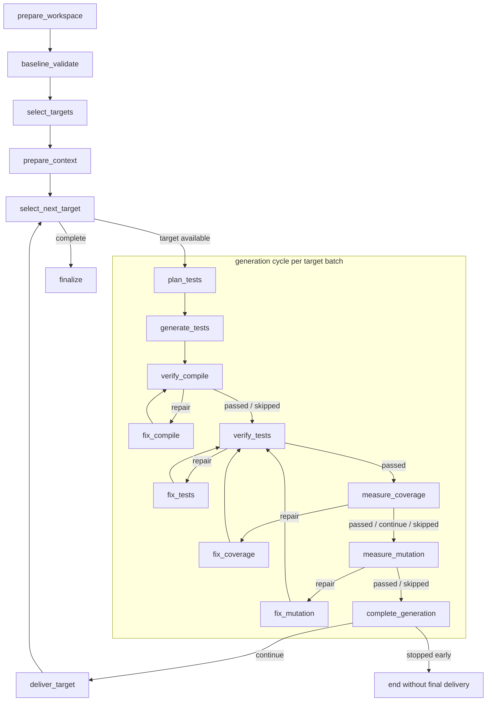

# Unit Test Agent (UTA)

**A deterministic test-quality gate, and an LLM agent that writes the tests to pass it.**

[](LICENSE)
[](pyproject.toml)
[](#language-support)

[Quick Start](#quick-start) · [Enforcement](#enforcement--the-deterministic-gate) · [Generation](#generation--the-llm-agent) · [CLI](#cli) · [Docs](#documentation) · [agent-core](https://github.com/comain/agent-core)

UTA is **two products that share one contract**.

**Enforcement** is a deterministic gate. No model is involved anywhere in it.
Given a git diff, it decides whether the changed production lines are covered by
tests, and whether those tests actually *detect* mutations of them. It is the
sole arbiter of pass and fail, and it runs on its own — in CI, or on a laptop,
with no agent, no API key, and no network.

**Generation** is an LLM agent. It reads a repository, picks targets, plans and
writes unit tests, then repairs them until the gate above passes.

The gate never asks a model anything. The agent never decides whether it
succeeded. That separation is the design: an LLM is allowed to *write* tests,
but only deterministic evidence is allowed to *accept* them.

## Not a demo

UTA runs inside a large, highly complex enterprise CI/CD environment. It and its
sibling **cragent** are both built on the same foundations:

- **[cragent](https://github.com/comain/code-review-agent)** reviews production
  changes across hundreds of repositories.
- **unit-test-agent** generates and enforces tests in the same delivery
  ecosystem.

Together these systems have processed **billions of model tokens** in real
engineering workflows. This repository is a sanitized snapshot; the production
deployments and all organization-specific policy remain private.

What that looks like in this repository:

- **~69k lines** of product code with **2,604 passing tests** across 218 test
  files in the default hermetic suite — no live agent, Maven, network or real
  repository required to run them.
- **1,200+ commits** of continuous development since April 2026.
- **Durable by construction.** SQLite checkpoints, a product operation ledger
  and crash reconciliation mean an interrupted run resumes rather than restarts.
- **Operated, not just built.** Supervisor unit, single-host deploy script,
  retention passes, config restart rules, cost and budget accounting, and
  runtime branch safety — see
  [docs/production-harden.md](docs/production-harden.md).
- **18 architecture decision records** in [docs/decisions/](docs/decisions/)
  covering the choices behind the gate and the generation cycle.

The enforcement half is designed to be adopted on its own, and is the piece that
runs on every pull request.

## The two halves

|                          | Enforcement                                            | Generation                                              |
| ------------------------ | ------------------------------------------------------ | ------------------------------------------------------- |
| What it does             | Scores changed lines for coverage and mutation          | Plans, writes and repairs unit tests                     |
| Deterministic            | Yes — no model involved                                 | No — driven by an agent harness                          |
| Needs an LLM             | No                                                      | Yes (agent-core harness, e.g. OpenCode)                  |
| Entry point              | `uta enforce`, or the standalone client                 | `uta run`, `uta tasks`                                   |
| Produces                 | Evidence JSON: pass/fail plus per-file metrics          | Test files in the repo, plus a run report                |
| Useful on its own        | Yes                                                     | No — its repair loop is driven by enforcement evidence   |

## Enforcement — the deterministic gate

Enforcement answers one question: **did this change arrive with tests that
actually exercise it?** It is incremental by construction — it scores the diff,
not the repository, so a legacy codebase is never asked to reach a global
coverage number.

### The two checks

1. **Diff line coverage.** Production lines added or changed against a base ref
   must be executed by the test suite. Non-behavioural hunks — imports,
   comments, blank lines, formatting, logging-only changes — are filtered out
   before scoring, so cosmetic edits do not manufacture gate targets.
2. **Diff mutation score.** The changed targets are mutated, and the suite must
   kill the mutants. This is what separates tests that execute a line from tests
   that assert on it. Coverage alone is trivially gamed; mutation is not.

A change with no behavioural production lines passes without running anything,
because there is no target. A green build with no coverage and mutation evidence
is **not** a pass — missing evidence is its own failure mode, not a default-allow.

### Per-language pipelines

| Language | Coverage    | Mutation | Driven by                                                              |
| -------- | ----------- | -------- | ---------------------------------------------------------------------- |
| Java     | JaCoCo      | PIT      | A Maven `test-enforcement` profile: `filter-diff` → `check-coverage` → `mutationCoverage` |
| Python   | coverage.py | mutmut   | Line-diff scoring in `tools/python-enforcement`                        |

The Java gate is an opt-in Maven profile, off unless the build is invoked with
`-Dtest.enforcement.enabled=true`. It filters `git diff` against the base ref,
derives PIT targets while excluding low-signal classes (DTOs, wrappers,
controllers, configuration, accessor-only changes) where mutation testing mostly
yields equivalent or unactionable mutants, then runs JaCoCo and PIT over what is
left. The `test-enforcer` Maven plugin itself is internal and not published
here; substitute your own plugin coordinates in
`uta/language/java/enforcement_versions.py` and
`uta/language/java/maven_compat/`. See
[docs/test-enforce-usage.md](docs/test-enforce-usage.md).

The Python gate maps changed production lines onto coverage and mutation
evidence directly. Legacy Python 2 projects are scored through a configured
runtime while UTA itself keeps running on modern Python.

### Evidence, not exit codes

Every run emits normalised evidence JSON — schema version, base and head
commits, changed files, changed lines, per-target coverage and mutation figures,
and a status of `passed`, `failed`, `error`, or `unsupported`. Service callers
additionally classify `timeout`, `command error`, `skipped`, and
`missing evidence`. The evidence is the product; the exit code is a summary of it.

```
[test-enforcer] python evidence passed diff_gates_met
[test-enforcer] python diff line coverage 97.30% passed (36/37)
[test-enforcer] python diff mutation 100.00% passed (12/12)
```

### One contract, and a client you can vendor

`tools/python-enforcement/uta_enforce_core` is the **sole** enforcement
contract: the request, the normalised result and evidence, validation, the
command-runner port, an immutable registry, and one stateless `enforce()`. It
depends on nothing above it — not UTA, not agent-core, not any binding. Every
caller goes through it, so there is exactly one implementation of the gate.

`tools/python-enforcement/` is a **distribution, not a subdirectory**. A third
party can sparse-checkout that one path and run it: nothing inside may import
`uta` or `agent_core`. That is enforced by a dependency gate and proved end to
end by a test that copies the tree out, scrubs the interpreter's site-packages,
confirms `uta` is unimportable, and then runs the gate for real.

```bash
# Full UTA
uta enforce --repo . --base-ref origin/main --coverage-gate 95 --mutation-gate 100

# Standalone client — no UTA, no agent, no API key
python3 tools/python-enforcement/uta_python_test_enforce.py \
  --repo . --base-ref origin/main --coverage-gate 95 --json-output
```

## Generation — the LLM agent

Generation is what produces tests that can pass the gate. It is deliberately
**not** one long agent conversation.

1. **Select targets.** Scan git history for hotspots, or take explicit targets,
   or sweep every production file.
2. **Build context.** `tree-sitter` extracts symbols, call graphs, dependency
   edges and business process flows, so the model receives a compact semantic
   view rather than a pile of files.
3. **Plan, then generate.** A `plan` session reads context and writes a test
   plan; a separate `generate` session writes the files from the approved plan.
4. **Repair against evidence.** Compile, test, coverage and mutation failures
   each open their own focused repair session, driven by the deterministic
   output of the gate — JaCoCo and PIT reports, mutmut survivors — never by the
   model's own opinion of its work.

Each phase is a separate agent turn with its own session, so a mutation-repair
round does not inherit unrelated planning history. Provider fallback is
turn-bounded: each candidate gets an isolated conversation, failed candidates
are closed before the next opens, and the run is never requeued to switch
provider.



Java and Python execute this same declarative cycle with stable batch IDs,
SQLite checkpoints and a product operation ledger, so a crashed run resumes
rather than restarting.

## How the halves compose

```
           ┌──────────────────────────────┐
  diff ───►│  ENFORCEMENT  (no LLM)       │───► evidence JSON ───► pass / fail
           └──────────────┬───────────────┘            │
                          │ survivors, uncovered lines │
                          ▼                            │
           ┌──────────────────────────────┐            │
           │  GENERATION  (LLM agent)     │◄───────────┘
           │  plan → write → repair       │
           └──────────────┬───────────────┘
                          │ new / repaired tests
                          └───────────────► re-run the gate
```

The gate runs first and last. In between, its evidence is the only instruction
the repair loop receives — which is why enforcement is usable entirely on its
own, and generation is not.

## Built on agent-core

Generation runs on [**agent-core**](https://github.com/comain/agent-core), a separate open-source agent harness.
agent-core owns everything about *running* an agent: harness selection, workspace
preparation, sessions, turns, provider fallback, cancellation, progress,
recovery and cleanup, plus the Git operations underneath them.

That split is why UTA names no concrete agent anywhere in product code — there is
no `OpenCodeProcess` and no auth client — so switching the agent underneath is
configuration rather than a code change. The two ship as a matched pair: UTA pins
an exact agent-core tag and refuses to start against any other version.

If you are building your own agentic tool and want the harness without the test
generation, agent-core stands alone: https://github.com/comain/agent-core

## Quick Start

### Prerequisites

- Python 3.11+
- For generation only: the runtime required by the configured agent-core
  harness. The default `UTA_AGENT_HARNESS=opencode` needs OpenCode on `PATH`.
- For Java targets: JDK and Maven.

### Installation

```bash
pip install -e .
```

UTA and [`agent-core`](https://github.com/comain/agent-core) ship as a matched pair:
`pyproject.toml` pins an exact agent-core tag and a startup guard refuses any
other installed version. Bump the pin in `pyproject.toml` and
`uta/app/agent_core_pin.py` together.

### Gate a change

```bash
uta enforce --repo . --base-ref origin/master --coverage-gate 95 --mutation-gate 100
```

### Generate tests

```bash
# Most active files from the last 30 days
uta run --repo ~/wms/sample-outbound-core --module biz --days 30

# Every production Java file
uta run --repo ~/wms/sample-outbound-core --module biz --all

# Specific classes
uta run --repo ~/wms/sample-outbound-core --module biz \
  --class-fqn com.example.sample.outbound.core.biz.impl.PickingBizImpl
```

## CLI

| Command                    | Half        | Purpose                                                        |
| -------------------------- | ----------- | -------------------------------------------------------------- |
| `uta enforce`              | Enforcement | Language-aware gate over a diff                                 |
| `uta python-enforce`       | Enforcement | Python gate directly                                            |
| `uta python-mutant-diffs`  | Enforcement | Inspect surviving mutants as diffs                              |
| `uta run`                  | Generation  | Generate and repair tests for a repo                            |
| `uta tasks`                | Generation  | SQLite-backed task runner for long backfills                    |
| `uta assess`               | Both        | Post-run token, duration and tool-call diagnostics              |
| `uta query-index`          | Both        | Query the extracted symbol index                                |
| `uta scan`                 | Generation  | List candidate files without generating                         |
| `uta parse`                | Generation  | Deep-parse a module and cache the code graph                    |

Add `--json-output` to most commands for machine-readable results.

### Long-running backfills

For repo-scale work, use the task runner rather than shell loops:

```bash
scripts/deploy_single_host.sh                         # install runner, init task DB
uta tasks create --repo ~/wms/sample-outbound-core --module biz --all --priority 100
scripts/start_daemon.sh --poll-interval 10            # run queued tasks
uta tasks watch <task-id> --show-sessions
```

Live status is written to `.uta_reports/status.html` and
`.uta_reports/live_status.json` in the target repo. See
[docs/production-usage.md](docs/production-usage.md).

## Configuration

Enforcement needs no configuration beyond its thresholds — it takes
`--coverage-gate` and `--mutation-gate` and runs with no model, key or network.

Generation selects its model through agent-core. `UTA_AGENT_HARNESS` names the
harness (default `opencode`); with that adapter `UTA_OPENCODE_PROVIDER_CHAIN` is
the model-selection source, configured left to right with comma-separated
fallback inside each provider:

```bash
export UTA_OPENCODE_PROVIDER_CHAIN='token-pool:token-pool/gpt-5.5,token-pool/gpt-5.5-mini;openai:openai/gpt-5.5'
export UTA_OPENCODE_PROVIDER_TOKENS='token-pool.token=${TOKEN_POOL_API_KEY};openai.token=${OPENAI_API_KEY}'
export UTA_OPENCODE_PROVIDER_FALLBACK_ENABLED=true
```

`openrouter/*`, `google/*`, `openai/*`, `cursor/*`, `tencent/*` and `ollama/*`
provider families are supported. Full reference — provider auth, batch sizing,
context cache, progress streaming, timeouts and report contents — in
[docs/configuration.md](docs/configuration.md).

## Language Support

Language behaviour lives behind category packages, so shared workflow, CI,
reporting, progress and cost accounting work against a common target model.

| Language | Batch entrypoint | Adapter and context | Parse package | Verification/enforcement | Primary target shape |
| --- | --- | --- | --- | --- | --- |
| Java | `uta/language/java/batch.py` | `uta/language/java/adapter.py`, `context.py`, `context_builder.py` | `uta/language/java/parse` | Maven, JUnit, JaCoCo, PIT, UTA Maven enforcement | class FQN and method symbols |
| Python | `uta/language/python/batch.py` | `uta/language/python/adapter.py`, `context.py`, `context_builder.py` | `uta/language/python/parse` | pytest, coverage.py, mutmut, Python enforcement evidence | file path plus module/function/class target |

To add a backend, implement the engine contracts behind
`uta/language/<language>/` and register it in the engine factories. See
[docs/language-extension.md](docs/language-extension.md).

## Running as a service

UTA exposes one FastAPI app whose inbound trigger, signature verification,
result callback and issue-context enrichment are handled by pluggable **protocol
adapters** (`uta/app/protocols/`). Both endpoints are always mounted; each
protocol stays dormant until its settings are provided.

- `POST /api/v1/github/webhook` — GitHub pull-request webhook. Verifies the
  `X-Hub-Signature-256` HMAC, enforces on `opened`/`synchronize`/`reopened`, and
  reports a **Checks API** check-run against the PR head SHA. The PR title and
  body become the repair issue context.
- `POST /api/v1/rdc/trigger` — internal RDC pipeline (`单元测试` pre-stage gate).
  See [docs/rdc-api-trigger-usage.md](docs/rdc-api-trigger-usage.md).

The service also serves queued/running status, enforcement evidence reports, and
a read-only SSE stream of fix-session progress. Environment reference:
[docs/service-configuration.md](docs/service-configuration.md).

## Architecture

```
uta/
  app/            CLI, FastAPI service, protocol adapters, composition roots
  testgen/        Language-neutral generation cycle, graph, operation ledger
  enforcement/    UTA's side of the enforcement contract (bindings only)
  language/
    java/         Detection, tree-sitter parse, Maven/JaCoCo/PIT verification
    python/       Detection, tree-sitter parse, pytest/coverage/mutmut verification
  tasks/          SQLite task model, lifecycle, accounting, reporting
tools/
  python-enforcement/
    uta_enforce_core/   The sole enforcement contract — depends on nothing above it
    uta_py_enforce/     Canonical Python enforcement implementation
```

See [design/architecture.md](design/architecture.md).

## Boundaries

Three boundaries decide where code goes. A dependency check
(`scripts/check_package_dependencies.py --check`) enforces them on every commit,
and every current exception is listed with an owner and the slice that removes it.

**agent-core owns running an agent** — harness selection, workspace preparation,
readiness, bootstrap, sessions, turns, fallback, cancellation, progress, cleanup,
and the Git operations underneath. UTA names no concrete harness: there is no
`OpenCodeProcess` and no auth client anywhere in product code, so selecting a
different agent is configuration rather than a code change. If UTA needs a
capability agent-core lacks, agent-core gains it, is released, and UTA pins the
release. Shared agent behaviour is never recreated here.

**`uta_enforce_core` is the sole enforcement contract** — the request, the
normalised result and evidence, validation, the command-runner port, an immutable
registry, and one stateless `enforce()`. Every caller goes through it; neither
`uta enforce` nor the local client runs its own gate.

**`tools/python-enforcement` is the distributed Python client** — a distribution,
not a subdirectory. Nothing in it may import `uta` or `agent_core`, so a third
party can sparse-checkout that path alone and run it.

`uta_py_enforce` holds the canonical Python enforcement implementation; full UTA
reaches it through a thin proxy in `uta/enforcement/bindings/python_proxy.py`
that adds UTA-owned policy and delegates exactly once. Which implementation runs
is governed by `UTA_PYTHON_ENFORCEMENT_IMPL` (`legacy` by default, then
`shadow`, then `canonical`); see
[docs/usage-uta-architecture-boundary-cleanup.md](docs/usage-uta-architecture-boundary-cleanup.md).

## Documentation

| Area | Document |
| --- | --- |
| Java enforcement setup | [docs/test-enforce-usage.md](docs/test-enforce-usage.md) |
| Mutation ROI (design record) | [docs/mutation-roi-coverage.md](docs/mutation-roi-coverage.md) |
| Test selection | [docs/test-selection.md](docs/test-selection.md) |
| Adding a language | [docs/language-extension.md](docs/language-extension.md) |
| Configuration | [docs/configuration.md](docs/configuration.md) |
| Testing lanes | [docs/testing.md](docs/testing.md) |
| Production usage | [docs/production-usage.md](docs/production-usage.md) |
| Production hardening | [docs/production-harden.md](docs/production-harden.md) |
| Resume, clean-rerun, rollout | [docs/usage-executable-generation-agent-turn.md](docs/usage-executable-generation-agent-turn.md) |
| Service configuration | [docs/service-configuration.md](docs/service-configuration.md) |
| Architecture decisions | [docs/decisions/](docs/decisions/) |

## Session Assessment

`uta assess` is the post-run consumer of the harness's optional offline
diagnostics. UTA never reads provider storage or raw session rows. It reports
exact token usage and model buckets when every requested session is available,
bounded duration/tool-call/patch counts, explicit `unsupported`, `unavailable`,
`mixed` and `truncated` states, and side-by-side deltas against a baseline.

```bash
uta assess --session-id ses_candidate --baseline-session-id ses_baseline
```

Public JSON never includes raw prompts, reasoning, commands, tool input/output,
or provider database rows. When a session cannot be diagnosed, aggregate values
are `null`, never partial totals.

## Testing

```bash
python3 -m pytest -m "not integration"     # default hermetic suite
```

The default suite needs no live agent, Maven/PIT, mutmut, network, or real
repositories. Heavier lanes are marked: `integration` (real Maven reactor),
`e2e_git_home` (repos under `$HOME`), and `real_e2e` (fresh-clone, enabled with
`UTA_E2E_MODE=real`). Lane definitions and the `UTA_E2E_*` repo-path variables
are in [docs/testing.md](docs/testing.md).

## Development Mandate

Every code modification **must** be accompanied by:

1. An updated `README.md` when the user-facing interface or high-level
   architecture changes.
2. An updated `design/architecture.md` (and related docs) when internal
   structure changes.
3. Added or updated tests under `tests/`.

## License

Apache License 2.0 - see [LICENSE](LICENSE).
