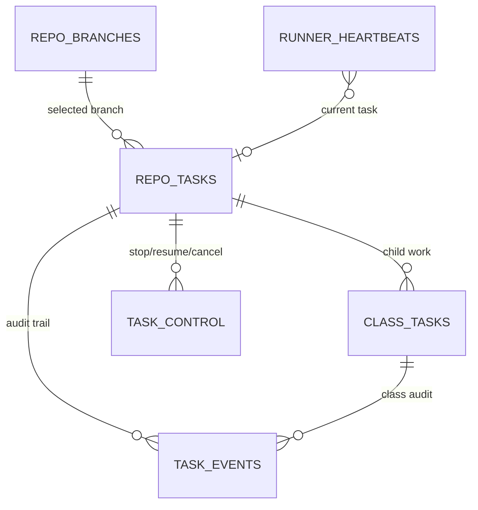
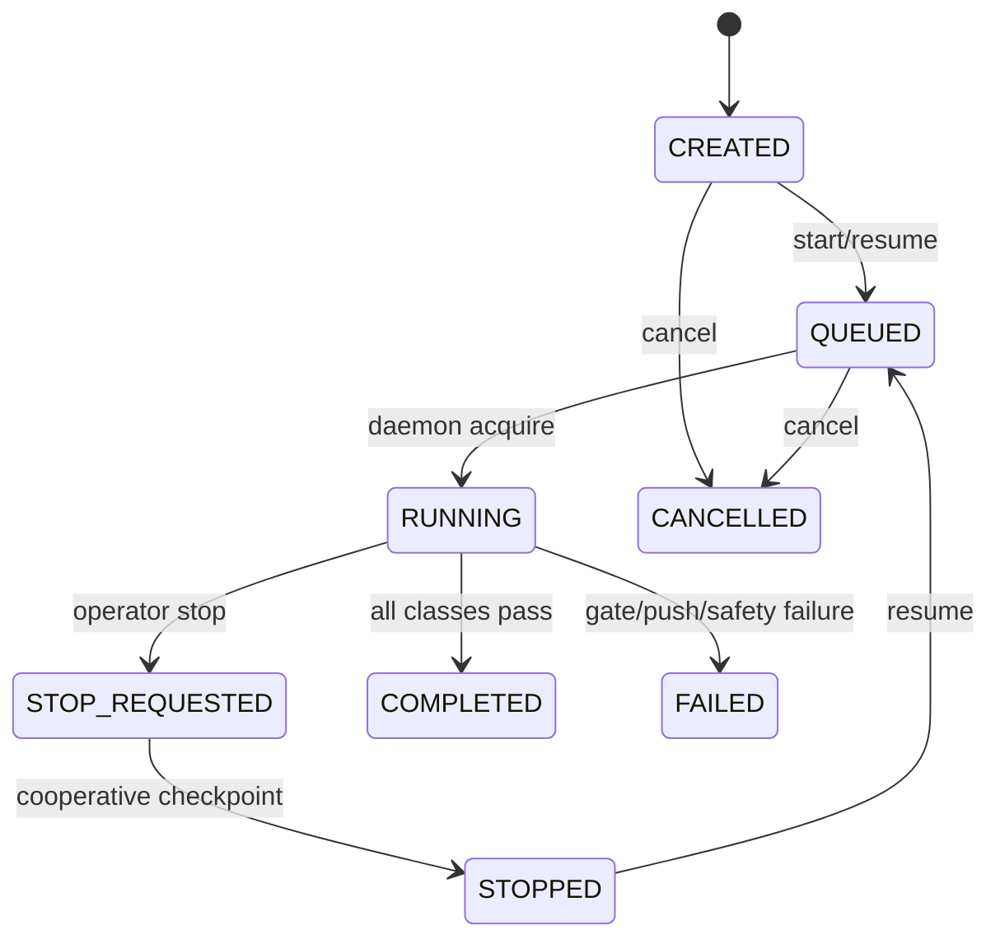

# UTA Architecture

## Purpose

UTA automates test generation for Java and Python repositories by combining:

- language-specific static analysis
- OpenCode-driven code generation and repair
- local verification gates for compile, tests, coverage, and mutation
- post-run reporting and session assessment

The system is optimized for large legacy services where coverage is hard to raise with one-shot prompting, while keeping language-specific parsing and enforcement behind explicit package boundaries.

## Main Components

### `uta/cli.py`

CLI entrypoint for:

- `uta run`
- `uta scan`
- `uta parse`
- `uta assess`

`uta run` owns the top-level workflow orchestration and report display.
`uta assess` is the lightweight postmortem surface for OpenCode session analysis.

### `uta/graph/`

Workflow orchestration layer.

- `workflow.py`: LangGraph wiring
- `nodes.py`: operational nodes for branch setup, parsing, planning, generation, compile/test/coverage/mutation validation, and repair loops
- `state.py`: workflow state contract

The workflow keeps the heavy local verification outside the model, and sends only distilled repair prompts back into OpenCode.

### `uta/language/<language>/parse/`

Language-specific static analysis built on `tree-sitter`.

- `uta/language/java/parse/`: Java class and method discovery, dependency graph construction, process-flow extraction, and cached parse artifacts
- `uta/language/python/parse/`: Python file/function/class discovery, import and side-effect hints, and target context extraction

This layer powers both repo-wide context export and per-target distilled context files.

### `uta/batch/`

Language-specific generation entrypoints behind a shared request/result contract.

- `base.py`: language-neutral `BatchGenerationRequest`, `BatchGenerationResult`, and generator protocol
- `java/`: facade for the existing Java LangGraph workflow and Maven/JaCoCo/PIT gates
- `python/`: Python OpenCode generation, generated pytest placement, and pytest/coverage/mutmut verifier handoff

Java generation logic is still implemented by the established workflow nodes; the Java batch facade owns invocation and state construction so later extraction can happen without changing CLI or task contracts.

### `uta/context/`

Context-building layer.

- repo scans and candidate selection
- repo summary generation
- target-specific context files under `.uta_cache/context/`

Important target artifacts include:

- `ClassName.context.md`
- `ClassName.symbols.md`
- planning- or repair-oriented cache files as the workflow evolves

### `uta/opencode/`

OpenCode integration layer.

- server bootstrap
- provider config generation
- session/message lifecycle
- provider limit detection
- token/session retrospect mining

UTA supports multiple providers through OpenCode-compatible configuration, including:

- `openrouter/*`
- `google/*`
- `openai/*`
- `cursor/*` and plain Cursor model names when `UTA_OPENCODE_PROVIDER=cursor`
- `tencent/*` and plain Tencent model names when `UTA_OPENCODE_PROVIDER=tencent`
- `ollama/*`

The default runtime configuration uses `tencent/glm-5` for both the main and small model unless the environment overrides it.

Cursor support is plugin-based rather than API-key based. UTA writes the OpenCode config expected by [`opencode-cursor-oauth`](https://github.com/ephraimduncan/opencode-cursor): a top-level `plugin` entry plus a `provider.cursor` stub so OpenCode keeps the provider in its catalog.
For OpenCode `1.14.x`, UTA also performs a best-effort repair of the Cursor plugin cache layout when the plugin is already installed globally, because `opencode auth login --provider cursor` resolves plugins from `~/.cache/opencode/packages/...` and some installs leave that cache entry empty.

### `uta/maven/`

Local verification utilities.

- Jacoco execution and parsing
- Pitest execution and parsing
- uncovered-cluster and survivor-family extraction for repair prompts

This layer is where deterministic preprocessing should live when analysis can be done more cheaply than an LLM turn.

### `uta/output/`

Report assembly and terminal display.

Outputs include:

- JSON summary reports under `.uta_reports/`
- timing details
- token usage
- mutation breakdowns
- retrospect hints

### `uta/tasks/`

Production task-management layer for long-running repo backfills.

- `db.py`: local SQLite schema, branch/task/class/event/control/heartbeat storage
- `manager.py`: create, queue, stop, resume, cancel, reprioritize, stage, and result-sync operations
- `scheduler.py`: daemon acquisition with same-repo locking and runner heartbeat updates
- `render.py`: terminal, JSON, and auto-refreshing HTML status output

The task DB is the production source of truth. `uta run --production --task-id <id>` executes a task while updating stage transitions and final metrics. `uta tasks daemon` polls the DB and invokes that production entrypoint for runnable tasks.

Live status data flows from workflow stage updates, class result sync, task events, and runner heartbeats into `.uta_reports/live_status.json` and `.uta_reports/status.html`. Config snapshots are stored on `repo_tasks`; daemon-process settings such as DB path, runner home, OpenCode spawn environment, and polling intervals require daemon restart, while task priority and control-table actions are observed from SQLite without restart.

## Workflow Shape

The current high-level flow is:

1. create/reset working branch from `origin/master`
2. baseline compile and environment normalization
3. parse repository and export context
4. select target classes
5. create OpenCode session
6. plan test approach
7. generate tests
8. run compile/test/coverage/mutation gates
9. run focused repair rounds when needed
10. write final report

In production mode, the same workflow runs inside a repo task:

1. `uta tasks create` records selection, priority, branch reuse, config snapshot, budget snapshot, and optional child class rows.
2. `uta tasks daemon` atomically acquires the highest-priority runnable repo task that is not blocked by same-repo locking.
3. `uta run --production --task-id <id>` reuses the task branch, mirrors `_set_stage` transitions into `task_events`, and syncs final class metrics/session IDs/token counters back into SQLite.
4. `.uta_reports/live_status.json` and `.uta_reports/status.html` are refreshed for operator monitoring.

### Key Design Choices

#### 1. Distilled target context before broad exploration

The workflow exports target-specific context files before planning or generation so the model can start from structured facts rather than rereading large source files immediately.

#### 2. Local verification is authoritative

Compile, test, Jacoco, and Pitest are always decided by local tools, not model self-report.

#### 3. Focused repair loops

Coverage and mutation repair can run in focused later-stage rounds so the model receives smaller, more specific repair packets instead of generic “try again” prompts.

#### 4. Session analysis is part of optimization

OpenCode session data is useful operational telemetry, not just debugging noise. UTA now treats session assessment as a first-class workflow tuning input.

## Assessment and Run Comparison

`uta assess` reads OpenCode session data directly from `opencode.db` and reports:

- token usage
- cache-read pressure
- tool-call volume
- text/reasoning verbosity
- top expensive steps
- side-by-side comparisons against a baseline session

This is meant for:

- model comparisons
- prompt/workflow regression checks
- spotting verbosity or exploration drift
- deciding whether an optimization actually reduced token usage

## Documentation Expectations

When workflow structure or user-facing behavior changes:

- update `README.md`
- update this architecture document
- add or update tests

This keeps the repo usable both for daily operation and for prompt/workflow optimization work.
