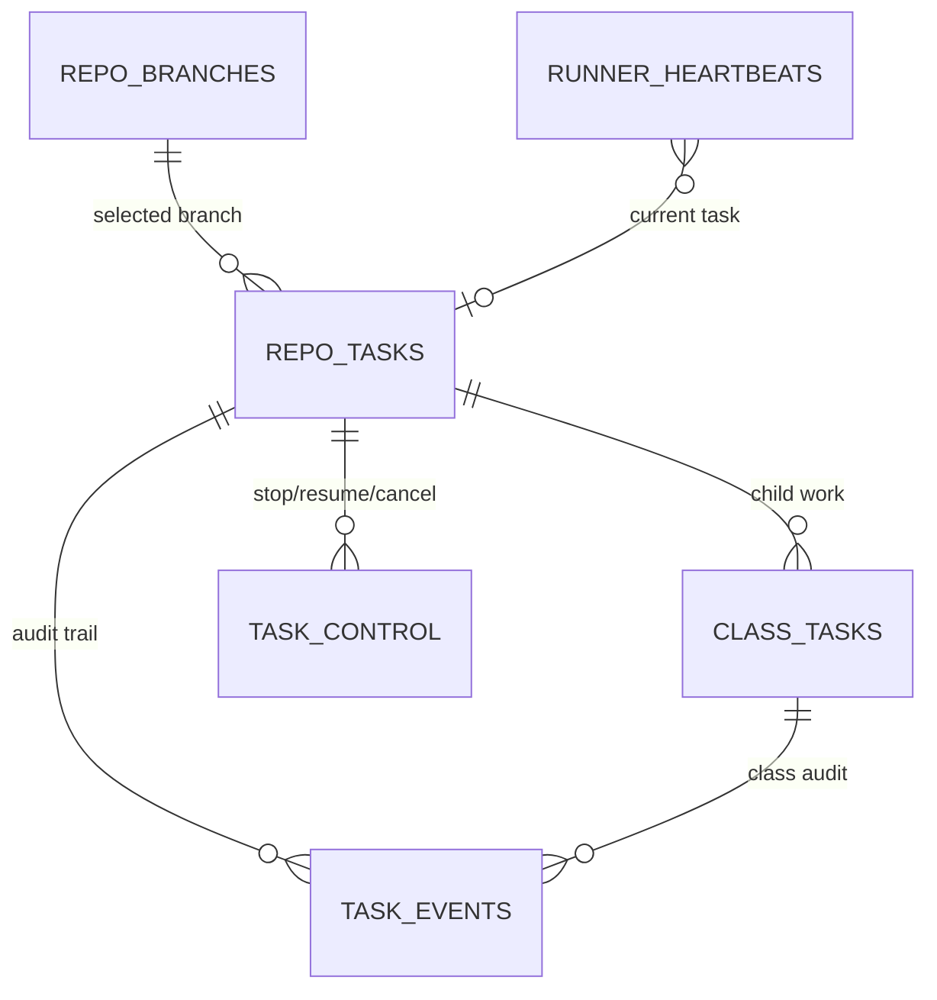
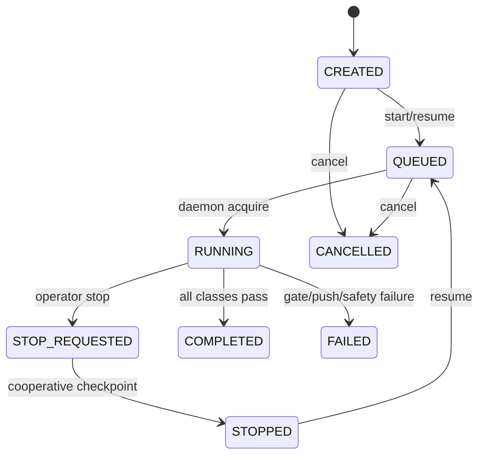

# UTA Architecture

## Purpose

UTA is two products that share one contract.

**Enforcement** is a deterministic gate over a git diff. It scores changed
production lines for coverage and mutation and decides pass or fail. No model is
involved anywhere in it, and it runs without an agent, a key, or a network.

**Generation** is an LLM agent that selects targets, builds distilled context,
writes tests, and repairs them until the gate passes.

The gate never consults a model; the agent never decides whether it succeeded.
Everything below follows from that split. The system is optimised for large
legacy services where coverage is hard to raise with one-shot prompting, so
language-specific parsing and enforcement stay behind explicit package
boundaries.

## Package Map

### `uta/app/`

Composition roots and every user-facing surface.

- `cli.py`: Click entry point. Commands: `run`, `scan`, `parse`, `enforce`,
  `python-enforce`, `python-mutant-diffs`, `query-index`, `assess`, `tasks`.
- `enforcement_commands.py`, `generation_commands.py`, `index_commands.py`,
  `assessment_commands.py`, `task_commands.py`: command groups.
- `commands/tasks/`: task subcommand implementations.
- `routes.py`, `service.py`: the FastAPI trigger service.
- `protocols/`: pluggable protocol adapters (`github.py`, `rdc.py`, `factory.py`)
  owning inbound trigger, signature verification, result callback, and issue
  context.
- `agent_core_pin.py`: startup guard refusing a mismatched agent-core.
- `enforcement_composition.py`: the only module naming both enforcement bindings.

### `uta/testgen/`

The language-neutral generation half.

- `graph/`: the declarative cycle — `generation-cycle.yaml`, state, routing, and
  thin node exports. `application.py` runs it as a durable, checkpointed
  application over agent-core invocation APIs.
- `runner.py`: batch dispatcher resolved through the configured adapter.
- `prompts/`: domain prompt templates and the loader. Values live here; strict
  rendering and secure materialization belong to agent-core.
- `operations/`: product-owned operation ledger and result-artifact facade for
  crash reconciliation.
- `context.py`, `project_summary/`, `source_selection.py`, `targets.py`,
  `scoring.py`, `wave_assigner.py`: target selection and context assembly.
- `cutover.py`, `standalone_execution.py`, `workspace_guard.py`: workspace
  guards, durable fingerprints, and owner-only ephemeral identity for taskless
  runs.

### `uta/language/<language>/`

Everything a language knows about itself, behind a common target model.

- `parse/`: `tree-sitter` static analysis. Java discovers classes, methods,
  dependency graphs and process flows; Python discovers files, functions,
  classes, imports and side-effect hints. This powers both repo-wide context
  export and per-target distilled context under `.uta_cache/context/`.
- `adapter.py`: detection, target normalization, prompt bundle, generated-test
  policy.
- `batch.py`, `generation_backend.py`, `phases/`: the language's mapping onto
  the shared lifecycle stages.
- `context.py`, `context_builder/`, `project_summary.py`: context providers.
- `verification/`: Java runs Maven, JUnit, JaCoCo and PIT; Python runs pytest,
  coverage.py and mutmut.
- `maven/` (Java): JaCoCo and PIT execution and parsing, plus uncovered-cluster
  and survivor-family extraction for repair prompts. Deterministic
  preprocessing belongs here whenever it is cheaper than an LLM turn.
- `enforcement.py`, `ci.py`: enforcement evidence and the CI repair handler.

Backends register independent capabilities in
`uta/composition/language_backends.py`. Context and project-summary factories
declare their own construction inputs, so adding a language adds no conditionals
to shared workflow code.

### `tools/python-enforcement/` and `uta/enforcement/`

The deterministic half.

- `tools/python-enforcement/uta_enforce_core/`: the sole enforcement contract —
  request, normalised result and evidence, validation, the command-runner port,
  an immutable registry, and one stateless `enforce()`. It depends on nothing
  above it.
- `tools/python-enforcement/uta_py_enforce/`: the canonical Python
  implementation — coverage, mutation, candidate planning, mutmut adapters and
  test selection.
- `uta/enforcement/`: UTA's side of the contract. `bindings/` holds the Java
  binding and a thin proxy to the distributed Python one; the proxy adds
  UTA-owned policy and delegates exactly once, reimplementing no part of the
  algorithm.

### `uta/reporting/`

Report assembly and terminal display: JSON summary reports under
`.uta_reports/`, timing details, token usage, mutation breakdowns and retrospect
hints.

### `uta/tasks/`

Production task management for long-running repo backfills.

- `db.py`: SQLite schema — branch, task, class, event, control and heartbeat
  storage.
- `manager.py`: create, queue, stop, resume, cancel, reprioritize, stage and
  result-sync operations.
- `scheduler.py`: daemon acquisition with same-repo locking and heartbeat
  updates.
- `render.py`: terminal, JSON and auto-refreshing HTML status output.
- `accounting/`: immutable operation accounting. Task code never opens an
  agent-local database or derives currency cost from tokens.

The task DB is the production source of truth. `uta tasks daemon` polls it and
runs the production entrypoint for runnable tasks.

Live status flows from workflow stage updates, class result sync, task events
and runner heartbeats into `.uta_reports/live_status.json` and
`.uta_reports/status.html`. Config snapshots are stored on `repo_tasks`;
daemon-process settings such as DB path, runner home, harness spawn environment
and polling interval require a daemon restart, while task priority and
control-table actions are observed from SQLite without one.

### `uta/shared/` and `uta/composition/`

`shared/` holds the settings model (`config.py`), the common target and CI
models, and cross-cutting git/delivery helpers. `composition/` wires backends
and persistence at the entry points.

## Boundaries

Three boundaries decide where code goes. `scripts/check_package_dependencies.py
--check` enforces them on every commit, and every current exception is listed
with an owner and the slice that removes it.

**agent-core owns running an agent.** Harness selection, workspace preparation,
readiness, bootstrap, sessions, turns, provider fallback, cancellation,
progress, cleanup, and the Git operations underneath. UTA names no concrete
harness — there is no `OpenCodeProcess` and no auth client in product code — so
selecting a different agent is configuration, not a code change. If UTA needs a
capability agent-core lacks, agent-core gains it, is released, and UTA pins the
release.

**`uta_enforce_core` is the sole enforcement contract.** Every caller goes
through it. Neither `uta enforce` nor the local client runs its own gate.

**`tools/python-enforcement/` is a distribution, not a subdirectory.** Nothing in
it may import `uta` or `agent_core`, so a third party can sparse-checkout that
path alone and run it. A test proves this by copying the tree out, scrubbing
site-packages, and confirming `uta` is unimportable before running the gate.

## Workflow Shape

Generation is deliberately not one long agent conversation. The durable engine
splits a run into phase-specific agent turns, so a mutation-repair round does not
inherit unrelated planning or generation history.

1. prepare workspace and validate the baseline
2. select targets and export distilled context
3. per target batch: plan, generate, then verify compile, tests, coverage and
   mutation, with a focused repair session for each gate that fails
4. deliver the target and move to the next
5. finalize and write the report

Java and Python execute the same declarative cycle with stable batch IDs, SQLite
checkpoints and a product operation ledger, so a crashed run resumes rather than
restarting. Provider fallback is turn-bounded inside the phase session: each
candidate gets an isolated conversation and failed candidates are closed before
the next opens, so the task is never requeued to switch provider.

Prompt artifacts never live in the target repository. They resolve under
`$UTA_RUNNER_HOME/workflow-state/prompts`, owner-only and mode `0600`, and a
configured root inside the target checkout is rejected.

### Key design choices

**Distilled context before broad exploration.** Target-specific context files are
exported before planning so the model starts from structured facts instead of
rereading large sources.

**Local verification is authoritative.** Compile, test, coverage and mutation
results are decided by local tools, never by model self-report.

**Focused repair loops.** Each failing gate opens its own narrow repair round, so
the model receives a specific packet rather than a generic "try again".

**Session analysis is a tuning input.** Bounded, sanitized session diagnostics
are operational telemetry for workflow optimisation, not just debugging noise.

## Assessment and Run Comparison

`uta assess` is the post-run consumer of the harness's optional offline
diagnostics capability. UTA never reads provider storage or raw session rows: it
supplies neutral durable session references and renders what the adapter returns.

It reports exact token usage and model buckets when every requested session is
available, bounded duration, tool-call, patch and sanitized signal counts,
explicit `unsupported`, `unavailable`, `mixed` and `truncated` states, and
side-by-side deltas against a baseline.

Public JSON never includes raw prompts, reasoning, commands, tool input/output,
absolute paths, or provider database rows. When any requested session cannot be
diagnosed, aggregate values are `null` rather than partial totals.

This supports model comparisons, prompt/workflow regression checks, and deciding
whether an optimisation actually reduced token usage.

## Documentation Expectations

When workflow structure or user-facing behaviour changes:

- update `README.md`
- update this architecture document
- add or update tests

This keeps the repo usable both for daily operation and for prompt/workflow
optimisation work.
