# From Java-Only Gates to Practical Python Enforcement in UTA

UTA started as a unit-test generation agent for Java services. That was a good first target: most services had Maven, JUnit, JaCoCo, PIT, predictable `src/main/java` layouts, and class FQNs that could be used as stable target identifiers.

Python broke almost every one of those assumptions.

This is the story of how we refactored UTA from a Java-shaped tool into a multi-language enforcement system, and what we learned while making Python coverage and mutation gates practical enough for real enterprise repositories.

## TL;DR

- UTA originally worked because Java services had stable conventions: Maven, JUnit, JaCoCo, PIT, class FQNs, and root-POM enforcement.
- Python broke those assumptions with flat script repos, import-time side effects, mixed Python 2/3 syntax, ambiguous test files, and expensive mutation runs.
- The fix was not a Python-specific branch. We moved workflow concepts into a language-agnostic engine and put Java/Python behavior behind adapters.
- Python enforcement now uses strict target-specific test selection, coverage-before-mutation, deterministic mutation candidate planning, adapter-filtered mutmut generation, and batched mutation execution.
- CI, repair, full CLI, and local developer enforcement share one evidence contract. CI may use a smaller deterministic cap profile, while repair/local runs use the fuller hard-capped profile.
- The most important lesson: for agent workflows, the report, repair loop, local gate, progress UI, and cost accounting are part of the product, not just the tests.

## The Journey At A Glance

```mermaid
flowchart LR
  A["Java-only UTA"] --> B["Language-neutral target model"]
  B --> C["Python parser and context adapter"]
  C --> D["Strict pytest selection"]
  D --> E["coverage.py changed-line gate"]
  E --> F["Deterministic mutation candidate plan"]
  F --> G["Adapter-filtered mutmut generation"]
  G --> H["Batched mutation execution"]
  H --> I["Shared CI / repair / local evidence"]
```

## Background: What UTA Does

UTA is an automated unit-test agent. In practice, it is used in three connected workflows:

1. CI enforcement: when a change reaches the CI pipeline, UTA checks whether changed production code has enough unit-test coverage and mutation strength. The output is a report that explains which targets passed, which failed, and why.
2. Local developer enforcement: before pushing, developers can run the same gate locally through the developer workflow tool. This catches missing tests earlier and prevents CI-only surprises.
3. Auto-fix repair sessions: when CI enforcement fails, a developer can start a repair session. UTA opens an agent workflow, gives it target context and verifier feedback, lets it generate or improve tests, and then reruns the same coverage/mutation gate. If the gate passes, UTA can commit and push the generated tests.

The important part is that these workflows are not separate products. They are different entrypoints into the same enforcement and repair loop.

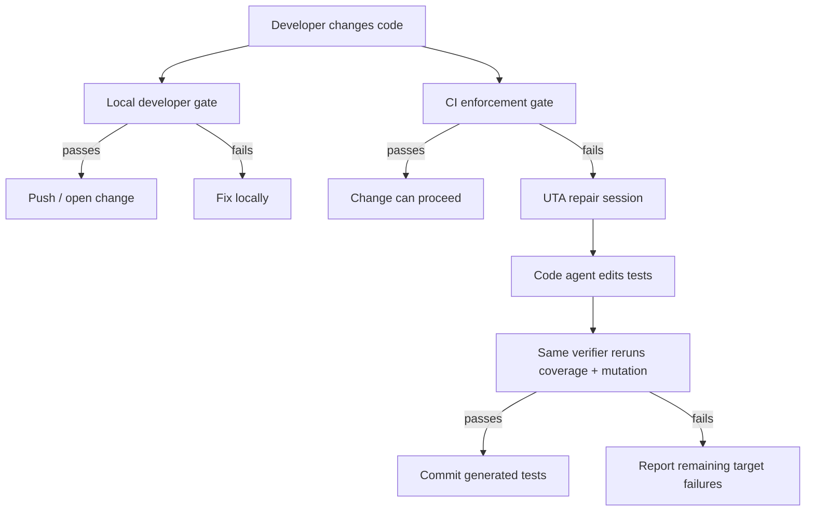

For Java, that loop grew around Maven conventions. For Python, we had to rebuild the enforcement side while preserving the same user experience: clear CI reports, reproducible local checks, and repair sessions that use the exact same definition of pass/fail.

## 1. The First Problem: UTA Had Java in Its Bones

The original UTA workflow knew how to do this:

```text
Java class FQN
  -> parse Java context
  -> generate JUnit tests
  -> run Maven
  -> read JaCoCo
  -> read PIT
  -> repair until gates pass
```

That workflow was effective, but the abstractions leaked everywhere:

- targets were Java class FQNs;
- generated tests lived under `src/test/java`;
- reports talked about classes and Maven modules;
- progress UI assumed Java class names;
- CI enforcement relied on a Maven plugin wired into the root POM;
- mutation diagnostics came from PIT.

Python forced a different model. A Python target might be:

- a flat file such as `config.py`;
- a function inside a data job;
- a script under `jobs/`;
- a Python 2 file that cannot be parsed by Python 3 `ast`;
- a module with import-time side effects;
- a repo without packaging, test config, or any existing tests.

So the first real decision was not "add Python branches." It was:

> Core UTA workflow must be language-agnostic. Java and Python behavior belongs behind language adapters.

That became the architecture invariant for the rest of the work.

## 2. Discovery: Real Python Repos Are Not Mini Java Projects

We started with a representative data/ML Python repository, then expanded to larger job-style repositories with hundreds of Python scripts.

The findings were immediately useful:

- many repos are flat script repositories, not installable Python packages;
- imports often assume repo root is on `PYTHONPATH`;
- many files perform work at import time;
- existing `*_test.py` files are often job scripts, not unit tests;
- Python 2 and Python 3 code can coexist in the same organization;
- large data/ML dependencies make integration-style tests expensive and fragile;
- the best first unit targets are pure helpers, date logic, config builders, parsers, and DataFrame transformations.

That changed the Python design:

- use Tree-sitter as the primary parser because it can parse source without importing modules;
- use Python `ast` only as optional Python 3 enrichment;
- identify targets by source path plus optional symbol, not import name alone;
- generate tests under `tests/uta_generated/` by default;
- run tests with `python -m pytest` from repo root for flat repos;
- treat Python 2 as a legacy lane with its own runtime and `mutmut==1.5.0`.

The important lesson was simple: discovery must be source-only. Importing production modules during discovery is unsafe in these repos.

## 3. Architecture: Multi-Language Core With Adapter Boundaries

The refactor split UTA into a language-agnostic engine and language-specific adapters.

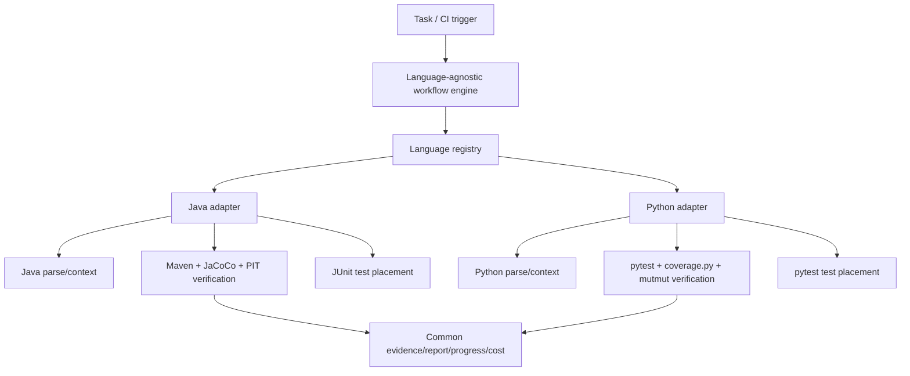

The shared engine owns:

- task lifecycle;
- progress reporting;
- cost accounting;
- CI repair creation;
- report rendering;
- target identity contracts;
- enforcement result contracts;
- mutation candidate evidence contracts.

Language adapters own:

- parsing;
- context building;
- prompt details;
- test placement;
- test discovery;
- coverage and mutation execution;
- language-specific failure diagnostics.

This mattered later. Every time Python exposed a new issue, we asked whether the fix belonged in the common engine or behind a Python adapter. That kept the implementation from becoming a pile of `if language == "python"` branches.

### 3.1 Architecture: CI Enforcement Through Language Adapters

Java incremental enforcement is delegated to Maven:

```text
CI orchestrator task
  -> Maven enforcement plugin
  -> filtered diff coverage
  -> PIT target mutation
  -> UTA report
```

Python has no root POM and no Maven plugin. The equivalent path had to be owned by UTA:

```text
CI orchestrator task
  -> UTA Python enforcement runner
  -> git diff against the configured base branch
  -> strict Python target discovery
  -> pytest selected tests
  -> coverage.py changed-line coverage
  -> mutmut changed-line mutation
  -> UTA report
```

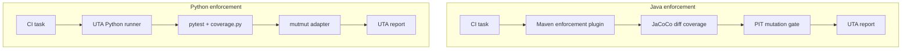

The key architecture rule was that Python support must not turn the common workflow into a pile of Python branches. The common layer can know about targets, evidence, progress, cost, reports, and repair state. It should not know about pytest naming, mutmut metadata, Python import compatibility, or Python package layouts. Those belong behind the Python adapter.

As the implementation evolved, we added cross-layer architecture tests to protect that boundary: Python-specific behavior must enter the workflow through registered adapters and language-neutral contracts, not through ad hoc conditionals in shared code.

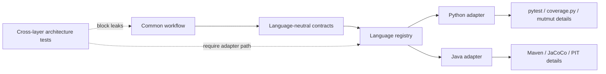

### 3.2 Architecture: One Enforcement Core For CI, Repair, And Local Development

CI is not enough. Developers need to run the same gate locally before pushing.

For Java, the Maven plugin is distributed through parent POMs. Python does not have an equivalent universal project-level package path. We first considered distributing a Python library, then moved to a lighter approach:

- UTA owns the Python enforcement core;
- the developer workflow tool is only a launcher and evidence validator;
- developers can sparse-checkout the lightweight UTA Python enforcement tool;
- local dev uses the same candidate planning, coverage, mutation, batching, and evidence schema;
- local dev cannot enable CI-only sampling.

The user-facing command became:

```bash
UTA_PYTHON_ENFORCE_SCRIPT=/path/to/uta-python-enforcement/python_test_enforce.py \
python3 /path/to/developer-workflow/scripts/python_test_enforce.py \
  --repo . \
  --base-ref <base-branch> \
  --coverage-gate 95 \
  --mutation-gate 95 \
  --evidence-output .uta_reports/python-enforcement.json
```

The important part is organizational, not just technical:

> The developer workflow launcher should not own enforcement algorithms. It should invoke and validate the UTA-owned implementation.

That prevents local guidance from drifting behind CI.

## 4. Determinism: Strict Unit-Test Selection And Target Drift

Early Python enforcement selected tests too loosely. A broad file that imported a target could be treated as evidence for that target. That caused target drift: the report, repair prompt, generated test, and verifier could gradually stop talking about the same unit.

- CI might verify one broad test file;
- repair might create or modify a target-specific test;
- rerun might pick a different file;
- mutation could pass once and fail later.

The fix was strict target-specific test selection.

A qualifying Python unit test must be name/path-related to the target, for example:

- `tests/test_orchestrator.py` for `orchestrator.py`;
- `tests/test_prompt_optimization_orchestrator.py`;
- mirrored package-local test path;
- canonical `tests/uta_generated/test_<source_path>.py`.

Broad workflow files such as `check_test.py`, `*_integration.py`, `*_e2e.py`, `*_workflow.py`, and unrelated "pure" test bundles are not accepted just because they cover lines.

The rule became:

> Any one strict target-specific candidate that passes coverage and mutation is enough. Broad tests are not per-target unit-test evidence.

That aligned CI reports and repair sessions.

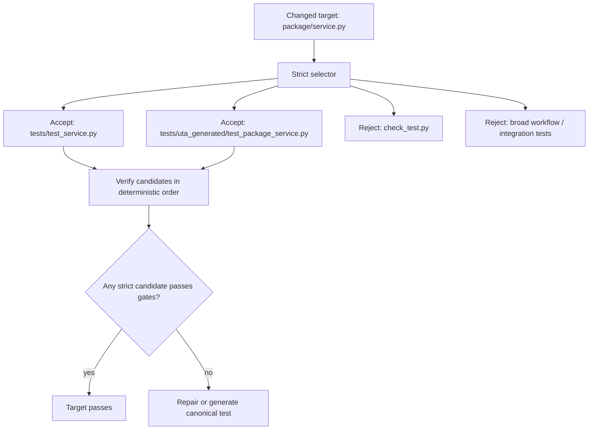

## 5. Performance: Coverage Before Mutation

Python mutation is expensive. Running mutation before coverage is wasteful.

We changed Python verification to run in this order:

```text
selected strict pytest file
  -> pytest smoke
  -> coverage.py changed-line coverage
  -> if coverage passes, run mutation
  -> if mutation fails, repair mutation
```

This matters because many failed targets do not need mutation yet. If changed lines are not covered, the right action is coverage repair. Mutation repair should start only after the coverage gate is satisfied.

This also clarified reporting. Coverage and mutation have different denominators:

- coverage denominator is executable changed lines;
- mutation denominator is selected mutation candidates that are covered and meaningful to mutate.

Trying to make those denominators identical caused confusion. They measure different things.

## 6. Performance: Making Mutmut Practical

The first Python mutation backend was `mutmut`, but stock `mutmut run` was not practical enough for large CI diffs.

We saw several failure modes:

- thousands of mutants for one large changed file;
- mutation runs taking tens of minutes;
- generated mutant modules becoming huge;
- CPython `ast.parse` spending minutes parsing a generated 78 MB module;
- orphaned mutmut worker processes after timeout;
- repair sessions spending most time on low-value mutants;
- CI and repair using slightly different candidate sets.

The root problem was that "changed-line mutation" cannot just mean "run stock mutmut and filter the report after the fact." By then the expensive work has already happened.

UTA needed to select candidates before mutmut generated and ran them.

### 6.1 Performance Before And After

The turning point was measuring the actual bottleneck. The slow path was not a Python loop in UTA and not an LLM delay. It was mutmut generating one oversized mutant module and then asking CPython to parse it.

The pathological target was about 3,100 source lines. Mutmut expanded it into roughly 6,000 mutants and one generated module around 78-82 MB. At that size, CPython parsing becomes super-linear, so the process looked like a hang even though it was burning CPU.

The beta-environment measurements made the fix direction clear:

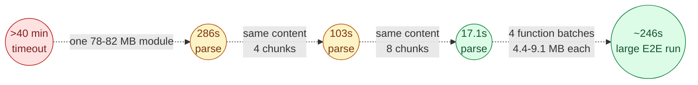

The important result was not just speed. It was that runtime became bounded and explainable. The report can now say how many candidates were planned, selected, generated, omitted by cap, scored, killed, or survived.

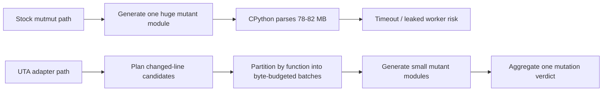

### 6.2 ADR: Why Adapter-Filtered Generation

The first architectural decision was to move mutation selection into the mutmut adapter, before generation. The formal decision record is [ADR-001: Shared Python Mutation Candidate Plan](decisions/ADR-001-python-mutation-candidate-plan.md).

Accepted decision:

> UTA builds a deterministic `MutationCandidatePlan`, then asks the Python mutmut adapter to materialize only the candidates UTA intends to run.

Rejected alternatives:

- Broad post-run report filtering: rejected because it does not reduce runtime. It only hides irrelevant mutants after the expensive generation and execution already happened.
- Stock exact-key CLI filtering only: rejected because stock mutmut can still perform broad generation before exact-name execution.
- `# pragma: no mutate` masking as the primary mechanism: rejected because it can suppress lines, but it cannot choose one useful operator per line or produce a precise operator-level denominator.
- Separate CI and repair planners: rejected because CI and repair must agree on test selection, mutation candidates, and verdict semantics.

The consequence is a stronger contract: CI, repair, and local development all see the same candidate-planning logic. CI can use a smaller deterministic cap profile, but it does not get a separate definition of mutation evidence.

### 6.3 ADR: Why Function-Granular Batching

The second architectural decision was to batch generated mutants by function under a byte budget. The formal decision record is [ADR-002: Function-Granular Byte-Budgeted Batched Mutation Generation](decisions/ADR-002-python-mutation-batched-generation.md).

Accepted decision:

> UTA partitions selected mutation opportunities into deterministic function-granular batches, generates each batch separately, scores each batch, and aggregates the result into one target verdict.

Rejected alternatives:

- Keep only the count hard cap: rejected because mutant count does not bound generated module size. A few large functions can still create a huge parse input.
- Per-line batching: rejected because mutmut numbers mutants per function per generation. Splitting a function across batches can make raw tool keys collide or refer to different mutations.
- Patch mutmut or skip its validation parse: rejected because it would fork the dependency and still not address every parse/import path.
- Upgrade CPython: rejected because the same large generated module remained slow across interpreter versions.
- Byte-aware cap-and-drop only: rejected as the primary fix because it is lossy. Batching preserves more of the selected mutation set while still bounding runtime.

Function-granular batching was the practical compromise: it keeps mutmut keys stable within a function, keeps generated modules small, and lets UTA aggregate evidence deterministically.

### 6.4 Candidate Planning: Make the Mutation Set Explicit

We introduced a `MutationCandidatePlan` evidence contract. Its job is to make mutation selection deterministic and inspectable.

For every Python target, UTA now records a funnel:

```text
changed lines
  -> executable changed lines
  -> covered changed lines
  -> mutation-eligible opportunities
  -> suppressed low-value opportunities
  -> selected candidates before cap
  -> active generated candidates
  -> scored candidates
  -> killed / survived
```

The plan includes:

- target path and changed lines;
- selected tests;
- runtime and dependency fingerprints;
- mutation tool version;
- operator policy version;
- suppression reasons;
- cap profile;
- candidate ids;
- generated mutmut keys where available;
- deterministic plan id.

This solved two problems:

1. The report can explain what was skipped, selected, generated, and scored.
2. Repair can compare current verification with prior CI evidence and detect real drift.

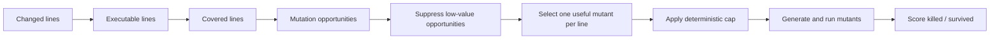

### 6.5 Filtering Before Generation

The decisive mutation scalability change was adapter-filtered generation.

Instead of asking mutmut to generate broadly and then selecting keys afterward, UTA asks the Python mutmut adapter to materialize only the candidates UTA intends to run.

The policy is deterministic:

- mutate only relevant changed production lines;
- suppress low-value categories such as logging, metrics, import wiring, pure config constants, and generated glue;
- choose one useful operator per eligible line;
- rank operators by a versioned policy;
- apply deterministic hard caps;
- generate/run only that selected set.

For Python 3 and modern mutmut, this keeps the generated mutant module small enough to parse and run. For Python 2, UTA keeps the legacy `mutmut==1.5.0` lane honest and reports that it does not provide the same exact-key/operator-filter semantics.

One subtle lesson: sampling should not be a public local-dev behavior. CI can use a smaller deterministic cap profile for speed, but repair and local dev should use the full hard-capped set. Otherwise developers can accidentally or intentionally optimize for a sampled subset that is not the real gate.

### 6.6 Batched Generation for Large Files

Hard caps are necessary, but they are not enough for very large Python files. Even a selected set can create generated modules large enough to make mutation slow or unstable.

We added a batched generation strategy:

- partition selected mutation units by function/symbol;
- keep each generated batch under a byte budget;
- reuse mutmut stats/cache across batches;
- aggregate killed/survived counts back into one target result;
- expose batch warnings and counts in evidence.

The key performance goal was not just "avoid timeout." It was:

> Never ask CPython or mutmut to process a giant generated mutant file when smaller deterministic batches can produce the same gate evidence.

This was verified in the beta environment with real mutmut runs before making batch mode the default.

### 6.7 CI Sampling Without Leaking The Shortcut

CI has a different runtime constraint from repair and local development. A developer waiting for a CI report needs a useful answer quickly; a repair session can spend more time because it is actively trying to fix the target; a local developer gate should be strict enough to reproduce the real problem.

That led to a careful split:

- CI may use a smaller deterministic representative subset when the mutation set is very large.
- Repair sessions use the fuller hard-capped mutation set, because repair needs the real survivor map.
- Local developer enforcement also uses the fuller hard-capped set, because local checks should not teach developers to optimize for a CI shortcut.

The key is that CI sampling is not a separate mutation algorithm. It is a private CI policy layer on top of the same candidate plan:

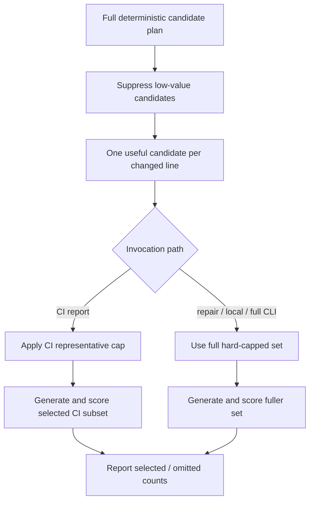

The selection is deterministic, not random:

1. Build the same full candidate plan from changed lines, coverage evidence, suppression rules, symbol ranges, and operator policy.
2. Rank candidates by versioned operator priority and stable tie-breakers such as source path, line, symbol, operator family, normalized diff, opportunity id, and hash.
3. Keep a representative capped subset for the CI report when the full set would exceed the CI budget.
4. Record the cap profile, selected count, omitted count, and candidate-plan fingerprint in evidence.

This gives CI a bounded runtime while keeping the report honest. If the report says it sampled or capped, it also says what was omitted.

We also put guardrails around the shortcut so it cannot leak into local workflows:

- CI sampling is injected by the CI adapter in-process; it is not a public command-line option.
- The lightweight local enforcement tool does not expose sampling flags.
- The developer workflow launcher validates evidence and rejects local evidence that claims CI sampling.
- Repair sessions do not reuse the sampled CI subset as the source of truth. They recompute the candidate plan and use the fuller repair profile, while using the CI evidence only as a comparison anchor.

That boundary matters. Sampling is a CI latency optimization, not a different definition of quality.

## 7. Agent Context: Give Repair The Right Mutation Problem

Another issue showed up in repair sessions: Python mutation repair could make no progress in the first round and then improve in the second. At first it looked like a model issue.

The real issue was context selection.

The first repair prompt sometimes received an arbitrary source-order window of survivors. If that window contained low-value or hard-to-test mutants, the LLM worked hard but did not improve the score. Java already had a better pattern: PIT survivors were grouped into mutation families and ranked before being sent to the agent.

So we moved mutation repair planning into the engine layer:

- Java adapts PIT survivors into mutation groups;
- Python adapts mutmut survivors into mutation groups;
- the engine ranks groups by ROI;
- the first repair round receives the full ROI-ranked survivor map;
- the second round is a focused cleanup over the latest remaining survivors.

The verifier remains authoritative. The LLM can edit tests, but only coverage and mutation reruns decide whether the target passed.

## 8. Verification Was a Product Feature

Most bugs in this work were not simple unit-test failures. They were workflow mismatches:

- CI passed while repair failed;
- repair passed while rerun failed;
- selected test files changed between runs;
- mutation score denominators confused users;
- Python reports showed Java/PIT wording;
- local dev guidance pointed to stale scripts;
- beta-environment behavior differed from local behavior;
- long-running mutmut processes leaked after timeout.

So verification had to be staged:

1. Unit tests for parsers, selectors, evidence contracts, candidate planning, batching, and aggregation.
2. E2E tests with fake/scripted agent and verifier doubles for workflow plumbing.
3. Real Python repo verification, including UTA itself as a Python project.
4. Real Java regression verification.
5. Beta-environment verification with actual CI report tasks.
6. Repair-session verification after CI failure.
7. Developer workflow local gate verification.

The lesson:

> For an agent workflow, "tests pass" is not enough. The CI report, repair session, local dev gate, progress UI, cost accounting, and callback behavior are all part of the feature.

## 9. What the Final Python Enforcement Path Looks Like

The current Python path is roughly:

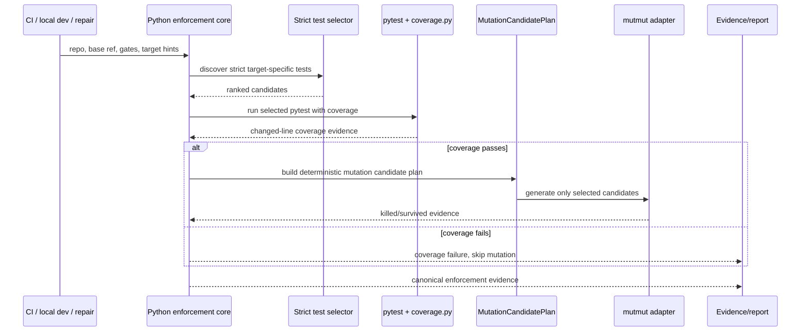

The same logic is used by:

- UTA CI Python reports;
- UTA repair verification;
- `uta python-enforce`;
- lightweight local Python enforcement through the developer workflow launcher.

The CI path may apply a smaller deterministic cap profile. Repair and local dev use the fuller hard-capped profile.

## 10. Lessons Learned

### 1. Language support starts with target identity

Java class FQNs were not a general abstraction. Python needed file/symbol targets. Future languages should plug into `TargetIdentity`, not force their world into Java terminology.

### 2. Keep workflow language-agnostic

Python exposed many bugs that were not Python-specific: progress, cost accounting, repair state, callback behavior, and report rendering. Fixing these in the engine made the system healthier for Java and future languages too.

### 3. Prevent target drift explicitly

An agent can easily drift from the failed target to a nearby file, a broader integration test, or a different failing module. The workflow must keep target identity, selected test path, changed lines, and verifier evidence attached to every repair turn. If a repair edits tests for one target but the verifier failure belongs to another, the system should requeue the owning target or fail clearly, not silently convert the run into success.

### 4. The verifier must stay authoritative

The LLM can propose tests, edit files, and explain intent, but it should not decide whether a target passed. The coverage and mutation verifier is the authority. This is especially important when the model claims a fix is complete, when a broad test happens to pass, or when a sampled CI subset is green. The workflow should always end with the deterministic verifier.

### 5. Agent context should be compact, ranked, and reproducible

Raw mutmut or PIT logs are noisy and push the model toward discovery work instead of repair work. A better agent prompt contains the target, strict test file, reproduce command, grouped survivors, representative diffs, and ROI ordering. The same context should be persisted so a resume or retry does not accidentally become a different task.

### 6. Stale workspace state is part of the threat model

Repair sessions run in mutable workspaces. A previous failed attempt may leave generated tests, caches, or partial edits behind. The workflow must refresh or validate the workspace at the right boundaries, commit useful generated tests before moving to the next target, and reject unsafe production-file edits when the task only allows test changes.

### 7. Observability is required for agent workflows

When an agent appears stalled, the system needs enough evidence to distinguish model no-output, provider failure, verifier slowness, mutation runtime, queue starvation, and process leaks. Progress events, per-turn logs, selected model/provider, verifier phase timings, and candidate-plan counts are not operational extras; they are how we debug and trust the workflow.

### 8. Optimization shortcuts must not leak into repair semantics

CI may use a bounded representative mutation subset for latency, but repair and local development need the fuller gate. If the shortcut leaks into repair, the agent can produce a fix that only satisfies the sampled subset. If it leaks into local development, users can learn the wrong behavior. Keep shortcuts private to the invocation path that owns the tradeoff, and record them in evidence.

## 11. Where This Leaves UTA

UTA is no longer just a Java unit-test generator with a Python branch. It is now closer to a language-aware code-agent runner:

- shared workflow engine;
- language registry;
- language-specific parsing and verification;
- common evidence contracts;
- common progress and cost reporting;
- CI and local enforcement alignment;
- repair sessions driven by verifier evidence.

Python support was the forcing function. The result is a cleaner architecture where adding a third language should mean adding an adapter, not rewriting the workflow.

## References

External papers, projects, and documentation that influenced the design:

- [Practical Mutation Testing at Scale](https://arxiv.org/abs/2102.11378), Goran Petrovic, Marko Ivankovic, Gordon Fraser, Rene Just. This paper shaped the incremental mutation strategy: mutate changed code, filter irrelevant mutants, and bound mutants per review.
- [Practical Mutation Testing at Scale PDF](https://homes.cs.washington.edu/~rjust/publ/practical_mutation_testing_tse_2021.pdf), the paper version used during design review.
- [mutmut documentation](https://mutmut.readthedocs.io/), the Python mutation testing backend used for Python enforcement.
- [pytest documentation](https://docs.pytest.org/) and [pytest good integration practices](https://docs.pytest.org/en/stable/explanation/goodpractices.html), used for Python test layout and runner conventions.
- [coverage.py documentation](https://coverage.readthedocs.io/), used for Python line coverage collection and reporting.
- [Tree-sitter documentation](https://tree-sitter.github.io/), used for source-only parsing without importing target modules.
- [PIT Mutation Testing](https://pitest.org/) and [PIT Maven quickstart](https://pitest.org/quickstart/maven/), the Java mutation testing baseline.
- [JaCoCo documentation](https://www.jacoco.org/jacoco/trunk/doc/) and [JaCoCo project page](https://www.eclemma.org/jacoco/), the Java line coverage baseline.
- [Python `ast` documentation](https://docs.python.org/3/library/ast.html), relevant to the mutmut generated-module parse bottleneck discussed in the performance section.
