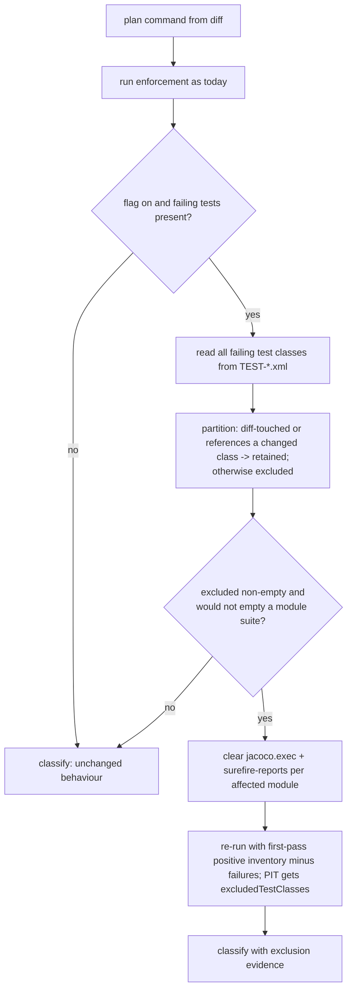

# Design — Diff-unrelated failing-test exclusion for Java enforcement

Spec: `docs/spec-baseline-red-exclusion.md` · ADR: [ADR-015](decisions/ADR-015-baseline-red-test-exclusion.md)
Date: 2026-08-31 · Revision 2 (design review dispositions folded in; base-ref probe dropped)

Single repo, so the per-repo detail design is folded in. The test-enforcer Maven plugin
is deliberately untouched (ADR-015).

## 1. Goals and non-goals

**Goals** — both stages observe the same test set; a test related to the change is never
excluded; no extra Maven invocation beyond one re-run; off by default; byte-identical
command when nothing is excluded.

**Non-goals** — measuring the baseline at the base ref, rc-143 classification, PIT stall
watchdog, `targetTests` narrowing, upstreaming to the plugin, wconfig infra.

## 2. High-level design

Additions inside `uta/language/java/`, one per existing layer. Nothing enters the
language-agnostic core; the two app-layer files are report rendering only, which is where
every other evidence key is rendered.

| Layer | Module | Addition |
| --- | --- | --- |
| read | `enforcement_runner/parsing.py` | `_failed_surefire_test_classes(repo)` — uncapped FQN set from `TEST-*.xml` |
| decide | **new** `enforcement_runner/failing_test_scope.py` | `partition_failing_tests(...) -> FailingTestPartition` — the rule, pure |
| plan | `enforcement_runner/planning.py` | Positive inventory shapers for file-backed and legacy selectors |
| run | `enforcement_runner/__init__.py` | Clear stale artifacts, re-run once with the exclusion |
| report | `enforcement_runner/evidence.py`, `classification.py` | New keys; attribution of a coverage shortfall |
| render | `uta/app/context.py`, `templates/report.html` | Show excluded/retained sets |
| repair | `uta/language/java/ci.py` | Excluded classes are not repair targets |

`_clear_jacoco_artifacts` (`uta/language/java/maven/jacoco.py:32`) is reused as-is rather
than reimplemented.

## 3. Core data model

```python
# uta/language/java/enforcement_runner/failing_test_scope.py

@dataclass(frozen=True)
class FailingTestPartition:
    excluded: tuple[str, ...]    # FQNs: diff-unrelated failing test classes
    retained: tuple[str, ...]    # FQNs: failing and related to the change
    reason: str                  # "" normally; else why `excluded` is empty
```

`reason` values: `""`, `"disabled"`, `"no-failures"`, `"all-failures-related"`,
`"would-empty-module-suite"`, `"unreadable-reports"`,
`"incomplete-test-inventory"`, `"positive-test-selector-too-large"`, and inventory I/O
failures. It reaches the report, so an empty
exclusion set is never ambiguous between "nothing to exclude" and "we could not tell".

No persisted business state or schema change. The partition is derived from the diff UTA
already computes and the Surefire reports the run just wrote. Modern Surefire gets a
deterministic runtime inventory under `.uta_cache/maven/`; it is command evidence, not a
cross-run cache.

## 4. Process flow



Cost: exactly one extra enforcement run, and only when there is something to exclude.

## 5. Key decisions

**D1 — Exclude after the first run, never before.** The failing set is not knowable until
the suite runs. Rejected: predicting failures from history.

**D2 — Re-run even when the first run passed.** A first run that passed is precisely the
possible false green this exists to catch. Rejected: "only re-run on failure" as a saving.

**D3 — Positive Surefire inventory plus PIT exclusions.** A negative-only `-Dtest`
overrides default discovery and can execute nonstandard utility classes that the first
run never selected. UTA therefore reruns the complete observed passing inventory.
Surefire 2.13+ uses an includes file with a no-match configured-includes override;
older versions use a positive `-Dtest` guarded at 96 KiB. PIT receives FQN exclusions.

**D4 — Clear stale build output before the re-run, reusing `_clear_jacoco_artifacts`.**
JaCoCo's agent appends; without this the re-run reports the first run's coverage and the
feature silently no-ops. Per affected module, not `mvn clean` — a full recompile would
double an already 40-minute run for no benefit. Stale `surefire-reports` must go too, or
the excluded classes' old reports are re-read as the re-run's failures.

**D5 — Fail open.** Unreadable reports, an empty partition, or a would-be-empty module
suite all leave the original verdict untouched with a `reason`. This feature may never
turn a run red through its own machinery.

**D6 — Related failures stay fatal and visible.** A retained failing class is reported as
it is today. The exclusion never suppresses a failure the diff is related to.

**D7 — Ordering in `classification.py`.** The exclusion attribution attaches to the
coverage-failure summary, after `_looks_skipped` (`:59`) and before `_looks_gate_failed`
(`:70`); the module docstring — which states the order *is* the policy — is updated in
the same commit.

**D8 — Merge, never overwrite.** Existing `-Dtest=` selectors and any repository-supplied
`-DexcludedTestClasses` are parsed and unioned. Class names are validated against a
Java-FQN pattern (living beside `_java_fqn_from_path`, `planning.py:273`) before reaching
a command line.

## 6. Interface changes

No HTTP/API change. Externally visible: the Maven command in the report and four evidence
keys (`excludedFailingTestClasses`, `retainedFailingTestClasses`, `exclusionReason`,
`coverageBeforeExclusion`).

| Setting | Env | Default | Meaning |
| --- | --- | --- | --- |
| `ci_failing_test_exclusion_enabled` | `UTA_CI_FAILING_TEST_EXCLUSION_ENABLED` | `false` | Single boolean; off is exactly today's behavior |

Off by default, and off means *nothing extra runs* — no probe, no re-run, no evidence
change. Enable per-environment after reading the first reports.

## 7. Capacity, reliability, security

| Call | Budget | Notes |
| --- | --- | --- |
| Read `TEST-*.xml` | ms | Local file glob, already done for `.txt` today |
| Partition | ms | Pure; reuses the diff already computed and `_java_test_targets_type` (a regex scan over the failing test sources only, not the suite) |
| Clear artifacts | ms | `unlink` + two `rmtree` per affected module |
| Re-run enforcement | existing 1800s | Only when the exclusion set is non-empty |

Worst case is 2× enforcement on a task with excludable failures — the honest price of the
correction, and bounded by the same timeout as today. **Known interaction:** on the
observed repository the *first* run was already being killed at ~40 minutes (rc 143);
until the deferred watchdog/environment work lands, enabling this there doubles exposure
to that stall. That is a reason to enable per repository, not globally.

| Failure mode | Handling |
| --- | --- |
| Reports unreadable / no class names | Empty exclusion, `reason="unreadable-reports"`, verdict unchanged |
| Exclusion would empty a module's suite | Skipped for that module (`failWhenNoMutations` would fail the build), reason recorded |
| Re-run itself fails or times out | The re-run's verdict stands, as any enforcement failure does; evidence records that exclusion was applied |
| Diff unavailable (`_changed_java_files` returns `None`) | Feature does not engage; condition 1 cannot be evaluated |
| A test broken by the change through DI/reflection | **Unguarded by construction** (ADR-015). Contained by: condition 2, the flag default, and always naming the excluded set in the report |

Security: no new network calls, no credentials, no new external input. Class names are
FQN-validated before reaching a command line, so a crafted report filename cannot inject
Maven arguments.

## 8. Observability

- Evidence keys above, rendered in the task report next to the existing Surefire failure
  block (`uta/app/context.py:128`, `report.html`).
- INFO log on partition: counts excluded/retained and the reason.
- The report's Maven command already shows the emitted properties, keeping the
  "reproduce locally" instruction accurate.

## 9. Verification plan

1. Unit tests per spec §5, all with injected runners.
2. A regression test proving the re-run cannot inherit the first run's `jacoco.exec`.
3. Fixture test from task `2d91c62a65f24aafb8eb9202c9001344`'s report shapes.
4. Full `pytest` green.
5. Production: enable on one repository, read the first reports for excluded sets that
   look wrong (a class that *should* have been related), then widen.

**Production proof signal:** a report where `coverageBeforeExclusion` differs from the
post-exclusion coverage — the first real instance of the coverage false green. Secondary:
`PIT >> Sending N test classes to minion` drops by the size of the excluded set on a
repeat of the observed task.

Rollback: `UTA_CI_FAILING_TEST_EXCLUSION_ENABLED=false`. No migration, no schema change;
evidence keys are additive.
