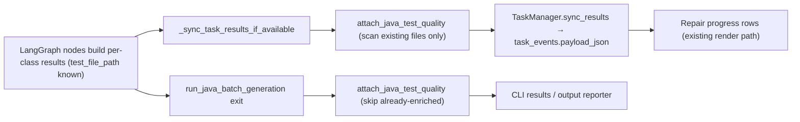

# Design: Behavior-Aware Test Quality — Round 2

Source spec: [`docs/spec-behavior-aware-quality-round2.md`](spec-behavior-aware-quality-round2.md)
Single-repo work: per-repo detail is folded into this overview.

## 1. Table Of Contents

1. Goals And Non-Goals
2. High-Level Design
3. Key Decisions (ADR-style)
4. Contracts And Data Model
5. Process Flows
6. Prompt Changes
7. Capacity, Reliability, Security
8. Failure Modes And Mitigations
9. Verification Plan
10. First-Principles Check
11. Design Review
12. Changelog

## 2. Goals And Non-Goals

### 2.1 Goals

- Java test-quality warnings flow end-to-end: workflow results → repair progress → CI report → local CLI summary.
- Local runs (`uta python-enforce`, dev-skills script, `uta run`) surface warnings without JSON parsing.
- Prompts mine intent from prioritized sources; an optional spec-context channel carries externally supplied behavior rules into prompts.
- Zero gate/lifecycle/schema changes; all evidence additions are additive keys.

### 2.2 Non-Goals

- No Maven test-enforcer plugin changes (external artifact).
- No hard gating on warnings; no DB migration; no Jira client in uta.
- No Python caller/symbol index this round (prompts may still name docstrings/existing tests as sources).
- No dev-skills plugin repo changes (it prints uta output as-is).
- No Java local dev-skills gate coverage: that gate is Maven-only (`uta_dev_gate.py` → `mvn verify`) with no uta involvement; Java local surfacing is via `uta run` summary only.

## 3. Key Decisions

**D1 — Java scan attachment: one shared helper, two UTA-owned call sites.**
We will add `attach_java_test_quality(repo_path, results)` (language-owned, in `uta/language/java/test_quality.py`) that enriches per-class result dicts in place, and call it from exactly two places:

1. `_sync_task_results_if_available` (`uta/graph/nodes.py:423`) — before `TaskManager.sync_results`, so mid-run task events carry warnings and repair progress updates live.
2. `run_java_batch_generation` (`uta/language/java/batch.py`) — before returning, skipping results that already have `testQuality`, so non-task CLI runs are covered.

Path selection per result: `candidate_test_file_paths` when non-empty, else `[test_file_path]`; entries that do not resolve to an existing file are skipped silently (error/rate-limited payloads carry conventional paths for files never created — they must not produce scan-failed noise). Scan whenever the file exists, regardless of PASS/FAIL status: warnings on a failing test are still actionable.
*Rejected:* wiring each of the 16 result-payload sites in `nodes.py` (scattershot); enriching inside `TaskManager.sync_results` (tasks layer is language-neutral and must not import the Java scanner).

**D2 — Java CI report seam: fix-session live-task refresh.**
Java structured enforcement evidence is parsed from Maven test-enforcer output, which UTA does not control, and Java has no `targetResults`. We will surface Java warnings in the CI report through the fix-session rows: where `uta/api_trigger/service.py` refreshes a session from the live repo task (`session["repoTaskStatus"] = live_task["status"]`, `service.py:557` and peers), also copy an aggregated test-quality summary (`testQualityWarningCount`, compact top-rule text) computed by reusing the existing aggregation helper (`uta/tasks/render.py` `_test_quality_by_class_task_id` over the same bounded `latest_events(limit=200)` query that repair progress already runs) — no duplicate aggregation logic. This adds one bounded SQLite query per fix-session refresh (report render / status poll), the same cost the progress page already pays. `CiReportRenderer` renders this on fix-session rows and feeds the existing "Test quality signals" section when `structured.testQuality` is absent. Initial (pre-repair) Java CI runs have no UTA-generated tests, so having warnings appear only once a fix session exists is semantically correct, not a limitation.
*Rejected:* modifying the Maven plugin (external, out of scope); report-time workspace scanning (violates the selected-files-only boundary and re-reads files at request time).

**D3 — Local surfacing: marker line + run-summary counts.**
`format_evidence_markers` (`uta/language/python/enforcement.py:219`) gains one line when `warningCount > 0`:
`[test-enforcer] python test quality N advisory warning(s) top=<rule>xC,<rule>xC (coverage/mutation gates unaffected)`.
`uta/reporting/reporter.py` per-class summary gains `test_quality_warning_count` and `test_quality_top_rule` when present (both languages). No line/field when zero warnings; exit codes unchanged.
*Rejected:* changing the dev-skills script (unnecessary — it prints uta output); a new CLI subcommand (overkill for advisory text).

**D4 — Spec-context channel: CLI flag + API field, injected after the cache boundary.**
`uta run` gains `--spec-context <path-or-text>`; the API trigger request gains optional `specContext`. Resolution: if the value names an existing file, read it, else treat it as inline text; bound to 16 KB with a visible `...[truncated]` marker. The text is carried in workflow state (`spec_context`) / batch request and injected verbatim into the plan and generate prompts (Java `plan_tests.txt`, `generate_test.txt`; Python `python_generate_test.txt`) inside a delimited block placed **after** `{# CACHE_BOUNDARY #}` in the per-target section, so the stable cached prefix is untouched and absent input renders byte-identical prompts. Repair prompts get intent-source instructions (D5) but not the raw spec context this round — survivors/coverage gaps already give repair its targeting, and keeping the injection surface small limits prompt-cache and token-cost risk.
*Rejected:* placing spec context in the stable prefix (varies per run — would fragment cross-run cache reuse); auto-fetching Jira (uta stays standalone; callers can pass text).

**D5 — Intent-source priority in prompts, not new machinery.**
Planning/generation prompts (both languages) will instruct: derive intended behavior from, in order, (1) supplied spec context, (2) docstrings/javadoc/comments, (3) existing tests of the same or sibling classes, (4) caller usage and collaborator contracts (the Java context builder already lists callers, caller counts, collaborators, nearby test references — `uta/language/java/context_builder.py`), (5) the implementation itself, explicitly noting that implementation-derived expectations are characterization only. Repair prompts get one added line pointing at the same priority. No context-builder changes needed for Java; Python context enrichment is deferred (spec §3).

**D6 — Precondition: diagnose the 4 failing `test_workflow.py` tests.**
They cover the delegated-gate/RDC-repair area D1/D2 touch. Diagnose first; fix if code-caused, record cause if environmental. Verification of (a) runs only on a green (or explained) baseline.

## 4. Contracts And Data Model

- Finding/aggregation contract: unchanged from round 1 (`uta/engine/test_quality.py`).
- Java evidence wrapper: `scan_java_test_quality_evidence(repo: Path, test_paths: Sequence[str|Path]) -> dict` — same shape as Python's (`aggregate_test_quality` output or `{}`), with missing-file skip semantics.
- Per-class Java result gains optional `testQuality` (same JSON shape as Python target results).
- Fix-session dict gains optional `testQuality: {"warningCount": int, "topRuleIds": [{"ruleId", "count"}]}` (structured, template-compatible; chosen over the originally sketched flat-text fields so the report renders it with the round-1 section unchanged). Additive; absent for Python-only or warning-free sessions is fine — Python continues to flow through `structured.targetResults`.
- Batch request / workflow state gains optional `spec_context: str` (empty default). API trigger request model gains optional `specContext`.
- No DB schema change: class-row `test_quality` already travels via `task_events.payload_json`.

## 5. Process Flows

### 5.1 Java Generation/Repair (a)

### 5.2 Java CI Report (a)

Fix-session refresh (service.py) reads live repo task → class rows already carry `test_quality` → copy aggregate onto session dict → `CiReportRenderer` renders fix-session warning column and populates "Test quality signals" for Java from session aggregates when structured evidence has none.

### 5.3 Local Runs (b)

`uta python-enforce` → evidence built (already contains `testQuality`) → `format_evidence_markers` appends the test-quality line → dev-skills script surfaces stdout unchanged. `uta run` → reporter summary includes per-class counts.

### 5.4 Spec Context (c)

CLI/API input → bounded resolution (file or inline) → batch request/state → prompt render injects delimited block after cache boundary → agent plans/generates against supplied behavior rules first.

## 6. Prompt Changes

- `plan_tests.txt`, `generate_test.txt`, `python_generate_test.txt`: add the intent-source priority instruction (stable rules) and the optional spec-context block (target section).
- `fix_coverage.txt`, `fix_mutations.txt`, `python_fix_coverage.txt`, `python_fix_mutations.txt`: add one intent-source priority line (stable rules only; no spec-context block this round).
- Rendering with `spec_context=""` must be byte-identical to current output (guarded by prompt-render tests).

## 7. Capacity, Reliability, Security

- Performance: scans are bounded local reads (≤128 KB/file, ≤ a handful of files per class) — negligible against Maven/LLM phases. The D2 seam copies data from an already-executed live-task query; no new DB/RPC calls. Spec-context adds ≤16 KB per plan/generate prompt (~4K tokens worst case) only when supplied.
- Reliability: wrapper catches per-file exceptions → single info finding; helper failure must never fail the sync or the run (wrap call sites).
- Security: spec-context content goes only to LLM prompts (existing trust boundary), never into reports/evidence/logs — record presence and byte length only. Evidence snippets remain short single-line excerpts of test files.

## 8. Failure Modes And Mitigations

| Failure mode | Impact | Mitigation |
| --- | --- | --- |
| Scan raises during task sync | Repair sync aborted | Wrap `attach_java_test_quality` call in try/except; log and continue without warnings. |
| Conventional path never created | Noisy scan-failed findings | Missing-file skip semantics (D1). |
| Double enrichment (sync + exit) | Duplicate scan cost | Exit call skips results already carrying `testQuality`. |
| Fix-session seam misses live task | No Java report warnings | Progress rows still show warnings; report section notes fix-session source. Advisory only. |
| Spec context is a huge file | Token blowup | 16 KB bound + truncation marker; length logged. |
| Spec context contradicts code | Agent writes failing "intended" tests | Acceptable and desirable signal (article's point); coverage/mutation gates still arbitrate merge. |
| Marker line breaks a log parser | Downstream CI grep confusion | New line uses the established `[test-enforcer]` prefix and appears only when warnings exist; format documented in usage doc. |

## 9. Verification Plan

1. Precondition: run `tests/test_workflow.py`, diagnose 4 failures, fix or document (D6).
2. Unit: Java wrapper (existing/missing/weak/exception); `attach_java_test_quality` path preference and skip semantics.
3. Unit: nodes sync enrichment (fake state → task event payload contains `testQuality`); exit enrichment skip-if-present.
4. Unit: service fix-session refresh copies aggregate; report renders Java warnings from session aggregates.
5. Unit: marker line emit/omit; reporter summary fields.
6. Unit: prompt render — intent priority present; spec-context block present/absent; byte-identical when absent; 16 KB truncation.
7. Suites: `test_test_quality.py`, `test_workflow.py`, `test_api_trigger_report.py`, `test_python_enforcement_cli.py`, `test_tasks.py`, `test_prompt_render.py`, `test_engine_layering.py`, `test_cross_language_contracts.py`, `test_python_batch_generation.py`.
8. E2E smoke (manual, post-merge): sample-outbound-core run showing Java warnings in progress + report.

## 10. First-Principles Check

- Key goal (spec): close round 1's gaps so weak-test warnings exist for Java, in every run mode, and generation has real intent sources instead of only the implementation.
- Simplest right solution: one shared Java helper at two existing seams, one marker line, additive report fields, prompt text, and a bounded pass-through input channel — no new services, schemas, or dependencies.
- Production proof: Java `warningCount`/`topRuleIds` appearing in real repair progress and CI reports; `[test-enforcer] ... test quality` lines in dev-skills local runs; spec-context presence/length in run logs.
- Worst case: noisy or missing advisory warnings, or a scan exception breaking task sync. Guards: warning-only semantics, missing-file skips, try/except at both call sites, additive-only payload keys.

## 11. Design Review

Reviewed 2026-07-07 (inline rubric pass; user delegated dispositions for this autonomous iteration).

- Important — spec success criterion (b) promised local dev-skills surfacing for Java, but the Java local gate is Maven-only with no uta involvement, making the criterion unmeetable. Disposition: fixed — spec and non-goals now scope Java local surfacing to `uta run` summary.
- Important — D2 risked duplicating class-row aggregation and an unbudgeted query. Disposition: fixed — D2 reuses `_test_quality_by_class_task_id` over the existing bounded `latest_events` query; per-poll cost stated.
- Nice-to-have — exit enrichment could theoretically carry a mid-run scan of an older file version; final sync at the finish stage scans the final file, so accepted.
- First-principles: goal traced to spec §1; solution is seams + text + one input channel (no new machinery); production proof and worst-case guards recorded in §10. No Critical findings; scope frozen.

## 12. Changelog

- 2026-07-07 — Initial round-2 design (D1–D6).
- 2026-07-07 — Implementation notes: session carrier is structured `testQuality` (see §4); T0 root causes recorded — 78af5cf dropped the initial-result out-of-scope check (fixed with a strong-signal module-disjoint precheck), 86d8bd1's module-ownership check needed pom.xml in old test fixtures.
