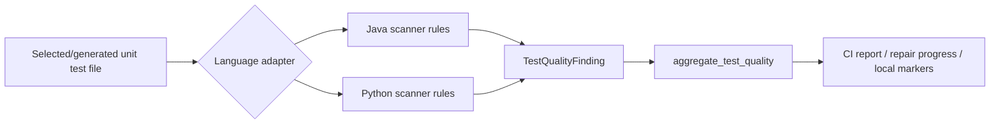
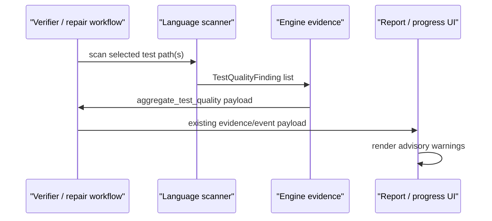
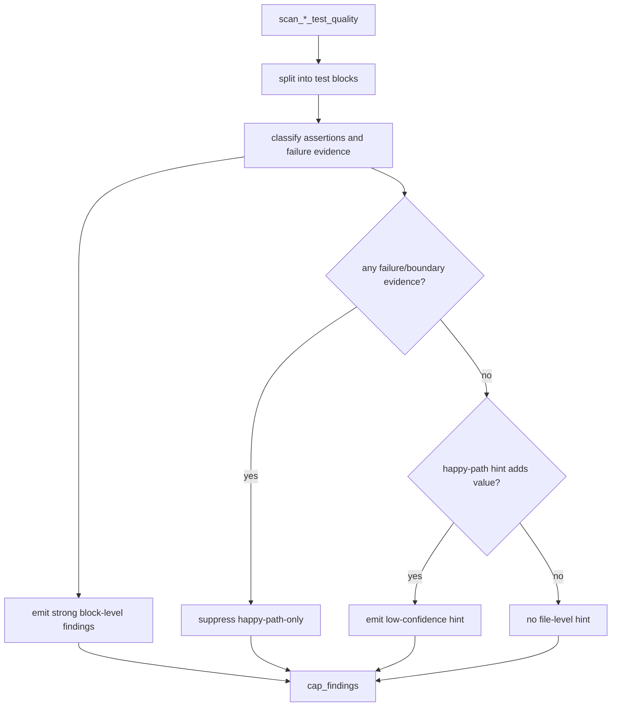

# Design: Behavior-Aware Test Quality — Round 3 Scanner Signal Improvements

Source spec: [`docs/spec-behavior-aware-quality-round3.md`](spec-behavior-aware-quality-round3.md)

## Table Of Contents

1. [Goals And Non-Goals](#1-goals-and-non-goals)
2. [High-Level Design](#2-high-level-design)
3. [Contracts And Data Model](#3-contracts-and-data-model)
4. [Language Adapter Design](#4-language-adapter-design)
5. [Report And Progress Flow](#5-report-and-progress-flow)
6. [Capacity, Reliability, And Security](#6-capacity-reliability-and-security)
7. [Failure-Mode Handling](#7-failure-mode-handling)
8. [Rollout And Verification](#8-rollout-and-verification)
9. [Repo Detail](#9-repo-detail)
10. [First-Principles Check](#10-first-principles-check)
11. [Design Review Notes](#11-design-review-notes)
12. [Changelog](#12-changelog)

## 1. Goals And Non-Goals

### 1.1 Goals

- Reduce false positives from `java-happy-path-only-hint` and `python-happy-path-only-hint`.
- Detect more actionable low-value test patterns, especially no-assertion, smoke-only, mock-only, weak existence-only, and implementation-mirroring tests.
- Keep warning semantics advisory. Coverage and mutation remain the only gates.
- Keep the architecture language-clean: shared evidence stays in `uta/engine/test_quality.py`; rule details stay in `uta/language/{java,python}/test_quality.py`.

### 1.2 Non-Goals

- No hard gate based on test-quality findings.
- No full-repo scan.
- No LLM-based scoring.
- No parser/call-graph dependency in this round.
- No dev-skills documentation change unless CLI/report wording changes in a way users must learn.

## 2. High-Level Design

We will keep the existing scanner pipeline and improve the rule implementations behind it.



The core change is a shared rule shape implemented twice, once per language:

1. Split each test file into test blocks.
2. For each block, classify evidence:
   - observable assertions;
   - weak existence assertions;
   - interaction-only checks;
   - failure/boundary intent;
   - implementation mirroring.
3. Emit high-confidence block-level warnings first.
4. Emit `happy-path-only` as a low-confidence file-level hint only if no credible failure/boundary evidence exists.

No report/progress lifecycle change is needed. Existing consumers already render `TestQualityFinding` payloads and top rule ids.

## 3. Contracts And Data Model

### 3.1 Evidence Contract

We will keep the existing `TestQualityFinding` shape:

```python
TestQualityFinding(
    language="java|python",
    file_path="...",
    rule_id="...",
    category="...",
    severity="warning|info",
    message="...",
    line=...,
    evidence="...",
)
```

No DB migration is required. Findings continue to travel through existing JSON payloads:

- Python CI target evidence.
- Java CI selected-test evidence.
- repair task event payloads.
- local `uta python-enforce` marker summaries.

### 3.2 Rule Naming

We will normalize new rule intent while keeping existing rule ids stable where tests and reports already expect them.

| Concept | Java rule | Python rule | Severity |
| --- | --- | --- | --- |
| No observable assertion | `java-no-observable-assertion` | `python-no-observable-assertion` | warning |
| Smoke-only / no behavior | `java-smoke-only-no-behavior` | `python-smoke-only-no-behavior` | warning |
| Mock/collaborator-only | existing `java-impl-detail-verify-only` | existing `python-impl-detail-mock-call-count` | warning |
| Weak existence assertion | existing `java-weak-not-null` / `java-weak-size-only` | existing `python-weak-assert-not-none` / `python-weak-len-only` | warning |
| Implementation mirroring | existing `java-mirroring-formula` | existing `python-mirroring-formula` | warning |
| Happy path only | existing `java-happy-path-only-hint` | existing `python-happy-path-only-hint` | info |

Messages will carry the actionable suggestion. We will not add a new `suggestion` field unless implementation shows report rendering needs it; the current message field is enough and avoids contract churn.

## 4. Language Adapter Design

### 4.1 Shared Adapter Pattern

Each language scanner will expose the same public functions as today:

- `scan_java_test_quality(path, text) -> list[TestQualityFinding]`
- `scan_python_test_quality(path, text) -> list[TestQualityFinding]`
- `scan_*_test_quality_evidence(repo, test_paths) -> dict`

Internally, each adapter will use small helpers with the same conceptual shape:

```python
def _has_failure_or_boundary_evidence(test_name: str, body: str) -> bool:
    return (
        _has_exception_assertion(body)
        or _has_try_fail_expected_pattern(body)
        or (_name_suggests_negative_path(test_name) and _has_meaningful_assertion(body))
        or _asserts_error_or_status(body)
    )
```

This preserves the architecture invariant: the workflow sees a language-neutral evidence contract, while rule syntax stays language-owned.

### 4.2 Java Rules

Java block parsing currently starts from `@Test`. We will extend it to keep the method name together with the body. This is required for name-based suppression of broad `happy-path-only` hints.

Java failure/boundary detection will include:

- existing exception assertion patterns;
- `try`/`catch` blocks with `fail(...)`, `Assert.fail(...)`, `Assertions.fail(...)`, `assertFalse(true)`, or `assertTrue(false)`;
- negative/boundary method names paired with meaningful assertions;
- assertions referencing error/status/message/failure fields.

Java no-observable assertion detection:

- emit when a test block has no assertion, no exception expectation, no explicit failure expectation, and no collaborator verification.
- if the test only contains `assertNotNull`, size/non-empty checks, or truthiness-equivalent checks, keep the existing weak assertion warning instead of duplicating no-observable assertion.

### 4.3 Python Rules

Python block parsing already keeps the test function name. We will extend helper classification rather than changing the public API.

Python failure/boundary detection will include:

- existing `pytest.raises`, `raises(...)`, and `assertRaises`;
- `try`/`except` blocks with `pytest.fail(...)`, `self.fail(...)`, `assert False`, or `raise AssertionError`;
- negative/boundary test names paired with meaningful assertions;
- assertions referencing error/status/message/failure fields.

Python no-observable assertion detection:

- emit when a test block has no `assert`, no unittest assertion, no exception expectation, and no mock verification.
- if the only assertion is truthiness/non-None/len-only, keep existing weak assertion warnings instead.

### 4.4 Happy-Path Hint Policy

`happy-path-only` remains a low-confidence file-level hint. It will be emitted only when:

1. the file contains at least one test block;
2. no block contains credible failure/boundary evidence; and
3. the hint adds useful file-level context beyond stronger block-level findings.

In practice, condition 3 means we will still allow the hint alongside one weak assertion warning in a tiny file, preserving current useful behavior, but we will not emit it when stronger findings already cover most blocks in a large low-value file. This keeps real reports from being dominated by a broad hint.

## 5. Report And Progress Flow

No new flow is introduced.



Report changes, if any, are limited to wording:

- keep "Coverage and mutation gates remain authoritative";
- show clearer messages from the scanner;
- keep top-rule grouping unchanged.

## 6. Capacity, Reliability, And Security

### 6.1 Capacity

The scanner reads at most `MAX_TEST_QUALITY_FILE_BYTES` (128 KiB) per selected test file and caps findings. This round adds local regex checks over the same bounded text. Expected overhead is sub-millisecond to low milliseconds per scanned file, with no RPC/DB/external calls.

### 6.2 Reliability

Scanner failures remain non-blocking:

- Python evidence wrapper records a scan-failed advisory today.
- Java evidence wrapper skips missing files and wraps unexpected scan failures.
- No warning can change pass/fail state.

### 6.3 Security

Evidence snippets stay bounded by `normalize_evidence_snippet`. We will not log full test files or source content. No secrets, credentials, or external requests are introduced.

## 7. Failure-Mode Handling

| Failure mode | Detection | Containment / recovery | Blast radius |
| --- | --- | --- | --- |
| False positive warning | Unit regression fixture or user report | Add a scanner fixture; warnings are advisory only | Report noise |
| False negative missed warning | Unit fixture or manual report review | Add rule/fixture in language adapter | Missed advisory only |
| Scanner exception | Existing scan-failed evidence or debug logs | Non-blocking wrapper; continue enforcement | Advisory missing or scan-failed info |
| Performance regression | Focused tests and report runtime observation | Bounded file reads/findings; no full repo scan | Slower report generation for selected tests |
| Language-specific leakage into core | Engine layering tests / code review | Keep rule ids/messages opaque to report core | Architecture drift |

## 8. Rollout And Verification

### 8.1 Unit Verification

Run:

```bash
python3 -m pytest -q tests/test_test_quality.py
```

Required fixtures:

- Java try/fail/catch suppresses `java-happy-path-only-hint`.
- Java `assertFalse(true)`/`assertTrue(false)` expected-failure style suppresses the hint.
- Java negative method names plus meaningful assertions suppress the hint.
- Python try/except failure tests suppress `python-happy-path-only-hint`.
- Positive happy-path-only Java/Python fixtures still emit the hint.
- No-observable assertion fixtures emit the new warning.

### 8.2 Integration Verification

Run:

```bash
python3 -m pytest -q tests/test_python_enforcement_cli.py
python3 -m pytest -q tests/test_api_trigger_report.py
python3 -m pytest -q tests/test_api_trigger_enforcement.py
python3 -m pytest -q tests/test_reporter.py tests/test_tasks.py tests/test_cross_language_contracts.py
```

### 8.3 Post-Deploy Smoke

After deploy to beta/node2, re-run one Java and one Python CI enforcement report that has selected/generated tests. Confirm:

- advisory section renders;
- report pass/fail is unchanged by warnings;
- warnings are more specific than `happy-path-only` when a stronger rule applies.

## 9. Repo Detail

### 9.1 Changes In This Repo

- `uta/language/java/test_quality.py`: add block method-name extraction, failure/boundary recognizers, no-observable/smoke-only warnings, and clearer messages.
- `uta/language/python/test_quality.py`: add try/except failure recognizers, negative-name suppression, no-observable/smoke-only warnings, and clearer messages.
- `tests/test_test_quality.py`: add scanner regression fixtures and update expected rule ids where messages/rules become more precise.
- `uta/api_trigger/templates/report.html` or `uta/tasks/render.py`: only if wording needs a small rendering adjustment. No lifecycle change expected.

### 9.2 Key Control Flow



### 9.3 API And Schema Changes

N/A. No external API, CLI argument, DB schema, or required JSON field changes. Evidence changes are additive rule ids/messages inside the existing test-quality payload.

### 9.4 Repo-Local Tradeoffs

- We will use bounded regex/text heuristics instead of AST parsing. Also considered AST parsing for better precision; rejected for this round because existing scanners are lightweight, tests can cover the observed false positives, and parser support would increase maintenance cost.
- We will keep existing rule ids where they already exist. Also considered renaming weak/mock/mirroring rules to the new concept names; rejected because stable ids keep existing report expectations and tests compatible.
- We will not inspect production source to prove the target has error branches before `happy-path-only`. Also considered source-aware hints; rejected for this round because it would require more context threading and may become slow/noisy.

## 10. First-Principles Check

1. Key goal: make UTA test-quality advisories useful by identifying low-value, non-behavior-oriented tests without noisy false positives.
2. Simplest right solution: improve the existing lightweight language scanners and keep the evidence/report pipeline unchanged.
3. Production proof: on beta/node2, recent Java/Python reports should show fewer false `happy-path-only` warnings and stronger rules for no-assertion/mock-only/weak tests while pass/fail remains governed only by coverage/mutation.
4. Worst case: scanner noise causes developers to ignore advisory feedback. Guard: advisory-only semantics, bounded evidence, regression fixtures for known false positives, and no gate impact.

## 11. Design Review Notes

Design review completed on 2026-07-09.

### 11.1 Findings

| Severity | Axis | Finding | Disposition |
| --- | --- | --- | --- |
| Important | Scope / verification | The design must prove both sides of the rule changes: false positives are suppressed and true positive happy-path-only warnings still fire. | Fixed in §8.1 and the implementation plan: add paired regression tests for suppression and positive detection. |
| Important | Simplicity | Adding a separate `suggestion` field would create schema churn for a display-only improvement. | Fixed in §3.2: keep existing `message` field and make messages actionable. |
| Nice-to-have | Performance | Regex helpers should avoid broad `.*` patterns over whole files where block-level scanning is enough. | Accepted: implementation will scan bounded blocks and keep file-level checks simple. |

### 11.2 First-Principles Review

- Key goal: make UTA test-quality advisories useful by identifying low-value, non-behavior-oriented tests without noisy false positives.
- Simplest right solution: improve existing language scanners and keep the evidence/report pipeline unchanged.
- Production proof: beta/node2 Java/Python reports continue to pass/fail by coverage/mutation while advisory warnings become more specific and less noisy.
- Worst case: scanner noise reduces developer trust. Guard: advisory-only semantics, regression fixtures for false positives, bounded evidence, and no gate impact.

## 12. Changelog

- 2026-07-09 — Initial design for round-3 scanner signal improvements.
- 2026-07-09 — Implementation completed with no report/progress contract changes; scanner behavior stayed inside Java/Python adapters.
