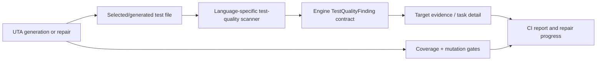
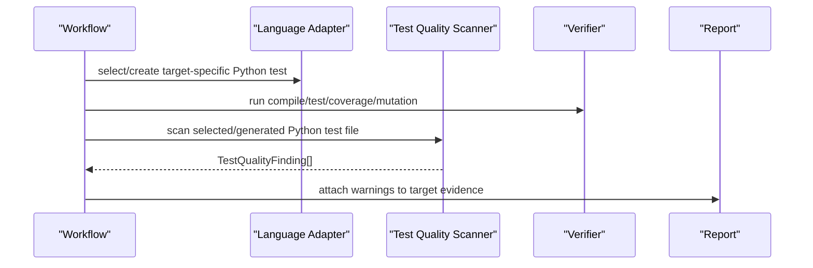

# Design: Behavior-Aware Test Quality For UTA

Source spec: [`docs/spec-behavior-aware-test-quality.md`](spec-behavior-aware-test-quality.md)

## 1. Table Of Contents

1. Goals And Non-Goals
2. High-Level Design
3. Contracts And Data Model
4. Process Flow
5. Prompt Changes
6. Report And Progress Changes
7. Failure Modes And Risks
8. Verification Plan
9. Design Review
10. Changelog

## 2. Goals And Non-Goals

### 2.1 Goals

- Make AI-generated tests more behavior-aware before and after mutation repair.
- Add deterministic advisory warnings for weak generated tests.
- Surface warnings in CI reports and repair progress without changing gate semantics.
- Preserve the architecture invariant: core workflow remains language-agnostic; Java/Python specifics live behind adapters/rules.

### 2.2 Non-Goals

- No hard failure based on heuristic test-quality warnings.
- No DB migration.
- No broad repository scan.
- No dev-skills local enforcement change in this iteration.
- No replacement of coverage/mutation gates.

## 3. High-Level Design

UTA will add a small language-neutral test-quality evidence contract in the engine layer. Language adapters will implement bounded scanners for selected/generated test files. Existing Python generation and repair workflows will attach warnings to per-target result/evidence where test file content is already known or paths are already selected. Java prompts and scanner rules are included, but Java workflow wiring is deferred until Java repair exposes a safe selected test-file carrier.



The warning path is side-channel evidence. It never changes `passed`, coverage, mutation, callback state, task scheduling, or auto-push eligibility.

## 4. Contracts And Data Model

### 4.1 Shared Finding Contract

`uta/engine/test_quality.py` will define only neutral contracts, limits, and serialization helpers. It must not import `uta.language.*`.

It will define:

```python
@dataclass(frozen=True)
class TestQualityFinding:
    language: str
    file_path: str
    rule_id: str
    category: str
    severity: str
    message: str
    line: int | None = None
    evidence: str = ""
```

`severity` values:

- `info`
- `warning`

No `error` severity is used in this iteration to avoid accidental gate behavior.

Initial categories:

- `weak_assertion`
- `implementation_detail`
- `implementation_mirroring`
- `happy_path_only_hint`

### 4.2 Scanner Bounds

- Max bytes read per test file: 128 KB.
- Max findings per file: 20.
- Max findings per target: 50.
- Max evidence snippet length: 160 characters.
- Snippets are single-line, whitespace-collapsed, and truncated.

### 4.3 Evidence Shape

Per-target evidence may include:

```json
{
  "testQuality": {
    "warnings": [
      {
        "language": "python",
        "filePath": "tests/uta_generated/test_foo.py",
        "ruleId": "python-weak-assert-not-none",
        "category": "weak_assertion",
        "severity": "warning",
        "message": "Primary assertion only checks non-null/truthiness.",
        "line": 42,
        "evidence": "assert result is not None"
      }
    ]
  }
}
```

Aggregate report evidence may include:

```json
{
  "testQuality": {
    "warningCount": 1,
    "warnings": []
  }
}
```

### 4.4 DB Schema

No schema change. Warnings are embedded in existing JSON evidence and rendered from it. Repair progress uses `task_events.payload_json` on the existing `stage_completed` event, keyed by `class_task_id`. If task-row persistence later needs warning search/filtering, that will be a separate migration.

## 5. Process Flow

### 5.1 Generation / Repair Flow



The Python scanner runs after test creation/repair and before final evidence rendering when the test file path is known. A scanner failure is logged as an advisory warning and does not fail verification.

### 5.2 CI Report Flow

The report renderer will read `evidence.testQuality` and `targetResults[*].testQuality`, aggregate warning counts, and render a "Test quality signals" section. It will not derive warning state by re-reading files at report time.

### 5.3 Repair Progress Flow

Repair progress already has per-target rows. `TaskManager.sync_results` will carry `result["testQuality"]` into the existing `stage_completed` task event payload. `build_status_payload` will read recent task events and attach compact warning text to matching class/target rows. This keeps progress visible without adding a DB column or a new stage.

## 6. Prompt Changes

### 6.1 Java Prompts

Update Java planning/generation/mutation prompts to:

- Prefer behavior names and behavior assertions.
- Treat mutation survivors as missing boundary/failure/observable-state checks.
- Discourage tests where the only assertion is collaborator call count.
- Require exact boundary cases for conditionals and thresholds when visible.

### 6.2 Python Prompts

Update Python generation/coverage/mutation prompts to:

- Prefer observable return values, state changes, exceptions, emitted records, or collaborator payloads.
- Forbid production-formula mirroring as the only expected-value source.
- Warn against placeholder assertions such as non-null/truthiness/length-only checks.
- Keep existing canonical-import and mutmut compatibility rules unchanged.

## 7. Scanner Rules

### 7.1 Shared Rule Strategy

Rules are heuristic and intentionally conservative. They flag likely weak patterns but do not attempt semantic proof.

### 7.2 Python Initial Rules

The scanner recognizes both module-level pytest functions and class-based tests (indented `def test_*`), and treats `self.assert*` unittest calls as assertion lines.

- `python-weak-assert-not-none`: `assert x is not None`, `assert x`, `assert bool(x)`, `self.assertIsNotNone(x)`, `self.assertTrue(x)` as dominant assertions.
- `python-weak-len-only`: `assert len(x) > 0` or equivalent as dominant assertion.
- `python-impl-detail-mock-call-count`: `assert_called_once`, `assert_called_once_with` without any value/state assertion in the same test.
- `python-mirroring-formula`: expected value assigned from arithmetic over variables (not literal-only arithmetic, and not operators inside string literals) and then asserted against the result.
- `python-happy-path-only-hint` (severity `info`): the file has tests but no `pytest.raises`/`assertRaises` failure-path test at all.

### 7.3 Java Initial Rules

Java rules are implemented and unit-tested as a reusable language module. They are not wired into Java repair/delegated Maven CI evidence in this iteration.

- `java-weak-not-null`: `assertNotNull(...)` as dominant assertion.
- `java-weak-size-only`: `assertTrue(list.size() > 0)` or `assertFalse(list.isEmpty())` as dominant assertion.
- `java-impl-detail-verify-only`: Mockito `verify(...)` with no state/value assertion in the same test.
- `java-mirroring-formula`: local expected value calculated with arithmetic over variables (not literal-only arithmetic, and not operators inside string literals) immediately compared to result.
- `java-happy-path-only-hint` (severity `info`): the file has tests but no `assertThrows`/`assertThatThrownBy`/`@Test(expected=...)` failure-path test at all.

## 8. Capacity, Reliability, And Security

- Performance: scanners read only selected/generated test files. Reads are capped at 128 KB and findings are capped before evidence serialization.
- Reliability: scanner exceptions are caught and converted to a single `test-quality-scan-failed` info warning.
- Security: evidence snippets are short, single-line excerpts from test files only. Do not include full files, environment values, or secrets.
- Compatibility: no callback, DB, model, or gate status changes.

## 9. Failure Modes And Mitigations

| Failure mode | Impact | Mitigation |
| --- | --- | --- |
| False positive warning | User sees noisy advisory | Warning-only first iteration; rules are conservative and line-specific. |
| Scanner crash | Missing warnings | Catch exceptions and continue. |
| Large generated test file | Slow report path | Scan during workflow, not request rendering; cap reads at 128 KB and findings at 20/file, 50/target. |
| Language-specific logic leaks into core | Architecture drift | Engine only owns finding contract and aggregation; rules live in `uta/language/*/test_quality.py`. |
| Warnings mistaken for hard failures | User confusion | Report wording states gates remain coverage/mutation. |

## 10. Verification Plan

1. Unit tests for engine finding serialization.
2. Python scanner tests for weak assertions, mock-only tests, and behavior assertions that should not warn.
3. Java scanner tests for weak assertions, verify-only tests, and value assertions that should not warn.
4. Report renderer tests for aggregate warning display.
5. Repair-progress rendering tests for task-event-carried warnings.
6. Engine layering and cross-language contract tests.
7. Prompt rendering tests or text assertions for behavior-aware rules.
8. Focused existing suites:

```bash
python3 -m pytest -q tests/test_test_quality.py
python3 -m pytest -q tests/test_api_trigger_report.py tests/test_api_trigger_fix_sessions.py
python3 -m pytest -q tests/test_prompt_render.py tests/test_python_batch_generation.py
python3 -m pytest -q tests/test_engine_layering.py tests/test_cross_language_contracts.py
```

## 11. First-Principles Check

- Key goal: make UTA-generated tests less likely to pass with weak, implementation-mirroring assertions.
- Simplest right solution: prompt hardening plus advisory scanner warnings; defer hard gates until warning quality is proven.
- Production proof signal: reports expose warning count/rate, top rule IDs, and scanner failure count from real generated tests while normal coverage/mutation pass/fail remains stable. A later review can sample false positives by rule ID before any hard-gate proposal.
- Worst case: noisy warnings reduce user trust. Guard: warning-only rollout, conservative rules, no callback/gate effect.

## 12. Design Review

### 12.1 Findings From Automated Review

- No Critical findings.
- Important: Progress visibility conflicted with no DB migration. Fixed by using existing `task_events.payload_json`.
- Important: Scanner dispatch boundary risked engine layering violations. Fixed by making engine contract-only and language-owned dispatch explicit.
- Important: Java scope was inconsistent. Fixed by unit-testing Java scanner rules but deferring Java workflow wiring.
- Important: Scanner bounds were vague. Fixed with explicit byte/finding/snippet caps.
- Important: Verification omitted compatibility gates. Fixed by adding engine layering, cross-language, and repair-progress tests.
- Important: Production proof was weak. Fixed by defining warning count/rate, top rule IDs, and scanner failure count as operational signals.
- Nice-to-have: Add local dev-skills warning display later. Disposition: defer.

### 12.2 Review Decision

Automated design-review findings have been folded into this design. This autonomous implementation proceeds with the fixed warning-only scope requested by the user.

### 12.3 Post-Implementation Review (2026-07-07)

A second design review ran against the landed implementation. Findings and dispositions (recommended dispositions applied while the user was away; revisitable):

- Important — mirroring rule was tautological (`expr in body` always true), flagging any arithmetic-shaped expected value including string literals containing `/`. Disposition: fixed — rule now requires arithmetic over variables, excludes literal-only arithmetic and operators inside string literals (both languages).
- Important — Python scanner skipped class-based tests and unittest-style `self.assert*` assertions entirely, including pre-existing repo tests scanned in enforcement mode. Disposition: fixed — indented/async `def test_*` blocks and `self./cls.assert*` lines are now recognized.
- Important — `happy_path_only_hint` category was declared but no rule produced it. Disposition: fixed — added `python-happy-path-only-hint` / `java-happy-path-only-hint` as info-severity file-level hints when no failure-path test exists.
- Nice-to-have — `assert bool(x)` was mislabeled `python-weak-len-only`. Disposition: fixed — rule id now keyed on `len(` presence.
- Nice-to-have — last test block absorbs trailing module-level code into its body. Disposition: deferred; harmless for current rules.

## 13. Changelog

- 2026-07-08 — Initial design for behavior-aware test-quality warnings and prompt hardening.
- 2026-07-07 — Post-implementation review round: mirroring-rule precision fix, class-based/unittest-style scanning, happy-path-only hint rules.
