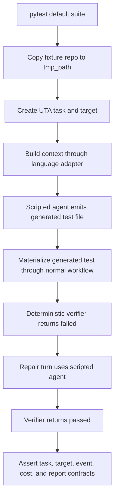
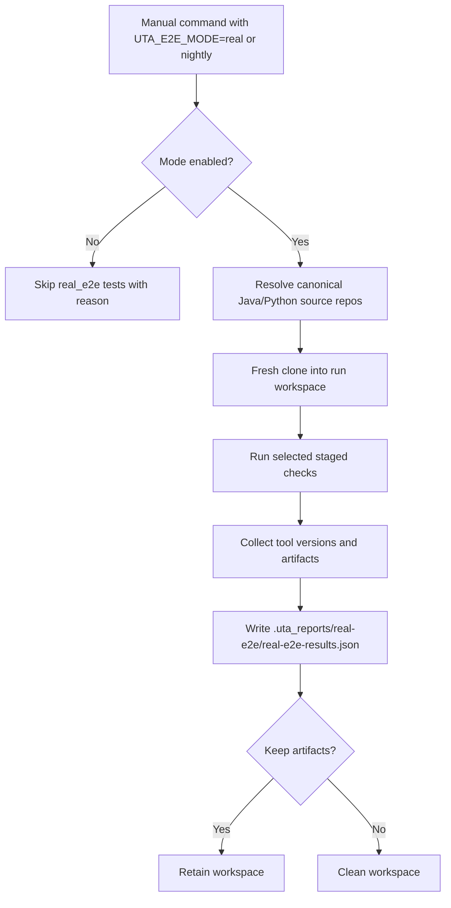

# Design: E2E Test Enhancing

## Table Of Contents

1. [Context](#context)
2. [Architecture And Scope](#architecture-and-scope)
3. [Contracts And Data Model](#contracts-and-data-model)
4. [Implementation Architecture](#implementation-architecture)
5. [Flow Diagrams](#flow-diagrams)
6. [API And Schema Changes](#api-and-schema-changes)
7. [Implementation Plan](#implementation-plan)
8. [Verification And Observability](#verification-and-observability)
9. [Operation And Rollback Plan](#operation-and-rollback-plan)
10. [Risks And Mitigations](#risks-and-mitigations)
11. [Design Review Checklist](#design-review-checklist)
12. [Changelog](#changelog)

## Context

This is non-Jira repository-quality work for UTA. The linked spec is `docs/spec-e2e-test-enhancing.md`.

The current unit/subsystem tests cover many local contracts, but the default test suite does not sufficiently exercise the multi-language generation loop:

```text
parse -> context -> generate -> materialize generated test -> verify -> repair/rerun -> report
```

Existing real-repo tests are useful but environment-gated. They can skip in clean developer or CI environments, so they do not protect the normal `python3 -m pytest` path. Live-agent smoke mostly validates provider availability and auth rather than UTA correctness, so it is not part of this E2E enhancement. The design adds a default hermetic E2E layer, keeps real-repo checks as explicit large tests, and records which guardrails are already implemented.

## Architecture And Scope

### Design Goals

- Make default tests catch common behavior regressions without live credentials or corporate repo checkouts.
- Keep Java and Python coverage symmetrical at the engine-contract level.
- Preserve the language abstraction invariant: shared engine/task/report layers stay language-agnostic.
- Add a real E2E mode that is manually invocable now and suitable for node2 later, without implementing node2 deployment or scheduling in this round.
- Keep the full default suite within a 5-minute target budget.

### Current Completed Work

Commit `a020fe5a` added `tests/test_engine_layering.py`.

Implemented guard:

- `uta/engine`: no module-load-time `uta.language.*` imports.
- `uta/tasks`: no `uta.language.*` imports anywhere.
- Allowed in `uta/engine`: function-local lazy dispatch imports and `TYPE_CHECKING` imports.
- Explicitly out of scope: `uta/graph`, because it still owns the current Java LangGraph workflow and carries Java `CodeGraph` types.

### In Scope

| Area | Decision | Notes |
| --- | --- | --- |
| Hermetic scripted E2E | In scope | Must cover both Java and Python and run in default `python3 -m pytest`. |
| Cross-language contract tests | In scope | Java/Python adapters should satisfy the same normalized engine contracts. |
| Java verification-runner tests | In scope | Add runner orchestration coverage, not just parser/XML tests. |
| Real E2E mode | In scope | Manual/local command now; node2 deployment and scheduling postponed. |
| `real_e2e` pytest marker | In scope | Selects large tests without polluting default test runtime. |
| Fresh-clone real E2E workspaces | In scope | Avoid stale source workspaces and hidden branch state. |
| README/usage doc update | In scope | Required because new commands and test modes are added. |

### Out Of Scope

| Area | Decision | Reason |
| --- | --- | --- |
| `uta/graph` refactor | Out of scope | User chose to leave it for now. |
| Node2 deployment/scheduling | Out of scope | User postponed it; command should remain manually invocable. |
| Live OpenCode in default suite | Out of scope | Default tests must remain hermetic. |
| New DB schema | Out of scope | Test/report artifacts can use files and existing task DB behavior. |
| Product API changes | Out of scope | This changes UTA test infrastructure only. |
| Python 2 real E2E lane | Out of scope for current `real_e2e` mode | Python 2 remains covered by staged legacy-runtime checks; current real E2E uses the selected Java WMS lane and a Python 3 UTA self-check lane. |

## Contracts And Data Model

### Test Mode Contract

| Mode | Selector | Runs By Default? | External Dependencies | Purpose |
| --- | --- | --- | --- | --- |
| Unit/subsystem | `python3 -m pytest` | Yes | None beyond dev dependencies | Fast contract and regression checks. |
| Hermetic scripted E2E | `python3 -m pytest` | Yes | None beyond dev dependencies | Exercise full loop using fixture repos and scripted agent. |
| Real E2E | `UTA_E2E_MODE=real python3 -m pytest -m real_e2e ...` | No | Fresh-cloned real repos, real local tools | Large manual verification without live LLM by default. |
| Manual nightly-style real E2E | `UTA_E2E_MODE=nightly ...` | No | Real repos and real tools | Same contract as later node2/nightly runner. |

### Pytest Marker Contract

Add to `pyproject.toml`:

```toml
"real_e2e: large real-repository E2E tests selected by UTA_E2E_MODE=real or UTA_E2E_MODE=nightly",
```

Rules:

- Tests marked `real_e2e` must skip unless `UTA_E2E_MODE` is `real` or `nightly`.
- Default `python3 -m pytest` must not run real repo clones or live OpenCode calls.
- A configured real lane that runs and fails is a failure, not a skip.
- An unconfigured lane may skip only with a structured reason.

### Scripted Agent Contract

The scripted agent backend should model the same shape the workflow expects from OpenCode, while remaining deterministic.

Minimal interface:

```python
class ScriptedAgentBackend:
    def create_session(self, model_id=None, provider_id=None) -> str: ...
    def send_message_split(self, session_id, stable_prefix, volatile_tail, model_id=None): ...
    def send_message(self, session_id, prompt, model_id=None, variant=None): ...
    def poll_completion(self, session_id, timeout=600, on_update=None) -> dict: ...
    def analyze_session_tokens(self, session_id) -> dict: ...
    def analyze_session_retrospect(self, session_id) -> dict: ...
```

Scripted turns should support:

- completed turn with generated file content,
- verification-failure turn followed by repair turn,
- provider-style terminal error when testing fallback classifications,
- token/cost metadata for existing cost accounting.

The scripted backend is test infrastructure only. Production OpenCode code paths must not depend on it.

### Hermetic E2E Result Contract

Each hermetic E2E case should assert stable engine/task outputs:

```json
{
  "language": "python",
  "taskStatus": "COMPLETED",
  "targetStatuses": [{"targetId": "python:function:jobs/forecast.py::forecast_for_store", "status": "PASS"}],
  "generatedTestPaths": ["tests/uta_generated/test_jobs_forecast.py"],
  "verificationAttempts": ["failed", "passed"],
  "events": ["stage_started", "llm_progress", "stage_completed"],
  "cost": {"totalTokens": 0}
}
```

The exact file names may differ by language policy, but the test should validate generated-test materialization, task status, target status, repair/rerun behavior, and reportable events.

### Real E2E Configuration Contract

Environment variables:

| Variable | Default | Purpose |
| --- | --- | --- |
| `UTA_E2E_MODE` | unset | `real` or `nightly` enables `real_e2e` tests. |
| `UTA_E2E_REPO` | `$HOME/wms/sample-inbound-core` | Canonical Java source repo or Git URL. |
| `UTA_E2E_MODULE` | inferred | Java Maven module override. |
| `UTA_E2E_PY3_REPO` | current UTA repo | Canonical Python source repo or Git URL. |
| `UTA_E2E_PY3_TARGET` | `uta_e2e_probe.py::discounted_total` for the UTA repo; otherwise repo-specific default chosen by harness | Python target override. |
| `UTA_E2E_PY3_TEST_PATHS` | `tests/test_uta_e2e_probe.py` for the UTA repo; otherwise strict test discovery | Python test path override, separated by the platform path separator. |
| `UTA_E2E_REAL_WORKSPACE_ROOT` | temporary directory | Fresh clone destination root. |
| `UTA_E2E_KEEP_ARTIFACTS` | existing setting | Keep or clean real E2E workspaces and artifacts. |

Python 2 is intentionally not part of this real E2E configuration contract. Existing staged E2E and legacy-runtime tests continue to cover Python 2 detection, missing-runtime diagnostics, and configured legacy verification where available.

The default Python real lane uses UTA itself and writes a tiny clone-only probe target/test into the fresh workspace. That keeps evidence non-empty for changed-line coverage/mutation while still honoring the fresh-clone rule and never mutating the source repo. External Python repos, including the MD sample project used during earlier Python support exploration, remain supported by setting `UTA_E2E_PY3_REPO` and optional target/test overrides.

Fresh-clone rule:

1. Treat `UTA_E2E_REPO` and `UTA_E2E_PY3_REPO` as source path or Git URL.
2. Clone into a run-specific workspace under `UTA_E2E_REAL_WORKSPACE_ROOT` or a temporary directory.
3. Never run real E2E directly in the source repo.
4. Record source, clone path, branch, HEAD, base ref, and cleanup decision in the report.

### Real E2E Report Contract

Real E2E writes:

```text
.uta_reports/real-e2e/real-e2e-results.json
```

Schema:

```json
{
  "schemaVersion": 1,
  "mode": "real",
  "generatedAt": "2026-06-11T00:00:00Z",
  "summary": {"passed": 2, "failed": 0, "skipped": 1, "elapsedSeconds": 120.5},
  "environment": {
    "python": "3.11.8",
    "java": "1.8.0_221",
    "maven": "3.8.8",
    "secrets": "redacted"
  },
  "lanes": [
    {
      "name": "java-wms",
      "language": "java",
      "status": "passed",
      "sourceRepo": "$HOME/wms/sample-inbound-core",
      "workspace": ".uta_reports/real-e2e/workspaces/java-wms",
      "branch": "master",
      "head": "abc123",
      "baseRef": "origin/master",
      "targetCount": 1,
      "toolVersions": {"maven": "3.8.8", "java": "1.8.0_221"},
      "artifacts": []
    }
  ]
}
```

Paths in docs should use env-based or repo-relative examples. Runtime reports may contain absolute paths because they are local artifacts, not shared design docs.

### DB Schema Change

N/A. No task DB migration is required.

The hermetic E2E may create temporary task DBs under pytest `tmp_path`. Real E2E report state is stored in JSON artifacts, not in the production task DB.

## Implementation Architecture

### Layer 1: Architecture Guard

Status: implemented by `a020fe5a`.

Future changes should only broaden `tests/test_engine_layering.py` after a package is explicitly declared language-agnostic. Do not scan `uta/graph` until its Java workflow coupling is moved or reclassified.

### Layer 2: Cross-Language Contract Tests

Add `tests/test_cross_language_contracts.py`.

Contract assertions:

- Java and Python adapters are registered in the same `BackendRegistry`.
- Both normalize explicit raw targets into `TargetRef`.
- Both provide generated-test policy with allowed roots.
- Parse/context providers return normalized callable metadata where available.
- Verification runner results expose stable fields: language, status, reason, evidence, selected tests, coverage/mutation shape.
- Mutation repair context, when supported, returns groups/examples through the shared `MutationRepairContext` contract.

The goal is not identical language behavior. The goal is identical engine-facing shapes.

### Layer 3: Hermetic Scripted Pipeline E2E

Add `tests/e2e/test_scripted_pipeline_e2e.py`.

Python lane:

1. Copy `tests/fixtures/python_projects/py3_flat_project` to `tmp_path`.
2. Create a task for a known Python function target.
3. Run the normal batch generation entrypoint with `ScriptedAgentBackend`.
4. First verification result fails for a deterministic reason.
5. Scripted repair turn updates the generated test.
6. Second verification passes.
7. Assert terminal task state, generated path, event sequence, and result summary.

Java lane:

1. Create or copy a tiny Java fixture repo.
2. Create a task for a known Java class target.
3. Run through the normal Java workflow surface where practical, or a Java command-contract path if full Maven is too heavy.
4. Materialize a generated Java test file.
5. Exercise verification failure then repair/rerun with deterministic verifier stubs.
6. Assert terminal task state, generated path, event sequence, and Java command/evidence contract.

The Java lane can start with deterministic verifier stubs to preserve the 5-minute default budget, but it must still cover generation materialization and workflow transitions.

### Layer 4: Java Verification Runner Coverage

Extend `tests/test_java_verification.py` to cover:

- command construction for target-specific Maven/test-enforcer execution,
- timeout classification,
- command error classification,
- missing evidence classification,
- parsed coverage/mutation evidence handoff,
- module/target scoped verification behavior,
- Java 8 environment propagation where relevant.

Parser fixtures in `tests/test_maven_parsers.py` remain parser tests; runner tests should validate orchestration.

### Layer 5: Real E2E Mode

Add real E2E utilities either in `tests/e2e_real_harness.py` or inside `tests/e2e/test_real_mode.py`.

Responsibilities:

- Gate on `UTA_E2E_MODE in {"real", "nightly"}`.
- Fresh-clone Java and Python source repos.
- Run selected existing staged checks against cloned workspaces.
- Record structured lane result objects.
- Write `.uta_reports/real-e2e/real-e2e-results.json`.
- Clean cloned workspaces unless `UTA_E2E_KEEP_ARTIFACTS` keeps them.

Node2 deployment, scheduler, cron, or daemon integration is not implemented in this round.

### Layer 6: Documentation

Update `README.md` or a usage doc to explain:

- default hermetic E2E,
- `real_e2e` large-test mode,
- manual nightly-style mode,
- report path and skip reason interpretation.

## Flow Diagrams

### Default Hermetic E2E



### Real E2E Mode



## API And Schema Changes

### Public API Changes

N/A. No HTTP endpoint or external service API changes.

### CLI Changes

No UTA production CLI behavior changes are required.

Test invocation contract changes:

- Add pytest marker `real_e2e`.
- Add `UTA_E2E_MODE=real|nightly` gate for real E2E.
- Add optional real E2E workspace/report env vars if needed by implementation.

### DB Schema Changes

N/A. No migration.

### Backward Compatibility

- Existing tests keep working.
- Existing env-gated real OpenCode tests may remain as ad hoc provider diagnostics, but they are not part of this E2E enhancement.
- Default `python3 -m pytest` remains hermetic.
- `a020fe5a` architecture guard remains compatible with current lazy language registry imports.

## Implementation Plan

1. Update pytest marker and docs.
   - Add `real_e2e` marker to `pyproject.toml`.
   - Add README/usage command descriptions.
   - Verify `pytest --markers` shows `real_e2e`.

2. Add cross-language contract tests.
   - Create `tests/test_cross_language_contracts.py`.
   - Cover target normalization, generated-test policy, verification shape, and mutation repair context shape.
   - Run focused tests.

3. Add scripted agent backend test helper.
   - Implement helper inside tests or a test-support module.
   - Keep it isolated from production code.
   - Cover completed, failed, and repair turns.

4. Add hermetic Python scripted E2E.
   - Use existing Python fixture project.
   - Exercise failed verification then repair pass.
   - Include in default `pytest`.

5. Add hermetic Java scripted E2E.
   - Use tiny Java fixture.
   - Exercise materialization and verification rerun through Java workflow surface or command-contract path.
   - Include in default `pytest`.

6. Strengthen Java verification runner tests.
   - Add orchestration coverage to `tests/test_java_verification.py`.
   - Keep parser tests separate.

7. Add real E2E mode.
   - Implement mode gate.
   - Fresh-clone source repos.
   - Run Java/Python lanes.
   - Write JSON report.
   - Keep node2 deployment/scheduling out of scope.

8. Run verification.
   - Focused tests for each layer.
   - Full `python3 -m pytest` under 5-minute target.
   - Manual `UTA_E2E_MODE=real ...` smoke against available canonical repos.

## Verification And Observability

### Local Verification

Required before merge:

```bash
python3 -m pytest tests/test_engine_layering.py
python3 -m pytest tests/test_cross_language_contracts.py
python3 -m pytest tests/e2e/test_scripted_pipeline_e2e.py
python3 -m pytest tests/test_java_verification.py tests/test_python_verification.py
python3 -m pytest
```

Real E2E manual verification:

```bash
UTA_E2E_MODE=real python3 -m pytest -m real_e2e tests/e2e/
```

Expected artifact:

```text
.uta_reports/real-e2e/real-e2e-results.json
```

### Observability

Hermetic E2E should assert and, when useful, print:

- task id,
- target ids,
- generated test paths,
- verification attempts,
- repair attempts,
- event sequence,
- cost/token snapshot.

Real E2E report should record:

- mode,
- lane name,
- repo source and cloned workspace,
- branch/head/base,
- tool versions,
- pass/fail/skip reason,
- elapsed seconds,
- artifact paths.

### Failure Diagnostics

Every skip/failure should distinguish:

- missing source repo,
- git clone failure,
- missing Python runtime,
- missing Java/Maven runtime,
- missing mutmut/PIT/test-enforcer,
- true UTA workflow regression.

## Operation And Rollback Plan

### Rollout

1. Land marker/docs and contract tests.
2. Land hermetic E2E in default suite.
3. Confirm default suite remains under the 5-minute target.
4. Land real E2E mode as manually invocable.
5. Defer node2 deployment/scheduling to a later decision.

### Rollback

- If hermetic E2E is flaky, temporarily mark only the failing test with a tracked issue and keep contract tests active.
- If `real_e2e` is flaky, keep it opt-in and fix report/skip classification before scheduling it.
- If architecture guard blocks a valid lazy dispatch import, update the guard allowlist with a specific comment and test case. Do not broadly disable it.

## Risks And Mitigations

| Risk | Impact | Mitigation |
| --- | --- | --- |
| Hermetic E2E exceeds 5-minute budget | Developers stop running default suite | Use tiny fixtures and deterministic verifier stubs; keep real tools in `real_e2e`. |
| Scripted backend diverges from real workflow contract | False confidence | Model the production client method names and event/result shapes; rely on real E2E for tool behavior, not live-agent smoke. |
| Java and Python E2E become parallel bespoke flows | Abstraction drift remains hidden | Assert shared engine-facing contracts and keep language details behind adapters. |
| Real E2E mutates source repos | Developer data loss or dirty workspaces | Fresh clone into temp workspace; never run in source repo. |
| Real E2E skips too easily | Nightly reports are green but meaningless | Configured lanes that start and fail are failures; skips require structured prerequisite reason. |
| Node2 expectation confusion | Premature deployment work | Design explicitly postpones node2 deployment/scheduling; command remains manual. |
| `uta/graph` stays Java-coupled | Future language abstraction gap | Document as known out-of-scope; revisit in a separate graph refactor spec. |

## Design Review Checklist

| Check | Result |
| --- | --- |
| Change scope | Covers tests, markers, real-mode report, docs, and existing completed layering guard. |
| Abstraction/extensibility | Uses engine-facing contracts and keeps language-specific behavior in adapters/lanes. |
| Verification depth | Defines contract tests, hermetic default E2E, and real E2E. |
| API/schema/data model compatibility | No product API or DB schema changes. |
| Risks/mitigations | Covers runtime, flake, stale workspace, abstraction drift, and node2 scope risks. |
| Simplicity | One scripted backend contract, one real E2E report contract, one marker/env gate. |

## Changelog

| Date | Change | Reason |
| --- | --- | --- |
| 2026-06-11 | Initial design doc generated from `docs/spec-e2e-test-enhancing.md`. | User requested the required design doc after closing spec questions. |
| 2026-06-11 | Removed live-agent smoke as a design layer. | User clarified live-agent smoke is not useful for UTA correctness. |
| 2026-06-11 | Refreshed after Tasks 1-10 implementation. | Marker, scripted helper, hermetic Java/Python E2E, Java runner coverage, real E2E fresh-clone/report mode, and README usage docs are now implemented. |
| 2026-06-11 | Recorded final verification completion. | Focused tests, full default suite, and manual real E2E command passed locally. |
| 2026-06-11 | Switched Python real lane default to UTA self-check. | The Python lane now writes and verifies a clone-only `uta_e2e_probe.py::discounted_total` target and `tests/test_uta_e2e_probe.py`, while keeping external repo overrides. |
| 2026-06-11 | Verified Python real lane with changed-line coverage and mutation. | The local real E2E command now passes with Python coverage 100.00% (6/6) and mutation 100.00% (13/13); dev tooling uses mutmut 2.x plus `whatthepatch` for stable patch-based mutation on macOS. |
| 2026-06-11 | Refreshed after Phase 6 gap closure. | Real Java tooling evidence, strict Python real-lane discovery, Python 2 real-lane scope, expanded cross-language contracts, and final verification evidence are now aligned with the plan. |
