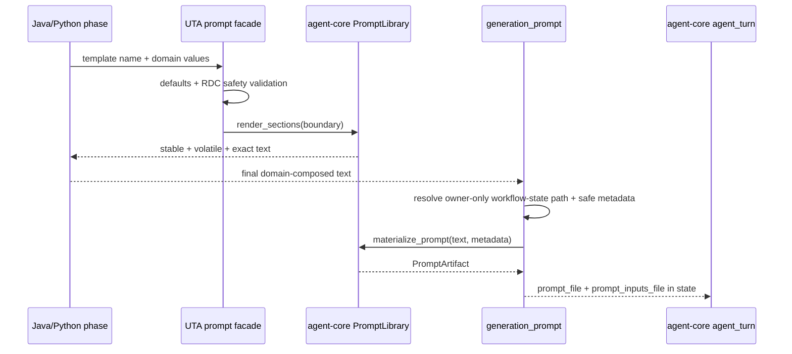

# Detail Design — unit-test-agent

Status: approved — Iteration 2 frozen on 2026-08-18
Overview: [design-executable-generation-agent-turn.md](design-executable-generation-agent-turn.md)
Spec: [spec-executable-generation-agent-turn.md](spec-executable-generation-agent-turn.md)

## Approved (Iteration 2 — Shared Prompt Construction)

### Changes in this repo

1. `uta.testgen.prompts.loader` owns only UTA defaults, RDC-context validation,
   name normalization (`foo` -> `foo.txt`), safe metadata projection, and
   compatibility facades. A module-scoped `PromptLibrary` points at UTA's
   template directory with `cache_source_text=True`, preserving current cache
   semantics.
2. `render_prompt_split` calls agent-core `render_sections` with
   `keep_trailing_newline=False`. Historical `render_prompt` rendered the whole
   source in one Jinja call and therefore contains one more LF at the cache
   boundary than independently rendered sections; it uses an absent boundary
   sentinel to preserve those bytes instead of returning the split `.text`.
   The exported `load_prompt`/`load_prompt_split` facades stay
   render-compatible for existing callers but return small UTA views backed by
   the shared library rather than Jinja `Template` instances. They are marked
   deprecated; repository search confirms production code uses only render
   functions.
3. Java and Python phase functions remain domain composers. Their existing
   suffix additions are appended to the volatile string before final
   concatenation, preserving byte output and cache meaning.
4. Durable `generation_prompt` and legacy `AgentRuntime._materialize` call
   agent-core `materialize_prompt` in strict mode instead of writing beneath
   the repository. Both receive a `PromptArtifactScope` from one UTA resolver;
   the durable path uses the reconciled turn `operation_id`.
5. `CycleState` adds the checkpointed `prompt_inputs_file: str` field.
6. Legacy runtime factories and Java/Python callers receive the resolved
   artifact scope. Standalone callers need no task ID/DB; they open one scope
   per CLI invocation and pass its stable run ID through all model turns.
7. UTA pins released agent-core `v0.6.1` (`v0.6.0` introduced prompt
   rendering/materialization; the patch release adds opaque artifact IDs).
   Jinja remains a direct dependency for
   HTML report rendering, not for agent prompt construction.

### Key structures and safe metadata

`CycleState` explicitly gains `prompt_inputs_file: str`; this is a compatible
optional `TypedDict` field, but it is a real checkpoint-schema change. The one
safe projection used by legacy and durable materializers is exactly:

```python
build_safe_prompt_metadata(
    *,
    engine: Literal["legacy", "durable_v2"],
    language: str,
    phase: str,
    task_id: int | None,
    workflow_run_id: str | None,
    unit_id: str | None,
    operation_id: str | None,
    session_id: str | None,
    batch: Sequence[str],
    logical_attempt: int,
    execution_ordinal: int,
) -> Mapping[str, JSONValue]

# The returned object has exactly these keys:
{
    "schema_version": 1,
    "product": "uta",
    "engine": engine,
    "language": language,
    "phase": phase,
    "task_id": task_id,
    "workflow_run_id": workflow_run_id,
    "unit_id": unit_id,
    "operation_id": operation_id,
    "session_id": session_id,
    "batch": list(batch),
    "logical_attempt": logical_attempt,
    "execution_ordinal": execution_ordinal,
}
```

Keys unavailable to the legacy engine are present with JSON `null`; the shape
does not vary by engine. `build_safe_prompt_metadata` accepts named scalar/list
arguments, not a state mapping. Feedback, recovery reasons, failure/provider
content, prompt values, and environment data are never accepted. Both callers
use `strict_metadata=True`, `metadata_max_bytes=4096`, and `file_mode=0o600`.

Every value is validated as JSON-safe scalar/list data before calling
agent-core. Repository paths, template values, prompt text, environment data,
provider events, and arbitrary state are excluded. The prompt file remains the
authoritative exact model input; metadata is identity/audit context.

`uta.testgen.prompts.artifacts` owns one lifecycle abstraction:

```python
@dataclass(frozen=True)
class PromptArtifactScope:
    root: Path
    run_id: str
    task_id: int | None
    managed: bool

@contextmanager
def open_prompt_artifact_scope(
    *, repo_path: Path, task_id: int | None, workflow_run_id: str | None
) -> Iterator[PromptArtifactScope]: ...
```

The resolver uses `$UTA_RUNNER_HOME/workflow-state/prompts` when configured and
otherwise `~/.local/share/uta/workflow-state/prompts`. It does not use
`UTA_TASK_DB_PATH` or the task DB parent, because either can be configured
inside the target repository. It resolves the repository, application root,
and every existing ancestor without following a product-controlled symlink;
it rejects a root equal to or below `repo_path`, creates directories as `0700`,
and never falls back to `.uta_cache`.

Managed durable paths are
`managed/<task_id>/<workflow_run_id>/<unit_id>/<operation_id>`; managed legacy
paths are `managed/<task_id>/<run_id>/legacy/<session_id>/<phase>-<turn_id>`.
Standalone Java/Python paths are
`standalone/<uuid4-run_id>/<language>/<session_id>/<phase>-<turn_id>`. Each
component matches stable identifier rules and every final path is checked below
the resolved scope root. A standalone scope is stable for the command's full
invocation; absence of task identity is valid and does not block a session.

### Intra-repo process and control flow



Strict rendering failure, invalid metadata, or file I/O failure stops at the
prompt node. No `agent_turn`, session, operation-result sink, or model budget is
consumed. Resume re-enters reconciliation and then the prompt node when the
same operation has no result.

### Compatibility and rejected alternatives

Prompt byte parity is mandatory. Before replacing the loader, UTA freezes the
single-render full bytes separately from the stable, volatile, and concatenated
split bytes produced by current `jinja2.Template` for all
nine production templates, both Java/Python composers, default/optional
branches, no-boundary cases, and Unicode. The adapter passes
`keep_trailing_newline=False`, so Jinja—not `strip()`—reproduces the current
one-trailing-newline behavior. The known one-LF difference between the legacy
single-render and split-concatenation APIs is preserved, not normalized. After
the dependency pin every frozen fixture must match. Legitimately optional values are added to
`_with_prompt_defaults`; no permissive undefined fallback is retained.

Returning a new prompt-request DTO from every language phase was considered
and rejected for this iteration: the phase modules append domain text after
template rendering, and changing every backend signature adds migration risk
without improving ownership. The shared library still owns all rendering; UTA
owns only the domain composition it must own.

Removing `load_prompt*` immediately was also rejected. Repository production
code does not call them, so the one-release deprecated facade guarantees only
`render(**values) -> str` and the same missing-variable exception. It does not
claim `jinja2.Template` identity, `generate`, `stream`, module access, or other
Template APIs; release notes name that limit. Full Template compatibility would
retain the product-side renderer and is rejected. Removal requires a separately
reviewed major UTA cleanup.

### Capacity, reliability, security, and failure handling

The hot path adds no DB/RPC calls and only one small metadata write per turn.
At fewer than 400 bounded turns, a 4 KiB cap is under 1.6 MiB/task. Metadata is
validated before write and never rendered publicly. Prompt artifacts live
under owner-only workflow state, never the repository. The existing retention
pass will be extended to delete managed prompt identities with
checkpoints/results after 30 days and standalone crash orphans by age.
Normally closed standalone scopes are removed immediately. Capacity
verification measures the largest real rendered prompt and reports
`400 * (prompt_bytes + metadata_bytes)` per ceiling task and the 30-day cohort.
Beta is blocked if any prompt exceeds 1 MiB, one ceiling task exceeds 400 MiB,
or the measured 30-day projection exceeds 1 GiB or 50% of the state volume.

| Failure | Detection | Recovery/blast radius |
| --- | --- | --- |
| Previously implicit variable is missing | parity/strict fixture fails | add explicit domain default; no session/model call |
| Shared output differs | byte comparison names template/section | block consumer commit; remain on 0.5.0 |
| Identity path invalid/escapes root | validation exception | task stops before write; correct corrupt state |
| Standalone command has no task identity | scope test asserts generated run UUID | command proceeds; context cleanup removes its scope |
| Configured task DB is inside repo | resolver ignores it for prompt placement and checks resolved ancestry | artifacts remain in dedicated application state; no staging exposure |
| Prompt or metadata write fails | prompt node exception | reconcile/retry same no-effect operation |
| Partial file pair after crash | state is updated only after both paths exist | same operation overwrites the partial pair before any session opens |
| Inputs contain forbidden key/type or exceed 4 KiB | safe projection validator | fail before write; never truncate identity silently |
| Legacy/durable drift | same parameterized facade tests run through both entry paths | block release; legacy rollback deploys the previous UTA build/pin |

### Repo-local verification and rollout

- Agent-core API contract tests are consumed from released `v0.6.1`, not an
  editable checkout.
- Parameterized UTA tests compare frozen pre-migration bytes for all nine
  templates, both language composers, stable/no-boundary behavior, defaults,
  optional branches, Unicode, and trailing newlines.
- Generation-cycle tests assert out-of-repository operation paths, deterministic
  strict `inputs.json`, `0600` modes, checkpoint round-trip/restart of both path
  strings, partial-pair recovery, and zero session opens on rendering failure.
- Legacy runtime tests prove the same safe projection/root and that feedback or
  recovery/provider text never enters `inputs.json`.
- Standalone Java and Python CLI tests omit task ID/DB, assert a stable
  application-state UUID across turns and a session open, then assert scope
  cleanup. A configured DB inside the symlink-resolved repository cannot move
  prompt output beneath Git.
- Source tests scan production Python under `uta/testgen` and `uta/language`
  for direct `jinja2` imports and prompt-artifact writes. The narrow allowlist
  is HTML report rendering outside agent-prompt paths; the unused Java
  `generation.py` Jinja import is removed.
- A real temporary Git repository with no `.uta_cache` ignore runs non-RDC
  delivery and asserts `git diff --cached --name-only` contains no path under
  `workflow-state`, `agent_turns`, or `cycle-prompts` and no `inputs.json`.
- Java/Python phase suites, full UTA suite, compile/import check, and packaged
  dependency inspection pass before push.
- In a fresh UTA environment, installation resolves agent-core from the pushed
  `v0.6.1` tag; `pip inspect` or `importlib.metadata` direct-URL data must name
  that tag/commit. Focused and full suites then run without `PYTHONPATH` or an
  editable agent-core checkout.
- Rollout changes only the dependency and prompt boundary. The persisted v2
  flag remains default false, but it does not gate the legacy prompt migration.
  A default-engine legacy canary must pass hash/root/safe-input/session/staging
  checks before deployment; rollback deploys the previous UTA build and
  dependency pin. Durable beta/prod/legacy deletion gates remain unchanged.

> **Revision 6** makes guarded result durability ordering executable, adds the
> audited atomic clean-rerun operation, and binds agent-core's progress sink.
> **Revision 5** adds the durable operation ledger, reconciliation topology,
> safe invoke lifecycle, real report SSE surface, persisted cutover flag,
> explicit maintenance owner, and complete Python phase mapping. **Revision 4** completes the repo-local design contract, replaces the
> unpersisted per-run identity with the existing `batch_key` storage boundary,
> defines phase evidence validity, and reuses `class_tasks_by_fqn` instead of
> adding another batch lookup API. **Revision 3** replaced revision 2's
> hand-transcribed phase mapping — which
> a follow-up review found substantially wrong — with one generated by an AST
> pass, and applies the [spike](spikes/spike-executable-generation-agent-turn.md)
> results. Revision 2 corrected revision 1, which understated this repository's
> work by an order of magnitude and claimed the YAML already bounded its loops.

## Contents

1. [The size of the work](#the-size-of-the-work)
2. [Changes in this repo](#changes-in-this-repo)
3. [Build and invocation boundary](#build-and-invocation-boundary)
4. [Data dependency flow](#data-dependency-flow)
5. [The unit of work is a stable batch](#the-unit-of-work-is-a-stable-batch)
6. [The topology, corrected](#the-topology-corrected)
7. [A model-driven phase has a shared three-node core](#a-model-driven-phase-has-one-shared-three-node-core)
8. [Phase mapping](#phase-mapping)
9. [The backend protocol](#the-backend-protocol)
10. [Neutral cycle state and serialization](#neutral-cycle-state-and-serialization)
11. [Evidence validity and idempotency](#evidence-validity-and-idempotency)
12. [Guards and their cost](#guards-and-their-cost)
13. [Progress and reporting](#progress-and-reporting)
14. [API and schema changes](#api-and-schema-changes)
15. [What gets deleted, and when](#what-gets-deleted-and-when)
16. [Tradeoffs](#tradeoffs)
17. [Capacity, reliability, and security](#capacity-reliability-and-security)
18. [Failure modes](#failure-modes)
19. [Repo-local risks and verification](#repo-local-risks-and-verification)
20. [Rollout and compatibility](#rollout-and-compatibility)
21. [Changelog](#changelog)

## The size of the work

Revision 1 gave one table row to `language/java/generation_backend.py`. That
file is **32 lines** of aliases. The composite lifecycle is:

| File | Lines |
| --- | --- |
| `uta/language/java/generation.py` | **4,611** — `generate_and_validate` alone spans 2,971→~4,600 |
| `uta/language/python/generation.py` | **1,874** |
| **total to decompose** | **~6,500** |

This decomposition *is* the project. agent-core's changes are the smaller half.
Any plan that treats "Java slice / Python slice" as two tasks will be wrong by
weeks; the [phase mapping](#phase-mapping) below is the unit of work.

## Changes in this repo

| Module | Change |
| --- | --- |
| `testgen/graph/generation-cycle.yaml` | **rewritten** — bounded routes, branch defaults, the two missing phases, render/turn/interpret split |
| `testgen/graph/generation_cycle.py` | build the child; stop decorating results with a phase list |
| `testgen/graph/workflow.py` | context-managed `open_workflow_application(...)` opens one checkpointer, compiles child and outer graphs, invokes, and closes; both callers change (`java/batch.py:140`, `python/generation_backend.py:61`) |
| `testgen/graph/nodes.py` | `run_generation_cycle(state, context)` derives the stable identity and invokes the precompiled child instead of delegating to a backend composite |
| `testgen/graph/state.py` | split `AgentState` from JSON-safe `CycleState`; remove `backend_context` live objects from serializable state |
| `testgen/backend.py` | replace composite `run_generation_cycle` with a phase-operation contract and validate every configured language backend at graph build |
| `testgen/phases.py` | **new** — neutral phase nodes |
| `testgen/operations.py` | **new** — ledger, artifact envelopes, reconciliation, rehydration and agent-core `on_result` port |
| `language/java/generation.py` | decomposed per the mapping; Maven/JUnit/JaCoCo/PIT stay |
| `language/java/generation_plan.py` | remains the Java generation-plan artifact owner; phase handlers call it rather than moving plan persistence back into `generation.py` |
| `language/python/generation.py` | same, plus real compile-equivalent evidence |
| `testgen/{agent_runtime,llm_session}.py` | reduced to prompt policy, then deleted |
| `testgen/task_guard.py` | adapt the guard signature and reuse `TaskDatabase.class_tasks_by_fqn` for one batch query |
| `testgen/progress.py` | persist agent-core's neutral phase/session projection; no provider parsing |
| `tasks/db.py`, `tasks/manager.py` | persist stable batch identity and add the authoritative `workflow_operations` ledger plus cursor-indexed event reads |
| `app/routes.py`, report renderer | adapt TaskDB to agent-core's existing SSE streamer and add per-session report tabs |
| `tasks/workflow_retention.py`, task daemon/CLI | own scheduled and operator-triggered lineage retention |

## Build and invocation boundary

UTA will use agent-core's existing `build_graph` twice. It will not add a
second graph builder and will not import a LangGraph saver or construct a
LangGraph configuration dictionary.

```python
@contextmanager
def open_workflow_application(config, context):
    if not isinstance(context["runner"], ResumableHarness):
        raise SessionUnsupportedError("generation cycle requires phase sessions")
    state_root = workflow_state_root(config.task_db_path)  # parent/workflow-state
    checkpoint_path = state_root / "checkpoints.sqlite"
    with open_checkpointer(checkpoint_path) as checkpointer:
        progress_sink = ProgressBatcher(
            append_batch=context["append_event_batch"],
            budget=context["progress_budget"],
        )
        bound = {**context, "progress_sink": progress_sink}
        try:
            cycle = build_graph(
                generation_cycle_spec(),
                generation_registry.extend(shared_registry),
                context=bound,
                checkpointer=checkpointer,
                state_schema=CycleState,
            )
            outer = build_graph(
                test_generation_spec(),
                outer_registry,
                context={**bound, "generation_cycle": cycle},
                state_schema=AgentState,
            )
            yield WorkflowApplication(outer=outer, cycle=cycle)
        finally:
            progress_sink.close()  # bounded final flush before checkpointer close
```

The child is compiled once per worker-owned workflow application. The outer
`run_generation_cycle` invokes that child once per stable batch through
agent-core's `invoke_workflow(..., recursion_limit=120)`. It supplies initial
state only to that API. agent-core inspects the lineage and chooses start,
pending resume with `None`, or completed-state reuse; UTA never calls
`cycle.invoke` directly and never knows LangGraph's config shape.

After every invocation disposition, the outer node validates the returned
terminal operation ID, artifact hashes and prerequisites against the product
ledger **before** committing target results. A `reused_completed` checkpoint
with missing or contradictory product evidence is `fail_unsafe`; it is not
trusted merely because the graph is terminal and is not re-entered under the
same identity.

The identity is deliberately **not** a `build_workflow` argument: one outer
application processes many batches, so the identity exists only when
`select_next_target` has selected a unit. Binding one identity at build time
would checkpoint every batch into the same lineage.

The application lifecycle is owned by every production batch entrypoint: open
once for the request, invoke all selected units, close in `finally`. No graph
or SQLite connection escapes the context. After a worker restart it selects the
same non-terminal stable batch, reaches `run_generation_cycle`, and invokes
the child with the same identity. The shared invocation API then resumes the
pending node or returns an already-completed terminal state. This is the exact separately compiled-child shape proven by the spike;
UTA does not require a new `NodeRegistry.add_workflow` or a parallel subgraph
registry.

## Data dependency flow

```text
BatchGenerationRequest
  │
  ├─ scalar inputs ───────────────▶ AgentState ── select stable batch
  │                                      │
  ├─ live runtime/backend objects ───────▶ build-time context
  │                                      │
  └─ production task/class rows ─────────┴─▶ CycleState (JSON-safe)
                                                │
                    prompt artifact ◀── phase node ──▶ agent_turn
                                                │
                             deterministic PhaseResultPayload
                                  │                         │
                                  ▼                         ▼
                         workflow checkpoint        product task DB/events
                         (resume position)           (operator truth)
```

The product DB remains authoritative for batch membership, status, attempts,
artifacts, session IDs, token usage and user-visible events. The checkpoint
stores only the child state and next node. Phase nodes write product evidence
before returning their state update; a checkpoint without the corresponding
valid product evidence is not sufficient to skip work.

## The unit of work is a stable batch

Java generates over a **batch** of classes per agent turn
(`generation.py:2997-3004`, `classes_per_agent_run`, `current_batch`). Revision
1's singular `target_id` had no representation for that, leaving checkpoint
identity ambiguous for the Java path.

**Decision: the cycle's unit is a stable batch.** A Python target is a batch
of one. `WorkflowRunIdentity.unit_id` is the batch id; `CycleState` carries
`batch: list[str]` and the derived `unit_id`. This keeps one topology for both
languages, which is success criterion 5.

The word *stable* is essential. Today's Java selector removes completed
classes and then forms a new smart batch (`generation.py:1254-1312`). After a
partial crash that can regroup the remaining classes and produce a different
checkpoint identity. The migration will instead:

1. partition the full ordered target list before cycle execution;
2. create one task-level `workflow_run_id`;
3. store `<workflow_run_id>/<unit_id>` in the existing
   `class_tasks.batch_key` column for every member;
4. on restart, reconstruct batches from `batch_key` and choose the first batch
   with any non-terminal member;
5. pass the original membership to the backend, which ignores already
   terminal members rather than changing the unit identity.

Stop/resume and orphan recovery preserve `batch_key`, so they reuse the
lineage. The existing `uta tasks resume`, including `--force-rerun-all`, never
changes `batch_key` or workflow identity. The distinct destructive-cost
operation is:

```text
uta tasks clean-rerun-generation TASK_ID \
  --reason "checkpoint corruption: <ticket-or-diagnosis>" \
  --confirm-task-id TASK_ID [--force-rerun-failed|--force-rerun-all]
```

The reason is non-empty and the confirmation value must exactly equal the
target ID. The manager re-reads the task under `BEGIN IMMEDIATE` and permits
the operation only for `STOPPED` or terminal tasks with no active lease;
`CREATED`, `QUEUED`, `RUNNING` and `STOP_REQUESTED` are rejected. In that same
transaction it mints a new run ID, repartitions the full stable ordered target
list, replaces every member's `batch_key` directly (no committed keyless
window), applies the ordinary/failed/all requeue selection, clears acknowledged
controls, increments `resume_count`, and inserts authoritative
`workflow_run_supersessions` rows plus a
`generation_cycle_clean_rerun_requested` audit event. The records include old
and new run/unit identities, affected class IDs, selected policy, required
reason, invoking OS user, and timestamp. Any failure rolls back all of those
changes.

The transaction parses every preexisting non-null key before writing. It
groups valid keys by distinct old run ID and inserts one `known` supersession
row per run with all of that run's unit/class IDs. Missing keys are not invented
into an old lineage: one additional `missing` row records their affected class
IDs with a null old run and empty old-unit list. Thus all-missing, mixed
missing/known, and multiple-known-run corruption are recoverable without
discarding an addressable checkpoint identity. A malformed non-null key is
rejected before mutation because it cannot be safely linked or retained; the
error reports the affected class IDs and requires diagnosis rather than raw
database editing.

Old checkpoints, ledger rows and artifacts are read-only after supersession
and remain available for audit until the normal 30-day workflow retention
pass; the supersession row gives that pass the old identity even when no
operation row existed. The command never deletes or edits LangGraph tables.
This satisfies the spec without a task-table schema change. The v2 engine
requires a persisted repo-task row and task DB; tests and non-production
callers provision a temporary one. There is no unledgered v2 mode. The legacy
adapter remains available while the flag is false.

## The topology, corrected

Revision 1 asserted the YAML "already encodes" bounded loops. It does not:
`fix_compile → verify_compile`, `fix_tests → verify_tests`,
`fix_coverage → verify_tests`, `fix_mutation → verify_tests` are **unconditional
edges** (`generation-cycle.yaml:24-32`), and **no branch declares a `default`**
— while `_branch_router` (`graph.py:120-125`) raises `KeyError` on an unmapped
key. So an unexpected outcome strands the graph rather than routing to
`failed`, which revision 1 also claimed.

The YAML is therefore rewritten, not merely executed. Required changes:

1. **Every repair decision is budget-aware.** Its selector combines the gate
   outcome with `attempts_by_phase`: `passed | skipped | retry | exhausted |
   failed`. `retry` enters one repair attempt and returns to deterministic
   verification; `exhausted` routes to `complete_generation` with a terminal
   reason. No repair node has an unconditional self-loop.
2. **Every branch declares a `default`**, routing to `complete_generation`.
   An outcome nobody anticipated must end the cycle with a reason, not raise.
3. **`continue` joins the outcome vocabulary** — `measure_coverage` already
   declares it (`generation-cycle.yaml:52`) and revision 1's vocabulary omitted
   it.
4. **Two missing phases are added** (below).
5. `recursion_limit=120` is supplied by agent-core at invocation; a cyclic graph with four repair loops
   exceeds LangGraph's default 25 super-steps on a single target with two
   repairs.

### The two missing phases

Both exist in code and are required by the spec; neither was in revision 1.

- **`precheck_existing_tests`** (`generation.py:2689`, called at `:3022`) can
  short-circuit the whole cycle or route to delegated repair. Its dedicated
  `PrecheckOutcome` is `proceed | skip_target | delegated_repair`; it is not
  overloaded with the terminal phase-result vocabulary.
- **`delegated_quality_gate`** — spec §2 explicitly requires "any delegated
  quality-gate repair" to run through `agent_turn`. It becomes a phase with its
  own bounded repair loop returning through `verify_tests`.

## A model-driven phase has one shared three-node core

Revision 1 said model phases "render a prompt and let the graph's `agent_turn`
run it", while declaring one YAML node and one backend method per phase. Those
are inconsistent, and it is the highest-uncertainty part of the design, so here
it is concretely.

Each model-driven phase keeps a shared prompt/turn/interpret core, surrounded
by reconciliation where side effects can occur:

```yaml
nodes:
  - name: plan_tests_turn_reconcile
    uses: reconcile_generation_operation
    config: {phase: plan_tests, step: turn}
  - name: plan_tests_prompt  # backend renders; neutral node writes the artifact
    uses: generation_prompt
    config: {phase: plan_tests}
  - name: plan_tests_turn
    uses: agent_turn
    config:
      {label: plan_tests, result_mode: normalized, session_scope: phase,
       progress_detail: public_detail, on_failure: skip}
  - name: plan_tests_turn_rehydrate
    uses: rehydrate_generation_operation
    config: {phase: plan_tests, step: turn}
  - name: plan_tests_interpret_reconcile
    uses: reconcile_generation_operation
    config: {phase: plan_tests, step: interpret}
  - name: plan_tests_interpret
    uses: generation_interpret
    config: {phase: plan_tests}
  - name: plan_tests_result_rehydrate
    uses: rehydrate_generation_operation
    config: {phase: plan_tests, step: interpret}

edges:
  - [plan_tests_prompt, plan_tests_turn]

branches:
  - from: plan_tests_turn_reconcile
    selector: reconciliation_outcome
    routes:
      run: plan_tests_prompt
      retry_no_effect: plan_tests_prompt
      reuse_result: plan_tests_turn_rehydrate
      adopt_result: plan_tests_turn_rehydrate
      verify_existing_edit: complete_generation  # planning forbids edits
      fail_indeterminate: complete_generation
      fail_unsafe: complete_generation
    default: complete_generation
  - from: plan_tests_turn
    selector: normalized_turn_outcome
    routes:
      continue: plan_tests_interpret_reconcile
      cancelled: pause_generation
    default: plan_tests_interpret_reconcile
  - from: plan_tests_turn_rehydrate
    selector: rehydration_outcome
    routes:
      ready: plan_tests_interpret_reconcile
    default: complete_generation
  - from: plan_tests_interpret_reconcile
    selector: reconciliation_outcome
    routes:
      run: plan_tests_interpret
      retry_no_effect: plan_tests_interpret
      reuse_result: plan_tests_result_rehydrate
      adopt_result: plan_tests_result_rehydrate
      verify_existing_edit: complete_generation
      fail_indeterminate: complete_generation
      fail_unsafe: complete_generation
    default: complete_generation
  - from: plan_tests_interpret
    selector: plan_outcome
    routes:
      passed: generate_tests_turn_reconcile
      retry: plan_tests_turn_reconcile
      exhausted: complete_generation
      failed: complete_generation
    default: complete_generation
  - from: plan_tests_result_rehydrate
    selector: plan_outcome
    routes:
      passed: generate_tests_turn_reconcile
      retry: plan_tests_turn_reconcile
      exhausted: complete_generation
      failed: complete_generation
    default: complete_generation
```

For edit-capable phases, `verify_existing_edit` routes to that phase's next
deterministic verifier (for example generation/fix-compile →
`verify_compile`, test/coverage/mutation fixes → `verify_tests`) rather than
terminal completion. Rehydrate nodes restore the full envelope and never call
the prompt, model or interpreter again. Graph tests assert every reconciliation
route and explicitly fail if reuse/adoption enters the expensive node.

Every `*_turn` also branches on normalized turn status. `cancelled` never
enters interpretation or `complete_generation`; it routes to
`pause_generation`. The shared turn's `on_result` port has already persisted
the CANCELLED operation envelope after any applicable guard/cleanup. The pause
node validates that evidence and, while the stop request remains set, raises
product `GenerationPaused` without returning a state update. It never writes a
second cancellation. The outer runner marks the product task stopped but does
not terminalize/delete the child lineage. Its checkpoint remains pending at
`pause_generation`.

On deliberate resume the stop flag is cleared and agent-core invokes the
pending lineage with `None`. `pause_generation` then routes back to the
cancelled phase's reconciliation node, which adopts a valid final artifact,
verifies allowed edits, or creates the next execution ordinal when there was
no observable effect. It never consumes a logical repair attempt. Cancellation
before turn, mid-turn with no edit, and mid-turn with an edit are separate
tests.

### The operator vocabulary does not change

`GENERATION_PHASES` publishes eleven labels today, and they are good ones —
`verify_compile` and `fix_compile` are **separate**, so an operator can see
that a run is repairing rather than merely "in the compile phase". That
distinction is worth keeping.

Each core and its reconciliation nodes report under one phase label:
`plan_tests_prompt`, `plan_tests_turn` and `plan_tests_interpret` are all
`plan_tests` to a reader.
Node mechanics stay internal; the phase label set is a contract.

The only movement is **additive**: `precheck_existing_tests` and
`delegated_quality_gate` are phases that genuinely run and are currently
invisible, taking the list from eleven to thirteen. Surfacing a phase that is
really happening is an improvement; renaming or merging labels people already
read is a regression.

An earlier revision proposed collapsing to the seven bullets the spec uses to
*describe* the lifecycle in prose. That was a misreading — the spec groups
"verify and, when allowed, repair" into one sentence for readability, not as a
vocabulary — and it would have removed information operators have today.

Deterministic phases (`verify_compile`, `measure_coverage`, …) remain single
nodes: they call a tool, not a model.

## Phase mapping

**Generated, not transcribed.** Revision 2's ranges were wrong in five rows;
they were read by eye. These come from an AST pass over the file plus the
stages the code itself declares via `_set_stage(..., "<stage>")`, so they can
be regenerated when the file moves.

### The shape of the problem

`generate_and_validate` is **lines 2971-4611 — 1,641 lines in one function.**
That single function is the migration. Around it sit named loops that are
already extractable units:

| Existing unit | Lines | Size | Becomes |
| --- | --- | --- | --- |
| `_precheck_existing_tests` | 2689-2707 | 19 | `precheck_existing_tests` |
| `_precheck_existing_tests_class_level` | 2506-2635 | 130 | (backend detail) |
| `_precheck_existing_tests_diff_enforcer` | 2638-2686 | 49 | (backend detail) |
| `_repair_from_delegated_precheck` | 2875-2968 | 94 | precheck → delegated route |
| `_run_delegated_quality_gate_fix_loop` | 602-729 | 128 | `delegated_quality_gate` + repair |
| `_create_phase_session` | 796-809 | 14 | **deleted** — `agent_turn` owns sessions |
| `_planning_timeout_result` | 1098-1156 | 59 | `plan_tests_interpret` |
| `_plan_needs_stricter_replan` | 919-935 | 17 | `plan_outcome` selector |
| `run_compile_fix_loop` | 1389-1553 | 165 | `fix_compile_*` triple |
| `_compile_test` | 2078-2096 | 19 | `verify_compile` |
| `run_coverage_fix_loop` | 1713-1858 | 146 | `fix_coverage_*` triple |
| `_run_focused_coverage_fix_round` | 2304-2370 | 67 | one `fix_coverage` attempt |
| `_run_coverage_test_fix_loop` | 1861-1966 | 106 | `fix_tests_*` (coverage-driven) |
| `_run_mutation_test_fix_loop` | 1969-2075 | 107 | `fix_tests_*` (mutation-driven) |
| `_run_focused_mutation_fix_round` | 2165-2301 | 137 | one `fix_mutation` attempt |
| `_run_test_selector` | 1678-1710 | 33 | `verify_tests` |

The remaining ~1,641 lines inside `generate_and_validate` are the orchestration
this design replaces, plus the per-class test repair that has no named function
at all.

### Stages the code already declares

`_set_stage` names these, in execution order — evidence that the phase
vocabulary is real rather than invented here:

| Line | Stage | Maps to |
| --- | --- | --- |
| 1255 | `select_batch` | outer graph (`select_next_target`) |
| 2524, 2650 | `precheck_existing_tests` | `precheck_existing_tests` |
| 2996 | `generate_prompt` | `generate_tests_prompt` |
| 3089 | `target_context` | outer graph (`prepare_context`) |
| 3158 | `plan_tests` | `plan_tests_*` |
| 3726 | `generate` | `generate_tests_*` |
| 1571, 3923 | `compile_verification` | `verify_compile` |
| 2723, 3984 | `test_verification` | `verify_tests` |
| 4194, 4216 | `test_execution` | `verify_tests` (execution half) |
| 4365 | `mutation_testing` | `measure_mutation` |

Note there is **no declared coverage stage**, though a coverage fix loop
exists. That asymmetry is inherited, not introduced, and the migration makes
it explicit.

### Python is not symmetric today

Python's file is structured differently, and revision 2 assumed a parallel
shape it does not have:

| Unit | Lines | Size |
| --- | --- | --- |
| `run_python_batch_request` | 241-673 | 433 |
| `_run_python_repair_loop` | 743-913 | 171 |
| `_verify_generated_test` | 1455-1498 | 44 |
| `_validate_generated_test_import_contract` | 1501-1542 | 42 |

Python has **one** repair loop where Java has five, and no separate
compile/coverage/mutation repair paths. So "implement the same neutral
topology" is not symmetric work: Java is decomposition, Python is partly
*construction*. The plan must size them separately.

The Python adapter maps the current combined verifier into neutral evidence;
it does not invent new model calls or multiply its one repair budget:

| Neutral phase | Current Python condition/tool | Prompt/model work | Retry maximum | Result field |
| --- | --- | --- | --- | --- |
| `precheck_existing_tests` | existing destination is verified before generation (`run_python_batch_request:307-393`) | none | 0 | `PrecheckOutcome`: passed existing → `skip_target`; repairable existing → `delegated_repair`; otherwise `proceed` |
| `plan_tests` | no Python planning turn exists | none; explicit `skipped` with `unsupported_by_current_python_policy` | 0 | plan evidence/reason |
| `generate_tests` | `python_generate_test` prompt and direct-edit/file extraction | existing single generation turn | 1 | generated path/content hash, session and diagnostics |
| `verify_compile` | syntax plus `_validate_generated_test_import_contract` | none | shared repair budget below | compile/loadability evidence and normalized failure reason |
| `fix_compile` | `_python_repair_kind(...) == compile` | current repair prompt selected by `repair_prompt_for` | consumes one of `python_repair_max_attempts` | turn result and resulting-workspace fingerprint |
| `verify_tests` | pytest portion of `_verify_generated_test` | none | shared repair budget | test status/diagnostics |
| `fix_tests` | repair kind `test` | current repair prompt | consumes same shared budget | turn result and workspace fingerprint |
| `measure_coverage` | coverage.py evidence already returned by `_verify_generated_test` | none | shared repair budget | rate, gate and changed-line evidence |
| `fix_coverage` | repair kind `coverage` | current coverage repair prompt; then rerun mutation only after coverage passes, as today | consumes same shared budget | coverage turn/result |
| `measure_mutation` | mutmut evidence plus candidate-plan determinism | none | shared repair budget | score, mutants, candidate-plan fingerprint |
| `fix_mutation` | repair kind `mutation` and current ROI/split context | current mutation repair prompt | consumes same shared budget | mutation turn/result |
| `delegated_quality_gate` | no separate Python delegated agent path | explicit `skipped` unless precheck selected the current generic repair path | consumes same shared budget when selected | delegated evidence/reason |
| `complete_generation` | current `_python_result_from_verification` assembly | none | 0 | unchanged target result fields |

`python_repair_max_attempts` remains a **unit-wide total** across compile,
test, coverage, mutation and delegated repair. The neutral selector checks
both its phase counter and this total counter; splitting the topology must not
turn N existing attempts into N attempts per phase. Java retains each current
loop's existing maximum independently. The implementation plan must capture
the exact setting/default values in parity fixtures before extraction.

## The backend protocol

```python
class GenerationBackend(Protocol):
    language: str

    # Deterministic operations. These execute tools but never a harness turn.
    def precheck_existing_tests(self, state) -> PhaseResultPayload: ...
    def verify_compile(self, state) -> PhaseResultPayload: ...
    def verify_tests(self, state) -> PhaseResultPayload: ...
    def measure_coverage(self, state) -> PhaseResultPayload: ...
    def measure_mutation(self, state) -> PhaseResultPayload: ...
    def complete_generation(self, state) -> PhaseResultPayload: ...

    # Model operations render and interpret only. They never open a session or
    # call create/send/poll/delete APIs.
    def plan_tests_prompt(self, state) -> PromptSpecPayload: ...
    def plan_tests_interpret(self, state, turn) -> PhaseResultPayload: ...
    def generate_tests_prompt(self, state) -> PromptSpecPayload: ...
    def generate_tests_interpret(self, state, turn) -> PhaseResultPayload: ...
    def fix_compile_prompt(self, state) -> PromptSpecPayload: ...
    def fix_compile_interpret(self, state, turn) -> PhaseResultPayload: ...
    def fix_tests_prompt(self, state) -> PromptSpecPayload: ...
    def fix_tests_interpret(self, state, turn) -> PhaseResultPayload: ...
    def fix_coverage_prompt(self, state) -> PromptSpecPayload: ...
    def fix_coverage_interpret(self, state, turn) -> PhaseResultPayload: ...
    def fix_mutation_prompt(self, state) -> PromptSpecPayload: ...
    def fix_mutation_interpret(self, state, turn) -> PhaseResultPayload: ...
    def delegated_quality_gate_prompt(self, state) -> PromptSpecPayload: ...
    def delegated_quality_gate_interpret(self, state, turn) -> PhaseResultPayload: ...
```

```python
class PromptSpecPayload(TypedDict):
    text: str
    metadata: Dict[str, JSONValue]
    recovery_text: str

class PhaseResultPayload(TypedDict):
    outcome: str  # passed | repair | continue | failed | skipped
    evidence: Dict[str, JSONValue]
    artifacts: Dict[str, str]
    operation_id: str
    operation_step: str
    execution_ordinal: int
    input_fingerprint: str
    resulting_workspace_fingerprint: str
    output_fingerprints: Dict[str, str]
    prerequisite_operation_ids: List[str]
    schema_version: int
```

The graph registry has three neutral implementations:
`generation_deterministic`, `generation_prompt` and
`generation_interpret`. Their node config names a phase; they resolve the
backend from `context["generation_backends"][state["language"]]`. Looking up a
data key is dispatch, not a language branch. `build_workflow` validates that
every configured backend implements the methods required by the YAML, so a
missing operation fails before a task starts.

`generation_prompt` materializes `PromptSpecPayload.text` through agent-core's
prompt artifact API and writes `prompt_file`. The following registered
`agent_turn` consumes that existing contract. Recovery text is resolved from
UTA's phase policy through the build-time context; it is not stored as a
provider-specific object in state.

`open_workflow_application` binds UTA's operation sink as
`context["on_result"]`. Turn reconciliation has already inserted the STARTED
row; the sink writes the full normalized `AgentTurnResult` envelope and
completes/cancels that row only after shared `agent_turn` has run
`llm_guard_after` successfully and closed the session, but before the node can
return. Guard rejection never calls the sink, so an unsafe edit cannot become
a reusable COMPLETED result. A sink failure raises before checkpointing and is
handled by the same reconciliation matrix.

`outcome` is the terminal/gate routing contract; `PrecheckOutcome` is a
separate typed selector and cannot contain terminal values. Neutral code reads
these values and never a language name. Python's compile-equivalent returns real syntax/import evidence rather
than an unconditional `skipped`; `skipped` stays available and honest where
validation genuinely does not apply.

## Neutral cycle state and serialization

The review's most serious structural finding: today's state **cannot be
checkpointed**. `graph/state.py` carries `backend_context: Dict[str, Any]`
holding a `BatchGenerationRequest`, a `runtime_factory` **callable**, a
`verification_runner`, and — after `python/generation_backend.py:130` — a live
`AgentRuntime` with open sessions.

**Decision:** `CycleState` carries **identifiers and evidence only**.

```python
class CycleState(TypedDict, total=False):
    task_id: int                 # required by v2 entry validation
    task_db_path: str            # required by v2 entry validation
    language: str
    repo_path: str
    source_commit: str
    workflow_run_id: str
    unit_id: str
    batch: List[str]
    phase: str
    attempts_by_phase: Dict[str, int]
    max_attempts_by_phase: Dict[str, int]
    prompt_file: str
    prompt_inputs_file: str
    turn_status: str
    turn_text: str
    turn_session_id: str
    turn_usage: Dict[str, JSONValue]
    turn_diagnostics: Dict[str, JSONValue]
    phase_results: Dict[str, PhaseResultPayload]
    terminal_reason: str
```

Live objects move to `context`, resolved **inside** a phase node from ids:
`context["generation_backends"][language]`, `context["runner"]`, guard,
the agent-core `progress_sink`, and the verification runner. A phase node receives
`(state, config, context)` and looks up what it needs. `turn_result` is a
normalized JSON-safe payload; no provider event/session object enters state.

`attempts_by_phase` is keyed by the repair phase. One scalar `attempt` would
allow a compile retry to consume a mutation retry or reset another loop on
resume. Selectors read and update only their own key. State updates replace a
copied complete map, matching agent-core's last-write-wins state reducer.

Two tests, because neither side sees the whole failure alone: agent-core
asserts `context` is not serialized; UTA asserts `CycleState` round-trips
through the checkpoint serializer and contains no callable or credential-shaped
key.

## Evidence validity and idempotency

Checkpointing is not a transaction around Git, files, tools or model edits.
Every phase therefore has a stable operation ID and one authoritative row in
UTA's `workflow_operations` table:

```text
sha256(workflow_run_id, unit_id, phase, operation_step, logical_attempt,
       execution_ordinal, input_fingerprint)
```

The ledger row contains `operation_id` (primary key), `repo_task_id`,
`workflow_run_id`, `unit_id`, `phase`, `operation_step` (`turn`, `interpret`
or `deterministic`), `attempt` (the language-policy logical
attempt), `execution_ordinal` (crash replay of that same attempt), `status`,
`input_fingerprint`, `resulting_workspace_fingerprint`,
`result_artifact_path`, `result_artifact_sha256`,
`output_fingerprints_json`, `prerequisite_operation_ids_json`,
`schema_version`, `session_id`, timestamps and normalized error text. An index
on `(repo_task_id, workflow_run_id, unit_id, phase, operation_step, status)`
supports recovery and retention. Status is
`STARTED | COMPLETED | FAILED | CANCELLED`.

`input_fingerprint` is the pre-operation snapshot: current relevant production
and test bytes, gate/tool configuration, and prerequisite-result hashes.
`resulting_workspace_fingerprint` records relevant bytes after the operation;
output fingerprints identify each artifact. `source_commit` is provenance,
not validity, because model edits are normally uncommitted.

Normalized result artifacts live outside the repository at
`workflow-state/results/{workflow_run_id}/{unit_id}/{operation_id}.json`.
Every path component is validated as an identifier before joining; the final
resolved path must remain under the owner-only results root. Files are `0600`
and contain a versioned `OperationResultEnvelope`: either a normalized
`AgentTurnResult` for a turn node or `PhaseResultPayload` for interpretation/
deterministic nodes, plus embedded operation identity and fingerprints. They
may contain repository-derived/model text and are task-sensitive; they never
contain prompts, environment mappings, credential objects or live handles.
The turn envelope includes the complete normalized session ID, usage, elapsed
time, diagnostics, retrospective, patch count, recovery flag and raw-log path.
`adopt_result` restores every corresponding `CycleState` and product-accounting
field from that envelope before continuing; checkpoint state is not required
for parity. The DB stores the relative path and SHA-256.

`phase_result_is_valid(state, phase)` will return true only when:

- `schema_version` is current;
- the result names the current `unit_id` and operation ID;
- every artifact exists and has its recorded output hash;
- the workspace matches either the pre-operation input (safe to run) or the
  completed operation's resulting-workspace fingerprint (safe to reuse/verify);
- every prerequisite result is itself valid.

The child begins at internal node `reconcile_cycle`. Before every side-effecting
model operation, a phase-specific reconciliation node loads the ledger and
routes one of seven explicit outcomes:

- `run`: no row exists and the current workspace matches the calculated input;
- `reuse_result`: a completed row, result artifact and all hashes are valid;
- `adopt_result`: a `STARTED` row has a fully renamed result artifact whose
  embedded operation identity, input/prerequisites/schema and artifact hash
  validate; complete the row transactionally, then reuse or verify it;
- `verify_existing_edit`: a `STARTED` row has a changed workspace consistent
  with allowed paths, so deterministic verification runs before any new turn;
- `retry_no_effect`: a `STARTED` row has an unchanged workspace and no final
  artifact (temporary fragments are removed); mark it `FAILED` with
  `crash_no_observable_effect`, increment only `execution_ordinal`, and create
  a new operation ID before rerunning the same logical attempt;
- `fail_indeterminate`: a `STARTED` row has an invalid/conflicting final
  artifact or effects that cannot be classified safely;
- `fail_unsafe`: identity, prerequisites, edited paths or fingerprints conflict.

`reconcile_cycle` also reconstructs the earliest valid next phase when product
evidence exists but its graph checkpoint is absent. It never marks work done
from a `task_event`. A deterministic phase with invalid evidence reruns; a
repair edit always returns through deterministic verification.

An unchanged workspace does **not** prove the provider call never completed;
`retry_no_effect` is a deliberate cost tradeoff for correctness and emits a
duplicate-cost diagnostic. It never consumes Java/Python repair attempts.
`max_crash_replays_per_operation` defaults to one; exhausting that separate
infrastructure budget routes `fail_indeterminate`. Planning and other no-edit turns prefer
`adopt_result` when the final artifact survived. An invalid final artifact is
never silently deleted and retried; it is quarantined by `fail_indeterminate`.

Write ordering closes the useful crash windows: write the normalized result
artifact to a temporary file, `fsync` the file, atomically rename it, `fsync`
the parent directory, then complete the
ledger row in one DB transaction, then emit derived `task_events`, and only
then return the node update for checkpointing. An orphan result artifact is
harmless. A durable completed row can reconstruct state. A `STARTED` row plus
edits routes to verification. The original model operation is never blindly
replayed against an already-modified workspace.

`task_events` may be emitted more than once after a crash and is deduplicated
by the report projection using `(operationId, eventType, sessionId, sequence)`.
Exactly-once truth belongs only to the ledger's primary key. The product DB
remains authoritative while the checkpoint controls graph position.

## Guards and their cost

The real guard is `llm_guard_before(state, batch, phase)`
(`task_guard.py:41`), not a zero-argument callable. Its cost, per turn:

- a `TaskManager` construction,
- `check_stop_requested`, `get_repo_task`,
- **`find_class_task` once per class in the batch** (`task_guard.py:71`) — an
  N+1 — and `llm_guard_after` repeats the per-class loop (`:165`) plus a
  `git status` snapshot.

Across seven possible model phases, their bounded attempts, 20 units and a
batch of five, the old per-class reads can reach **thousands** of SQLite
round-trips on a repair-heavy task. Unbudgeted in revision 1.

**Decision:** reuse the existing
`TaskDatabase.class_tasks_by_fqn(task_id, fqns)` (`tasks/db.py:923`) — one
query for the batch — in both guards. Adding a second batch lookup API would
duplicate a capability already used by Java target selection. The guard
adapter supplies the existing product arguments to agent-core's neutral
contract:

```python
before_turn(state, config):
    return llm_guard_before(state, state["batch"], config["label"])

after_turn(state, config, snapshot):
    llm_guard_after(state, snapshot)
```

This improvement lands before the cycle cutover so its query reduction is
measurable independently.

## Progress and reporting

`turn_session_id` is carried into cycle state and stamped on every progress
event; report tabs key on it, keeping parallel sessions in separate timelines
as the spec requires. `GENERATION_PHASES` continues to publish the existing
eleven labels and adds the two phases that already execute invisibly:

```text
precheck_existing_tests, plan_tests, generate_tests,
verify_compile, fix_compile, verify_tests, fix_tests,
measure_coverage, fix_coverage, measure_mutation, fix_mutation,
delegated_quality_gate, complete_generation
```

The rewritten YAML gives every node an `operator_phase` config value.
`generation_cycle.py` publishes the ordered unique values rather than raw node
names, because raw names now include `*_prompt`, `*_turn` and `*_interpret`.

The product event stream uses three neutral event types — `phase_started`,
`agent_progress`, `phase_completed` — with this additive payload:

```json
{
  "workflowRunId": "...",
  "unitId": "...",
  "phase": "fix_compile",
  "attempt": 1,
  "maxAttempts": 3,
  "sessionId": "...",
  "status": "running",
  "elapsedSeconds": 12.3,
  "usage": {},
  "evidenceSummary": {}
}
```

UTA configures each cycle turn with `progress_detail: public_detail`. These
events come from agent-core's JSON-safe `AgentProgressEvent`; UTA does not
parse provider logs or define a second sanitizer. It persists only the current
public-safe 180-character synopsis/safe tool context; raw reasoning, model
text, commands and tool output remain excluded on this opaque-link report
boundary.

UTA binds agent-core's `ProgressBatcher` as the normalized turn's
`progress_sink`; its `publish` method writes through a UTA
`append_event_batch` port: at most two sampled events per second/session,
256 pending events and 2,000 ordinary rows/session, with coalescing and an
explicit dropped/truncated summary. All sessions share a task budget initialized
from SQLite on restart: 20,000 ordinary progress rows or 20 MiB serialized
payload, whichever comes first. Shared `agent_turn` calls the sink's bounded
`flush` before session close; only after that turn returns can UTA publish
`phase_completed`. `publish` also catches inline timer/append failures from
provider polling, keeps a bounded retry batch and latches the diagnostic. A
final timeout or append failure is retained in normalized turn diagnostics and
does not change operation truth. Ordering and both inline/final failure paths
are contract-tested with a spy sink; malformed progress also proves the outer
projection callback cannot abort provider polling. `WorkflowApplication.__exit__` closes the
task-scoped sink after both graphs stop, flushing any non-turn deterministic
summaries before the checkpointer connection closes.
Progress is best-effort; the operation ledger remains truth. UTA has
no SSE route today, so this design adds one rather than referring to an
imaginary projection:

```text
GET /reports/{task_id}/fix-sessions/{fix_session_id}/progress/events?after_id=<event-id>
Accept: text/event-stream
Last-Event-ID: <event-id>             # used when `after_id` is zero/absent
```

The route first calls `_get_record_or_404`, then the same repair-session lookup
used by the existing progress page/data routes, and obtains `repoTaskId` only
from that session. It never accepts an arbitrary database task ID from the
client. A queued session without a repo task returns `409` with
`retryAfterSeconds`; the existing progress-data poll opens EventSource only
after the persisted session acquires `repoTaskId`. A small
`UtaTaskEventStreamStore.events_since` adapter reads indexed task events. The
route returns `StreamingResponse` over agent-core's existing
`stream_task_events(store, task_ref=..., after_id=resolved_cursor,
terminal_types=("task_terminal",))`; `resolved_cursor` is nonzero `after_id`
or otherwise a valid nonnegative `Last-Event-ID`;
agent-core owns monotonic SSE IDs, one-second polling, 15-second keepalive,
backfill, bounded connection duration and wire formatting. Task completion
first projects remaining ledger events, then one DB transaction records the
terminal repo-task status and appends the final `task_terminal` event. The
stream closes only after delivering that persisted cursor. The GET route
itself is read-only. The response uses no-cache/no-buffer headers.

The report script reconnects automatically with the last received ID. It
renders a deterministic unit timeline separately, then creates one tab per
`sessionId`; events without a session never enter a session tab. Within each
tab it orders by event ID and deduplicates the derived event key. Raw reasoning,
commands and outputs remain hidden; public-safe reasoning synopses, tool
activity/context, status, token usage and diagnostics keep it useful.

A parity test compares the assembled result against the current path
field-by-field: target status, session ids, phase token usage, timings, test
paths, coverage, mutation data, provider-limit details. A field that changes
shape needs a design amendment, not a quiet migration.

## API and schema changes

**Public HTTP and task result contracts:** no incompatible change. Existing
fields remain; the read-only fix-session progress `events` SSE endpoint, event
payload keys and the two phase labels are additive. It has the same visibility
boundary as `/reports/{task_id}/detail`.

**Database schema:** additive migration. `class_tasks.batch_key` remains the
stable batch store. New `workflow_operations` is the authoritative operation
ledger described above; `workflow_run_supersessions` is the authoritative
clean-rerun lineage link. `legacy_prompt_scopes` is the typed authoritative
legacy prompt-retention link and is superseded in the same clean-rerun
transaction. New indexes cover operation recovery, legacy scope retention and
`task_events(repo_task_id,id)`. No existing column or event schema is removed;
`task_events` remains presentation history rather than idempotency or
retention storage.

```sql
CREATE TABLE workflow_operations (
  operation_id TEXT PRIMARY KEY,
  repo_task_id INTEGER NOT NULL REFERENCES repo_tasks(id) ON DELETE CASCADE,
  workflow_run_id TEXT NOT NULL, unit_id TEXT NOT NULL,
  phase TEXT NOT NULL, operation_step TEXT NOT NULL,
  attempt INTEGER NOT NULL,
  execution_ordinal INTEGER NOT NULL DEFAULT 0,
  status TEXT NOT NULL CHECK(status IN ('STARTED','COMPLETED','FAILED','CANCELLED')),
  input_fingerprint TEXT NOT NULL,
  resulting_workspace_fingerprint TEXT,
  result_artifact_path TEXT, result_artifact_sha256 TEXT,
  output_fingerprints_json TEXT NOT NULL DEFAULT '{}',
  prerequisite_operation_ids_json TEXT NOT NULL DEFAULT '[]',
  schema_version INTEGER NOT NULL, session_id TEXT,
  superseded_by_operation_id TEXT,
  started_at TEXT NOT NULL, completed_at TEXT, updated_at TEXT NOT NULL,
  error_kind TEXT, error TEXT
);
CREATE INDEX workflow_operations_recovery_idx
  ON workflow_operations(repo_task_id,workflow_run_id,unit_id,phase,operation_step,status);
CREATE TABLE workflow_run_supersessions (
  supersession_id TEXT PRIMARY KEY,
  repo_task_id INTEGER NOT NULL REFERENCES repo_tasks(id) ON DELETE CASCADE,
  prior_identity_kind TEXT NOT NULL
    CHECK(prior_identity_kind IN ('known','missing')),
  old_workflow_run_id TEXT,
  new_workflow_run_id TEXT NOT NULL,
  old_unit_ids_json TEXT NOT NULL,
  new_unit_ids_json TEXT NOT NULL,
  affected_class_ids_json TEXT NOT NULL,
  requeue_policy TEXT NOT NULL,
  reason TEXT NOT NULL,
  requested_by TEXT NOT NULL,
  requested_at TEXT NOT NULL,
  CHECK((prior_identity_kind='known' AND old_workflow_run_id IS NOT NULL)
     OR (prior_identity_kind='missing' AND old_workflow_run_id IS NULL))
);
CREATE UNIQUE INDEX workflow_run_supersessions_known_idx
  ON workflow_run_supersessions(repo_task_id,old_workflow_run_id,new_workflow_run_id)
  WHERE old_workflow_run_id IS NOT NULL;
CREATE TABLE legacy_prompt_scopes (
  repo_task_id INTEGER NOT NULL REFERENCES repo_tasks(id) ON DELETE CASCADE,
  legacy_run_id TEXT NOT NULL,
  language TEXT NOT NULL,
  opened_at TEXT NOT NULL,
  superseded_at TEXT,
  superseded_by_workflow_run_id TEXT,
  PRIMARY KEY(repo_task_id,legacy_run_id)
);
CREATE INDEX legacy_prompt_scopes_retention_idx
  ON legacy_prompt_scopes(superseded_at,repo_task_id);
CREATE INDEX task_events_cursor_idx ON task_events(repo_task_id,id);
```

The migration also adds `repo_tasks.progress_event_count INTEGER NOT NULL
DEFAULT 0`, `progress_event_bytes INTEGER NOT NULL DEFAULT 0`, and
`progress_truncated INTEGER NOT NULL DEFAULT 0`. `append_event_batch` uses
`BEGIN IMMEDIATE` to reserve remaining task rows/bytes, insert the admitted
batch, update both counters, and win the one truncation-marker flag atomically.
This is authoritative across worker restart/process overlap; agent-core's
locked in-memory `ProgressBudget` prevents contention among concurrent
sessions in the normal one-leased-worker-per-task path.

`TaskDB.init()` applies this as the next transactional schema version. The
existing pre-migration fixture is upgraded in place, and a second init is
idempotent; downgrade is by code rollback while leaving the additive table and
indexes intact.

`TaskManager.clean_rerun_generation(...)` is the sole writer of
`workflow_run_supersessions`; CLI validation is repeated inside the manager so
other callers cannot bypass eligibility, confirmation or audit requirements.
Contract tests cover wrong confirmation, every ineligible status/active lease,
ordinary and force requeue policies, transaction rollback at each write,
atomic replacement with no visible keyless state, all-missing keys,
mixed missing/known keys, multiple distinct known runs, malformed-key rejection,
and exact audit payload.
Existing `resume_task(..., force_rerun_all=True)` has a regression test proving
all prior `batch_key` values remain unchanged.

`start_operation` uses `INSERT ... ON CONFLICT(operation_id)` and accepts only
an identical immutable identity/input tuple; a conflict with different data is
`fail_unsafe`. `complete_operation` is one `BEGIN IMMEDIATE` transaction that
may transition only `STARTED → COMPLETED`; completion is idempotent only when
all stored hashes match. `finish_task_with_terminal_event` projects all pending
ledger events, then updates the task and inserts its final stream event in one
transaction so SSE has an unambiguous closing cursor.

`cancel_operation` records a normalized cancellation envelope and transitions
`STARTED → CANCELLED`; `fail_operation` is reserved for an infrastructure
failure with no adoptable result.

Ledger status describes durable execution, not the business gate outcome: a
captured provider failure with a valid normalized `AgentTurnResult` artifact is
`COMPLETED`, while that artifact's status is `failed`/`rate_limited`. `FAILED`
means infrastructure/reconciliation produced no adoptable result. Advancing a
failed/no-effect or cancelled operation is one transaction: mark the old row,
insert its new STARTED successor, and set `superseded_by_operation_id`. On
recovery, a FAILED/CANCELLED row with a valid successor follows it; a row with
no successor is reconciled from its artifact/workspace when allowed, otherwise
`fail_indeterminate`. There is no committed fail-old/insert-next gap.

**Python APIs inside UTA:** Java and Python batch entrypoints use the shared
`open_workflow_application(config, context)` lifecycle. `TestGenerationBackend` moves from
one composite lifecycle method to the phase-operation protocol. Compatibility
adapters remain until both languages pass parity.

**Dependency:** UTA replaces its moving `agent-core@main` dependency with the
released `agent-core[langgraph,yaml]==0.5.0` contract before enabling the new
path. Local editable wiring is test-only and cannot be the beta artifact.

## What gets deleted, and when

| Artifact | Deleted when |
| --- | --- |
| `AgentRuntime` | rollout step 10: both languages have parity, production was explicitly authorized/default-on for its observation window, and no non-terminal legacy snapshot remains |
| `llm_session.run_agent_node` | same |
| Java/Python composite `run_generation_cycle` methods | same; the neutral outer node remains |

Until then they remain as the rollback path. The source-boundary test lands in
the same commit as the deletion, so it never guards nothing.

## Tradeoffs

| Decision | Chosen | Rejected | Why |
| --- | --- | --- | --- |
| Child invocation | separately compiled child bound in outer context | new subgraph registry | existing `build_graph` already compiles the child and the spike proves independent resume; a second registry adds no capability |
| Cycle unit | stable persisted batch (target = batch of 1) | regroup remaining targets after restart | Java generates per batch; regrouping changes checkpoint identity |
| Model phase | shared prompt/turn/interpret core plus reconciliation/rehydration | one node calling `agent_turn` internally | A wrapper would not be "the graph's `agent_turn`", weakening criterion 2 |
| Phase vocabulary | group triples under 13 phase labels | expose physical node names | The operator-visible vocabulary is a contract; node mechanics are not |
| State | ids and evidence only | today's `backend_context` | It holds callables and a live runtime; it cannot serialize |
| Evidence key | content/prerequisite fingerprint | `HEAD` alone | model edits are uncommitted, so `HEAD` cannot detect stale evidence |
| Guard batching | existing `class_tasks_by_fqn` query | new API or current N+1 | the batch API already exists and thousands of round-trips per task add no value |

## Capacity, reliability, and security

**Model and tool cost.** Quality gates and retry maxima do not change. The
physical node count is generated from the final YAML rather than fixed in
prose because reconciliation adds internal nodes. Only visited `*_turn` nodes
invoke a model.
Splitting a Python repair loop changes where decisions are visible, not the
number of allowed repairs. Fresh-session context setup may add prompt tokens,
so parity records both total and per-phase tokens and rejects an unexplained
increase above 10% on the beta replay. Independently, a no-effect crash may
consume the separate one-replay infrastructure budget and duplicate one
provider call; it never consumes the language repair budget but means failure-
path spend is not guaranteed identical.

**Checkpoint I/O and storage.** The 2026-08-18 benchmark with representative
256 KiB and 1 MiB normalized results retained 14.34/61.10 MiB at 27/120 steps
for 256 KiB and 57.14/243.52 MiB for 1 MiB. The largest synthetic fixture
therefore projects to 4.756 GiB for twenty units; eight units reach 1.90 GiB
and unit nine crosses the initial 2 GiB alert. The earlier 8 KiB measurement
is historical evidence only and must not be extrapolated. The rollout records
real p50/p95 payload, steps, units and bytes, then recalibrates the 30-day
budget and 2 GiB/80%-volume alert from the measured p95. Detailed commands,
formulas and results are in `evidence-prompt-checkpoint-capacity.md`.
agent-core owns WAL/busy-timeout configuration and connection cleanup; UTA
opens one checkpointer context per workflow application, never one connection
per node.

**Guard I/O.** Before the change a batch of five costs at least five class-row
queries per guarded turn, with further repeats on budget and unsafe-diff
paths. The reused batch query makes the normal path one class-row query per
turn. No DB or RPC call is added inside an item loop.

**Checkpoint retention.** `uta.tasks.workflow_retention` is the owner. The task
daemon runs its pass at startup and every six hours; `uta tasks
prune-workflows --older-than-days N` invokes the same code for operators.
Successful lineages are eligible only after the terminal product result and
operation ledger rows commit. Failed, stopped and cancelled lineages remain
resumable for `workflow_checkpoint_retention_days` (default 30). The pass
queries product tasks/operations, then calls agent-core identity deletion; UTA
never issues SQL against LangGraph tables. Operation-result artifacts and
their ledger rows share the product task's 30-day workflow retention and are
deleted by the same pass only after the task is terminal; user-facing report
artifacts are governed separately and are not under `workflow-state/results`.
Prompt artifacts under application-state `workflow-state/prompts` have the
same lifecycle owner. The pass will be extended to delete managed durable
directories by workflow-run/unit identity and managed legacy directories by
task/run identity only after the corresponding terminal/superseded lineage
becomes eligible. A standalone scope is deleted when its CLI context closes;
an advisory lease prevents the same pass from deleting a live invocation even
if it outlives the retention window. After a crash releases that lease, the
pass removes validated standalone orphans older than 30 days by directory age.
It never scans or deletes a target repository's `.uta_cache`, and disables
prompt retention when either the prompt root or a target repository contains
the other.
Known superseded run/unit identities are read from
`workflow_run_supersessions` and become eligible 30 days after supersession
even if the replacement task is still active; `missing` rows intentionally
name no prior checkpoint and are audit-only. Supersession audit rows remain
with ordinary task audit history.
The same pass deletes only `agent_progress` detail rows after
`workflow_progress_event_retention_days` (default 30), preserving phase,
operation and terminal summary events. At the task cap the UI still receives
phase completions and one `progress_truncated` explanation.
An explicit clean rerun first persists its new run ID; superseded evidence is
kept for audit until normal retention.

**Reliability.** Product writes and checkpoint writes are ordered so product
evidence becomes durable before a node returns. Duplicate operation/event
writes are idempotent. SQLite lock/open failures fail the cycle with its stable
identity intact; they do not fall through to an uncheckpointed execution.

**Security.** Checkpoints and normalized operation artifacts live in the
dedicated `<task-db-parent>/workflow-state` directory, not directly beside or
inside the task DB. agent-core creates/verifies that directory as `0700` and
the checkpoint file as `0600`; UTA creates operation files as `0600`. Both reject
unsafe existing permissions or symlinks. State may
contain source-derived text and paths, so it is task-sensitive data. Harness
objects, callbacks, credentials, Git tokens and environment mappings stay in
build-time context. A serialization test rejects callable values and keys
matching credential/secret/token patterns except normalized numeric token
usage fields.

## Failure modes

| Failure | Detection | Containment and recovery |
| --- | --- | --- |
| Backend lacks a required operation | backend/spec validation during `build_workflow` | worker startup fails before acquiring a task; deploy the complete backend |
| Unknown `outcome` | selector records the value in `terminal_reason` | branch `default` routes to `complete_generation`; no `KeyError` strands the task |
| Repair budget exhausted | phase-specific attempt selector | `exhausted` routes terminally; deterministic evidence and attempts remain visible |
| Recursion limit hit | agent-core surfaces `GraphRecursionError` | terminal product event names the unit and limit; no automatic replay |
| Checkpoint absent | agent-core reports absent lineage | start at `reconcile_cycle`; reconstruct only from valid operation-ledger artifacts, otherwise run from the earliest safe phase |
| Checkpoint corrupt | deserialization/identity/state invariant failure | fail with `WorkflowCheckpointError`; do not silently restart or overwrite the lineage |
| Checkpoint locked/unwritable | saver open/write error | fail the unit without silently disabling checkpointing; operator fixes storage and resumes the same identity |
| Batch key missing or inconsistent | selector validates every member's persisted key | stop before child invocation; rebuild keys only for an explicit clean rerun |
| Stale evidence on resume | `phase_result_is_valid` fails schema, unit, artifact, fingerprint or prerequisite checks | rerun the deterministic phase or enter a fresh bounded repair; never mark it passed from stale state |
| Crash after model edit and before checkpoint | operation event is started but not completed, workspace fingerprint changed | validate allowed paths and artifacts, then enter deterministic verification; do not blindly replay the model edit |
| Provider limit/timeout/stall | normalized `agent_turn` status and diagnostics | close the session; route by existing product retry/budget policy with the provider reason preserved |
| Cancellation before/mid phase | normalized cancelled result routes to `pause_generation` | `on_result` persists one CANCELLED envelope; pause validates it, raises `GenerationPaused`, and keeps a pending checkpoint; deliberate resume clears stop and re-enters phase reconciliation with the same logical attempt |
| Unsafe model-authored path | `llm_guard_after` compares Git snapshots | mark affected classes `UNSAFE_DIFF`, stop the unit, retain evidence for diagnosis |
| Progress persistence failure | event write retry exhausted | ledger remains authoritative; completion projection backfills derived phase/session events from ledger artifacts before the report is terminal |
| Session leak | snapshot/close assertions and live-session gauge | `agent_turn` closes in `finally`; graph-level cleanup closes remaining sessions |

## Repo-local risks and verification

| Risk or contract | Verification evidence |
| --- | --- |
| YAML is still descriptive rather than executable | graph test replaces every registered operation with a spy and observes each declared success/repair/exhausted/default route |
| Physical nodes leak into operator phases | phase-label test asserts ordered unique 13-label `GENERATION_PHASES` and event payloads |
| A restart regroups a partial Java batch | DB-backed test assigns `batch_key`, marks one member terminal, rebuilds the outer graph and asserts the same unit identity/membership resumes |
| `HEAD` is unchanged while a test file changed | validity test mutates file bytes without committing and asserts the old result is rejected |
| A model edit is replayed after a crash window | scripted test records a started operation and changed test file, rebuilds, and asserts deterministic verification runs before any new turn |
| Unsafe-diff guard is bypassed by durability | spy sink proves `llm_guard_after` rejection never completes the STARTED row; crash/restart classifies the changed workspace as `fail_unsafe` and never selects `reuse_result`/`adopt_result` |
| Operation evidence tears across crash windows | matrix tests stop after STARTED, workspace edit, temp write, final rename, ledger completion, event emission and node return for edit/no-edit phases; each restart proves `run`, `reuse_result`, `adopt_result`, `verify_existing_edit`, `retry_no_effect`, `fail_indeterminate` or `fail_unsafe` |
| Adopted turn loses accounting | crash after ledger completion but before checkpoint/product projection, then assert adopted session IDs, tokens, elapsed time, provider diagnostics, retrospective, patch count, recovery and raw-log fields equal the uninterrupted fixture |
| Failed/cancelled successor transition tears | transaction fault test proves old-row status, successor STARTED insert and superseded pointer commit together; recovery tests cover existing FAILED/CANCELLED with valid, absent and conflicting successors |
| State captures a live runtime or credential | checkpoint serializer round-trip plus recursive forbidden-value/key assertion |
| Repair loops are unbounded | graph-construction test proves every branch has a default, every repair selector has `exhausted`, and the configured recursion limit is 120 |
| Guard batching regresses to N+1 | query-count test for a five-target batch asserts one `class_tasks_by_fqn` read on the normal before-turn path |
| Java/Python diverge | the same YAML and neutral phase-node tests run against scripted Java and Python backends; no neutral source file branches on language |
| Existing result fields drift | field-by-field parity fixtures for status, sessions, tokens, timings, test paths, coverage, mutation and provider-limit diagnostics |
| Parallel events mix | two concurrent fake sessions emit interleaved updates; persistence and report tests assert separate session timelines |
| Restart/resume does not work after reconstruction | integration tests cover absent start, pending `None` resume, completed terminal reuse before outer commit, corrupt failure and clean rerun; each counts the expensive node |
| Stop turns a resumable child terminal | tests cancel before turn, mid-turn/no edit and mid-turn/edit; graph remains pending at pause, a second stopped call remains pending, and cleared-stop resume reconciles without consuming logical repair budget |
| Checkpoint lifecycle or permissions leak | context-manager test proves one open/close per application and POSIX test asserts `0700` directory, `0600` file and unsafe-path rejection |
| SSE reconnect loses or duplicates human progress | E2E opens the stream, records a cursor, disconnects, appends interleaved session events, reconnects with `Last-Event-ID`, and asserts ordered backfill, heartbeat, terminal close, deduplication and tab isolation |
| SSE exposes another task | route test proves the public task and fix-session IDs are resolved through the existing report/session boundary and cannot select an arbitrary repo-task ID |
| Progress overwhelms SQLite | fake-clock/load test drives hundreds of sessions and asserts sampling, batch writes, bounded queue, task event/byte caps, restart-initialized budget, one truncation event and preserved terminal summaries |
| Concurrent sessions race the task cap | multithreaded batch-port test asserts `BEGIN IMMEDIATE` counter reservation never exceeds row/byte caps and exactly one truncation marker commits |

Focused tests land with each vertical phase extraction. Before cutover, UTA's
full clean-worktree suite and compile check pass against released agent-core
0.5.0. Acceptance then replays a representative production task on beta and
records: executed phase route, resume/restart counter, per-session live events,
token/timing parity and deterministic gate parity. The restart proof kills the
worker after a completed expensive operation but before the outer result
commit, then verifies `disposition=resumed|reused_completed` and the same
operation ID is not executed twice.

## Rollout and compatibility

`generation_cycle_v2_enabled` is the single cutover flag. Its default is
`false`; task creation records it in `repo_tasks.config_snapshot_json`, and
all retries/restarts read that immutable snapshot rather than current daemon
configuration. Beta enables it only for an allowlist. Every cycle emits
`generation_cycle_selected` with `engine=legacy|declarative` and the terminal
outcome, plus start/resume/reused-completed disposition counts.

1. Land the guard batch-query reuse and additive DB migration independently.
2. Consume released agent-core 0.5.0; never beta-test against a moving branch.
3. Add the context-managed application, operation ledger/reconciliation and
   SSE surface while the persisted flag remains false.
4. Rewrite and execute the cycle with scripted backends while the composite
   paths remain available.
5. Decompose Java phase by phase; keep `generation_plan.py` as the artifact
   owner; require Java parity before switching its adapter.
6. Construct Python's missing phase boundaries and compile-equivalent; require
   Python parity before switching its adapter.
7. Enable the flag for beta allowlisted replays and collect legacy/new gate,
   token, timing, storage, SSE and restart evidence.
8. Make beta default-on for seven days while production remains default-off;
   update README and `docs/usage-executable-generation-agent-turn.md`.
9. Stop. Production enablement requires separate authorization. When granted,
   make new production tasks default-on but retain the legacy adapter for
   persisted `false` snapshots and immediate rollback.
10. Only after there are no non-terminal legacy tasks and the approved
    production observation window is green, delete `AgentRuntime`,
    `run_agent_node`, composite backend methods and the flag with the
    source-boundary test in the same commit.

The flag/adapter cannot be removed from a build that still defaults false.
Removal requires both-language parity, beta and restart proof, explicit
production authorization, a default-on observation window, and a DB query
showing zero non-terminal tasks whose snapshot selects legacy. Before step 10,
rollback selects the composite path for new tasks; in-flight tasks retain their
captured engine. After deletion, rollback is
a revert commit restoring the compatibility adapter; checkpoint state is
ignored by reverting the topology version, while product results remain
authoritative. Production deployment still requires separate authorization.

## Changelog

| Date | Revision | Change |
| --- | --- | --- |
| 2026-08-17 | 1 | Initial UTA detail design. |
| 2026-08-17 | 2 | Expanded the Java/Python decomposition and corrected the topology. |
| 2026-08-17 | 3 | Replaced hand-read phase ranges with AST/spike evidence. |
| 2026-08-17 | 4 | Completed repo-local contracts; defined stable persisted batches, invocation identity, JSON-safe state, content-based evidence validity, progress schema, capacity/security, failure recovery, rollout and verification. |
| 2026-08-17 | 5 | Added safe workflow invocation, operation-ledger reconciliation, complete Python phase mapping, real SSE/report design, lifecycle/retention ownership, permission checks, measured checkpoint budget and persisted cutover flag. |
| 2026-08-17 | 6 | Added guard-before-result durability, explicit progress-sink flushing, authoritative clean-rerun supersession/audit semantics and representative large-state capacity fixtures. |
| 2026-08-18 | 7 (pending) | Move legacy/durable UTA prompt rendering and durable prompt artifacts onto agent-core 0.6.0 with byte parity, strict variables, safe metadata, and operation-scoped paths. |
| 2026-08-18 | 8 (pending) | Resolve prompt review: out-of-repository owner-only artifacts and retention, explicit checkpoint state, frozen newline parity, one safe legacy/durable projection, full source boundary, and released-consumer proof. |
| 2026-08-18 | 9 (pending) | Add one application-state scope resolver for managed and standalone runs, enforce resolved Git ancestry, define standalone cleanup, and require an ungated legacy canary with previous-build rollback. |
| 2026-08-18 | 10 (implemented) | Reject both repository/root ancestry directions, map opaque harness IDs through agent-core 0.6.1, make legacy prompt retention a typed transactional product record, and lease live standalone scopes. |
