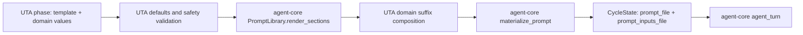

# Design: Executable Test-Generation Cycle Using agent-core `agent_turn`

Status: approved — Iteration 2 frozen on 2026-08-18
Date: 2026-08-17
Spec: [docs/spec-executable-generation-agent-turn.md](spec-executable-generation-agent-turn.md)
Workflow: [doc/workflow.md](../doc/workflow.md)
Detail designs:
[agent-core](design-executable-generation-agent-turn-agent-core.md),
[unit-test-agent](design-executable-generation-agent-turn-uta.md)
ADRs:
[ADR-004](decisions/ADR-004-nested-workflow-execution.md),
[ADR-005](decisions/ADR-005-checkpoint-persistence-boundary.md),
[ADR-006](decisions/ADR-006-session-per-phase.md),
[ADR-007](decisions/ADR-007-durable-workflow-invocation.md),
[ADR-008](decisions/ADR-008-product-workflow-operation-ledger.md),
[ADR-009](decisions/ADR-009-shared-prompt-construction.md)

## Approved (Iteration 2 — Shared Prompt Construction)

### Goals and non-goals

The goal is to make agent-core the single owner of prompt rendering and
artifact mechanics for both UTA execution engines, while UTA remains the owner
of templates, domain values, validation, phase selection, and interpretation.

This iteration does not change prompt wording, model/session policy, workflow
topology, quality gates, public report surfaces, the
default-off cutover flag, or the legacy deletion/production rollout gate.
It adds one checkpoint-safe path field, `prompt_inputs_file`, to `CycleState`.

### High-level design

agent-core will extend its existing `PromptLibrary`; it will not introduce a
second builder. The additive `render_sections` method splits raw template text
on a caller-supplied boundary before rendering both sections through the same
strict Jinja environment. An explicit `keep_trailing_newline` option lets a
consumer select Jinja's native whitespace policy without post-render trimming.
It returns an immutable `RenderedPrompt` containing
`stable`, `volatile`, and exact concatenated `text`. Existing `render`,
`render_to_file`, and `materialize_prompt` contracts remain compatible.

UTA's prompt loader becomes a thin adapter around that API. Its current
defaults and RDC-context validation run before calling agent-core. Language
phase functions continue to add domain-specific volatile suffixes, but no UTA
module creates a Jinja environment. Durable `generation_prompt` passes the
final text to agent-core's existing `materialize_prompt`, with a small
allowlisted metadata projection, and returns both artifact paths.



### Intra-system cooperation and data dependency flow

agent-core consumes only a template source, template name, values mapping, and
optional boundary string. It does not receive task databases, languages, phase
policies, or UTA settings. UTA derives domain values from checkpoint-safe cycle
state, projects safe artifact metadata (`schema_version`, product, language,
phase, workflow/unit/operation identity, batch, and logical attempt), and
passes the rendered text to the shared writer. Raw state and environment
mappings never enter `inputs.json`.

Both legacy and durable paths are identity-scoped beneath the existing
owner-only UTA application-state root, never beneath the checked-out
repository. The
durable layout is:

```text
<UTA_RUNNER_HOME or ~/.local/share/uta>/workflow-state/prompts/managed/
  <task_id>/<workflow_run_id>/<unit_id>/<operation_id>/prompt.md
  <task_id>/<workflow_run_id>/<unit_id>/<operation_id>/inputs.json
```

Standalone commands use the sibling `prompts/standalone/<run_id>/...` layout.
One UTA resolver creates the run identity, checks symlink-resolved ancestry
against `repo_path`, and rejects any equal/descendant artifact root before an
agent session opens. It deliberately does not derive prompt placement from an
arbitrary configured task DB path.

Components are validated as existing stable identifiers before path joining.
This prevents a repair/replay from overwriting the prompt referenced by an
earlier checkpoint. The prompt itself remains the exact provider input; the
metadata artifact identifies the phase safely rather than attempting to copy
arbitrary prompt values.

### Inter-repo process flow

1. agent-core adds and tests `RenderedPrompt` and
   `PromptLibrary.render_sections` without changing existing methods.
2. agent-core documents the API, runs its full suite, releases **0.6.0**, and
   pushes the release first.
3. UTA pins `v0.6.1` (`v0.6.0` prompt APIs plus the opaque artifact-ID patch),
   replaces its Jinja-backed loader with the shared library,
   and retains one-release, `.render(...)`-only loader facades for current
   callers.
4. UTA changes both materialization paths to the shared writer and adds
   `prompt_inputs_file` to `CycleState` and the node update/checkpoint contract.
5. Prompt parity and full suites run in both repositories. Beta replay remains
   a later rollout gate; this iteration does not flip the engine flag.

### Key tradeoffs

| Decision | Chosen | Rejected | Reason |
| --- | --- | --- | --- |
| Shared abstraction | Extend `PromptLibrary` and reuse `materialize_prompt` | New `PromptBuilder` hierarchy | Existing APIs already own strict rendering and artifacts; another builder duplicates them |
| Split point | Split raw template before strict rendering | Split rendered text | Jinja removes comment markers, so post-render splitting cannot preserve the boundary |
| Whitespace compatibility | UTA passes `keep_trailing_newline=False`; other callers inherit the library default | `strip()` or template rewrites | Jinja's native policy reproduces legacy section rendering without changing bytes after rendering |
| Artifact metadata | Small allowlisted identity projection | Serialize all render values/state | Full values can contain source, paths, live objects, or secrets and can grow without bound |
| UTA compatibility | Thin `.render(...)` loader facades backed by agent-core | Keep Jinja in UTA or remove helpers immediately | One engine prevents drift; facades avoid an unnecessary caller break |
| Prompt path | Stable operation-scoped directory under workflow state | Repository `.uta_cache` or one mutable `<phase>.md` | A retry must not overwrite evidence, and delivery must never stage source-bearing prompts |
| Standalone identity | UTA application-state run UUID scoped to one CLI invocation | Require a task DB or store beneath the repository | Standalone Java/Python are supported and need safe storage without inventing a product task |

The public boundary decision is recorded in
[ADR-009](decisions/ADR-009-shared-prompt-construction.md).

### Capacity, reliability, and security

Rendering is local CPU/file I/O: one template read and two strict renders per
model turn, with no RPC or DB query. At the cycle ceiling (fewer than 20 units
and fewer than 20 model turns per unit), this is under 400 small template reads.
The implementation records a local read/render benchmark rather than assuming
a per-read latency. UTA preserves its existing process-lifetime raw-template
cache; changing live override semantics requires separate approval.

Each turn already writes a prompt. The new metadata artifact is capped by the
allowlisted scalar/list identity projection (hard limit: 4 KiB), adding under
1.6 MiB/task at the ceiling. Strict metadata validation rejects unsupported
values, non-finite floats, and oversized payloads without `default=str`.
Strict undefined checking
turns an incomplete prompt into a pre-session error instead of a degraded model
request. Prompt artifacts use UTA's application-state `workflow-state`
permissions. Managed artifacts use 30-day product retention; standalone scopes
are deleted when their command closes, with crash orphans pruned after 30 days.
This iteration does not expose them through the report. For `N` retained ceiling-sized tasks, the metadata bound is
`N * 1.6 MiB`; measured prompt bytes are added to that projection and the
existing 2 GiB/80%-volume workflow-state alert applies.

### Failure-mode handling

| Failure | Detection and behavior | Containment/recovery |
| --- | --- | --- |
| Missing template variable | `UndefinedError` before materialization/session open | Add an explicit UTA default only when empty is legitimate; no permissive fallback |
| Missing template/boundary misuse | named template error or deterministic all-volatile result | fix template/config; no model cost incurred |
| Unsafe metadata value | validation error before file write | correct the UTA projection; never serialize whole state |
| Artifact write failure | exception before `agent_turn` | operation remains resumable/reconcilable; no session is opened |
| Partial artifact pair after interruption | both files must exist before state update | re-materialize the same no-effect operation path; never open a session from an incomplete pair |
| Prompt parity drift | parameterized legacy/shared fixture comparison | block UTA release; after deployment restore the previous UTA build/pin |
| Standalone run has no task DB | resolver allocates an application-state run UUID | command proceeds without product persistence; scoped artifacts are cleaned on close |
| Configured application-state path is inside repository | resolved ancestry validation before write/session | fail clearly; never fall back to repository or silently ignore `UTA_RUNNER_HOME` |
| agent-core regression in another consumer | agent-core/cr_plugin/UTA suites before release | revert additive agent-core release or keep UTA on 0.5.0 |

### Rollout and verification

This is an agent-core-first library rollout: additive API, consumer pin, no
feature activation. Unit tests prove strict variables, split/no-split behavior,
byte-exact concatenation, both newline policies, sources, filenames, and strict
metadata. UTA tests parameterize all templates and composers, prove frozen
previous/shared output parity, verify both artifact paths survive checkpoint
restart, and enforce source boundaries. A Git integration fixture without a
`.uta_cache` ignore proves delivery stages no prompt artifacts. Both full suites
and compile/import checks must pass. The production proof signal
for the later beta is a durable task event whose phase/session uses an
operation-scoped prompt artifact with a readable safe `inputs.json`; rendered
prompt hashes must match the pre-migration fixture. Because legacy rendering
also changes and is not gated by `generation_cycle_v2_enabled`, acceptance first
runs a default legacy canary with the same hash/root/metadata/staging checks.
Rollback is deployment of the previous UTA build and dependency pin; switching
the v2 flag is not a prompt-migration rollback.

### First-principles check

- **Goal:** agent-core owns reusable prompt mechanics while UTA owns only
  test-generation domain policy.
- **Simplest right solution:** one additive method on the existing library plus
  the existing artifact writer; no new framework or workflow node.
- **Production proof:** a default legacy canary and durable beta prompt hashes
  match parity fixtures, both artifact
  paths exist outside the repository, `git diff --cached` excludes them, and
  missing-value injection opens zero agent sessions.
- **Worst case:** a source-bearing prompt is pushed or whitespace drift changes
  model context. Out-of-repository owner-only storage, strict metadata, frozen
  byte-parity tests, a legacy canary, and previous-build rollback prevent or
  contain it. The durable flag contains only durable workflow risk.

### Iteration 2 review dispositions

The user chose **fix now** for every Critical and Important finding on
2026-08-18:

| Finding | Disposition recorded in this revision |
| --- | --- |
| Trailing-newline mismatch | Native per-call Jinja policy plus frozen nine-template/composer byte fixtures |
| Repository staging/data leak | Both engines use owner-only `workflow-state/prompts`; real Git delivery test |
| Missing `CycleState` field | Explicit `prompt_inputs_file` schema addition and checkpoint restart tests |
| Undefined retention | Existing workflow retention owner, 30-day lifecycle, capacity formula and alert |
| Narrow source boundary | Scan all agent-prompt production paths; allow only unrelated HTML reporting |
| Nondeterministic `default=str` | Additive strict JSON-safe metadata mode with finite-number and 4 KiB checks |
| Unsafe legacy metadata | One named-argument safe projection for legacy and durable paths |
| Underspecified loader facade | One-release `.render(...)`-only protocol and documented unsupported Jinja APIs |
| Incomplete consumer verification | Candidate-commit CR suite, released tag, and fresh UTA install proof |
| Standalone invocation lacks task identity | Application-state standalone run UUID; Java/Python CLI tests without task DB |
| Configured task DB may be inside repository | Dedicated prompt root plus symlink-resolved repository ancestry rejection |
| Legacy migration is not v2-gated | Default legacy canary and rollback to previous UTA build/pin |
| Concurrent newline policy (nice-to-have) | Per-call environment overlay; shared environment remains immutable |
| Retention wording/capacity (nice-to-have) | Explicit implementation extension and 1 MiB/400 MiB/1 GiB beta ceilings |
| Compatibility typo (nice-to-have) | Corrected `Existing result fields` wording in the approved spec |
| Managed path mismatch | Canonical layout includes task, workflow-run, unit, and operation identities in both overview and UTA detail |

## Contents

1. [Goals and non-goals](#goals-and-non-goals)
2. [Where we are](#where-we-are)
3. [High-level design](#high-level-design)
4. [Data-dependency flow](#data-dependency-flow)
5. [Inter-repo process flow](#inter-repo-process-flow)
6. [Key tradeoffs](#key-tradeoffs)
7. [Capacity, reliability, security](#capacity-reliability-security)
8. [Failure-mode handling](#failure-mode-handling)
9. [Rollout plan](#rollout-plan)
10. [Verification plan](#verification-plan)
11. [First-principles check](#first-principles-check)
12. [Review dispositions](#review-dispositions)
13. [Changelog](#changelog)

## Goals and non-goals

### Goals

1. `generation-cycle.yaml` is **compiled and executed**, so its declared nodes
   and routes decide what runs.
2. Every model-driven phase runs through agent-core's registered `agent_turn`.
3. agent-core owns reusable sessions, stall recovery, progress forwarding,
   neutral diagnostics and cleanup.
4. Java and Python execute the *same* topology; language mechanics stay in
   language packages.
5. A restarted worker resumes from a checkpoint instead of repeating expensive
   completed phases.
6. Product evidence makes non-transactional model/tool effects safely
   reconcilable, and reports stream useful session-isolated progress.

### Non-goals

Migrating cr_plugin to this contract; changing any quality-gate semantics;
adding a harness implementation; changing trigger/write APIs, Git delivery,
or production deployment. The additive operation ledger and read-only report
SSE endpoint are required parts of this design.

## Where we are

Measured, not assumed:

| Fact | Evidence |
| --- | --- |
| The cycle is metadata, not execution | `graph/generation_cycle.py` loads the spec and exposes `GENERATION_PHASES`; `attach_generation_cycle()` decorates a result. Nothing calls `build_graph` on it. |
| Execution is one composite call | `TestGenerationBackend.run_generation_cycle(state)` — the outer graph's `generate_and_validate` node delegates the entire lifecycle to a backend method. |
| UTA does **not** own a duplicate turn lifecycle | `agent_runtime.py:104` already calls `run_harness_node`, which owns attempts and bounded recovery (`node.py:135-137`). UTA owns *policy*: prompt location, phase→continue-prompt mapping, the workspace guard. Revision 1 claimed otherwise and designed a rebuild. |
| `agent_turn` exists but is single-shot | `workflow/nodes.py:112` — takes `prompt_file` and `repo_path` from state, calls `runner.run_turn(...)`, returns `turn_status`/`turn_result`. No session, no recovery, no guards. |
| Sessions exist but are not reachable from the graph | `harness/sessions.py` — `HarnessSession`, `ResumableHarness`, `SessionSnapshot`. `agent_turn` never opens one. |
| The builder accepts a checkpointer but nothing supplies one | `workflow/graph.py:156` `checkpointer: Any = None` → `graph.compile(checkpointer=...)`. No persistence API, run identity, or safe start/resume API. |
| Same thread ID is not resume semantics | Executable LangGraph 1.x probe: fresh mapping re-enters pending and completed graphs; only `invoke(None, config)` resumes a pending snapshot. |
| UTA has no SSE projection | `uta/app/routes.py` has HTML/JSON report routes but no `StreamingResponse`; `task_events` has no cursor API or operation uniqueness. |

So the gap is narrower than "build a workflow engine": the engine, the spec
format, the session protocol and the checkpointer parameter all exist. What is
missing is (a) executing the nested spec, (b) an `agent_turn` rich enough that
UTA's wrapper becomes unnecessary, (c) a persistence/invocation API that hides
LangGraph, and (d) product evidence and streaming that survive crash/reconnect.

## High-level design

```
                    ┌─────────────────────── agent-core ───────────────────────┐
                    │                                                          │
  UTA outer graph   │  workflow/                    harness/                   │
  ┌──────────────┐  │  ┌────────────────┐  ┌──────────────────────────────┐    │
  │ select_next  │  │  │ agent_turn     │──│ ResumableHarness             │    │
  │   _target    │  │  │  (enhanced)    │  │  open_session → HarnessSession│   │
  └──────┬───────┘  │  └────────────────┘  │  run_turn, recovery, snapshot│    │
         │          │  ┌────────────────┐  └──────────────────────────────┘    │
         ▼          │  │ build_graph    │  ┌──────────────────────────────┐    │
  ┌──────────────┐  │  │ nested spec    │  │ checkpoints.open_checkpointer│    │
  │ run_cycle    │──┼─▶│ + checkpointer │──│  (LangGraph hidden here)     │    │
  └──────┬───────┘  │  └────────────────┘  └──────────────────────────────┘    │
         │          └──────────────────────────────────────────────────────────┘
         ▼
  ┌──────────────┐        generation-cycle.yaml, now executed
  │ deliver      │   plan → generate → verify_compile ⇄ fix_compile
  │  _target     │        → verify_tests ⇄ fix_tests
  └──────────────┘        → measure_coverage ⇄ fix_coverage
                          → measure_mutation ⇄ fix_mutation → complete
```

Three changes, in this order:

**1. agent-core: `agent_turn` delegates to `run_harness_node`.** It gains
session scope, guards, progress and diagnostics — but it does *not*
reimplement attempts or recovery, which `run_harness_node` already owns and
which UTA already calls. Everything is driven from `config` and `context`; the
node never names a harness. Detail: [agent-core design](design-executable-generation-agent-turn-agent-core.md#agent_turn).

**2. agent-core: checkpoint persistence and safe invocation.** `agent_core.workflow.checkpoints`
exposes `open_checkpointer(path)` and a `WorkflowRunIdentity` value type whose
`invoke_config` method carries the topology version and recursion limit;
`workflow.execution.invoke_workflow` inspects state and chooses absent start,
pending `None` resume, or completed-state reuse. Products never invoke a
durable graph directly. Detail: [ADR-005](decisions/ADR-005-checkpoint-persistence-boundary.md)
and [ADR-007](decisions/ADR-007-durable-workflow-invocation.md).

**3. UTA: the cycle is built and invoked.** `run_generation_cycle` stops being
a composite backend method. `build_workflow` uses agent-core's existing
`build_graph` to compile `generation-cycle.yaml` once and binds that child in
the outer graph context; the neutral node invokes it per stable target batch.
The language backend supplies phase *operations* rather than the lifecycle.
UTA records them in an authoritative ledger, reconciles incomplete effects
before every side-effecting turn, and streams derived events over a new
cursor-based report SSE endpoint ([ADR-008](decisions/ADR-008-product-workflow-operation-ledger.md)).
Detail:
[UTA design](design-executable-generation-agent-turn-uta.md).

The language boundary is expressed as a backend protocol of **phase
operations** — `plan_tests`, `generate_tests`, `verify_compile`, `fix_compile`,
… — each returning neutral evidence plus an outcome the declared selectors
route on. Neutral graph code never branches on a language name; an unsupported
phase returns `skipped`, which the YAML already routes.

## Data-dependency flow

```
task row ──▶ outer state ──▶ per-target cycle state ──▶ phase evidence ──▶ target result
                                     │                        │
                                     ▼                        ▼
                            checkpoint (graph position)   product DB (truth)
```

Two stores, deliberately disjoint ([ADR-005](decisions/ADR-005-checkpoint-persistence-boundary.md)):

| Store | Owns | Authoritative for |
| --- | --- | --- |
| `<state>/uta_tasks.db` | task rows, operation ledger, artifacts, results, derived progress events | business truth, reconciliation and everything a user sees |
| `<state>/workflow-state/checkpoints.sqlite` | serialized graph state, next node, interrupts, nested position | resumption only |
| `<state>/workflow-state/results/` | normalized operation-result artifacts keyed by run/unit/operation | crash reconciliation inputs, governed by product retention |

The product DB stays authoritative. If the checkpoint lineage is absent, the
cycle starts at reconciliation and reuses/verifies only valid ledger evidence.
A corrupt lineage fails explicitly; it is never overwritten as if absent.

## Inter-repo process flow

```
agent-core                              unit-test-agent
──────────                              ───────────────
1. enhance agent_turn        ──┐
2. add checkpoints API       ──┤ minor release 0.5.0
3. full suite green          ──┘
                               └──▶ 4. pin released agent-core
                                    5. land ledger/SSE, flag default-off
                                    6. Java + Python slices → parity tests
                                    7. beta allowlist/default-on observation
                                    8. explicit production authorization
                                    9. production default-on observation
                                   10. drain legacy tasks, then delete adapters
```

agent-core ships first and is released before UTA depends on it.

**cr_plugin is the constraint, not UTA.** `cr_plugin/pyproject.toml:20` tracks
`agent-core@main` deliberately, so anything merged to main reaches a
**production** service on its next image build — before any UTA pin exists.
"Rollback is reverting UTA's pin" is therefore false for cr_plugin, which
revision 1 missed.

So the gate is: **run cr_plugin's suite against the agent-core branch before
merging to main.** cr_plugin does not use `agent_turn` at all (its only shared
node is `prepare_workspace`, `code-review.yaml:12`), so the exposure is the
dependency edge rather than the node contract — which is exactly why a
signature-compatibility argument does not cover it.

## Key tradeoffs

| Decision | Chosen | Rejected | Why |
| --- | --- | --- | --- |
| Nested execution | Compile the child once with existing `build_graph`, bind it in outer context, invoke per stable batch ([ADR-004](decisions/ADR-004-nested-workflow-execution.md)) | new subgraph registry or inline cycle | Existing APIs already provide independent child checkpoints; another registry adds no capability, while inlining loses the unit boundary |
| Checkpoint boundary | agent-core API, LangGraph hidden ([ADR-005](decisions/ADR-005-checkpoint-persistence-boundary.md)) | UTA imports `SqliteSaver` | A second consumer (CR) must get the same contract; and a saver import in product code is a dependency we cannot later swap |
| Durable invocation | inspect then start/resume/reuse completed ([ADR-007](decisions/ADR-007-durable-workflow-invocation.md)) | invoke fresh mapping for every call | fresh input demonstrably re-enters pending and completed LangGraph lineages |
| Side-effect truth | product `workflow_operations` ledger plus reconcile routes ([ADR-008](decisions/ADR-008-product-workflow-operation-ledger.md)) | checkpoint or `task_events` as truth | neither provides transactional, unique evidence for filesystem/model effects |
| Session scope | Fresh session per phase and per deliberate repair ([ADR-006](decisions/ADR-006-session-per-phase.md)) | One session per target | Phase accounting and parallel progress timelines must stay isolated; only stall recovery reuses a session |
| Language dispatch | Backend protocol of phase operations | Selector branching on language | The spec forbids language conditionals in neutral code; the backend table pattern already exists in `shared/backends.py` |
| Migration shape | Vertical slice per language, adapters deleted after both pass | Big-bang cutover | Parity has to be demonstrable per language before the old path goes |

## Capacity, reliability, security

**Cost.** Normal-path model policy and logical repair maxima are unchanged.
A separately budgeted crash replay can repeat one provider call when no durable
effect/result survived, so total spend is not guaranteed identical under
failure. The per-phase session is process-local: `create_session` is a `uuid4()`
and a dict entry, `delete_session` a `pop` (`client.py:140-155`) — verified,
not assumed.

Checkpoint storage was remeasured with the installed LangGraph 1.x SQLite
saver and representative 256 KiB and 1 MiB normalized results. The four
27/120-step cases retained 14.34, 61.10, 57.14, and 243.52 MiB per lineage.
At the largest fixture, twenty units project to 4.756 GiB and the ninth unit
crosses the existing 2 GiB alert. The old 8 KiB result remains historical
evidence, not a sizing basis. Beta must measure payload/step/unit p95 and actual
volume capacity before the 30-day budget and alert can be approved; full
measurements and formulas are recorded in
`evidence-prompt-checkpoint-capacity.md`.

The guard cost is larger and was missed entirely: guarded turns call
`find_class_task` once per class (`task_guard.py:71`, and again on exceptional
after-turn paths). The existing `class_tasks_by_fqn` batch query
(`tasks/db.py:923`) replaces that N+1 before the migration; no new DB API is
introduced.

**Reliability.** Checkpointing does not make filesystem, Git, compiler, test,
mutation or model side effects transactional. A unique operation ledger,
atomic artifact-before-ledger write order and explicit reconciliation routes
prevent blind replay.

**Security.** The new SSE surface is read-only and resolves tasks through the
same report-record boundary. Credentials continue through
`uta.shared.git` and the harness config; the checkpoint file contains graph
state and must be treated as task data — agent-core enforces a `0700` parent
and `0600` file, and it must never
receive credentials, which is enforced by keeping credentials out of graph
state (they live in `context`, which is bound at build time and not
serialized).

## Failure-mode handling

| Failure | Detection | Containment | Recovery |
| --- | --- | --- | --- |
| Model stalls mid-turn | `is_stall` on the turn result | bounded in-session recovery, once per attempt | fresh attempt from the phase's retry budget |
| Provider rate limit | normalized `rate_limited` diagnostic | phase returns `failed` with provider detail | task requeued by existing policy |
| Operator stop | normalized cancelled turn | UTA routes to a pause node that raises while keeping the child pending | cleared-stop resume re-enters product reconciliation; completed lineage is never fabricated |
| Worker restart | no in-process graph | shared invoke API inspects checkpoint | pending resumes with `None`; completed returns stored terminal state |
| Absent checkpoint | no stored tuple/values | enter `reconcile_cycle` | reuse/verify only valid operation-ledger evidence |
| Corrupt checkpoint | deserialization or invariant failure | explicit `WorkflowCheckpointError` | operator repairs/deletes only through a deliberate clean-rerun procedure |
| Crash after model edit | `STARTED` operation and changed workspace | reconcile allowed paths/fingerprints | deterministic verification before any new model turn |
| Unroutable phase outcome | branch `default` | route to `complete_generation` with the value in the terminal reason | no `default` exists today and `_branch_router` raises `KeyError`; the YAML is rewritten |
| Repair loop exceeds the graph budget | `recursion_limit` | terminal reason naming the limit | nothing sets one today; a cyclic graph with four repair loops exceeds LangGraph's default of 25 |
| Non-serializable state reaches a checkpoint | round-trip contract test | build fails, not production | today's `backend_context` holds a callable and a live `AgentRuntime` |
| Incompatible topology change | thread identity version mismatch | new versioned `thread_id` | old lineage ignored, run starts clean |
| Session leak | `snapshot()` / cleanup assertions | `close()` in a `finally`, plus close-all on graph exit | test asserts no live session after success, failure, cancel, interrupt |

The persisted `generation_cycle_v2_enabled` task-config flag defaults false.
Restarts use the captured task snapshot, so a daemon config change cannot
switch engines mid-run.

## Rollout plan

1. agent-core changes on a branch; **cr_plugin's suite runs green against that branch** before merge to main (C-1).
2. Merge, release **0.5.0**, agent-core full suite green.
3. UTA pins the release.
4. Land ledger/reconciliation/SSE with the flag false.
5. Java slices, per the phase-mapping table — not one task; parity suite green.
6. Python slices; parity suite green.
7. Beta allowlist enables the persisted flag; deliberate restart and SSE
   reconnect evidence are recorded.
8. Beta becomes default-on for a seven-day observation window; production
   remains default-off.
9. Production requires separate explicit authorization (spec "ask first").
   If granted, new production tasks become default-on while legacy stays for
   rollback and persisted false snapshots.
10. Delete legacy execution and the flag only after no non-terminal legacy
    task remains and the approved production observation window is green.

Rollback for UTA before step 10 sets the persisted flag false for new tasks;
in-flight tasks retain their captured engine. After deletion it is a
revert commit. Rollback for
cr_plugin is a revert on agent-core main, which is why step 1 exists.

## Verification plan

| Level | What it proves | Where |
| --- | --- | --- |
| agent-core contract | parameterized exact legacy `agent_turn` (missing inputs, cancellation, custom output/model/timeout); normalized DTO/snapshot/progress; no-throw inline publish and guard → flush → close → durable-result ordering; absent, pending, completed, corrupt and clean-rerun invocation; permissions/cleanup | `agent-core/tests/` |
| UTA graph | the nested YAML is *executed* — every declared route observed, not merely loaded | `tests/test_generation_cycle_execution.py` (new) |
| UTA parity | existing Java and Python generation suites unchanged and green | existing suites |
| Boundary | no `run_agent_node`, `AgentRuntime.run_node`, or create/send/poll/delete in production paths | source-boundary test, extending `tests/test_lane_layering.py` |
| Resume | restart after expensive completion but before outer commit does not repeat the operation | scripted E2E with invocation counter |
| E2E | success and every repair branch | scripted harness |
| Serialization | `CycleState` round-trips through the checkpoint serializer and carries no callable or credential-shaped key | UTA contract test; agent-core asserts `context` is never serialized |
| Evidence validity | a phase re-runs when artifact hashes, input/prerequisite fingerprint, schema version, operation ID or unit ID is invalid | unit tests on the validity function, including uncommitted edits with unchanged `HEAD` |
| Bounded routes | every branch has a `default`; every repair loop has an attempts-exhausted route; `recursion_limit` is set | graph-construction test over the YAML |
| Crash reconciliation | every artifact/ledger/checkpoint write boundary selects the specified safe route | fault-injection integration tests |
| Unsafe guard restart | after-turn rejection never completes the operation; restart cannot reuse/adopt it and preserves the unsafe verdict | UTA sink/ledger integration test |
| SSE | ordered backfill, `Last-Event-ID`, heartbeat, disconnect, terminal close, task isolation and session tabs | route/renderer E2E |
| Beta | a production task replays with session-isolated live progress | manual, recorded |

The execution test is the one that matters most, because the failure this
design exists to prevent — a declared topology that describes something the
code does not do — is invisible to every other level.

**Post-cutover signal.** A counter of resumed-vs-restarted cycles, emitted on
every cycle start. Without it a checkpointer that silently never resumes is
indistinguishable from a working one, which the review noted is exactly the
kind of failure this design could ship unnoticed.

## First-principles check

**Goal, in one sentence (from the spec).** Make UTA's declared generation
lifecycle the thing that actually runs, with all model-driven work going
through agent-core's shared node.

**Is this the simplest right solution?** In revision 1, no. The review found
it added machinery in agent-core that `run_harness_node` already provides,
while under-planning the ~6,500-line UTA decomposition that is the actual
project. Revision 2 rebalances: agent-core's change shrinks to an adapter plus
a checkpoint API, and the UTA work is expanded into a phase-mapping table that
makes its true size visible.

What remains genuinely new is the checkpoint/invocation API, the product
operation ledger/reconciliation boundary, the report SSE endpoint, and the
rewritten YAML. Each closes a separate demonstrated gap; none duplicates a
working capability.

**How we will know it works in production.** A beta replay of a real task
shows per-phase session tabs and reconnectable SSE with deterministic and
token/timing parity. The worker is deliberately stopped after a completed
expensive operation but before its outer commit; the resumed/reused metric
increments and the stable operation ID is not executed again.

**Worst case, and the guard.** The worst case is a resumed task silently
skipping a phase whose evidence is stale, producing a passing result nothing
verified. Revision 1 asserted a guard — "missing *or invalid*" — without ever
defining invalid, which the review rightly called unguarded in practice.

**Invalid** means any of: the evidence names an absent or content-mismatched
artifact; its `input_fingerprint` no longer matches relevant production/test
file bytes, gate/tool configuration and prerequisite evidence; its
`schema_version` is not current; or its `unit_id`/operation ID does not match
the resumed state. `source_commit` remains provenance but is not a validity
key because model edits are normally uncommitted and do not move `HEAD`. A
phase whose pre-input still matches may re-run; a changed or contradictory
workspace routes to deterministic verification or `fail_unsafe`, never blind
replay.

That check is a named function with its own tests, not a property of prose,
and deterministic gates always re-run after repair edits regardless.

## Review dispositions

The user selected **fix all** for the first independent review. Revision 5
resolves its findings as follows:

| Finding | Disposition |
| --- | --- |
| C1 resume re-entry | agent-core inspection API; absent/pending/completed/corrupt contract and executable tests |
| C2 incomplete turn projection | public JSON-safe DTO, pre-close snapshot, progress forwarding, exact legacy activation boundary |
| C3 non-durable evidence | UTA operation ledger, atomic artifact/DB ordering and reconciliation routes |
| C4 nonexistent SSE | concrete report route, cursor/backfill/heartbeat/close contract and session-tab E2E |
| I1 compatibility | legacy/none defaults; UTA explicitly opts into normalized/phase |
| I2 cross-phase reuse | removed; only in-turn stalled recovery reuses a phase session |
| I3 evidence topology | `reconcile_cycle` and per-side-effect reconciliation with explicit new/reuse/adopt/edit/no-effect/indeterminate/unsafe outcomes |
| I4 lifecycle owner | context-managed `WorkflowApplication`; daemon/CLI retention owner |
| I5 cutover | persisted default-off task flag, beta allowlist, proof and removal criteria |
| I6 language contract | distinct precheck type and complete Python phase/budget table |
| I7 permissions | enforced `0700` directory / `0600` database and rejection tests |

A fresh revision-5 review found one remaining safety ordering defect and four
important contract gaps. Revision 6 moves durable turn completion after
post-turn guard acceptance/session cleanup; defines the progress sink/flush
contract; adds the confirmed, audited, atomic clean-rerun command; expands the
exact legacy matrix; and aligns the overview rollout with delayed adapter
removal. It also qualifies crash-replay cost, adds large-state capacity
fixtures, and shows checkpoint exception wrapping explicitly.

## Changelog

| Date | Change |
| --- | --- |
| 2026-08-17 | Initial design for review. |
| 2026-08-17 | Revision 4: the operator phase vocabulary does **not** change. Revision 3 proposed collapsing eleven labels to seven, having misread the spec's prose summary as a vocabulary; it would have deleted the verify/repair distinction operators rely on. The eleven are pinned by a test, and two genuinely-invisible phases are added (11 → 13). |
| 2026-08-17 | Revision 3 after the spike: `on_failure` takes only `fail`/`skip`; `run_harness_node` already accepts a session; the prompt keeps coming from `state['prompt_file']`; `recursion_limit` via `with_config`, which keeps the resume API; the topology version moves out of `checkpoint_ns`, which LangGraph resolves as a subgraph path. |
| 2026-08-17 | Revision 2 after design review. Corrected: the premise that UTA duplicates agent-core's turn lifecycle (it calls `run_harness_node`); `add_workflow` on a registry that cannot host it; a `session_recovery` call that does not compile; "the YAML already bounds its loops" and "an unknown outcome maps to failed", neither of which is true; a rollback story that did not cover cr_plugin's `@main` pin; the UTA work understated by an order of magnitude; batch semantics, two missing phases, guard signature and its N+1, version number, and the undefined word "invalid" in the worst-case guard. |
| 2026-08-17 | Revision 3 applied executable spike results: `on_failure`, session compatibility, invoke-time recursion limits, independent child resume and the reserved meaning of `checkpoint_ns`. |
| 2026-08-17 | Revision 4 completes the UTA detail: stable persisted batch identity, existing-API child compilation, content-based evidence validity, reuse of the existing batch DB query, checkpoint retention, progress schema and repo-local rollout/verification. |
| 2026-08-17 | Revision 5 resolves the independent review: safe start/resume/completed semantics, normalized turn DTO and exact legacy defaults, product operation ledger/reconciliation, real SSE/report tabs, lifecycle and retention owners, complete Python mapping, measured storage, permissions and persisted cutover. |
| 2026-08-17 | Revision 6 resolves the fresh review: guard-before-durability ordering, explicit progress sink flushing, exact legacy test matrix, an atomic audited clean-rerun command, consistent delayed adapter deletion, checkpoint error wrapping and representative large-state sizing. |
| 2026-08-18 | Iteration 2 pending: converge UTA legacy/durable prompt rendering and artifact creation on agent-core, with strict variables, stable/volatile sections, operation-scoped artifacts, safe metadata, and no rollout change. |
| 2026-08-18 | Iteration 2 review fixes: native byte-compatible newline policy, owner-only workflow-state artifacts, explicit prompt checkpoint field, strict shared metadata, retention/capacity, full source boundary, and executable CR/UTA release verification. |
| 2026-08-18 | Iteration 2 second-review fixes: application-owned standalone/managed scope resolver, resolved Git-boundary enforcement, legacy canary/previous-build rollback, concurrency-safe rendering, explicit prompt capacity gates, and accurate retention scope. |
| 2026-08-18 | Iteration 2 final review fix: synchronize the canonical managed prompt path as `<task_id>/<workflow_run_id>/<unit_id>/<operation_id>` across overview and UTA detail. |
