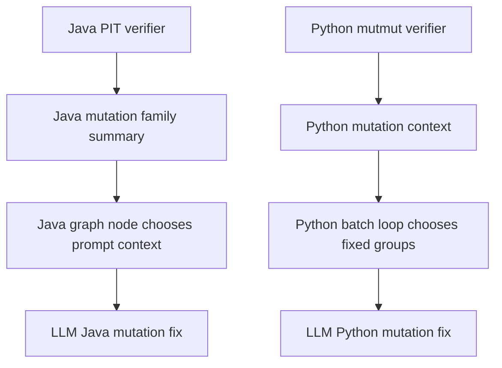
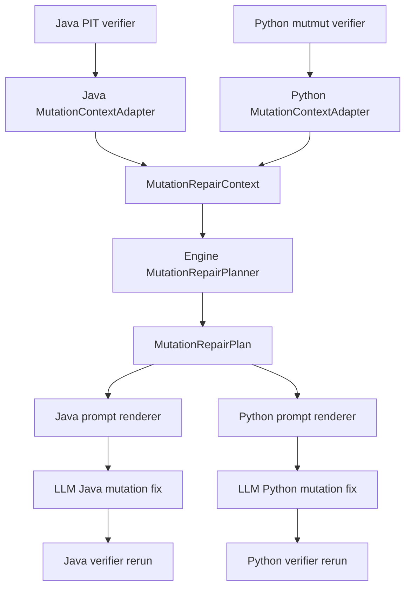

# Design: Language-Agnostic Mutation Repair Planner

## Changelog

- 2026-06-17: Initial design for issue A, moving mutation-repair round policy into the engine layer.
- 2026-06-17: Implemented the first planner slice: engine-owned `full_roi`/`focused_roi` plans and Python prompt/context wiring through the shared planner.
- 2026-06-17: Completed Java planner wiring: PIT survivor families now adapt into `MutationRepairContext`, and the Java mutation-fix workflow calls the shared planner while preserving full first-round family context.

## 1. Overview

This design fixes slow mutation-repair rounds by extracting the shared orchestration policy from the Java/Python paths into an engine planner. Language backends remain responsible for parsing mutation tools, while the engine decides how much context to send to the LLM per repair turn.

The key behavior change is:

1. First repair turn: send the full ROI-ranked survivor map.
2. Second repair turn: run only as a cleanup fallback, using the latest remaining survivors plus no-progress evidence from round 1.
3. Verifier remains authoritative.

## 2. Before

Problems:

1. Java and Python encode round policy separately.
2. Python fixed-group repair is too slow for large survivor sets.
3. Attempts to fix this in one language can regress the other.
4. Historical event-count based round selection is fragile during resume.
5. Python first-round no-progress is a symptom of the same planning flaw: the first turn may receive only source-order `batch-1-of-N`, while the second turn receives a different chunk that happens to contain more actionable mutants.

## 3. After

The engine owns the policy. The adapters own language/tool translation.

## 4. Contracts And Data Model

### 4.1 `MutationRepairContext`

Existing normalized input to the engine:

1. `language`
2. `target_id`
3. `total_survivors`
4. `groups`
5. `reproduce_command`
6. `artifact_paths`

### 4.2 `MutationRepairGroup`

Existing group-level mutation unit:

1. symbol/method/function
2. mutator/family
3. survivor count
4. representative examples
5. optional representative diffs
6. ROI score

### 4.3 `MutationRepairPlan`

New engine output:

1. `round_kind`: `full_roi` or `focused_roi`
2. `selected_groups`
3. `context_artifact_path`
4. `prompt_flags`
5. `evidence`

### 4.4 `MutationRepairRoundState`

New engine input:

1. `target_id`
2. `attempt_index`
3. `previous_survivor_count`
4. `latest_survivor_count`
5. `previous_selected_group_ids`
6. `edited_test_paths`

This state should be passed explicitly by the workflow. It should not be inferred from event logs.

## 5. Planner Policy

1. If this is the first real mutation repair attempt for the target, return `full_roi` and include every mutation group ranked by ROI.
2. If survivors remain after the first verifier rerun, return `focused_roi` as a second-round cleanup fallback over the latest remaining groups.
3. If the previous attempt edited no selected test file, mark the plan evidence as no-progress.
4. If survivor count did not decrease, include the prior selected groups in evidence so the prompt can avoid repeating the same ineffective edit.
5. Keep ordering deterministic: ROI descending, survivor count descending, symbol path ascending.
6. Do not use source-order batch number as the definition of a repair round. Batching may cap representative diff extraction cost, but it must not decide the first-round repair scope.

## 6. Java Adapter

Java keeps PIT-specific parsing in `uta/language/java/maven/pitest.py`.

It should:

1. parse PIT XML survivors;
2. group by method/family/mutator;
3. calculate shared ROI fields;
4. emit `MutationRepairContext`;
5. preserve the current full-family prompt behavior by default.

The selected-window behavior introduced by recent experiments should not remain the Java default.

## 7. Python Adapter

Python keeps mutmut-specific parsing in `uta/language/python/mutation_context.py`.

It should:

1. parse mutmut survivor output;
2. map survivors to Python symbols via the language parser;
3. collect representative `mutmut show` diffs with bounded cost;
4. calculate shared ROI fields;
5. emit `MutationRepairContext`.

The adapter can cap representative examples, but it should not cap the group list for the first repair turn. The second turn is allowed to narrow the group list because it is cleanup against latest remaining mutants after verifier feedback.

This fixes issue C together with issue A: first-round no-progress should no longer be caused by round 1 receiving an arbitrary low-value chunk while round 2 receives a more actionable chunk.

## 8. Prompt Rendering

Prompt files stay language-specific because Java and Python need different commands and tool vocabulary.

Shared planner output should provide:

1. context artifact path;
2. selected group list;
3. reproduce command;
4. no-progress evidence;
5. round kind.

Language prompts should tell the agent to read the artifact and repair tests for the selected target only.

## 9. Implementation Steps

1. Add engine planner types and tests.
2. Wire Java PIT summary into the planner without changing Java default context width.
3. Wire Python mutmut context into the planner.
4. Remove Python fixed small-group first-round behavior.
5. Remove event-history based repair round inference.
6. Add a regression test for the task-112/task-113 pattern: a large Python target whose source-order first batch is low ROI must still produce a first-round `full_roi` plan that exposes all ROI-ranked groups.
7. Add prompt tests or snapshot assertions for full-vs-focused plan payloads.
8. Run Java and Python repair regressions.

## 10. Risks And Mitigations

1. Risk: Java mutation repair regresses if full PIT context is narrowed.
   Mitigation: add regression coverage that Java first-round plan is `full_roi`.
2. Risk: Python prompts become too large for huge survivor sets.
   Mitigation: include all groups but keep representative examples bounded and artifact-based.
3. Risk: resume behavior repeats stale plans.
   Mitigation: planner uses explicit latest verifier state.
4. Risk: duplicated logic creeps back into language backends.
   Mitigation: language code may extract data only; round choice belongs to engine.
5. Risk: batching reappears as hidden round policy.
   Mitigation: tests assert first-round scope is `full_roi` even when the adapter splits mutmut survivors into internal batches for diff extraction.

## 11. Open Questions

1. Should `MutationRepairRoundState` be persisted in the existing task result JSON, or reconstructed from verifier artifacts and current class task state?
2. What upper bound should representative mutmut diffs use for very large Python targets?
3. Should the report expose selected mutation group ids for debugging no-progress rounds?
