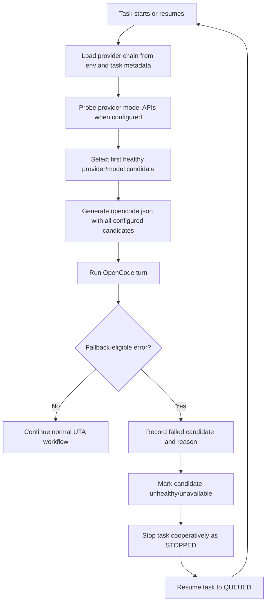

# Design: OpenCode Provider Fallback

## Context

UTA currently depends on a single configured OpenCode model for most generation and repair turns. A provider-side rate limit or disabled model can stop a long-running repo task even when another configured provider/model could continue the work. The change replaces model selection with an ordered provider/model chain and a task-level fallback mechanism that cooperates with the existing task stop/resume lifecycle.

This is non-Jira tool work.

## Core Data Model

### Configuration

Environment variables:

```text
UTA_OPENCODE_PROVIDER_CHAIN=token-pool:token-pool/gpt-5.5,token-pool/gpt-5.5-mini;openai:openai/gpt-5.5,openai/gpt-5.4;deepseek:deepseek/deepseek-v4-pro
UTA_OPENCODE_PROVIDER_TOKENS=token-pool.token=${TOKEN_POOL_API_KEY};openai.token=${OPENAI_API_KEY};deepseek.token=${DEEPSEEK_API_KEY}
UTA_OPENCODE_PROVIDER_BASE_URLS=token-pool.base_url=https://token-pool.example/v1;openai.base_url=https://api.openai.com/v1;deepseek.base_url=https://api.deepseek.com/v1
UTA_OPENCODE_MODEL_API_TIMEOUT_SECONDS=5
UTA_OPENCODE_MODEL_API_CACHE_SECONDS=300
UTA_OPENCODE_PROVIDER_FALLBACK_ENABLED=true
```

Rules:

- `;` separates providers.
- `:` separates provider id from comma-separated full model ids.
- Model ids are stored as full OpenCode model ids, for example `openai/gpt-5.5`.
- The provider chain is required for the new routing path and is the only source of model selection.
- When fallback is disabled, UTA uses the first configured provider/model from the provider chain and does not advance to later candidates.
- Legacy standalone model env vars are removed as model-selection inputs.
- Cheap/small model routing uses the same selected provider-chain model as the main model.
- Provider tokens use `provider.token` keys in `UTA_OPENCODE_PROVIDER_TOKENS`; token values are injected into OpenCode/provider env only and are never copied into task metadata or events.
- Provider base URLs use `provider.base_url` keys in `UTA_OPENCODE_PROVIDER_BASE_URLS`; these URLs are used for generated OpenAI-compatible OpenCode provider config and model-list probing.
- Native `openai` still uses OpenCode OAuth unless an OpenAI-compatible base URL/API key is configured.

### Runtime Metadata

Use existing task JSON fields and task events first. Avoid DB schema changes in v1.

Add to `repo_tasks.config_snapshot_json` when a task is created or resumed:

```json
{
  "opencode_provider_chain": [
    {"provider": "token-pool", "models": ["token-pool/gpt-5.5"]},
    {"provider": "openai", "models": ["openai/gpt-5.5", "openai/gpt-5.4"]},
    {"provider": "deepseek", "models": ["deepseek/deepseek-v4-pro"]}
  ],
  "opencode_selected_model": "token-pool/gpt-5.5",
  "opencode_selected_provider": "token-pool",
  "opencode_candidate_index": 0,
  "opencode_provider_tokens": {
    "token-pool": "configured",
    "openai": "configured",
    "deepseek": "configured"
  },
  "opencode_fallback_history": [
    {
      "provider": "token-pool",
      "model": "token-pool/gpt-5.5",
      "reason": "rate_limit",
      "phase": "generate",
      "retry_after_seconds": 120
    }
  ]
}
```

Token metadata stores only presence/status such as `configured`, `missing`, or `oauth`; never store token values.

Also emit task events:

- `opencode_model_selected`
- `opencode_model_unavailable`
- `opencode_provider_fallback_stop`
- `opencode_provider_fallback_resume`

## Flow Diagram



## API Changes

N/A. This change does not add public HTTP APIs. It affects CLI/daemon behavior and generated `opencode.json`.

Provider model availability probing uses OpenAI-compatible API:

- Method: `GET`
- Path: `<baseURL>/models` when base URL already ends with `/v1`, otherwise `<baseURL>/v1/models`
- Base URL source: `UTA_OPENCODE_PROVIDER_BASE_URLS` first, then legacy provider-specific env such as `UTA_BASE_URL` / `OPENAI_BASE_URL`, `TENCENT_BASE_URL`, or `OLLAMA_HOST`.
- Accepted response shapes:
  - `{"data":[{"id":"gpt-5.5"},{"id":"gpt-5.4"}]}`
  - `{"models":[{"id":"gpt-5.5"}]}`
  - `["gpt-5.5", "gpt-5.4"]`

Probe requests include the matching provider token when configured. Probe failures are non-fatal and keep configured candidates. Successful probes filter task creation and generated OpenCode config selection before the first LLM turn.

## Scope And Decisions

| Module | Interface | Accepts or returns provider/model routing data? | Recent production traffic | Decision | Reason |
| --- | --- | --- | --- | --- | --- |
| `uta/opencode/process.py` | `OpenCodeProcess.run_turn`, `TurnResult` | Yes | N/A local process path | In scope | Classifies fallback-eligible provider/model failures. |
| `uta/opencode/tiered_router.py` | `effective_model`, `ModelHealthTracker` | Yes | N/A in-process policy | In scope | Becomes canonical routing policy. |
| `uta/opencode/config.py` | `generate_opencode_config` | Yes | N/A generated local config | In scope | Must register all chain models for OpenCode resolution. |
| `uta/config.py` | `Settings` env fields | Yes | N/A config layer | In scope | Adds chain/probe/fallback env variables. |
| `uta/tasks/manager.py` | task stop/resume/events | Yes, via metadata/events | N/A SQLite task store | In scope | Existing lifecycle provides deferred retry. |
| `uta/graph/nodes.py` | OpenCode workflow nodes | Yes | N/A workflow graph | In scope | Converts provider failure into stop/resume. |
| `uta/ci_plugin/routes.py` | CI HTTP endpoints | No | Public traffic exists | Out of scope | No endpoint contract changes. |
| `uta/opencode/server.py` | removed/legacy server helpers | Partially | Not the process turn path | Out of scope | Avoid reviving server mode unless later needed. |

## Implementation Architecture

### Provider Chain Parser

Add a parser returning ordered candidates:

```python
ProviderCandidate(provider="token-pool", model="token-pool/gpt-5.5", index=0)
```

Invalid entries are ignored safely. Fallback-disabled behavior is explicit: the router returns only candidate index `0`.

### Provider Token Resolver

Parse token keys from `UTA_OPENCODE_PROVIDER_TOKENS`:

```text
token-pool.token=...
openai.token=...
deepseek.token=...
```

The resolver maps tokens by provider id and injects only the matching token when building the OpenCode process environment. Token values must not be written to `opencode.json`, task metadata, events, or logs.

### Provider Base URL Resolver

Parse OpenAI-compatible base URL keys from `UTA_OPENCODE_PROVIDER_BASE_URLS`:

```text
token-pool.base_url=...
openai.base_url=...
deepseek.base_url=...
```

The resolver maps base URLs by provider id. Provider-specific URLs take precedence over the legacy shared `UTA_BASE_URL` / `OPENAI_BASE_URL` setting.

### Availability Probe

Add a small OpenAI-compatible probe client with:

- timeout from `UTA_OPENCODE_MODEL_API_TIMEOUT_SECONDS`,
- process-local TTL cache,
- no secret logging,
- tolerant parsing of known model list response shapes.

Only filter models for providers with enough config to build a model-list URL. Providers without model API support are treated as unknown availability and remain candidates.

The cache is process-local only. Restarting the daemon or CI plugin clears model availability state.

### Error Classification

Extend existing rate-limit parsing into a narrower availability classification:

- `rate_limit`
- `model_disabled`
- `model_unavailable`
- `model_not_found`

Do not classify generic command errors, timeouts, stalled streams, unsafe diff, budget, compile, test, or mutation failures as fallback eligible.

### Stop And Resume

When a fallback-eligible error occurs during production task execution:

1. Record failed candidate in task config snapshot fallback history and task events.
2. Recompute selected provider/model by skipping exhausted candidate indexes.
3. Mark current task `STOPPED` with a provider-fallback reason.
4. Call `resume_task` so status becomes `QUEUED`.
5. Let the daemon scheduler acquire the task naturally.

This preserves the user's requested boundary: fallback happens on the next run, not by immediate in-turn prompt retry.

## Operation And Rollback Plan

Rollout:

1. Deploy with `UTA_OPENCODE_PROVIDER_FALLBACK_ENABLED=false`.
2. Configure `UTA_OPENCODE_PROVIDER_CHAIN`.
3. Enable fallback on the server after focused tests pass.
4. Watch task events for model selection and fallback stop/resume loops.

Rollback:

- Set `UTA_OPENCODE_PROVIDER_FALLBACK_ENABLED=false`.
- Move the desired model to the first provider-chain position.
- Restart daemon/CI plugin.

No DB migration rollback is expected because v1 uses JSON metadata and task events only.

## Deployment Verification Plan

- Local:
  - Run focused OpenCode/router/config/task tests.
  - Simulate `/v1/models` responses with fake transports.
  - Simulate OpenCode rate-limit/model-disabled output and assert task is stopped and queued.
- Node2:
  - Deploy config with two fake/unavailable candidates followed by one valid candidate in a controlled task.
  - Verify task events show failed candidate and selected next candidate.
  - Verify no retry happens inside the same OpenCode turn.
  - Verify Java and Python UTA flows start with the configured provider chain.

## Observability

Task event payloads should include:

- provider id,
- model id,
- candidate index,
- phase,
- reason,
- retry-after or cooldown,
- model API probe status.

Task events include concise event types:

- `opencode_model_selected`
- `opencode_model_unavailable`
- `opencode_provider_fallback_stop`
- `opencode_provider_fallback_resume`

Do not log API keys or full HTTP headers.

## Risks And Mitigations

| Risk | Mitigation |
| --- | --- |
| Infinite stop/resume loop when all models are unavailable | Track exhausted candidates in task metadata; fail with `PROVIDER_RATE_LIMITED` when no candidate remains. |
| Native OpenAI OAuth accidentally replaced by API-key path | Keep current env sanitization; only OpenAI-compatible probing when base URL/API config exists. |
| Provider model API down blocks all work | Probe failure is non-fatal and keeps configured models as candidates. |
| Cheap-model routing conflicts with provider chain | Remove separate cheap-model selection; all phases use the selected provider-chain model. |
| Metadata grows unbounded | Cap fallback history length, for example last 20 events in config snapshot; full history remains in task events. |

## Design Review Checklist

- Change scope: OpenCode process/config/router, graph fallback handling, task metadata/events, and tests are covered.
- Abstraction: one routing policy module owns provider/model chain decisions.
- Verification: unit, integration, and the server controlled-task checks are defined.
- Compatibility: provider chain behavior is explicit and driven by env configuration.
- Risks: stop/resume loops, model API failures, auth drift, and metadata growth are covered.
- Simplicity: v1 avoids DB schema migration and public API changes.

## Changelog

- 2026-05-29: Initial design from user-confirmed non-Jira spec.
