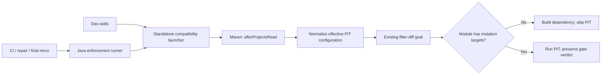

# Design: PIT Runtime Configuration Compatibility

Status: Design review passed 2026-09-08 after user-approved revisions. No remaining
Critical/Important design blockers. Implementation plan approval and real Maven proof remain.

Implementation checkpoint update: the original revision now reproduces the failure
on both 1.0.13 and 1.0.15. The first fixture lacked service tests and PIT skipped
independently, so its apparent counterevidence was incomplete. The corrected fixture
reproduces the runtime skip=false / no-change-sentinel mismatch and validates the
adapter. See the plan's exact replay evidence. Automatic activation, packaging and
shared local bootstrap are implemented; publication/deployment evidence lives in
the plan. Compatibility errors carry repairEligible=false rather than asking an
agent to change application tests to repair tooling.

## Contents
1. Architecture
2. Contracts And Ownership
3. UTA Detail
4. Dev-Skills Detail
5. Verification And Rollout
6. ADR And Risks
7. Changelog

## 1. Architecture

Before: merged POM freezes PIT skip/targets -> filter-diff updates properties ->
PIT reads stale explicit configuration -> unchanged dependency fails.

After: UTA loads a small lifecycle extension -> extension removes frozen owned
configuration after project construction -> filter-diff updates live properties ->
PIT reads its native bindings at execution. No source edits, extra Maven preflight,
replacement diff classifier, or new test-enforcer release.

## 2. Contracts And Ownership

### 2.1. Parameter Table

Apply only with the launcher's explicit `uta.pit.compat.intent=diff-enforcement`
and `test.enforcement.enabled=true`. Configuration presence alone is not activation
proof. Diagnostic/effective-POM and direct class-level PIT paths do not set intent.
Operate on org.pitest:pitest-maven in effective
build plugins and pluginManagement, including every execution configuration.

| Parameter | Action | Authority |
| --- | --- | --- |
| skip | Remove explicit nodes | PIT descriptor `${skipPitest}`, set by filter-diff |
| targetClasses | Remove explicit nodes | PIT descriptor `${targetClasses}`, set per module by filter-diff |
| targetTests | Remove only when invocation supplies targetTests | UTA's selected-test property; otherwise retain configured test scope |
| testStrengthThreshold | Replace at plugin and execution levels with late expression | `${test.enforcement.pitest.testStrengthThreshold}`, UTA gate arg / enforcer |
| excludedTestClasses | Replace plugin/execution nodes with the invocation value only when supplied, including explicit empty value | Existing baseline rerun selector; descriptor binding verified in fixture |
| excludedMethods | Remove frozen plugin/execution nodes; consume filter-diff's current project property, including absence | Existing filter-diff unchanged-method policy; no union with stale exclusions |
| mutators, timeouts, reports, dependencies | Preserve | Existing project behavior |

Do not set failWhenNoMutations=false. Do not remove coverage configuration, skip
compilation, or alter Surefire. The native bindings must be checked against PIT's
installed plugin descriptor in integration tests. Compatibility is initially verified
for Maven 3.9.10, PIT 1.15.0, test-enforcer 1.0.15, Java 8; other versions require
regression evidence before claiming support.

### 2.1.1. Scope Precedence And Execution Order

Reject user or system properties `skipPitest`, `targetClasses`, and `excludedMethods`
in diff-enforcement mode, even when their values look harmless. Inspect Maven's actual
session user/system properties, covering CLI, `.mvn/maven.config`, MAVEN_OPTS and JVM
injection; Python command parsing alone is insufficient. Do not delete these properties
silently. Threshold and selected-test parameters are explicitly allowed invocation inputs.
The error names the conflicting key, not potentially sensitive values.

The extension also registers Maven's supported ExecutionListener, delegating every event
to the existing listener. At filter-diff mojoStarted, invalidate any previous scope
snapshot; at successful mojo completion, capture the reactor project properties written
by that invocation (`skipPitest`, `targetClasses`, `excludedMethods`, threshold).
Require all participating projects to have coherent scope: skip=true with the enforcer's
no-change sentinel, or skip=false with non-empty targets. Never infer scope from test files.
ExecutionListener is for ordering and ledger events, not resolved-parameter proof.
Register a Plexus `MojoExecutionListener` and use `beforeMojoExecution`, after Maven's
`getConfiguredMojo` and before `Mojo.execute`, to inspect the actual injected PIT mojo.
Use reflective calls to PIT 1.15.0's public getters for targets/exclusions/report settings;
read its declared `skip` and `testStrengthThreshold` fields reflectively because this
version exposes no public getters for them. Resolve the fields through the mojo's class
hierarchy; require their expected types. No PIT classes are bundled in the extension.
Missing/inaccessible members fail compatibility with `MojoExecutionException` before
execution, rather than falling back to configuration text. This narrow version-bound
inspection performs no mutation of the configured mojo.

Require a completed filter-diff event and compare these injected parameter values and
project scope with the captured authority. A direct PIT
goal, reordered phase, missing filter-diff, changed reserved property, or mismatched
effective configuration is a terminal compatibility failure. No fallback to stock PIT.

`afterProjectsRead` remains the normalization hook; the listener observes/verifies and
does not implement a second target selector. Real integration tests must prove listener
events and injected values are available at the required boundaries on Maven
3.9.10. If they cannot, stop and revise the design rather than weakening these checks.

### 2.2. Artifact And Invocation

Canonical package: `uta/language/java/maven_compat/` in UTA. Contains Java source,
build POM, small versioned JAR, SHA-256 manifest, and stdlib-only `launcher.py`.
The launcher supports both import (`prepare_command`) and standalone invocation.
The immutable JAR is built before release, reviewed with its source, and packaged
as UTA package data. No compilation/download during enforcement.

Append the verified absolute JAR path to existing `maven.ext.class.path`, using the
platform path separator; preserve other paths and deduplicate only our exact path.
Existing JVM/environment extension configuration must be retained or rejected with
an actionable conflict error, never silently overridden. Validate the artifact digest
before each invocation. Enabled extension emits `[uta-pit-compat] version=...` plus
relative module and normalized parameter names, never full POM data or secrets.

The JVM extension performs no network calls, database access, or source-file writes.
Its only direct writes are the bounded invocation ledger and private evidence directory.
Cost: one bounded JAR hash plus O(reactor plugins + execution configuration nodes);
no additional Maven invocation in the production workflow.

### 2.3. API And DB Schema

No API or database migration. Existing command/stdout evidence carries the effective
invocation and compatibility markers. Missing/corrupt artifact fails before launch;
missing activation evidence for an applicable enforcement command is a tooling failure.

### 2.4. Same-Invocation Completion Contract

Each invocation has a fresh ID and a bounded structured evidence file outside source
files. The listener records relative reactor module identity, authoritative scope,
PIT execution ID, start/success/failure, and a final session outcome. It writes incrementally
and finalizes atomically; stale files or another invocation's evidence are rejected.
No source, full POM, environment, credentials, or raw Maven output is copied into it.

Every module with non-empty mutation scope must have a successful PIT execution and
fresh module-local mutation evidence consistent with that scope. Non-target modules
have an explicit `no_filtered_mutation_targets` reason, including modules without a PIT
execution. Never accept a reactor-wide metric as proof for another module. Existing
coverage authority stays unchanged, but compatibility success cannot hide missing
mutation execution. Zero applicable targets is valid only after successful filter-diff.

Validation occurs before `_classify_completed` and before its evidence-present/nonzero
exit success path. Compatibility failures cannot enter baseline retry fallback or become
repairable application failures. Genuine PIT baseline failures may use the existing
baseline retry, but each retry gets a new invocation and must independently satisfy this
contract. An unexplained nonzero exit, incomplete ledger, skipped obligated module, or
missing fresh report remains failed regardless of earlier green module summaries.

### 2.4.1. Mutation Report Attribution

For opted-in diff enforcement, append XML to the configured PIT output formats (preserve
HTML/other formats), set timestampedReports=false, and redirect reportsDirectory in the
in-memory configuration to a newly created private invocation directory. Each module and
PIT execution has a separate directory under that root; their identifiers are hashed,
not interpolated unchecked into paths. The launcher creates the root with a fresh random
invocation ID and restrictive permissions, outside source files. It must be empty before
launch. This intentionally overrides report *location*, not mutation policy; record the
effective location in evidence and use it for UTA report consumers. Do not delete or reuse
existing application report directories. Preserve the private evidence until normal
workspace artifact retention removes it.

At the post-configuration hook verify the injected formats/location, and at successful PIT
completion parse only `mutations.xml` from that execution's private directory. Disable
external entities/DTDs and bound file size and record count. The exact limits are 64 MiB
and 250,000 mutation records per execution; exceeding either is a tooling error, not a
partial score. Freshness follows empty unique directory + execution lifecycle, not mtime
or changed content; identical results on two runs are valid.

Scope consistency requires each mutation's `mutatedClass` to match the authoritative
target pattern set, and each obligated target pattern to have at least one mutation.
Use the supported PIT glob matcher from the executing plugin realm, not a second regex
interpretation. An obligated pattern with no generated mutants remains missing evidence;
no-change modules are exempt only through filter-diff's explicit skip scope. This is
deliberately fail-closed rather than interpreting an empty report as 100%.

An actual PIT mojo failure is not replaced by a missing-XML error. Preserve its failure
type/cause and module first: recognized baseline failures may trigger the existing retry,
threshold failures remain failed gates, other failures remain failed execution. Only a
claimed successful PIT execution requires a complete report. A fresh successful rerun
must independently fulfill all obligations before the overall verdict can pass.

## 3. UTA Detail

Use `MavenEnforcementRunner.run` to prepare the recorded command, and `_run_command`
to ensure all generated retries receive the same idempotent compatibility preparation.
Retain central-mirror handling, process limits, targetSources, -pl/-am, and baseline
test selectors. Direct class-level PIT is unchanged: no test-enforcer means no activation.
Place no Java logic in agent-core or shared workflow packages.

Only execution calls carry diff intent; help/effective-POM probes remain unmodified.
The launcher validates the same completion evidence when used standalone, so local
development cannot bypass UTA's fail-closed checks by using a different result parser.

Extension extends `AbstractMavenLifecycleParticipant`; `afterProjectsRead` runs after
model interpolation, before goal execution. Register via Plexus metadata; Maven APIs
are provided dependencies, not bundled duplicates. Use cloned Xpp3Dom trees and bounded
allowlisted changes. Repeated preparation/normalization is idempotent.

## 4. Dev-Skills Detail

Sparse checkout the canonical `uta/language/java/maven_compat` directory at an immutable
40-character commit recorded in dev-skills' compatibility lock, then invoke
`python launcher.py -- mvn ...`. The lock also pins artifact version, SHA-256 and evidence
schema version independently of the downloaded manifest; install/update is atomic.
Do not copy Java normalization into dev-skills. Update uta_dev_gate.py to validate
the structured completion contract and give a clear missing artifact/setup hint.
Applicable ordinary Java diff-enforcement commands must go through this same launcher;
there is no optional raw-Maven bypass in the local hard gate. Diagnostics, class-level
non-diff commands and Python remain unchanged.
Document the wrapper in test-enforce-usage.md and its Chinese companion if present,
and in UTA report guidance. Do not add repository-specific POM edits as a prerequisite.

Package Java source, Plexus metadata, JAR and manifest explicitly in wheel and sdist.
The initial supported tuple is Java 8 / Maven 3.9.10 / PIT 1.15.0 / test-enforcer 1.0.15;
resolve effective plugin versions in the extension and fail closed on any other tuple.
This restriction applies to opted-in diff compatibility, not unrelated invocations.
Build records pin toolchain and source revision; package tests verify the artifact digest
and execution from wheel, sdist and sparse checkout. Deploy UTA code/artifact first, then
publish the consumer lock to that commit. Rollback restores the matched lock/code/artifact,
not just the JAR. No mutable main ref or placeholder digest may ship.

Nexus public metadata checked 2026-09-08 reports latest/release **1.0.15**. Use that
released artifact, not the local development parent version 1.0.16. Preserve UTA and
dev-skills' existing minimum 1.0.15 checks. Historical 1.0.13 is used only in an isolated
RED reproduction without the compatibility launcher; it is never admitted by production
compatibility mode. If the original application still resolves 1.0.13, its replay must
report version mismatch; do not lower the guard or change its POM silently. In that case
record the blocked replay and obtain an application-owner upgrade before live GREEN.

## 5. Verification And Rollout

1. RED real Maven reactor with unchanged dependency and changed leaf: stale skip false
   reproduces no-mutations abort. GREEN with extension reaches leaf; test both genuinely
   passing and failing mutation verdicts. Use isolated fixture workspaces and pinned tools.
2. Java unit tests cover execution/pluginManagement merging, field preservation,
   disabled activation, explicit test selection, threshold precedence, and idempotence.
3. Python tests cover artifact checks, extension classpath composition, exact invocation
   evidence and CI/repair/final rerun consistency. Hash repository POMs around all outcomes.
4. Run existing Java enforcement/parser tests and Python non-regression tests.
5. Commit/push UTA and dev-skills, deploy via Git pull only after idle. Verify artifact
   digest, Java 8, process IDs, health, and focused tests on production.
6. Fresh replay of dms-order-core report c3a75efa07774cc4a404f0f44014c3f5 with recorded
   base/head. Prove service skipped PIT, biz ran, and unchanged files stayed unchanged.
   A genuine gate failure is not a tooling failure and is not permission to bypass.
7. Roll back the matched code/artifact pair if scope changes unexpectedly. No schema undo.

Exact test/build commands will be recorded in the plan after design review. Mandatory
real-reactor execution cannot be waived by unit tests or an effective-POM printout.

Required negative fixtures additionally cover: module A passes while obligated B skips
or fails without recognized gate text; stale prior PIT reports; CLI/maven.config/JVM
forced skip and wrong target; direct/reordered goals; execution-level method exclusions;
both baseline selector paths with explicit exclusions; unsupported versions; and stale
or corrupt consumer locks. None may return passed, even with aggregate green output.

## 6. ADR And Risks

ADR: choose in-memory normalization at the lifecycle boundary. Rejected POM editing
(checkout mutation), global skip/no-mutants flags (false pass), and duplicate module
selection (disagrees with enforcer). A provider-library fix remains a future alternative;
this iteration is explicitly constrained to UTA compatibility without that release.

Risks: another extension can mutate configuration later; unknown plugin bindings may
not behave identically; lifecycle inheritance can reintroduce entries. Real Maven tests
and fail-closed activation guard these assumptions. Worst case is false gate success:
negative changed-module fixtures and production target evidence are release blockers.

First principles: goal is correct diff gates without application edits; one small
invocation adapter is the minimum shared intervention. Production proof is service PIT
skipped while biz produces real metrics/verdict. Existing passing reports are never rewritten.

## 7. Changelog
- 2026-09-08: Initial design from approved spec; lifecycle hook, parameter ownership,
  artifact sharing, no-schema compatibility, and real-reactor verification specified.
- 2026-09-08 (review revision): User approved fixing all findings. Added per-module
  same-invocation completion (Critical 1), reserved-property rejection (Critical 2),
  execution ordering/explicit intent (Important 3), exclusion ownership (Important 4),
  and pinned distribution/mandatory local parity (Important 5). All await re-review;
  no findings waived and no production behavior changed yet.
- 2026-09-08 (second review revision): User approved resolved-mojo inspection, private
  XML evidence with explicit freshness/scope rules, and preservation of minimum versions.
  User additionally requested latest enforcer: Nexus confirms released 1.0.15. Local
  1.0.16 is not selected. Historical 1.0.13 remains RED-only; production version mismatch
  is not bypassed. Re-review pending.
- 2026-09-08 (review closure): Independent reviewer verified Maven/PIT APIs and passed
  the revised design with no remaining Critical/Important blockers. Real reactor,
  packaging, baseline-retry and production evidence remain implementation obligations.

## Sources
- [Maven lifecycle participant](https://maven.apache.org/components/ref/3.0/maven-core/apidocs/org/apache/maven/AbstractMavenLifecycleParticipant.html): hook ordering.
- [PIT Maven configuration](https://pitest.org/quickstart/maven/): plugin options; exact property bindings additionally verified from deployed plugin.xml.
