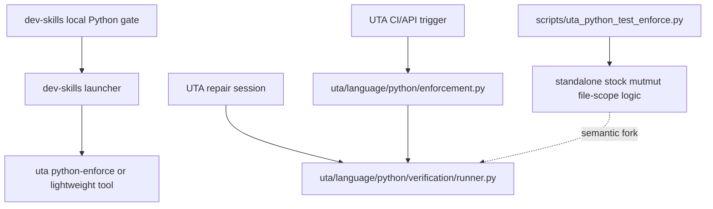
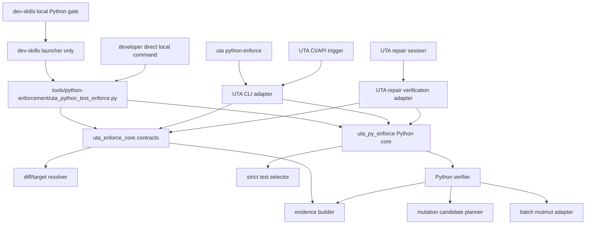
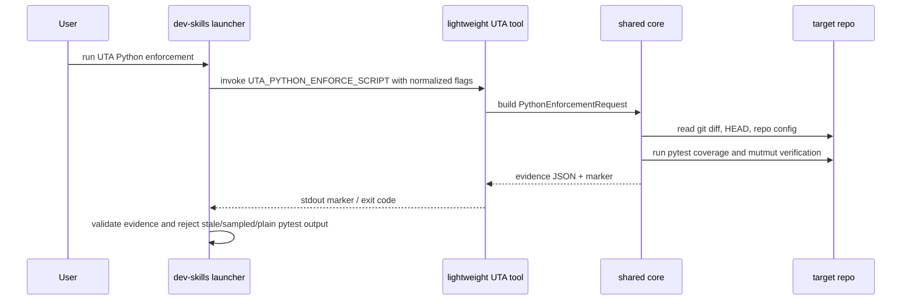
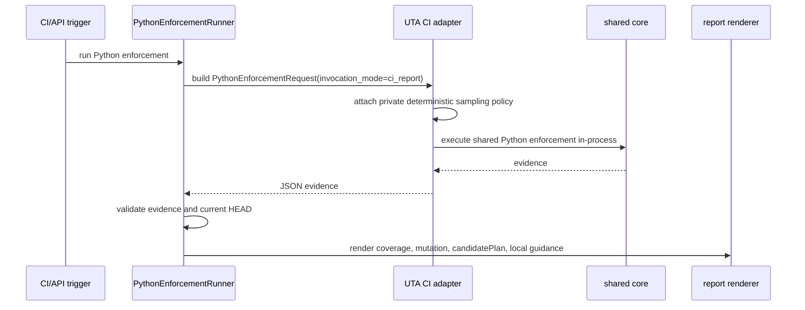
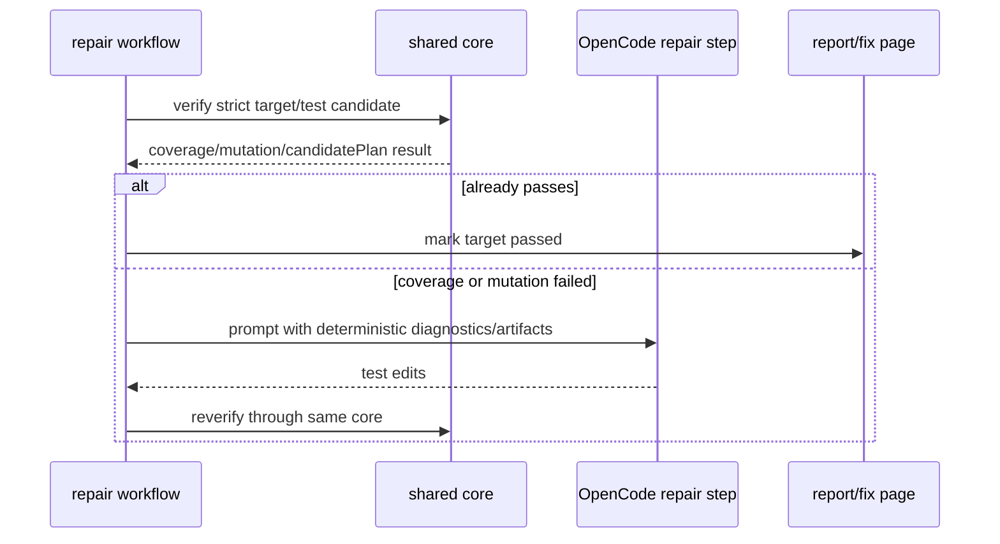

# Design Overview: Standalone UTA Python Enforcement Core

## Table Of Contents

1. [Goals And Non-Goals](#1-goals-and-non-goals)
2. [High-Level Design](#2-high-level-design)
3. [Contracts And Data Model](#3-contracts-and-data-model)
4. [Process And Data Flow](#4-process-and-data-flow)
5. [Repo Detail: unit-test-agent](#5-repo-detail-unit-test-agent)
6. [Repo Detail: dev-skills](#6-repo-detail-dev-skills)
7. [Capacity, Reliability, And Security](#7-capacity-reliability-and-security)
8. [Failure-Mode Handling](#8-failure-mode-handling)
9. [Rollout Plan And Strategy](#9-rollout-plan-and-strategy)
10. [Verification Plan](#10-verification-plan)
11. [Key Design Tradeoffs](#11-key-design-tradeoffs)
12. [First-Principles Check](#12-first-principles-check)
13. [Changelog](#13-changelog)

## 1. Goals And Non-Goals

### 1.1 Goals

1. Extract Python enforcement into a lightweight UTA-owned core that can run without the full UTA checkout.
2. Keep one Python enforcement implementation for full UTA CLI, UTA CI/API trigger, repair-session verification, and dev-skills local enforcement.
3. Preserve current Python 3 semantics: strict test selection, changed-line coverage, mutmut candidate planning, operator-level filtering, deterministic hard caps, default batch generation, exact-key evidence, and fail-closed backend behavior.
4. Preserve Python 2 legacy behavior through the existing `mutmut==1.5.0` lane without claiming Python 3 exact-key/operator-filter support.
5. Keep dev-skills as a launcher and evidence validator, not an enforcement algorithm owner.
6. Update both local-dev guidance surfaces: dev-skills usage docs and the UTA CI report failure page.

### 1.2 Non-Goals

1. No Java Maven enforcer behavior change.
2. No RDC/API route shape change.
3. No database schema migration.
4. No package publishing in this iteration. Distribution is a sparse-checkout of the lightweight folder from the UTA repo; direct copy is allowed only when the copied folder keeps the same version file and evidence reports that version.
5. No OpenCode, task DB, daemon, API trigger, report UI, or Java module dependency in the lightweight local path.

## 2. High-Level Design

### 2.1 Before



The current simplified standalone script is a fork. It emits the same marker shape, but it does not implement batch generation, operator filtering, candidate-plan parity, or the same mutmut adapter behavior as UTA.

### 2.2 After



UTA will extract reusable enforcement contracts into `tools/python-enforcement/uta_enforce_core/` and Python-specific enforcement behavior into `tools/python-enforcement/uta_py_enforce/`. Full UTA code will call those packages through thin adapters. The standalone entrypoint will be only CLI parsing plus core invocation. Dev-skills will only locate and invoke the standalone entrypoint, then validate the emitted evidence.

### 2.3 Component Responsibilities

| Component | Owner | Responsibility |
| --- | --- | --- |
| `tools/python-enforcement/uta_enforce_core` | UTA | Single source package for language-neutral local enforcement contracts, evidence, diff, target, and mutation candidate-plan data. |
| `tools/python-enforcement/uta_py_enforce` | UTA | Single source package for shared local/CI/repair Python enforcement behavior. |
| `tools/python-enforcement/uta_python_test_enforce.py` | UTA | Lightweight direct CLI entrypoint. |
| `uta/cli.py python-enforce` | UTA | Compatibility command that calls the shared core. |
| `uta/language/python/enforcement.py` | UTA | UTA integration adapter and evidence compatibility surface. |
| `uta/language/python/verification/runner.py` | UTA | Will be split so reusable verification logic moves to the lightweight core; UTA-specific path remains as an adapter. |
| `scripts/uta_python_test_enforce.py` | UTA | Current simplified script; deleted after docs and tests move to `tools/python-enforcement/uta_python_test_enforce.py`. |
| `plugins/dev-skills/scripts/uta_python_test_enforce.py` | dev-skills | Launcher only. It resolves `UTA_PYTHON_ENFORCE_SCRIPT` or an explicit `UTA_PYTHON_ENFORCE_CMD`. |
| `plugins/dev-skills/scripts/uta_dev_gate.py` | dev-skills | Evidence validator only. It rejects stale/missing/sampled local Python evidence. |

## 3. Contracts And Data Model

### 3.1 Public Command Contract

The lightweight CLI will support the same required command surface as `uta python-enforce`:

Local/dev-skills command output is file-based so the launcher can validate a committed evidence artifact:

```bash
python3 /path/to/uta-python-enforcement/uta_python_test_enforce.py \
  --repo . \
  --base-ref origin/master \
  --target path/to/module.py \
  --test-path tests/test_module.py \
  --coverage-gate 95 \
  --mutation-gate 95 \
  --syntax-version python3 \
  --evidence-output .uta_reports/python-enforcement.json
```

Full UTA CLI output keeps the existing marker behavior and also supports JSON for command callers:

```bash
uta python-enforce \
  --repo . \
  --base-ref origin/master \
  --coverage-gate 95 \
  --mutation-gate 95 \
  --syntax-version python3 \
  --json-output
```

`--evidence-output` writes canonical evidence JSON to a path and prints the `UTA_PYTHON_ENFORCEMENT_EVIDENCE=...` marker. `--json-output` writes the same canonical evidence to stdout for app callers. Both modes use the same field names. `uta python-enforce` remains a compatibility alias for full CLI and existing scripts, but it delegates to the same core. The UTA CLI may add app-local defaults and settings, but it must not reimplement enforcement logic or enable CI sampling.

### 3.2 Evidence Contract

Evidence stays schema-version compatible:

| Field | Requirement |
| --- | --- |
| `schemaVersion` | `1` |
| `language` | `python` |
| `backend` | `python_enforcer` |
| `headCommit` | Current target repo `HEAD` |
| `coverage` | Changed-line coverage aggregate and per-target details |
| `mutation` | Changed-line mutation aggregate and per-target details |
| `mutation.candidatePlan` | Present for Python 3 mutation verification; contains deterministic candidate-plan counts and fingerprints |
| `mutation.samplingLayer` | Present with `enabled=true` only for `invocationMode=ci_report`; absent or `enabled=false` for local, repair, and full CLI |
| `targetResults[].candidateTestPaths` | Strict candidate list tried for the target |
| `targetResults[].candidateResults` | Per-candidate verification result evidence |
| `command.cwd` | Repo cwd used for enforcement |
| `command.argv` | Sanitized command or adapter description used to run enforcement |
| `command.exitCode` | Process/adapter exit code |
| `command.timeoutSeconds` | Effective command timeout budget |
| `configFingerprint` | Deterministic fingerprint over config fields marked as fingerprint inputs |
| `devSkillsLauncherVersion` | Present when invoked through dev-skills |

Local dev evidence must not set CI sampling. `uta_dev_gate.py` will continue to reject local Python evidence when the CI-only sampling flag is present or when candidate-plan consistency is missing.

Golden schema fixtures must exist for Python 3 candidate-plan evidence and Python 2 legacy evidence. Schema comparison may ignore only timestamp, elapsed time, absolute executable path, and temp artifact paths.

### 3.3 Candidate Plan Contract

The lightweight core reuses the existing neutral engine contract from `uta/engine/mutation_candidates.py` by moving reusable contract source into `uta_enforce_core` and leaving UTA-side modules as import adapters only:

1. one deterministic candidate plan per target and runtime policy;
2. one useful mutation opportunity per eligible changed line before generation;
3. operator policy and hard-cap ordering included in the plan fingerprint;
4. batch generation metadata included in evidence when `generationStrategy=batch`;
5. mutmut backend failures fail closed and never become zero-mutant success;
6. Python 2 legacy lane emits explicit legacy evidence and no Python 3 exact-key claims.

### 3.4 Config Contract

The lightweight core will read config in this order:

1. explicit CLI flags;
2. environment variables already used by UTA Python enforcement;
3. repo-local config files such as `.uta/python-enforce.toml` and `.uta-test-enforcement.toml`;
4. safe defaults matching UTA CI where no repo config exists.

`PythonRuntimeConfig`:

| Field | CLI/env source | Default | Fingerprint input |
| --- | --- | --- | --- |
| `syntax_version` | `--syntax-version`, `UTA_PYTHON_SYNTAX_VERSION` | `python3` | yes |
| `python_executable` | `--python`, `UTA_PYTHON_EXECUTABLE` | current interpreter or configured legacy interpreter | yes |
| `pytest_command` | `--pytest-command`, `UTA_PYTEST_COMMAND` | `python -m pytest` | yes |
| `coverage_command` | `--coverage-command`, `UTA_COVERAGE_COMMAND` | `python -m coverage` | yes |
| `mutmut_command` | `--mutmut-command`, `UTA_MUTMUT_COMMAND` | `mutmut` for Python 3, configured `mutmut==1.5.0` command for Python 2 | yes |
| `repo_path` | `--repo` | `.` | no, evidence records `headCommit` instead |
| `base_ref` | `--base-ref`, `UTA_BASE_REF` | `origin/master` | yes |
| `targets` | repeated `--target` | changed production Python files from diff | yes |
| `test_paths` | repeated `--test-path` | strict selector candidates | yes |
| `invocation_mode` | adapter-selected, not a public local flag | `local_dev` for lightweight CLI, `full_cli` for `uta python-enforce`, `repair` for repair adapter, `ci_report` for CI adapter | yes |
| `command_timeout_seconds` | `--timeout-seconds`, `UTA_PYTHON_ENFORCE_TIMEOUT_SECONDS` | existing UTA setting | yes |

`PythonMutationConfig`:

| Field | CLI/env source | Default | Fingerprint input |
| --- | --- | --- | --- |
| `coverage_gate` | `--coverage-gate`, `UTA_COVERAGE_GATE` | existing UTA Python default | yes |
| `mutation_gate` | `--mutation-gate`, `UTA_MUTATION_GATE` | existing UTA Python default | yes |
| `generation_strategy` | config/env only | `batch` for Python 3, `legacy` for Python 2 | yes |
| `operator_policy_version` | code constant | current Python mutation operator policy version | yes |
| `hard_cap_ci` | UTA CI config | `300` | yes when `ci_report` |
| `hard_cap_full` | local/full/repair config | `1000` | yes when not `ci_report` |
| `batch_candidate_limit` | config/env | current UTA batch default | yes |
| `max_generated_module_bytes` | config/env | current UTA generated-module byte budget | yes |
| `mutation_timeout_seconds` | config/env | current UTA mutation timeout | yes |
| `per_mutant_timeout_seconds` | config/env | current UTA per-mutant timeout | yes |
| `sampling_policy_fingerprint` | UTA CI adapter only | absent for local, repair, and full CLI | yes when present |

### 3.5 CI-Only Sampling Isolation

Python mutation has three invocation scenarios:

1. `ci_report`: UTA CI/API trigger may apply deterministic sampling after the normal hard-cap candidate policy when the candidate set is large.
2. `repair`: UTA repair sessions run the full hard-capped candidate set, without sampling.
3. `local_dev`: dev-skills and direct lightweight local use run the full hard-capped candidate set, without sampling.

The sampling implementation is not part of the lightweight local distribution. `uta_py_enforce` exposes only a narrow selection-policy interface and the default full hard-cap policy. The UTA CI adapter owns the sampling policy implementation under UTA code that is not required by `tools/python-enforcement/` sparse-checkout. The local CLI has no sampling flag, no documented sampling environment variable, and no code path that loads the UTA CI sampling policy.

Hard rule:

```python
sampling_policy = None
if invocation_mode == "ci_report" and uta_ci_adapter_supplied_policy:
    sampling_policy = uta_ci_adapter_supplied_policy
```

Any sampled evidence from `local_dev`, `repair`, or `full_cli` is invalid. Dev-skills validation rejects sampled evidence even if a user manually forges a sampling env var. This prevents local workflows from using or reverse-engineering the CI sampling strategy to satisfy only the sampled subset.

### 3.6 DB Schema

N/A. Evidence remains JSON payload data in the existing report/task structures; no task DB migration is required.

## 4. Process And Data Flow

### 4.1 Local Dev Flow



### 4.2 UTA CI/API Trigger Flow



The CI/API trigger path must not depend on a public CLI flag or environment variable for sampling. It invokes the shared core through a UTA-owned in-process adapter so `mutation_selection_policy` can be passed as an object that is not available in the sparse-checkout local distribution. Existing shell command execution remains valid for full CLI compatibility and non-sampled runs, but the production Python CI report path uses this adapter.

### 4.3 Repair-Session Flow



Repair uses the same strict target/test selection, coverage, mutation candidate planning, and batch adapter implementation as CI before the CI-only sampling layer. Repair always passes `mutation_selection_policy=None`, runs the full hard-capped candidate set, and treats persisted CI candidate plans as comparison anchors only, not sources of selection.

## 5. Repo Detail: unit-test-agent

### 5.1 Changes In This Repo

1. Add `tools/python-enforcement/` as the lightweight distribution root.
2. Move reusable language-neutral contracts from `uta/engine/*` into `tools/python-enforcement/uta_enforce_core/` where they are safe to run without full UTA app imports.
3. Move reusable Python enforcement behavior from `uta/language/python/*` into `tools/python-enforcement/uta_py_enforce/`.
4. Update `pyproject.toml` package discovery so installed UTA includes `uta_enforce_core` and `uta_py_enforce` from `tools/python-enforcement`.
5. Delete the simplified `scripts/uta_python_test_enforce.py` script after updating docs/tests to use `tools/python-enforcement/uta_python_test_enforce.py`.
6. Change `uta/cli.py python-enforce` to construct a shared-core request and call the extracted core.
7. Keep UTA-specific adapters for report rendering, repair workflow, settings, and task context outside the lightweight core.
8. Keep `uta/api_trigger/templates/report.html` Python guidance aligned with the lightweight local path.
9. Update README and existing Python support docs to call out lightweight distribution.

### 5.2 Package Layout

```text
tools/python-enforcement/
  README.md
  uta_python_test_enforce.py
  uta_enforce_core/
    __init__.py
    diff.py
    evidence.py
    mutation_candidates.py
    targets.py
  uta_py_enforce/
    __init__.py
    cli.py
    config.py
    test_selection.py
    verification.py
    coverage.py
    mutation_candidates.py
    mutation_batching.py
    mutmut_adapter.py
    runtime.py

uta/language/python/
  enforcement.py          # adapter to shared core
  verification/runner.py  # UTA adapter/facade; no copied algorithm
```

Packaging change:

```toml
[tool.setuptools.packages.find]
where = [".", "tools/python-enforcement"]
include = ["uta*", "uta_enforce_core*", "uta_py_enforce*"]
```

The lightweight package may import only standard library modules and target-runtime command-line tools. If tree-sitter or another parser dependency is needed later, the dependency must be documented in `tools/python-enforcement/README.md` and the local tool must fail with an actionable setup message when it is missing.

### 5.3 Key Abstractions

```python
@dataclass(frozen=True)
class PythonEnforcementRequest:
    repo_path: Path
    base_ref: str
    targets: tuple[str, ...]
    test_paths: tuple[str, ...]
    coverage_gate: float
    mutation_gate: float
    syntax_version: str
    invocation_mode: Literal["local_dev", "ci_report", "repair", "full_cli"]
    mutation_selection_policy: MutationSelectionPolicy | None = None

@dataclass(frozen=True)
class PythonEnforcementEvidence:
    payload: Mapping[str, Any]
    markers: str
    exit_code: int
```

The invocation mode may change defaults and evidence labels, but it must not create a separate enforcement algorithm. `mutation_selection_policy` is an internal adapter injection point, not a CLI flag. The lightweight CLI and dev-skills launcher always pass `None`; only the UTA CI adapter can pass the CI sampling policy.

### 5.4 Key Control Flow

1. Resolve repo, base commit, head commit, and changed production Python targets.
2. Resolve strict target-specific tests; broad/import-only tests do not qualify as unit evidence.
3. For each target, try strict candidates in deterministic order.
4. Run coverage first.
5. Only run mutation after coverage gate passes.
6. Run Python 3 mutation through candidate planner and batch mutmut adapter.
7. Run Python 2 through the existing legacy lane.
8. Build target evidence, aggregate evidence, and evidence marker.
9. Validate the evidence before returning success.

### 5.5 UTA-Specific Boundaries

The lightweight core must not import:

1. API trigger Flask/FastAPI modules;
2. task DB models;
3. OpenCode workflow modules;
4. report templates;
5. Java language adapters;
6. daemon settings that require deployed UTA filesystem layout.

UTA adapters may import the lightweight core and translate UTA settings/task context into `PythonEnforcementRequest`.

## 6. Repo Detail: dev-skills

### 6.1 Changes In This Repo

1. Keep `plugins/dev-skills/scripts/uta_python_test_enforce.py` as a launcher only.
2. Prefer `UTA_PYTHON_ENFORCE_SCRIPT=/path/to/tools/python-enforcement/uta_python_test_enforce.py`.
3. Keep `UTA_PYTHON_ENFORCE_CMD` as an explicit command override for unusual local installations.
4. Keep `plugins/dev-skills/scripts/uta_dev_gate.py` as a validator only.
5. Update `references/test-enforce-usage.md`, README files, command docs, and skill docs with the lightweight path wording.

### 6.2 Local Gate Validation

`uta_dev_gate.py` will validate:

1. evidence marker exists;
2. `schemaVersion=1`;
3. `language=python`;
4. `backend=python_enforcer`;
5. `headCommit` matches current `HEAD`;
6. coverage and mutation pass when there are changed production Python files;
7. Python 3 mutation evidence includes candidate-plan consistency;
8. local evidence does not use CI sampling.
9. no user-facing dev-skills command or doc exposes the CI sampling env var or policy name.

Dev-skills will not parse mutmut output, infer coverage, or run pytest directly as Python enforcement evidence.

## 7. Capacity, Reliability, And Security

### 7.1 Capacity

1. Local dev runs are bounded by the same target count, candidate planning, batch generation, and hard-cap behavior as CI.
2. Mutation generation remains the dominant cost. Batch mode keeps generated modules below the configured byte budget and avoids known large-file `ast.parse` stalls.
3. The lightweight tool performs local subprocess calls only; there are no RPCs or DB calls.
4. UTA CI keeps its existing command timeout budget. Local dev reads the same timeout env/config defaults.

### 7.2 Reliability

1. All invocation paths share the same core, removing local/CI semantic drift.
2. Mutmut backend errors fail closed.
3. Source masks, temp config overlays, and generated mutmut artifacts must restore/cleanup in `finally` blocks.
4. Evidence is commit-bound and validated by dev-skills before the local gate passes.

### 7.3 Security

1. The lightweight tool runs only in the developer's target repo and does not call UTA services.
2. No tokens or service credentials are required.
3. CLI output should truncate command stdout/stderr in evidence to avoid accidentally storing huge logs.
4. Sparse-checkout guidance must point to trusted UTA repo paths, not arbitrary remote installers.

## 8. Failure-Mode Handling

| Failure mode | Detection | Handling | Blast radius |
| --- | --- | --- | --- |
| Lightweight tool missing | Launcher `OSError` or non-zero command | Show setup message with `UTA_PYTHON_ENFORCE_SCRIPT` and optional explicit `UTA_PYTHON_ENFORCE_CMD` override | Local gate fails only |
| Tool lacks candidate-plan support | Evidence validation sees missing/legacy Python 3 candidate plan | Fail local gate and point user to update lightweight tool | Local gate fails; no false pass |
| Mutmut backend failure | Core sees non-zero backend failure with no valid plan | Fail closed with command evidence | Target fails; no false pass |
| Large mutation target | Candidate planner/batch metadata shows hard cap or batch trimming | Report cap/batch evidence and keep run bounded | Slower local/CI run, bounded by timeout |
| Mutmut timeout leaves worker processes | Process-group audit after timeout or orphan process detection in tests | Kill the full process group and any child mutmut workers before returning failure evidence | Prevents local/node2 CPU leaks after failed mutation verification |
| Python 2 lane invoked | `syntax_version=python2` | Use legacy mutmut 1.5 lane and mark evidence as legacy | No Python 3 capability claims |
| Dev-skills stale evidence | Head mismatch | Reject evidence | Local gate fails |
| Local CI sampling enabled | `samplingLayer.enabled=true`, local evidence claims sampled mutation, or user-provided env tries to enable sampling | Reject evidence; local CLI ignores sampling knobs | Local gate fails |
| UTA adapter drift | Contract tests compare full CLI and lightweight output | Block release until fixed | Prevents CI/local inconsistency |

## 9. Rollout Plan And Strategy

1. Build lightweight core behind existing tests while keeping current full UTA paths green.
2. Add contract tests that compare `uta python-enforce` and lightweight CLI evidence on the same fixture.
3. Delete the simplified standalone script, or leave only a hard-failing setup message that cannot run enforcement.
4. Update dev-skills launcher/docs to prefer `UTA_PYTHON_ENFORCE_SCRIPT`.
5. Update UTA report failure guidance and README.
6. Run local real-repo Python 3 verification with batch mode and candidate-plan evidence.
7. Run Python 2 legacy smoke verification if a configured local Python 2 fixture/runtime is available; otherwise record the skipped dependency explicitly.
8. Deploy UTA normally; no database migration.
9. Rollback by pointing dev-skills to a known-good `uta python-enforce` command through `UTA_PYTHON_ENFORCE_CMD`.

## 10. Verification Plan

### 10.1 Unit Tests

1. Shared core request/config parsing.
2. Diff target resolution.
3. Strict Python unit-test selection.
4. Evidence finalization and validation.
5. Candidate-plan deterministic count/fingerprint behavior.
6. Batch partition and aggregate evidence.
7. Python 2 legacy evidence is explicit and does not claim Python 3 exact-key support.
8. Local/dev-skills invocation cannot enable sampling even when sampling env vars are present.

### 10.2 Contract Tests

1. Full `uta python-enforce` and lightweight CLI produce equivalent evidence for a small Python 3 fixture.
2. Dev-skills launcher invokes `UTA_PYTHON_ENFORCE_SCRIPT` without appending `python-enforce`.
3. Dev-skills validator accepts lightweight evidence and rejects plain pytest, stale HEAD, local CI sampling, and inconsistent candidate plans.
4. The old simplified stock-mutmut script path cannot satisfy batch/operator-filter evidence assertions.
5. UTA CI adapter can inject the CI sampling policy, but repair/full CLI/lightweight CLI cannot.

### 10.3 Integration Tests

1. Run lightweight CLI on UTA's own Python test fixture or UTA repo fixture.
2. Run full UTA CLI on the same fixture and compare pass/fail, selected tests, coverage totals, mutation totals, candidate-plan counts, and generation strategy.
3. Run dev-skills local gate with `UTA_PYTHON_ENFORCE_SCRIPT` pointed at the lightweight CLI.

### 10.4 Real Repo Verification

1. Python 3: run against a real local Python repo with changed production lines and mutation enabled.
2. Large mutation case: verify `generationStrategy=batch`, `batchCount > 1` where expected, and no broad stock whole-file mutmut generation.
3. Python 2: run legacy lane on a configured Python 2 repo/runtime if available.

### 10.5 Regression Verification

1. Existing UTA Python enforcement tests.
2. Existing UTA report rendering tests.
3. Existing API trigger Python enforcement tests.
4. Existing repair-session tests that call Python verification.
5. Existing dev-skills Java and Python gate tests.

## 11. Key Design Tradeoffs

### 11.1 Shared Lightweight Core Instead Of Full UTA Checkout

Decision: UTA will own one lightweight Python enforcement core and both local and deployed paths will call it.

ADR: [ADR-003: Extract Lightweight Python Enforcement Core](decisions/ADR-003-lightweight-python-enforcement-core.md).

Rejected alternatives:

1. Keep requiring full UTA checkout from dev-skills. Rejected because it is heavy for local development and keeps app-only dependencies in the local path.
2. Keep the one-file standalone stock-mutmut implementation. Rejected because it creates a second algorithm and already lacks batch/operator filtering.
3. Publish a Python package now. Rejected for this iteration because sparse-checkout satisfies the immediate need with fewer release/distribution moving parts.

### 11.2 Sparse-Checkout Folder Distribution

Decision: distribute `tools/python-enforcement/` by sparse checkout. Direct copy is a fallback only when it preserves the lightweight tool version file and evidence reports that version.

This keeps the UTA repo as the source of truth without requiring local developers to fetch daemon/API/report code. A generated zip or package can be added later without changing the core contract. Dev-skills validation should fail with an update instruction when the tool version in evidence is missing or older than the configured minimum.

### 11.3 Standard-Library Core Plus Runtime Tools

Decision: the lightweight core will use Python standard library internally and rely on target repo tools already required by enforcement: Python runtime, pytest, coverage, and mutmut. New library dependencies require an explicit doc/update decision.

### 11.4 Immediate Replacement Of Simplified Script

Decision: replace the current simplified `scripts/uta_python_test_enforce.py` path with the shared-core entrypoint. We will not keep it as a compatibility implementation because a compatibility shim that can pass with different mutation semantics is worse than a clear setup failure.

## 12. First-Principles Check

1. Key goal: developers can run the same Python enforcement logic locally through a lightweight UTA-owned tool without checking out full UTA.
2. Simplest right solution: extract the existing UTA enforcement semantics into one small reusable core and make every entrypoint delegate to it; this is smaller and safer than maintaining a second script.
3. Production proof signal: UTA CI reports and dev-skills local runs emit matching pre-sampling `candidatePlan` evidence for the same commit, sampled CI reports explicitly mark `invocationMode=ci_report`, and repeated same-input runs keep the same plan/pass-fail result.
4. Worst case: local dev passes a Python change that CI later rejects because local enforcement drifted. Guard: one shared core, candidate-plan contract tests, dev-skills evidence validation, and fail-closed behavior for missing/legacy Python 3 candidate plans.

## 13. Changelog

- 2026-06-25: Initial design for extracting a lightweight standalone Python enforcement core and replacing the simplified stock-mutmut standalone script.
- 2026-06-25: Added CI-only sampling isolation: UTA CI injects the private sampling policy, while dev-skills/local/repair/full CLI use full hard-capped mutation and reject sampled local evidence.
- 2026-06-25: Split the lightweight package boundary into neutral `uta_enforce_core` contracts and Python-specific `uta_py_enforce` behavior, and added mutmut timeout worker cleanup as an explicit failure mode.
