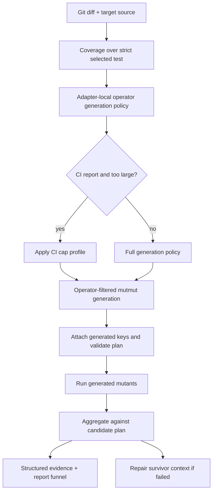
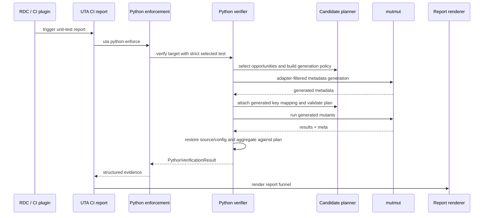
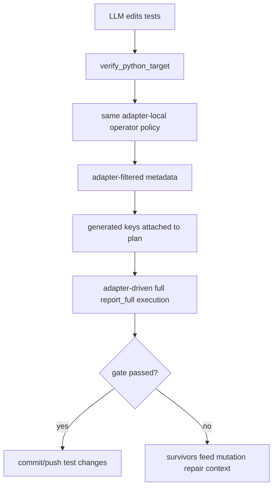
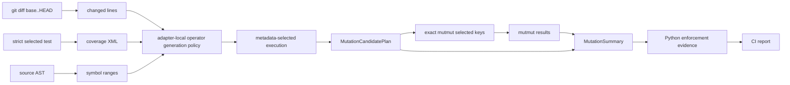

# Design: Practical Python Mutation Scalability

## Table Of Contents

1. [Changelog](#1-changelog)
2. [Goals And Non-Goals](#2-goals-and-non-goals)
3. [High-Level Design](#3-high-level-design)
4. [Scope And Decisions](#4-scope-and-decisions)
5. [Contracts And Data Model](#5-contracts-and-data-model)
6. [Process And Control Flow](#6-process-and-control-flow)
7. [Repo Detail: unit-test-agent](#7-repo-detail-unit-test-agent)
8. [Capacity, Reliability, And Security](#8-capacity-reliability-and-security)
9. [Failure-Mode Handling](#9-failure-mode-handling)
10. [Rollout Plan And Strategy](#10-rollout-plan-and-strategy)
11. [Verification Plan](#11-verification-plan)
12. [Design Review Notes](#12-design-review-notes)
13. [Appendix A: Mutmut Generated-Module Parse Bottleneck (Investigation 2026-06-22)](#13-appendix-a-mutmut-generated-module-parse-bottleneck-investigation-2026-06-22)

## 1. Changelog

- 2026-06-22: Initial design for deterministic Python mutation candidate planning, candidate filtering, CI cap profiles, and report evidence.
- 2026-06-22: Added CI/repair parity and determinism rules: repair recomputes the plan from current inputs and uses persisted report evidence only as a comparison anchor.
- 2026-06-22: Reworked Python filtering design after mutmut v2/v3 research. Python3/mutmut 3 uses UTA-owned adapter-filtered generation plus line-mapped metadata evidence for the decisive gate. Python2 remains on the current `mutmut==1.5.0` legacy lane and does not claim mutmut2 or mutmut3 semantics.
- 2026-06-22: Clarified the Python3 rollout: UTA materializes only adapter-selected mutmut metadata, then invokes CLI scoring over that generated set; selected-key CLI filtering is not the scalability mechanism.
- 2026-06-22: Collapsed `MutationStaticPrePlan` and `MutationCandidatePlan` into one public `MutationCandidatePlan` contract. The adapter-local `OperatorGenerationPolicy` is serialized only as a fingerprint/artifact for debugging.
- 2026-06-22: Addressed accepted design-review findings: split opportunities from generated candidates, made verifier context inputs explicit, added engine suppression categories, named config/rollback knobs, and recorded Python2 as mutmut 1.5.0.
- 2026-06-22: Clarified that selection and deterministic caps happen before mutmut generation. Generated mutmut keys are attached afterward only to validate adapter output and provide auditable evidence, not to drive a second execution filter.
- 2026-06-22: Renamed engine evidence fields from mutmut-specific names to language-neutral `mutationTool*` names; no compatibility aliases are kept because this feature is still pre-release.
- 2026-06-22: Added Appendix A documenting the profiled root cause of the node2 100%-CPU mutmut hang (CPython tokenizer `strncpy`/`strlen` on the single oversized generated module), the cross-CPython-version test showing an interpreter upgrade does not fix it, why the 1000-mutant hardcap does not bound the real cost, and where the design is currently stuck.
- 2026-06-23: Extended Appendix A with the parse-cost scaling/chunking evidence (§13.7), the chosen mitigation — function-granular batched generation at the pre-generation policy adapter (§13.8) — and the collision analysis for batched generation (§13.9, module-import vs mutant-key collisions and how whole-function partitioning avoids both).

## 2. Goals And Non-Goals

### 2.1. Goals

1. Make Python `mutmut` verification practical for large diffs by reducing the mutation set before execution.
2. Keep CI report enforcement and repair-session verification on the same candidate planning, arid suppression, test selection, and mutmut exact-mutant execution logic.
3. Add one exact mutmut operator candidate per changed line before mutmut execution.
4. Add a deterministic CI-only cap profile inside the adapter generation policy when the selected mutation set is too large.
5. Make mutation reruns deterministic for the same repo/base/head/target/test/runtime/config inputs.
6. Show a report-visible mutation funnel: changed lines, eligible candidates, suppressed candidates, selected-before-cap candidates, generated candidates, cap-trimmed candidates, scored candidates, killed, survived, no-tests, timeout, and suspicious.

### 2.2. Non-Goals

1. No Java Maven/test-enforcer behavior change. Java is regression scope only.
2. No Python mutation gate threshold change.
3. No DB migration. Evidence changes are additive JSON fields in existing task/report payloads.
4. No new mutation library or runtime dependency.
5. No long-lived mutmut fork. Python3 uses one UTA-owned mutmut 3 adapter contract for generation-time filtering and metadata evidence. Python2 remains on the existing mutmut 1.5.0 legacy lane and reports a distinct filter mechanism.
6. No model/provider fallback change.

## 3. High-Level Design

UTA will introduce one shared `MutationCandidatePlan` evidence contract in the engine layer. Python verification will ask the Python mutmut adapter to build that plan before executing mutants. For Python3/mutmut 3, UTA will not use stock `mutmut run` as the primary path because stock mutmut generates broadly before exact-name filtering. Instead, UTA will run mutmut through a UTA-owned adapter that applies line eligibility and operator-per-line selection inside mutmut's generation path.

There is one public plan state:

1. `MutationCandidatePlan`: pre-generation line/operator opportunities plus generated tool-key evidence after the Python adapter validates emitted mutmut metadata against the selected opportunities.

The adapter may build an internal `OperatorGenerationPolicy` while producing the plan. That policy is an implementation detail serialized as a fingerprint/artifact for debugging; it is not a separate engine-level plan type.

The `report_full` candidate plan is produced as follows:

1. collect changed executable production lines;
2. map them to Python symbols and candidate mutation opportunities;
3. suppress arid/low-value candidates with reason codes;
4. select one exact operator candidate per eligible changed line with the deterministic policy;
5. apply the active deterministic cap profile before generation;
6. build an adapter-local operator generation policy;
7. run mutmut 3 metadata generation through the adapter so only selected/capped opportunities are emitted;
8. attach each generated tool key to the planned source line, operator family, symbol, and diff metadata, then validate the generated set;
9. produce a stable candidate plan id;
10. execute mutmut over the adapter-generated mutant set without a second selected-key filter;
11. aggregate adapter-filtered mutmut results against the same candidate plan.

CI report enforcement and repair-session verification both use this candidate planning path. CI report enforcement applies one deterministic report-wide CI cap if the aggregate selected candidate count exceeds the configured runtime budget. The cap is stratified across targets, symbols, and operators and is never reset for each target. Repair and nightly/manual full verification use the larger full cap profile by default.



## 4. Scope And Decisions

### 4.1. Scope Table

| Area | Interface / Module | In Scope? | Decision | Reason |
| --- | --- | --- | --- | --- |
| Candidate planning | `uta/engine/mutation_candidates.py` | Yes | Add shared `MutationCandidatePlan` contract, ids, fingerprints, and deterministic ranking helpers. | Prevent CI and repair drift while letting language adapters own tool-specific plan construction. |
| Suppression categories | `uta/engine/mutation_suppression.py`, `uta/language/python/mutation_candidates.py` | Yes | Add engine-owned reason-code taxonomy with Python AST bindings. | Keeps low-value/arid suppression reusable and reportable without scattering Python-only conditionals. |
| Python mutmut verification | `uta/language/python/verification/runner.py` | Yes | Add candidate-plan-driven generation filtering, line mapping, and evidence on top of changed-line scoping. | This is where mutmut runtime and nondeterministic denominator drift originate. |
| Python enforcement aggregation | `uta/language/python/enforcement.py` | Yes | Aggregate `candidatePlan` fields from target summaries. | Reports and validators need the same denominator and cap evidence. |
| Python repair loop | `uta/language/python/batch.py` | Yes | Pass full-cap mode into verification and do not apply the CI cap profile by default. | Repair must verify against the larger full cap, not the faster CI cap. |
| CI report rendering | `uta/api_trigger/reporting.py`, `uta/api_trigger/templates/report.html` | Yes | Add mutation funnel and non-comparable rerun notes. | Users must see exactly what was skipped, selected, cap-trimmed, and scored. |
| Dev-skills local gate | `/path/to/dev-skills/scripts/uta_dev_gate.py`, `/path/to/dev-skills/references/test-enforce-usage.md` | Yes, when implementation changes output/semantics | Sync embedded Python enforcement and usage guide if behavior changes. | Local dev and CI must share enforcement semantics. |
| Java PIT path | `uta/language/java/**`, `uta/graph/nodes.py` | Regression only | Do not change Java mutation behavior in this design. | Java already has Maven/test-enforcer diff gating; this design targets Python mutmut cost. |
| Task DB schema | `uta/tasks/db.py` | No | No schema migration. | Evidence is stored in existing JSON result payloads. |
| OpenCode/model fallback | `uta/opencode/**` | No | No change. | Mutation runtime reduction is independent from LLM behavior. |

### 4.2. Key Decisions

1. We will add a shared engine-level candidate plan contract and use it from both CI report enforcement and repair-session verification.
2. We will use UTA-owned mutmut 3 adapter-filtered generation as the decisive operator-level gate. Mutmut config overlay remains only for paths, test selection, copy/import compatibility, and runner setup.
3. We will implement one exact mutmut operator per eligible changed line in candidate planning, before mutmut execution.
4. We will implement CI bounding as a deterministic generation-policy cap, not as sampling, a post-generation execution filter, or a different planner.
5. We will fingerprint the candidate plan and cap profile so reruns can prove comparability.

ADR: [ADR-001: Shared Python Mutation Candidate Plan](decisions/ADR-001-python-mutation-candidate-plan.md).

## 5. Contracts And Data Model

### 5.1. Engine Contracts

New module: `uta/engine/mutation_candidates.py`.

```python
@dataclass(frozen=True)
class MutationVerificationContext:
    repo_url: str
    base_ref: str
    base_commit: str
    head_commit: str
    target_id: str
    source_path: str
    selected_test_paths: tuple[str, ...]
    runtime_fingerprint: str
    dependency_fingerprint: str
    mutation_tool_version: str
    selected_test_policy_version: str
    operator_policy_version: str
    suppression_policy_version: str
    mutation_tool_api_fingerprint: str
    candidate_plan_config_fingerprint: str
    policy_mode: Literal["report_full"]
    use_ci_cap_profile: bool

@dataclass(frozen=True)
class MutationOpportunity:
    language: str
    source_path: str
    line: int
    line_span: tuple[int, int]
    symbol: str
    opportunity_id: str
    operator_name: str
    family_hint: str
    diff_hunk: str
    operator_priority: int
    roi_score: float
    selection_rank: tuple
    covered: bool
    executable: bool
    selection_reason: str

@dataclass(frozen=True)
class MutationCandidate:
    opportunity: MutationOpportunity
    candidate_id: str
    tool_candidate_key: str
    score: float

@dataclass(frozen=True)
class SuppressedMutationOpportunity:
    opportunity: MutationOpportunity
    reason_code: str
    reason: str

@dataclass(frozen=True)
class MutationSamplingLayer:
    # Compatibility field only; disabled for cap-based planning.
    enabled: bool
    strategy: str
    threshold: int
    limit: int
    selected_candidate_ids: tuple[str, ...]

@dataclass(frozen=True)
class MutationCandidatePlan:
    language: str
    target_id: str
    source_path: str
    policy_mode: Literal["report_full"]
    candidate_plan_id: str
    changed_lines: tuple[int, ...]
    executable_changed_lines: tuple[int, ...]
    covered_changed_lines: tuple[int, ...]
    eligible_opportunities: tuple[MutationOpportunity, ...]
    suppressed: tuple[SuppressedMutationOpportunity, ...]
    report_full_selected: tuple[MutationCandidate, ...]
    active_selected: tuple[MutationCandidate, ...]
    omitted_by_one_per_line: tuple[MutationOpportunity, ...]
    suppression_by_reason: Mapping[str, int]
    sampling_layer: MutationSamplingLayer
    filter_mechanism: Literal[
        "mutmut3_metadata_selected_execution",
        "mutmut15_legacy_changed_line_scope",
        "mutation_not_supported_for_runtime",
    ]
    generation_policy_artifact: str | None
    generation_policy_fingerprint: str
    exact_tool_candidate_keys: tuple[str, ...]
    planner_version: str
    arid_rule_version: str
    test_selection_policy_version: str
    suppression_policy_version: str
    operator_policy_version: str
    mutation_tool_api_fingerprint: str
    mutation_tool_config_fingerprint: str
    effective_cap_config: Mapping[str, int | bool | str]
    runtime_fingerprint: str
    dependency_fingerprint: str
```

The `active_selected` field is the adapter-generated candidate set after the active cap profile. Repair/nightly/manual full verification uses the larger full cap profile; CI report enforcement uses the smaller CI cap profile.

`MutationOpportunity` is a pre-generation record and does not require a mutmut key. Suppressed and omitted-by-one-per-line records use `opportunity_id`. `MutationCandidate` is a generated/scored record and requires `tool_candidate_key`, the language-tool native id. For Python3/mutmut 3 this is the exact generated mutmut mutant name, for example `pkg.module.x_func__mutmut_4`. The engine contract treats it as opaque; the Python adapter owns mapping it to mutmut metadata and execution. In the Python2/mutmut 1.5.0 legacy runtime, `filter_mechanism` must be `mutmut15_legacy_changed_line_scope`, `exact_tool_candidate_keys` must be empty unless the adapter can prove equivalent semantics, and the verifier must not report mutmut2 or mutmut3 exact-key-per-line semantics.

### 5.2. Candidate IDs And Plan IDs

Opportunity ids must be stable across reruns:

```text
sha256(language | source_path | line | symbol |
       operator_name | normalized_source_line | normalized_diff_hunk)
```

Generated candidate ids must be stable across reruns:

```text
sha256(opportunity_id | tool_candidate_key | mutation_tool_api_fingerprint)
```

Candidate plan id must be stable across comparable runs:

```text
sha256(repo_url | base_commit | head_commit | target_id | source_path |
       selected_test_paths | runtime_fingerprint | dependency_fingerprint |
       mutation_tool_version | policy_mode | report_full_candidate_ids |
       exact_tool_candidate_keys | cap_profile | planner_version |
       arid_rule_version | test_selection_policy_version |
       suppression_policy_version | operator_policy_version |
       mutation_tool_api_fingerprint |
       mutation_tool_config_fingerprint | effective_cap_config |
       roi_policy_fingerprint)
```

The design intentionally excludes mutmut execution order and filesystem traversal order.

### 5.3. Python Evidence Additions

`MutationSummary.as_dict()` will add:

```json
{
  "candidatePlan": {
    "candidatePlanId": "...",
    "policyMode": "report_full",
    "samplingLayer": {"enabled": false},
    "generationPolicy": {"capProfile": "ci", "omittedByCap": 750},
    "changedLines": 1032,
    "executableChangedLines": 980,
    "coveredChangedLines": 950,
    "eligibleMutationCandidates": 8305,
    "eligibleMutationOpportunities": 8305,
    "reportFullSelectedCandidates": 950,
    "selectedCandidates": 200,
    "omittedByOnePerLine": 7355,
    "suppressedCandidates": 42,
    "suppressionByReason": {"low_value_logging": 18},
    "filterMechanism": "mutmut3_metadata_selected_execution",
    "adapterFilteredGenerationApplied": true,
    "selectedKeyExecutionApplied": false,
    "exactToolCandidateKeyCount": 200,
    "candidatePlanArtifactPath": ".uta_cache/python/mutation/<plan>.json",
    "reportFullCandidateIds": ["..."],
    "activeCandidateIds": ["..."],
    "activeToolCandidateKeys": ["..."],
    "plannerVersion": "python-mutation-candidates-v1",
    "aridRuleVersion": "python-arid-rules-v1",
    "testSelectionPolicyVersion": "python-strict-test-selection-v1",
    "suppressionPolicyVersion": "python-suppression-v1",
    "operatorPolicyVersion": "python-operator-priority-v1",
    "roiPolicyFingerprint": "none",
    "mutationToolApiFingerprint": "mutmut3.3.1:file_mutation-v1",
    "mutationToolConfigFingerprint": "...",
    "effectiveCapConfig": {"profile": "ci", "maxSelected": 200},
    "mutationToolVersion": "3.3.1",
    "runtimeFingerprint": "...",
    "dependencyFingerprint": "..."
  }
}
```

Aggregate enforcement evidence will preserve target-level candidate plan summaries and roll up the counts into `evidence.mutation.candidatePlan`.

The report/CI record must persist enough target-level data to compare a later repair run even when `.uta_cache` is gone:

1. `candidatePlanId`;
2. `generationPolicyFingerprint`;
3. `reportFullCandidateIds`;
4. `activeCandidateIds`;
5. `activeToolCandidateKeys`;
6. fingerprints and policy versions listed above;
7. the artifact path as a convenience pointer only.

The local `.uta_cache/python/mutation/<plan>.json` artifact remains useful for debugging, but it is not the source of truth for CI/repair parity.

### 5.4. API And Schema Changes

1. Public CLI output is additive: Python evidence markers add candidate-plan summary lines.
2. CI report HTML adds a Python mutation funnel section when `candidatePlan` exists.
3. Existing JSON consumers remain compatible because existing fields (`generated`, `killed`, `survived`, `rate`, `changedLineMutantsScored`, `sampling`) remain.
4. No DB schema changes.
5. Canonical target evidence must keep the existing scalar fields and add `candidatePlan` as a nested block. Aggregates derive their totals from target-level `candidatePlan` blocks; they must not recalculate denominators from raw mutmut metadata.
6. A zero generated/scored mutation result is valid only when the candidate plan proves there were no eligible operator candidates after coverage/arid suppression. If changed executable covered lines exist but exact-key enumeration fails or returns no keys without suppression reasons, the verifier reports a tool/planner failure rather than a pass.
7. Validator compatibility:
   - legacy evidence without `candidatePlan` keeps the existing validation rules;
   - new evidence with `candidatePlan` validates zero scored candidates only under the no-eligible-candidates or reason-suppressed condition;
   - aggregate validators derive pass/fail from target-level candidatePlan validity, not from aggregate raw mutmut counts alone.

## 6. Process And Control Flow

### 6.1. CI Report Enforcement Flow



### 6.2. Repair-Session Verification Flow

Repair uses the same verifier and the same candidate planning path. The only difference is that repair uses the larger full cap profile by default.

When a repair session starts from a CI report that already has `candidatePlan`, repair will use the persisted target-level report evidence as a comparison anchor, not as the source of selection. It may load the local artifact path only for debugging. It will rebuild the plan from the current workspace using the current `MutationVerificationContext` inputs, compare `report_full_selected.candidate_id` and `tool_candidate_key`, and classify differences.

`run_python_enforcement` constructs `MutationVerificationContext` from repo URL, base ref, base/head commits, strict selected tests, runtime/dependency fingerprints, mutation-tool version, selected-test policy, operator policy, suppression policy, mutation-tool API fingerprint, and candidate-plan config fingerprint. Repair reconstructs the same context from persisted CI evidence plus current workspace fingerprints. If branch head, runtime, dependency, selected-test policy, operator policy, suppression policy, mutation-tool API fingerprint, or candidate-plan config changed, the rerun continues with `comparable=false`.

1. Same fingerprints and same selected tests/keys: comparable rerun, proceed normally.
2. Changed fingerprinted input, such as branch head, dependency/runtime/config, selected-test policy, or cap profile: continue repair against the current branch and mark `comparable=false`.
3. Same fingerprints but different selected tests/keys: fail as a UTA determinism bug.

Repair must not silently use a different test file, changed-line set, or operator set without either a fingerprint explanation or a determinism-bug failure.



### 6.3. Candidate Plan Builder Control Flow

1. Normalize changed lines for `source_path`.
2. Read coverage XML and compute covered executable changed lines.
3. Parse Python AST to map changed lines to enclosing function/class/module symbol.
4. Apply arid suppression rules and build the adapter-local `OperatorGenerationPolicy`.
5. Rank eligible static operator opportunities with the versioned operator-selection policy in section 6.7.
6. Select one operator opportunity per changed line for `report_full`.
7. Apply the active cap profile before metadata generation. CI report enforcement uses the smaller CI cap profile; repair/nightly/manual full verification uses the larger full cap profile.
8. Materialize mutmut metadata through the mutmut Python API under the adapter generation policy, without generating broad whole-file mutants or running broad mutant tests.
9. Attach exact mutmut keys to the selected changed-line candidates, validate every generated key maps to a planned opportunity, and produce the `MutationCandidatePlan` artifact/id.
10. Return adapter-generated exact tool keys as evidence, not as a second execution filter.

### 6.4. Mutmut 3 Adapter-Filtered Generation Control Flow

The rollout Python3 path uses a UTA-owned mutmut adapter hook during metadata generation. The adapter applies the `OperatorGenerationPolicy` before mutmut emits metadata, so mutmut never creates the broad whole-file mutant set in candidate-plan mode. The verifier must not invoke broad unkeyed `mutmut run` in candidate-plan mode.

1. Build an adapter-local `OperatorGenerationPolicy` from changed lines, coverage, symbol ranges, arid suppression, and deterministic operator ranking.
2. Apply generation caps as deterministic truncation, not as a terminal verifier failure. The policy records `truncated`, `truncationReasons`, pre-cap counts, post-cap selected lines, and omitted-by-cap counts.
3. Run mutmut metadata generation through the adapter so only policy-selected lines/operators are emitted into `mutants/<source>.meta`.
4. Attach generated keys to selected changed-line opportunities using the adapter sidecar metadata, such as `line_by_key`, or an equivalent mutmut metadata field.
5. Run mutmut over the adapter-generated metadata set without passing exact keys as a second execution filter.
6. Score only generated candidates; non-selected same-line opportunities are reported as `omittedByOnePerLine`, and cap-trimmed opportunities are reported as `omittedByCap`.
7. Write `filterMechanism=mutmut3_metadata_selected_execution` for compatibility, plus the generation policy artifact/fingerprint and the generated key list. The value now denotes adapter-filtered generation plus unkeyed execution over the generated set.

The adapter must fail closed if it cannot map generated keys back to selected candidate metadata. It must not emit or report broad stock mutmut output as a narrow generated-candidate denominator.

### 6.5. Concrete Mutmut Adapter Points

The rollout design is based on mutmut 3 metadata that UTA can read after adapter-filtered metadata generation:

1. `mutants/<source>.meta` is the source of native mutmut keys and execution status.
2. The adapter requires key-to-line metadata, such as `line_by_key`, `mutations_by_key`, or an equivalent structure. Missing line mapping for eligible changed lines is a verifier failure.
3. The adapter emits only selected static opportunities and then maps generated keys back to those planned opportunities for validation.
4. The decisive score comes from mutmut execution over the adapter-generated candidate set, not from broad stock generation or post-hoc filtering.
5. The adapter records `mutationToolApiFingerprint` from mutmut version and metadata shape. If mutmut metadata is incompatible, fail closed or use the explicit legacy mechanism.

### 6.6. Python2 / Mutmut 1.5.0 Legacy Path

Python2 currently uses `mutmut==1.5.0` in UTA. This design preserves that lane rather than migrating it to mutmut2.

1. The Python2 lane keeps the existing `mutmut==1.5.0` requirement.
2. It may keep the current changed-line scope/mask and post-filter evidence.
3. It must report `filterMechanism=mutmut15_legacy_changed_line_scope`.
4. It must not report mutmut2 `mutmut_config.py` behavior or mutmut3 exact-key-per-line behavior.

Mutmut2 does support `mutmut_config.py`, patch-file scoping, and mutation-type filters, but moving Python2 from mutmut 1.5.0 to mutmut2 is out of scope for this design and requires a separate compatibility proof.

### 6.7. Operator Selection Policy

For each eligible changed line, the planner chooses exactly one exact mutmut key using a fully deterministic ranking tuple. Persisted CI report evidence is not used to choose the key; it is used only to compare a later repair/rerun against the recomputed plan.

Operator family is derived from the mapped source/diff metadata:

| Priority | Family | Examples | Rationale |
| --- | --- | --- | --- |
| 100 | Decision/control predicates | Boolean operator changes, comparison changes that affect an `if`, loop, guard, comprehension filter, or conditional expression. | Highest behavioral leverage; usually controls path selection. |
| 90 | Behavioral expression effects | Return expression changes, call argument changes, arithmetic operators, comparison operators, exception/control effects. | Directly changes observable output or control. |
| 80 | Behavioral literals and containers | Numeric/string/bool literal changes, collection membership/shape changes inside executed behavior. | Common source of boundary and data-shape bugs. |
| 60 | Value propagation | Assignment/value propagation changes that are not pure config/constants. | Useful but often less directly observable. |
| 20 | Unknown executable operator | Exact mutmut key is mapped to covered executable changed code, but family is unknown. | Keep conservative behavior without making unknowns dominant. |
| suppressed | Arid/low-value | Logging, tracing, metrics, import-only glue, pure config/constants, generated/framework registration glue. | Suppressed before ranking with reason codes. |

The rank tuple is:

```text
(
  -operator_priority,
  -roi_score,
  source_path,
  line,
  symbol,
  operator_name,
  normalized_diff_hunk,
  tool_candidate_key,
  candidate_id
)
```

`roi_score` defaults to `0.0`. It can be non-zero only when loaded from a versioned immutable ROI policy snapshot whose fingerprint is included in `candidatePlanId`. The planner must not read live mutable history, current report outcomes, or repair-session progress when selecting the candidate for a line.

Determinism rules:

1. The same immutable inputs and policy fingerprints must produce the same selected key list even with no previous CI report.
2. A repair session triggered from a CI report recomputes the plan and compares it to persisted evidence. It does not replay persisted selected keys as the source of truth.
3. If recomputation differs from persisted evidence and a fingerprinted input changed, continue the verification and mark `comparable=false`.
4. If recomputation differs from persisted evidence and no fingerprinted input changed, fail as a UTA determinism bug.
5. Hard caps cut inside the generation policy over the sorted selected opportunity list with deterministic operator priority and stable hash tie-breakers.

## 7. Repo Detail: unit-test-agent

### 7.1. Changes In This Repo

| Path | Change |
| --- | --- |
| `uta/engine/mutation_candidates.py` | New shared dataclasses, deterministic plan id helper, exact-key-per-line selector, and generation-policy cap evidence. |
| `uta/language/python/mutation_candidates.py` | New Python adapter that maps generated mutmut keys to source line/operator/diff metadata. |
| `uta/language/python/verification/runner.py` | Build candidate plans from mutmut metadata, use candidate-plan-driven generation filtering, add plan artifacts and evidence to `MutationSummary`. |
| `uta/language/python/enforcement.py` | Aggregate candidate-plan counts and include candidate plan in console markers. |
| `uta/language/python/batch.py` | Ensure repair verification uses the full cap profile by default. |
| `uta/api_trigger/reporting.py` | Shape `candidatePlan` evidence for report templates and non-comparable rerun messages. |
| `uta/api_trigger/templates/report.html` | Render Python mutation funnel and cap-trimming details. |
| `uta/config.py` | Keep legacy sampling env aliases mapped to CI cap settings without retaining sampling behavior. |
| `tests/test_python_verification.py` | Candidate planner, adapter-filtered generation, exact-key-per-line evidence, deterministic rerun tests. |
| `tests/test_python_enforcement.py` | Aggregation, evidence marker, generation-policy cap tests. |
| `tests/test_api_trigger*.py` | Report rendering tests for mutation funnel. |
| `/path/to/dev-skills/scripts/uta_dev_gate.py` | Sync only if embedded Python enforcement script/output changes in implementation. |
| `/path/to/dev-skills/references/test-enforce-usage.md` | Sync local-dev Python enforcement guidance when report/CLI wording or mutation evidence semantics change. |

### 7.2. Data Dependency Flow



### 7.3. Key Control Flow

1. Coverage still gates before mutation. If coverage fails, mutation is skipped as today.
2. Candidate planning is built only after coverage succeeds because covered changed lines are a planner input.
3. Adapter-local generation policy suppresses low-value/arid candidates before mutmut generation.
4. Candidate planning maps exact mutmut keys from metadata and applies one exact mutmut operator per eligible changed line before caps.
5. CI cap profile is active only when the CI path requests the CI cap profile.
6. Repair verification uses the full cap profile.
7. Mutation score uses `scoredMutants` from the adapter-generated set.
8. A candidate plan mismatch across reruns is handled by fingerprint classification: changed fingerprint means continue with `comparable=false`; unchanged fingerprint means fail as a UTA determinism bug.
9. A mutation pass with zero scored candidates is allowed only when the candidate plan has zero eligible exact operator candidates or all candidates were suppressed with reason codes. Missing mutmut metadata is a verifier failure.

### 7.4. Repo-Local Tradeoffs

1. We will use UTA-owned mutmut 3 adapter-filtered generation plus line-mapped metadata rather than pragma-only masking, selected-key CLI filtering, or mutmut config/dynamic hooks.
   - Considered pragma-only masking; rejected because it can choose lines but cannot bound multiple operators generated on one changed line.
   - Considered mutmut 3 config filtering and mutmut 2 `mutmut_config.py`; rejected for the primary path because keeping multiple policy paths would reintroduce CI/repair drift and version-specific behavior. Python2 remains on the current mutmut 1.5.0 lane.
2. We will add an engine candidate-plan contract and deterministic helper policy rather than keeping evidence shape inside Python verification.
   - Rejected Python-only evidence because report, repair, and future languages need one contract; language adapters still own tool-specific plan construction.
3. We will keep CI bounding as generation-policy cap evidence rather than a planner mode.
   - Rejected separate `ci_bounded` mode because previous bugs came from CI and repair selecting different test/mutation evidence.

### 7.5. Dev-Skills Sync Acceptance Criteria

If implementation changes Python enforcement evidence semantics or report wording, `/path/to/dev-skills` must be updated in the same slice:

1. `scripts/uta_dev_gate.py` must read `mutation.candidatePlan` when present.
2. It must accept zero scored/generated mutation only when candidatePlan proves no eligible exact candidates or all candidates were reason-suppressed.
3. It must continue to apply legacy validation for evidence without candidatePlan.
4. It must use persisted report evidence fields, not `.uta_cache`, when validating candidate-plan parity.
5. `references/test-enforce-usage.md` must describe deterministic caps, exact-key generated mutants, zero-no-eligible semantics, and the fact that coverage still gates all executable changed lines.
6. Dev-skills tests must cover candidatePlan-aware pass/fail, zero-no-eligible pass, exact-key denominator wording, and legacy evidence compatibility.

## 8. Capacity, Reliability, And Security

### 8.1. Capacity

No RPC or DB fan-out is added.

Runtime budget:

| Phase | Cost Model | Budget / Bound | Notes |
| --- | --- | --- | --- |
| Generation policy build | O(file AST nodes + changed lines + coverage rows) | Less than 5 seconds per target for 1,000 changed lines on node2-class hardware. | Adapter-local step before mutmut metadata generation. |
| Mutmut metadata generation | Mutmut Python API metadata generation under changed-line scope | Hard timeout uses `python_mutation_adapter_generation_timeout_seconds`. | This materializes metadata only; broad mutant test execution is not invoked. |
| Exact-key mapping | O(generated operator candidates) in process | Less than 10 seconds per target for 1,000 generated operator candidates; no per-candidate `mutmut show` shell-out. | Use mutmut metadata plus bounded internal diff/source mapping. |
| Adapter-generated execution | Mutmut execution over the generated mutant set in the same workspace | Selected strict test clean run target less than 30 seconds; per-mutant runner timeout prevents one mutant from consuming the full target budget. | This is the denominator used by the gate. |
| CI capped execution | O(report-wide capped generated candidates × selected test runtime) | Existing rollout starts with one report-wide `python_mutation_generation_ci_max_selected=300` budget; legacy sampling env names remain aliases to CI caps. `python_mutation_max_children=2` on node2 unless overridden. | The deterministic representative selector distributes the shared budget across targets, symbols, and operators before per-target generation. |
| Repair/full execution | O(full-cap generated candidates × selected test runtime) | Uses the larger full cap by default; repair may take longer but uses the same plan; per-target hard timeout remains configurable and report-visible. | If too slow, repair optimization belongs in mutation repair planner, not in weakening CI caps. |

CI wall-clock SLOs for rollout:

1. For a large-diff Python report with CI cap trimming active, the aggregate mutation phase should finish within 5 minutes on node2 and must time out by 8 minutes with a clear phase label.
2. A CI report must never select or run more mutants than its report-wide configured budget; per-target setup time remains separately visible.
3. A node2 staged rollout is not considered passing until a real large-diff Python CI report shows phase timings for metadata generation, setup, exact-key mapping, and generated-mutant execution, and the total CI mutation phase is under the 8-minute hard timeout.
4. If the hard timeout fires, the report must show whether the timeout was in metadata generation, setup, or generated-mutant execution.

Report evidence must include phase timings for generation-policy build, generation, setup, key mapping, execution, and aggregation so node2 runs can prove where time is spent.

Repair creation treats a failed sampled aggregate as a trigger for evidence refinement, not as a target list. After refreshing the branch, the Python CI handler runs the same enforcement core with CI sampling disabled and the full deterministic cap enabled. The language-agnostic repair service then consumes that returned evidence normally. A full-cap pass ends the repair session without generation; a full-cap failure creates tasks only for targets that fail in the full evidence.

Config and rollback controls:

| Setting | Env | Default | Purpose |
| --- | --- | --- | --- |
| `python_mutation_candidate_plan_enabled` | `UTA_PYTHON_MUTATION_CANDIDATE_PLAN_ENABLED` | false during rollout, true after staged verification | Feature flag for the new Python3 adapter. |
| `python_mutation_generation_ci_max_changed_lines` | `UTA_PYTHON_MUTATION_GENERATION_CI_MAX_CHANGED_LINES` | 300 | CI cap profile maximum changed lines considered for generated candidates. |
| `python_mutation_generation_ci_max_selected` | `UTA_PYTHON_MUTATION_GENERATION_CI_MAX_SELECTED` | 300 | Report-wide CI cap shared across all changed Python targets. Selection is stratified by target, symbol, and operator, then ranked by a fingerprint of the base commit, planner version, and production mutation-opportunity universe. Test-only HEAD changes do not reshuffle the sample. The CI mutation gate is evaluated only from the report aggregate; per-target sample rates remain diagnostics. |
| `python_mutation_max_children` | `UTA_PYTHON_MUTATION_MAX_CHILDREN` | 2 on node2 | Bound mutmut process fan-out. |
| `python_mutation_adapter_generation_timeout_seconds` | `UTA_PYTHON_MUTATION_ADAPTER_GENERATION_TIMEOUT_SECONDS` | 90 | Bound metadata generation and candidate-plan construction. |
| `python_mutation_selected_execution_timeout_seconds` | `UTA_PYTHON_MUTATION_SELECTED_EXECUTION_TIMEOUT_SECONDS` | existing per-target timeout unless set | Bound generated-mutant execution. |
| `python_mutation_per_mutant_timeout_seconds` | `UTA_PYTHON_MUTATION_PER_MUTANT_TIMEOUT_SECONDS` | 10 | Bound each mutmut runner invocation with wall timeout and POSIX CPU limit where available. |
| `python_mutation_generation_max_source_bytes` | `UTA_PYTHON_MUTATION_GENERATION_MAX_SOURCE_BYTES` | 5,000,000 | Record source-size over-cap evidence for diagnosing expensive adapter planning. |
| `python_mutation_generation_max_changed_lines` | `UTA_PYTHON_MUTATION_GENERATION_MAX_CHANGED_LINES` | 1,000 | Deterministically cap policy-selected mutation lines before mutmut metadata generation. |
| `python_mutation_generation_max_opportunities` | `UTA_PYTHON_MUTATION_GENERATION_MAX_OPPORTUNITIES` | 3,000 | Record static opportunity pressure for report evidence. |
| `python_mutation_generation_max_selected` | `UTA_PYTHON_MUTATION_GENERATION_MAX_SELECTED` | 1,000 | Deterministically cap one-per-line selected candidates before mutmut metadata generation. |

### 8.2. Reliability

1. Source restoration runs in `finally`; failure to restore is a verifier failure.
2. Mutmut state is cleared or namespaced by candidate plan id before execution so stale `mutants/` metadata cannot change scoring.
3. Candidate plan artifacts are persisted under `.uta_cache/python/mutation/`.
4. Candidate ids and plan ids are stable over immutable inputs.
5. Evidence includes runtime/dependency fingerprints so non-comparable reruns can be diagnosed.

### 8.3. Security

1. No new network call, credential, or external service.
2. Report evidence includes paths, counts, and fingerprints, not source contents beyond existing command output.
3. The target repo remains the trust boundary already used by UTA verification. No new privilege is introduced.

## 9. Failure-Mode Handling

| Failure Mode | Detection | Handling | Blast Radius |
| --- | --- | --- | --- |
| Mutant workspace/source contamination | Post-run source checksum mismatch or filtered mutmut workspace contains keys outside the plan | Fail verification, restore/clear generated state, do not report pass. | One target workspace; no committed source change. |
| Candidate plan differs between reruns with changed fingerprint | Candidate plan id mismatch plus branch/runtime/dependency/policy/config fingerprint change | Continue verification, mark `comparable=false`, and show changed fingerprint. | Report clarity only; repair can proceed on changed branch head. |
| Candidate plan differs between reruns without fingerprint change | Candidate plan id mismatch but all fingerprinted inputs match | Fail verification as `uta_determinism_bug` with selected-test/operator-key diff. | One target; prevents silent CI/repair drift. |
| Mutmut cache changes result | Plan id cache namespace mismatch or stale `mutants/` metadata | Clear/namespace mutmut state before run. | Runtime cost increase, not false pass/fail. |
| CI cap trims a survivor | Report marks cap profile and omitted-by-cap counts; nightly/manual full can validate. | CI report remains honest; repair/full verification uses the full cap profile. | Possible delayed detection, bounded by explicit cap evidence. |
| Arid suppression suppresses meaningful line | Reason-coded suppression visible in report and artifacts. | Conservative rules only; full mode can inspect suppressed counts. | Potential false pass for mutation, coverage still enforced. |
| Candidate planner parse failure | AST parse exception or missing coverage XML | Fail verification with a planner/tool error; do not silently pass. | One target. |
| Exact-key mapping failure | Selected key has no source line/operator metadata | Fail closed with a verifier error; do not report a narrow denominator. | One target; prevents false pass. |
| Mutmut adapter executes keys outside the plan | Results include keys outside `active_selected` | Fail verification and show selected-vs-run mismatch. | One target. |
| Zero generated candidates with covered changed code | Candidate plan has covered eligible lines but no exact keys and no suppression reasons | Fail as planner/tool error, not mutation pass. | One target; prevents false pass. |
| Report renderer missing candidate fields | Report tests and backward-compatible defaults | Show old mutation summary plus no funnel rather than crash. | Display degradation only. |

## 10. Rollout Plan And Strategy

1. Implement behind a Python mutation candidate-plan feature flag, defaulting to enabled only after local verification. The flag must be able to disable the new adapter and return to the previous changed-line masking/post-filter behavior during rollback.
2. Add candidate-plan evidence while preserving existing mutation fields.
3. Enable report funnel rendering only when `candidatePlan` exists.
4. Run local unit/integration tests.
5. Run real Python3 repo verification with a large diff.
6. Run Java regression verification.
7. Sync dev-skills Python enforcement and `test-enforce-usage.md` if the embedded local script/output or user-visible guidance changes.
8. Deploy to node2 and run staged CI report plus repair-session verification before production rollout.

Rollback:

1. Disable CI cap trimming by setting CI cap values high enough that no cap is active.
2. Disable `python_mutation_candidate_plan_enabled` / `UTA_PYTHON_MUTATION_CANDIDATE_PLAN_ENABLED` if exact-key planning introduces verifier failures.
3. Existing evidence consumers continue to read old fields.

## 11. Verification Plan

### 11.1. Unit Tests

1. Candidate planner:
   - blank/comment/non-executable changed lines excluded;
   - logging/metrics/tracing calls suppressed with reasons;
   - one exact mutmut key selected per eligible changed line;
   - candidate ids and plan ids stable across reruns;
   - CI caps stable over pre-generation selected opportunities.
2. Python verifier:
   - adapter generation receives the selected opportunity list before the decisive mutation score is calculated;
   - adapter-generated mutmut keys are the only keys scored in the decisive execution;
   - missing line-mapped metadata for eligible changed lines fails the verifier instead of reporting broad output as a narrow denominator;
   - original source restored on success, failure, and timeout;
   - mutmut cache cleared/namespaced by plan id;
   - repair mode uses the full cap profile.
3. Python enforcement:
   - target and aggregate evidence include candidatePlan;
   - denominator uses active scored candidates;
   - zero scored candidates pass only with no eligible exact candidates or reason-coded suppression;
   - repeated immutable inputs produce same verdict and denominator.
4. Report renderer:
   - mutation funnel renders when candidatePlan exists;
   - CI-capped report shows total/selected-before-cap/omitted-by-cap/generated/scored counts;
   - legacy evidence without candidatePlan still renders.

### 11.2. Integration Tests

1. Python3 fixture with many changed lines: CI path uses the smaller cap, repair path uses the larger cap.
2. Python target with log-only changed line: suppression reason visible and coverage still enforced.
3. Re-run same Python target twice: same candidatePlanId, denominator, selected tests, and verdict.
4. Python fixture with two mutmut operators on one changed line: the adapter selects one exact key, runs one exact key, and reports the other as `omittedByOnePerLine`.
5. Repair session from a CI-capped report rebuilds with the full cap profile; changed branch/runtime/config fingerprints continue with `comparable=false`, while unexplained selected-test or exact-key differences fail as a UTA determinism bug.
6. Java regression suite: existing PIT/report tests still pass.

### 11.3. Real Verification

1. Run a large-diff Python repo through CI report enforcement and verify runtime plus report evidence.
2. Trigger a repair session from the same report and verify it uses the same candidate planner with the full cap profile.
3. Run one recent successful Java UTA test to verify no regression.
4. Run local dev-skills Python enforcement and check `test-enforce-usage.md` wording if dev-skills is synced.

## 12. Design Review Notes

### 12.1. First-Principles Check

1. Key goal: make Python mutation gating practical for large diffs while keeping CI and repair mutation evidence deterministic and honest.
2. Simplest right solution: one shared candidate plan plus a CI-only deterministic cap profile; no separate CI/repair verifier logic.
3. Production proof signal: CI reports show candidate funnel counts and repeated same-input reruns keep the same candidatePlanId, denominator, and verdict.
4. Worst case: UTA incorrectly passes a mutation gate by suppressing or cap-trimming too much. Guards: strict coverage still applies, suppression is conservative and reason-coded, CI caps are explicit, repair/full verification uses the full cap profile, and non-comparable reruns are flagged.

### 12.2. Review Status

Latest review findings addressed in this revision:

1. Pragma-only filtering is rejected; exact mutmut-key operator selection is now the decisive mechanism.
2. Exact-key planning is exposed as one `MutationCandidatePlan`; the adapter-local generation policy exists only because mutmut keys do not exist before generation.
3. `MutationVerificationContext` makes candidate-plan inputs explicit.
4. Zero-generated mutation evidence has fail-closed semantics unless the candidate plan proves no eligible exact candidates.
5. Rollback has an explicit Python candidate-plan feature flag.
6. CI report and repair-session verification compare persisted target-level candidate ids, exact tool keys, and fingerprints instead of relying on workspace-local `.uta_cache`.
7. Validator compatibility for legacy evidence, new candidatePlan evidence, and aggregate rollups is explicit.
8. Plan fingerprints now include planner/rule/test-selection/config versions.
9. Dev-skills script and usage guidance sync are both in scope.
10. Runtime budget is split by generation-policy build, mutmut generation/setup, exact-key mapping, capped CI execution, and repair/full execution.
11. Previous design review found no Critical findings. Remaining Important findings were addressed by:
    - choosing the concrete mutmut call sequence: UTA-owned mutmut 3 adapter-filtered generation plus metadata mapping;
    - adding node2 wall-clock SLOs, selected-test runtime assumptions, `max_children` assumption, hard timeout behavior, and rollout pass/fail timing thresholds;
    - adding dev-skills validator and guidance acceptance criteria;
    - splitting `exactToolCandidateKeyCount` from `activeToolCandidateKeys`.
12. 2026-06-22 design review found no Critical findings. Important findings were accepted as `fix now`:
    - split pre-generation `MutationOpportunity` from generated `MutationCandidate`;
    - make `MutationVerificationContext` construction and repair reconstruction explicit;
    - keep Python2 on `mutmut==1.5.0` and document mutmut2 migration as out of scope;
    - add engine suppression-category ownership with Python AST bindings;
    - add explicit feature flag, CI cap aliases, max-children, and timeout settings.

Design review should be rerun only if the mutmut call sequence or evidence contract changes again before planning.

## 13. Appendix A: Mutmut Generated-Module Parse Bottleneck (Investigation 2026-06-22)

This appendix records the profiled root cause of the production mutmut hang on node2
(`worker1.example.com` = `root@10.0.0.11`; 4-core Skylake, 7.5 GiB RAM, **0 swap**,
CPython **3.12.9**), and the experiments that bound where the design is currently stuck. It exists
so future work does not re-derive this from scratch or chase the wrong layer.

### 13.1. Symptom

A single mutmut worker pinned one core at ~100% for ~40 minutes generating/verifying mutations for
one large target file (`react_agent/.../runners/windows_wechat_meituan_runner.py`, ~117 KB / ~3100
lines). On the UTA command timeout the parent was killed and the multiprocessing worker was orphaned
(PPID=1), continuing to burn CPU until manually killed.

### 13.2. Two hypotheses that the evidence falsified

1. **"It is the LibCST combine / generation phase."** False. The generated module was already fully
   written to disk when sampled; combine had finished. Reproduced combine time on node2 is **~131s**.
2. **"It is memory pressure / swap thrash."** False. The host has **0 swap configured**; the
   monitoring dashboard for the hang window showed swap 0% and memory `used` peaking at **5.48 GiB of
   7.5 GiB** (no OOM). The reproduced parse process held a **flat ~1.4 GB RSS**. The bottleneck is
   pure single-core CPU, not memory.

### 13.3. Confirmed root cause: `ast.parse` of one oversized module, in the CPython tokenizer

mutmut 3's "mutation schemata" packs **all** mutants of a file into **one** generated module. Each
mutant is a full copy of its containing function (`mutmut/file_mutation.py::function_trampoline_arrangement`).
Generated size is therefore:

```
generated_bytes ≈ Σ_functions (mutants_in_function + 1) × function_source_size
```

This was verified empirically to within 0.3% (a 400-line function with 3600 mutants → 68.85 MB).
For the real target: **6071 mutants → ~65 M chars → 81.7 MB on disk** (CJK string literals make it
UTF-8 multi-byte), **1,537,802 lines**, avg 41 chars/line, max line 389 chars.

The hang is the **stdlib `ast.parse` validation of that module** (`mutmut/__main__.py`, the
`ast.parse(f.read())` after generation), *not* the LibCST work. Reproduced on node2: parse ran
**>17.5 min at 99% of one core and had not finished** when killed.

A `py-spy --native` profile of the live parse (1999 samples) is unambiguous:

| native leaf frame      | samples | share  |
| ---------------------- | ------- | ------ |
| `__strncpy_avx2` (libc)| 1200    | 60.0%  |
| `__strlen_avx2` (libc) | 769     | 38.5%  |
| `munmap`               | 22      | 1.1%   |
| everything else        | 8       | 0.4%   |

~98.5% of parse CPU is libc string copy + length-scan inside CPython's tokenizer — per-token
source-line string handling. This matches the class of CPython issue **#119118** (3.12 tokenizer
creating a unique line string per token, plus `_PyPegen_byte_offset_to_character_offset` →
`PyUnicode_*`). It is super-linear in module size at this scale: a 32 MB *synthetic* module parses in
~28s (near-linear), but the 81.7 MB *real* module never completes — real code (denser tokens, longer
keyword-dict lines, multi-byte strings) degrades far beyond linear.

### 13.4. A CPython upgrade does NOT fix it (tested)

The same 81.7 MB generated module was parsed under three interpreters (on a Mac faster than node2),
each capped at 480s wall clock:

| CPython   | `ast.parse` of the 81.7 MB module |
| --------- | --------------------------------- |
| 3.12.10   | **TIMEOUT (>480s)**               |
| 3.13.3    | **TIMEOUT (>480s)**               |
| 3.14.0a7  | **TIMEOUT (>480s)**               |

All three remain pathological. 3.12.9/.10 already contain #119118's primary fix, and the newest
stable/alpha lines do not rescue this input. **Therefore an interpreter upgrade is not a viable
mitigation; the only lever is to stop emitting an oversized single module.**

### 13.5. Why the current 1000-mutant hardcap does not bound the real cost

`python_mutation_generation_max_selected` (`uta/config.py:194`, default **1000**; CI cap
`python_mutation_generation_ci_max_selected` default 300) caps **mutant count**. But parse cost is
driven by **generated module bytes**, and from §13.3:

```
generated_bytes ≈ Σ_functions (mutants_in_function + 1) × function_source_size
```

A count cap does **not** bound bytes:

- Bytes scale with `mutants × function_size`. The same 1000 mutants concentrated in one large function
  produce a far larger module than 1000 mutants spread across small functions.
- A single large function copied per mutant dominates: 1000 mutants of a 400-line (~19.5 KB) function
  ≈ a ~19 MB module on its own — already in the slow, super-linear parse regime for real code on the
  node2 interpreter.
- Conversely the cap can over-trim small files where the module would have parsed fine.

So the hardcap is capping the wrong quantity. It reduces the worst case from "never finishes" but does
not give a predictable parse-time ceiling, because it does not control module bytes or the size of the
largest single generated function.

### 13.6. Where we are stuck

The schemata model couples "number of mutants we want to test" to "size of one Python module CPython
must tokenize," and CPython's tokenizer is super-linear on that module with no upstream fix available.
Open problem: bound the **generated-module byte size** (and/or the largest per-function contribution),
not just mutant count, while keeping mutation selection deterministic and the gate honest.

Candidate directions considered:

1. **Byte/size-aware cap.** Replace/augment the count cap with a generated-bytes budget per file
   (estimate `Σ (mutants+1) × function_size`; trim deterministically to a parse-safe size). Caps the
   cost driver but is **lossy** — drops mutants, weakening the gate.
2. **Per-function mutant cap.** Bound mutants-per-function. Also lossy.
3. **Split generation into multiple scoped batches** (§13.8). **Chosen direction** — keeps *all*
   mutants while keeping each generated module in the linear regime. Lossless.
4. **Skip/Sample oversized files** with reason-coded evidence. Acceptable fallback, still lossy.

### 13.7. Parse-cost scaling and chunking evidence

Measured `ast.parse` of valid prefixes of the real generated module (Python 3.12.10), confirming the
cost is **super-linear in the size of a single parse call** (≈ O(n^2.4)):

| prefix | 4 MB | 8 | 16 | 24 | 32 | 48 |
| ------ | ---- | -- | -- | -- | -- | -- |
| parse  | 0.6s | 1.7s | 7.0s | 22s | 51s | 153s |

Controlled experiments isolate the driver: parse time is flat vs **line length** (39→60,000 chars),
flat vs **CJK/multibyte**, and linear vs **function size** and **function count** — every synthetic
stays linear to ~130 MB. Real mutant code only has a higher quadratic coefficient (knee ~16–32 MB), so
the 82 MB module is deep in the quadratic zone. The cost is therefore intrinsic to single-call size,
not to any specific construct.

Because the cost is quadratic in single-call size, **chunking the parse collapses it**. Same 48 MB
content: one parse 150s; 24× 2 MB chunks 12.9s (**11.6× faster**). And generating the file in line
batches and parsing each separately (node2):

| split            | total parse | speedup |
| ---------------- | ----------- | ------- |
| K=1 (one module) | >2400s      | 1×      |
| K=4              | 286s        | ~8×     |
| K=8              | 103s        | ~23×    |

Same 6071 mutants in every case — only the partitioning changes. This is the empirical basis for §13.8.

### 13.8. Chosen mitigation: function-granular batched generation at the pre-generation policy adapter

**Where.** The fix belongs in the pre-generation filtering adapter,
`_write_mutmut_generation_policy` (`uta/language/python/verification/runner.py`), which already emits
`allowedLines`/`selectedLines` driving what mutmut materializes (and is exactly where the oversized
module — and the `ast.parse` hang — is produced). It already has count (`maxSelected`=1000) and
`maxSourceBytes` caps; both are lossy. Nothing downstream can help once the giant module exists.

**Change.** Move from "one capped selection → one generation" to **"select → partition → generate &
score per batch → aggregate"**:

1. Compute selected opportunities as today (`collect_python_mutation_opportunities`).
2. **Partition by whole function**, bin-packing functions into batches under an estimated-generated-bytes
   budget (target ≈ 6–8 MB/batch → ~2s parse each, linear regime). Estimate per function ≈
   `(#selected mutants in function + 1) × function_source_size` — the real cost driver, which also
   handles §13.5 concentration.
3. Write **one policy file per batch** (`allowedLines` = that batch's lines) and loop the existing
   metadata-generation + scoring once per batch. **Run batches sequentially and call
   `_cleanup_mutation_state` between them** (see §13.9).
4. **Aggregate** deterministically: counts (killed/survived/timeout/no-tests) as sums, survivors as
   union, into one candidate plan and verdict.

**Why better than the 1000 cap.** Lossless — every mutant is tested, so no false-pass risk from
cap-trimming. The byte budget bounds the actual cost driver (module bytes), which a count cap does not
(§13.5). Recommendation: make byte-budgeted batching the primary mechanism and keep a count/size cap
only as a final safety bound.

**Determinism.** Partition must be deterministic (stable function order, stable bin-pack). The
candidate-plan fingerprint must include the partition scheme, batch count, and byte budget so reruns
stay comparable — fits the existing aggregate-rollup / `candidatePlanId` model.

**Cost.** Each batch re-runs metadata generation and (in full mode) stats/test-collection; reuse
mutmut's stats cache across batches (same tests) to amortize. Test *execution* is unchanged — the same
mutants, partitioned. Even with per-batch generation overhead, node2 K=8 wall was ~246s vs >40 min.
Bonus: with small batches, mutmut's internal validation `ast.parse` is cheap, so mutmut itself needs no
patch.

### 13.9. Collision analysis for batched generation

Two distinct collisions, with different answers:

1. **Python module import collision — avoided by sequential batches.** mutmut writes every generated
   module to `mutants/<same-relative-path>` with the **same module name** as the source (intentional:
   the mutant module shadows the real import; the trampoline dispatches via `MUTANT_UNDER_TEST`). So
   every batch produces a module at the identical path/name. Sequentially this is safe — each batch is
   its own `mutmut run` that regenerates and tears down `mutants/`. **Required:** run batches
   sequentially and `_cleanup_mutation_state` (wipes `mutants/`, `.mutmut-cache`, `.coverage`) between
   them; do **not** parallelize batches in one workspace (they would clobber the shared `mutants/`,
   `.meta`, and cache) — parallel needs a separate cwd/mutants-root per batch.

2. **Mutant-key collision in aggregation — avoided by whole-function partitioning.** mutmut numbers
   mutants per-function, per-generation, starting at 1 (`function_trampoline_arrangement`:
   `mutant_name = f'{mangled}_{i+1}'`). So `x_run__mutmut_1` means "first mutation of `run()` *in this
   generation*." If a function's lines were split across batches, the same key would denote different
   mutations in different batches. UTA's `make_opportunity_id` is global (hash of
   `language, source_path, line, symbol, operator_name, source_line, diff_hunk`) and `make_candidate_id`
   includes it, so opportunity/candidate ids do **not** collide — but raw tool-key fields
   (`activeToolCandidateKeys`, `exactToolCandidateKeyCount`) **would** conflate.
   - **Fix: partition by whole function** (all of a function's lines in one batch) so each function's
     `__mutmut_1..N` series lives in exactly one batch → tool-keys globally unique → zero collision.
   - **Residual case:** a single function whose estimated bytes alone exceed the budget forces an
     intra-function split. Handle by **namespacing the tool-key by batch** (e.g., `batch{i}:…`) and
     merging on the already-global `opportunity_id`. This is the only case needing more than
     whole-function packing.

### 13.10. Reproduction notes

- Generate the faithful module: run `mutmut.file_mutation.mutate_file_contents` on the target source
  (combine ~131s → 81.7 MB).
- Time the parse: `python -c "import ast; ast.parse(open(F, encoding='utf-8').read())"` — exceeds 480s
  on 3.12/3.13/3.14.
- Profile a live parse: `py-spy dump --native --pid <pid>` / `py-spy record --native --pid <pid>
  --duration 20 --format raw` (leaf frames dominated by `__strncpy_avx2` / `__strlen_avx2`).
- Compounding orphan-leak bug (separate from this parse cost): on UTA command-timeout the parent
  mutmut is killed but the multiprocessing generation worker is reparented to PID 1 and keeps running;
  reap the whole process group on timeout.
