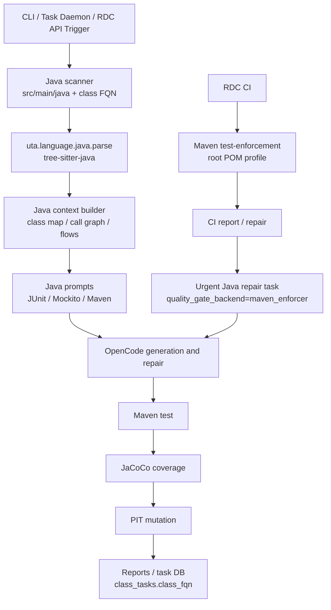
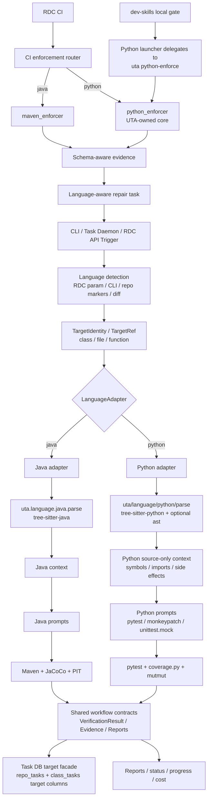
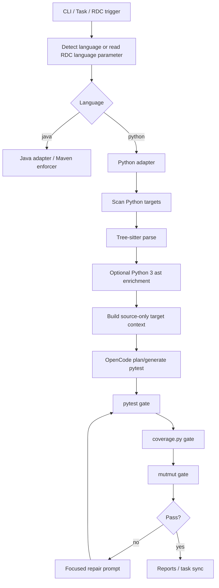
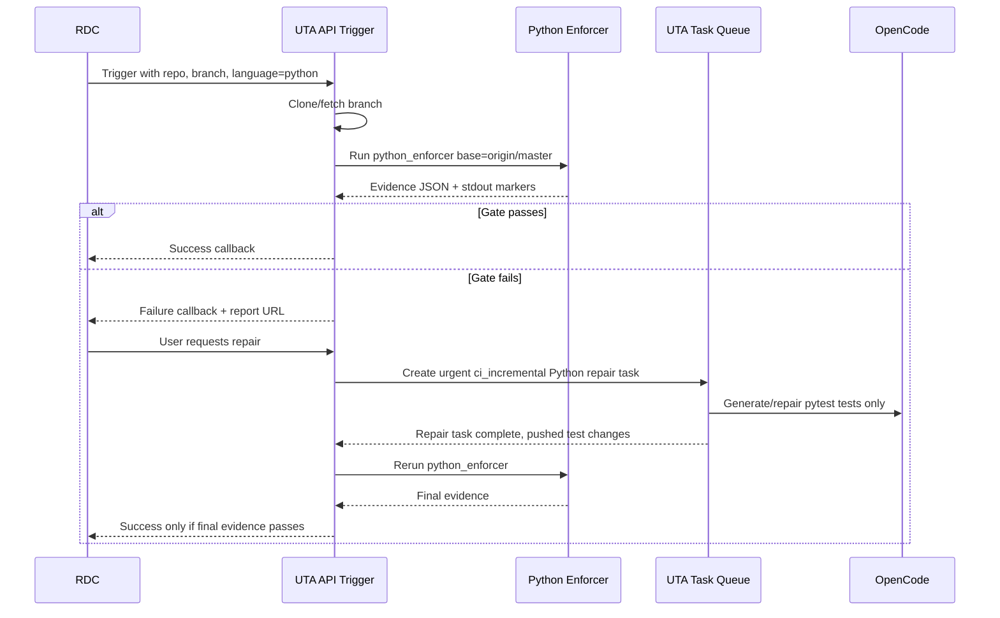

# Design: Python Project Support

Status: Draft for review.

Spec: `docs/spec-python-project-support.md`

Jira status: N/A. This is confirmed non-Jira UTA tool work.

## Table Of Contents

1. [Context](#1-context)
2. [Architecture And Language Abstraction](#2-architecture-and-language-abstraction)
   1. [Architecture Overview](#21-architecture-overview)
      1. [Before: Java-Only Backend](#211-before-java-only-backend)
      2. [After: Language-Aware Backend](#212-after-language-aware-backend)
   2. [Language Abstraction Design](#22-language-abstraction-design)
   3. [Extensibility For A Third Language](#23-extensibility-for-a-third-language)
3. [Scope And Decisions](#3-scope-and-decisions)
   1. [Scope](#31-scope)
   2. [Key Decisions](#32-key-decisions)
4. [Contracts And Data Model](#4-contracts-and-data-model)
   1. [Core Data Model](#41-core-data-model)
   2. [Task DB Schema Change](#42-task-db-schema-change)
   3. [API Changes](#43-api-changes)
5. [Implementation Architecture](#5-implementation-architecture)
   1. [Module Layout](#51-module-layout)
   2. [Existing Script And Query Tool Updates](#52-existing-script-and-query-tool-updates)
   3. [Existing Feature Compatibility Matrix](#53-existing-feature-compatibility-matrix)
   4. [Flow Diagram](#54-flow-diagram)
   5. [CI Incremental Flow](#55-ci-incremental-flow)
6. [Python Enforcement And Runtime](#6-python-enforcement-and-runtime)
   1. [Python Enforcer](#61-python-enforcer)
   2. [Python 2 Runtime And Gate Semantics](#62-python-2-runtime-and-gate-semantics)
7. [Generated Tests And Safety](#7-generated-tests-and-safety)
   1. [Test Placement](#71-test-placement)
   2. [Security And Safety](#72-security-and-safety)
8. [Implementation And Rollout](#8-implementation-and-rollout)
   1. [Implementation Plan](#81-implementation-plan)
   2. [Operation And Rollback Plan](#82-operation-and-rollback-plan)
   3. [Node2 Deployment Instructions](#83-node2-deployment-instructions)
9. [Verification And Observability](#9-verification-and-observability)
   1. [Verification Plan](#91-verification-plan)
   2. [Observability](#92-observability)
10. [Risks And Documentation](#10-risks-and-documentation)
   1. [Risks And Mitigations](#101-risks-and-mitigations)
   2. [Documentation Updates](#102-documentation-updates)

## 1. Context

UTA currently generates and repairs unit tests for Java projects. The current implementation assumes Maven, Java class FQNs, `src/main/java`, JUnit, JaCoCo, and PIT across the CLI, scanner, context builder, prompts, verification, task DB selection, reports, and RDC API trigger.

This design adds Python support alongside Java. It must cover two operating modes:

- Batch UTA tasks: repo-level or target-level generation jobs driven by `uta run`, `uta tasks create`, and the task daemon.
- CI incremental gate and repair: RDC-triggered diff coverage and mutation enforcement for changed Python code, followed by user-requested UTA repair tasks.

The design intentionally keeps deterministic pass/fail decisions in local tools. LLM sessions may plan, generate, and repair tests, but pytest, coverage.py, mutmut, and enforcement evidence decide whether a target passed.

## 2. Architecture And Language Abstraction

### 2.1. Architecture Overview

#### 2.1.1. Before: Java-Only Backend



Key limitation: Java class FQN, Maven, JaCoCo, PIT, `src/main/java`, and Java test paths are embedded across selection, context, prompts, verification, reporting, and CI repair.

#### 2.1.2. After: Language-Aware Backend



Main change: Java and Python share orchestration, task DB, progress, cost, reports, and CI repair contracts, but each backend owns scanning, parsing, context, prompts, verification, and enforcement details behind explicit adapters.

### 2.2. Language Abstraction Design

The abstraction is not “put `if language == "python"` everywhere.” It is a small registry-driven boundary between shared UTA orchestration and language-owned backend implementations.

Shared orchestration owns:

- CLI/task/CI request parsing.
- Language detection and explicit language override handling.
- Target normalization into `TargetRef`.
- Task DB writes through target-compatible helpers.
- Progress events, reports, token/cost accounting, budget enforcement, and task lifecycle.
- CI repair task creation and final pass/fail callback flow.

Language backends own:

- Candidate scanning rules.
- Source parsing and symbol extraction.
- Context building.
- Prompt bundle selection.
- Generated test placement and auto-push allowlist.
- Test, coverage, and mutation command planning.
- Tool-specific evidence parsing.

The shared layer may know the selected language name as data, but should not contain backend-specific behavior except at registration/bootstrap boundaries.

#### 2.2.1. Core Objects

```python
@dataclass(frozen=True)
class TargetRef:
    language: str
    target_id: str
    display_name: str
    granularity: Literal["class", "file", "function", "package", "module"]
    source_path: str | None = None
    symbol: str | None = None
    legacy_class_fqn: str | None = None
```

`TargetRef` is the normalized identity used after CLI parsing, DB reads, scanner output, CI evidence parsing, and repair task creation.

Examples:

```text
TargetRef(language="java", target_id="com.foo.BarService", granularity="class", legacy_class_fqn="com.foo.BarService")
TargetRef(language="python", target_id="pyfile:jobs/a.py", granularity="file", source_path="jobs/a.py")
TargetRef(language="python", target_id="pysymbol:jobs/a.py::parse", granularity="function", source_path="jobs/a.py", symbol="parse")
```

```python
@dataclass(frozen=True)
class LanguageCapabilities:
    supports_function_targets: bool
    supports_branch_coverage: bool
    supports_mutation: bool
    supports_incremental_diff_enforcement: bool
    supports_import_safety_hints: bool
    generated_tests_are_autopushable: bool
```

Capabilities prevent shared code from assuming Java/PIT or Python/mutmut behavior. For this release, Java and Python both declare mutation support. If a future backend lacks mutation, the gate result must follow policy from config, not accidental shared-code behavior.

```python
class LanguageAdapter(Protocol):
    language: str

    def capabilities(self) -> LanguageCapabilities:
        ...

    def detect(self, repo_path: Path, changed_paths: list[str]) -> DetectionSignal:
        ...

    def normalize_target(self, raw: RawTargetSelection) -> TargetRef:
        ...

    def scan_candidates(self, repo_path: Path, selection: SelectionOptions) -> list[TargetRef]:
        ...

    def build_context(self, repo_path: Path, target: TargetRef) -> ContextBundle:
        ...

    def prompt_bundle(self, phase: str, target: TargetRef) -> PromptBundle:
        ...

    def generated_test_policy(self, repo_path: Path, target: TargetRef) -> GeneratedTestPolicy:
        ...

    def verification_plan(self, repo_path: Path, target: TargetRef) -> VerificationPlan:
        ...
```

```python
class EnforcementRunner(Protocol):
    language: str
    backend: str

    def run(self, repo_path: Path, request: EnforcementRequest) -> EnforcementEvidence:
        ...
```

```python
class BackendRegistry:
    def register_language(self, adapter: LanguageAdapter) -> None:
        ...

    def register_enforcement(self, runner: EnforcementRunner) -> None:
        ...

    def adapter_for(self, language: str) -> LanguageAdapter:
        ...

    def enforcement_for(self, *, language: str, backend: str) -> EnforcementRunner:
        ...
```

#### 2.2.2. Routing Flow

Batch task flow:

```text
CLI/task request
  -> resolve language with LanguageDetector
  -> adapter = registry.adapter_for(language)
  -> targets = adapter.scan_candidates(...) or adapter.normalize_target(...)
  -> TaskManager.create_task_targets(targets)
  -> for each target:
       context = adapter.build_context(repo, target)
       prompts = adapter.prompt_bundle(phase, target)
       placement = adapter.generated_test_policy(repo, target)
       plan = adapter.verification_plan(repo, target)
       run OpenCode and deterministic gates
       write VerificationResult(target=target, ...)
  -> shared report/progress/cost rendering
```

CI incremental flow:

```text
RDC trigger
  -> language from RDC param, fallback to detector only when absent
  -> backend from config, for example python_enforcer or maven_enforcer
  -> runner = registry.enforcement_for(language=language, backend=backend)
  -> evidence = runner.run(repo, request)
  -> parse evidence into language-neutral EnforcementEvidence
  -> if failed and user requests repair:
       targets = evidence.changed_targets
       TaskManager.create_task_targets(targets, quality_mode="ci_incremental")
  -> after repair, rerun same runner before RDC success callback
```

#### 2.2.3. Concrete Backend Mapping

| Concern | Shared contract | Java implementation | Python implementation |
| --- | --- | --- | --- |
| Target identity | `TargetRef` | `class` target, `legacy_class_fqn` populated | `file` or `function` target with path/symbol |
| Scanner | `LanguageAdapter.scan_candidates` | `src/main/java`, module/class filters | `.py` roots, job dirs, flat files, vendor/venv excludes |
| Parser | `ParseProvider.parse_project` | `uta/language/java/parse` package | `uta/language/python/parse` package |
| Context | `ContextProvider` | `uta/language/java/context.py` and `context_builder.py` | `uta/language/python/context.py` and `context_builder.py` |
| Prompts | `prompt_bundle(phase, target)` | JUnit/Mockito/Maven prompts | pytest/monkeypatch/mock prompts |
| Test placement | `generated_test_policy` | `src/test/java/...Test.java` | `tests/uta_generated/test_<slug>.py` by default for job repos |
| Verification | `verification_plan` / `VerificationResult` | Maven, JaCoCo, PIT | pytest, coverage.py, mutmut modern/legacy |
| CI enforcement | `EnforcementRunner` | `maven_enforcer` | `python_enforcer` |
| Auto-push safety | Generated-test policy | Java test/resource allowlist | Python generated pytest/resource allowlist |
| Display/progress/cost | `TargetRef.display_name` | class FQN | path or path-plus-symbol |

#### 2.2.4. Compatibility Rules

- Existing Java CLI flags such as `--class-fqn` remain supported, but are immediately normalized into `TargetRef`.
- Existing Java DB column `class_fqn` remains populated for Java and mirrored for Python only as a legacy storage key. Shared code should read target display/result keys through the target facade.
- Existing report/progress/cost code should call helper functions such as `display_target(row)`, `result_key(target)`, and `event_payload_for_target(target)` rather than reading `class_fqn` directly.
- Existing Maven enforcer import paths should be re-exported during migration so API trigger callers do not break while the registry is introduced.
- New code should not add Java/Python conditionals in workflow nodes, reporters, task managers, or cost accounting. If behavior differs by language, it belongs in `LanguageAdapter`, `EnforcementRunner`, or generated-test policy.

#### 2.2.5. Allowed Language Conditionals

Language-specific branching is allowed only in:

- Backend registration/bootstrap.
- Language detection tie-breaking and ambiguity diagnostics.
- CLI argument compatibility shims, for example `--class-fqn` mapping to a Java target.
- Test fixtures that intentionally assert Java and Python behavior.

All other shared modules should use registry lookup, capabilities, or target facade helpers.

### 2.3. Extensibility For A Third Language

This section depends on the canonical contracts in `Language Abstraction Design`. It should not redefine `TargetRef`, `LanguageAdapter`, `EnforcementRunner`, or `BackendRegistry`; those interfaces live above and should be updated in one place only.

The intent is to make the next backend an additive registration exercise rather than another shared-code refactor.

Reusable foundation:

- `TargetRef` / `TargetIdentity`: a third language can use file, function, class, package, or symbol target IDs without adding another `class_fqn`-style field.
- `LanguageAdapter`: scanning, target normalization, context building, prompt selection, generated-test policy, and verification planning are explicit language-owned responsibilities.
- Task DB target columns: `language`, `target_id`, `source_path`, `symbol`, `target_granularity`, and `display_name` are not Python-specific.
- Task lifecycle: repo task creation, target rows, progress events, heartbeat, priority, resume/cancel, cost accounting, budget enforcement, and reports are shared.
- Evidence contract: `schemaVersion`, `language`, `backend`, `status`, `reasonCode`, coverage, mutation, command evidence, artifact paths, and commit binding can support another backend.
- CI enforcement router: `language + backend -> EnforcementRunner` keeps Java/Python/third-language gates isolated behind one interface.
- Dev-skills gate: language-aware evidence parsing allows another local launcher without duplicating the umbrella gate.
- E2E harness: staged scan/context/enforcement/batch/CI tests can add another language lane with its own repo config.

What must remain out of the shared layer:

- Parser implementations and grammar packages.
- Prompt templates and test idioms.
- Test runner commands and dependency setup.
- Coverage and mutation tool adapters.
- Import/module loading rules.
- Generated test placement rules.
- Side-effect heuristics that are language or ecosystem-specific.

Required guardrails:

- Shared modules must not branch on `if language == "python"` except at adapter/enforcement registration boundaries.
- Shared reports, task rendering, cost accounting, and CI repair code must consume `TargetIdentity`, `VerificationResult`, and evidence models rather than raw Java FQNs or Python paths.
- `LanguageAdapter.capabilities()` must declare whether the backend supports function-level targets, mutation, branch coverage, import-safety hints, generated fixtures, and incremental diff enforcement.
- Enforcement runners should implement the same interface and return the same evidence model. Tool-specific parsing belongs inside the runner.
- Prompt loaders should select templates by language and phase instead of embedding Java/Python conditionals in shared graph nodes.
- Path allowlists for auto-push must come from the language adapter or generated-test placement policy.
- Learning and retrospective records must be keyed by `language + target_id`, not by Java FQN or Python path alone.

Minimal third-language implementation should only need:

1. A `LanguageAdapter` registered in `BackendRegistry`.
2. Prompt templates for supported phases.
3. A verification adapter or `EnforcementRunner` registered in `BackendRegistry`.
4. Generated-test placement and auto-push allowlist policy.
5. Capability declaration through `LanguageCapabilities`.
6. Evidence fixtures and parser tests when CI/local enforcement is supported.
7. Staged E2E config for scan/context/enforcement/batch/CI as applicable.

Third-language acceptance test:

- Add a minimal fake language adapter in tests, for example `toy`, that does not parse real code.
- Create a repo task with `language=toy` and one target.
- Verify task DB insertion, target display, progress events, token/cost rollup, report rendering, generated-test allowlist lookup, and CI routing work without adding `toy` branches to shared code.
- Fail the test if shared workflow, reporter, task manager, or cost code adds `toy`, `python`, or `java` conditionals outside the allowed language-conditional boundaries.

## 3. Scope And Decisions

### 3.1. Scope

In scope:

| Area | Decision | Reason |
| --- | --- | --- |
| Language selection | Add auto-detection with explicit override | Existing Java behavior remains default-compatible, while Python repos do not need Java-only flags. |
| Target model | Add language-aware target refs for file/module and function targets | Python repos often use flat scripts and non-package layouts; Java FQN is not a valid universal target ID. |
| Parsing | Use Tree-sitter Python first, optional Python `ast` enrichment | Tree-sitter supports source-only parsing and tolerates Python 2/error nodes better than `ast`. |
| Batch verification | Use pytest, coverage.py, and mutmut | Mirrors Java compile/test/coverage/mutation stages with Python-native tools. |
| Mutation | Required in first Python release | Mutation is a quality gate, not a later enhancement. |
| Python 2 | Support through configured legacy runtime and `mutmut==1.5.0` | Current mutmut is Python 3 only; Python 2 target repos need an explicit legacy lane. |
| CI incremental | Add `python_enforcer` backend | Maven enforcer remains Java-only; Python needs a deterministic equivalent. |
| Local dev enforcement | Distribute through dev-skills scripts | Existing sampled Python repos do not show internal package distribution conventions. |
| Generated tests | Default target repos to `tests/uta_generated/` | Existing `*_test.py` files may be scheduled jobs, not pytest tests. |

Out of scope:

| Candidate | Decision | Reason |
| --- | --- | --- |
| Distributed Python package for enforcement | Out of scope | The approved path is one canonical UTA implementation with dev-skills launchers delegating to it. |
| Production Python code fixes | Out of scope | UTA generates tests only; production edits need a future explicit `--fix-code` flow. |
| Real Hive/HDFS/network/email/IM calls | Out of scope | Generated tests must isolate external effects. |
| Endpoint/API changes | N/A | This is a tool workflow change, not an application endpoint change. |
| Repo-wide packaging migration | Out of scope | Existing flat target repos must work without adopting packaging. |

### 3.2. Key Decisions

#### 3.2.1. Decision: Use Tree-sitter First

Reason: Target repos include flat scripts, Python 2 files, and modules with import-time side effects. Tree-sitter can parse source without import execution and can preserve partial syntax with error nodes.

Rejected alternative: Python `ast` as primary parser. It fails on Python 2 syntax and invalid/incomplete files, which would make repo-wide discovery brittle.

#### 3.2.2. Decision: Keep Java And Python Behind Adapters

Reason: The existing graph should not become a chain of language-specific conditionals. Adapters make scanner, context, test path, and verification decisions explicit.

Rejected alternative: Patch Python branches directly into `uta/cli.py` and graph nodes. That would make Java behavior harder to preserve and test.

#### 3.2.3. Decision: Mutation Is Required

Reason: The Java path already treats mutation as part of test quality. The Python path should meet the same quality bar.

Rejected alternative: Ship Python coverage-only first. This would create a weaker Python quality contract and defer the hardest integration work.

#### 3.2.4. Decision: Dev-Skills Script For Local Enforcement

Reason: Sampled Python repos are requirements-driven script repos, not packaged projects with clear internal package distribution. A skill-provided launcher script fits the existing dev workflow and avoids forcing repo dependency changes.

Rejected alternative: Publish `uta-test-enforcement` package first. This may be useful later, but is not part of this spec.

#### 3.2.5. Decision: UTA-Owned Enforcer Source With Two Entrypoints

Reason: Local development and CI must enforce the same rules, and deployed UTA cannot depend on access to a skill directory. The canonical source therefore lives in the UTA repo under `uta/enforcement/python/`. UTA CI invokes it directly. dev-skills provides only a launcher that finds the configured UTA executable/module and delegates to `uta python-enforce`.

Rejected alternative: Put the canonical source in dev-skills and make UTA import it. Deployed UTA cannot reliably access skill directories, so that design is not deployable.

Rejected alternative: Duplicate the implementation in both UTA and dev-skills. That creates drift risk and contradicts the goal of one source-code location.

Rejected alternative: Publish a Python package first. That may become useful later, but the current sampled repos do not show an internal Python package distribution convention.

#### 3.2.6. Decision: RDC Supplies Language

Reason: RDC can make the language decision from pipeline metadata and pass it to the plugin. The API trigger should use that parameter rather than guessing when it is present.

Rejected alternative: API trigger infers language from changed suffixes only. Mixed repos and nonstandard layouts would make that ambiguous.

## 4. Contracts And Data Model

### 4.1. Core Data Model

#### 4.1.1. TargetRef

Add a language-aware target abstraction used by scanner, context builder, prompts, verification, reports, and task selection.

```python
@dataclass(frozen=True)
class TargetRef:
    language: str
    target_id: str
    display_name: str
    granularity: Literal["class", "file", "function", "package", "module"]
    source_path: str | None = None
    symbol: str | None = None
    legacy_class_fqn: str | None = None
```

Target ID examples:

```text
java:class:com.example.FooService
pyfile:jobs/app_ad/measure/parse_fee_rules.py
pysymbol:jobs/app_ad/measure/parse_fee_rules.py::parse_fee_rules
```

#### 4.1.2. LanguageAdapter

Move language-specific behavior behind an adapter boundary.

```python
class LanguageAdapter(Protocol):
    language: str

    def capabilities(self) -> LanguageCapabilities:
        ...

    def normalize_target(self, raw: RawTargetSelection) -> TargetRef:
        ...

    def scan_candidates(self, repo_path: Path, selection: SelectionOptions) -> list[TargetRef]:
        ...

    def build_context(self, repo_path: Path, target: TargetRef) -> ContextBundle:
        ...

    def expected_test_path(self, repo_path: Path, target: TargetRef) -> Path:
        ...

    def generated_test_policy(self, repo_path: Path, target: TargetRef) -> GeneratedTestPolicy:
        ...

    def verification_plan(self, repo_path: Path, target: TargetRef) -> VerificationPlan:
        ...
```

Java behavior lives under `uta/language/java/` without changing external Java semantics. Python behavior lives under `uta/language/python/`, with parser-only logic in `uta/language/python/parse/`.

#### 4.1.3. ParseProvider

Parsing is a separate engine contract from target normalization and context packaging.

```python
class ParseProvider(Protocol):
    language: str

    def parse_project(self, request: ParseProjectRequest) -> ParseProjectResult:
        ...
```

Language bindings own parser composition:

- Java: `uta/language/java/parse` returns a typed Java parse result with graph, flows, normalized callables, imports, and diagnostics.
- Python: `uta/language/python/parse` returns normalized files, symbols, imports, diagnostics, and project-index payloads.

Workflow, CLI, staged E2E, and later third-language support should call `make_parse_provider(language)` rather than constructing `JavaParser`, `GraphBuilder`, `ProcessExtractor`, or `PythonParser` directly. Low-level parser tests may still test parser packages directly.

#### 4.1.4. PythonParseResult

Tree-sitter is the source of truth. Python `ast` is optional enrichment.

```python
@dataclass(frozen=True)
class PythonParseResult:
    source_path: str
    syntax_family: Literal["python3", "python2", "unknown"]
    imports: list[ImportRef]
    symbols: list[PythonSymbol]
    side_effects: list[SideEffectHint]
    tree_sitter_errors: list[SyntaxErrorNode]
    ast_enrichment: AstEnrichment | None
```

The parser must never import target modules.

#### 4.1.4. VerificationResult

Use a shared result shape for Java and Python reports.

```python
@dataclass(frozen=True)
class VerificationResult:
    target: TargetRef
    test_status: GateStatus
    coverage: CoverageSummary | None
    mutation: MutationSummary | None
    backend: str
    command_log: list[CommandEvidence]
```

Python mutation summaries include runtime lane:

```text
mutmut-modern
mutmut-legacy-py2
```

#### 4.1.5. Compatibility Abstraction Layer

UTA should add a small target compatibility layer rather than adding Python branches inside every existing progress, report, and cost caller.

The abstraction is not a second task system. It is a facade over the existing `repo_tasks`, `class_tasks`, `task_events`, estimator, reporter, and budget flows.

Recommended model:

```python
@dataclass(frozen=True)
class TargetIdentity:
    language: Literal["java", "python"]
    target_id: str
    display_name: str
    source_path: str | None = None
    symbol: str | None = None
    granularity: Literal["class", "file", "function"] = "class"
    legacy_class_fqn: str | None = None
```

Recommended facade functions:

| Function | Purpose |
| --- | --- |
| `target_identity_from_row(row, selection)` | Rebuild language-aware target identity from DB row plus selection JSON. |
| `legacy_class_fqn_for_storage(target)` | Returns Java FQN for Java; returns Python `target_id` only as a compatibility storage key while `class_fqn` remains `NOT NULL`. |
| `display_target(row, selection)` | Returns Java class FQN for Java and Python path/symbol ID for Python. Used by HTML, Rich, reports, logs, and events. |
| `target_count(selection)` | Counts selected targets without hardcoding "classes". Existing `total_classes` may remain the storage column during migration. |
| `result_key(target)` | Stable key for `sync_results`, reports, generated-test ownership, and CI repair payloads. |
| `event_payload_for_target(target)` | Emits both new target fields and legacy `class_fqn` when present. |

Task manager adaptation:

- Add target-oriented wrappers such as `create_task_targets`, `ensure_target_tasks`, `find_target_task`, `record_stage_for_targets`, and `sync_target_results`.
- Keep current Java APIs such as `create_task(... class_fqns=...)`, `ensure_class_tasks`, `find_class_task`, `record_stage(... class_fqns=...)`, and `sync_results` as compatibility wrappers.
- Store Python target metadata in both `selection_json` and the migrated target columns.
- While `class_tasks.class_fqn` is `NOT NULL`, store Python `target_id` there as a compatibility key, but never render or semantically treat it as a Java FQN.

Progress and reporting adaptation:

- Renderers must not read `row["class_fqn"]` directly. They should call `display_target(row, selection)`.
- UI labels should move from "Class Tasks" to "Targets" when a task is not Java-only.
- Event payloads should include `language`, `target_id`, `display_name`, `source_path`, `symbol`, and `granularity`; Java payloads may additionally include `class_fqn`.
- Existing Java report JSON fields should remain present. Python report rows should add target fields and may keep `class_fqn` only as a deprecated compatibility key.

Cost and estimation adaptation:

- Token and provider-cost aggregation should stay in the existing class-task/repo-task columns. The abstraction changes row identity only, not accounting math.
- Estimator inputs should be language, target count, source size, context size, and historical samples. Existing `class_count` arguments can be wrapped by `target_count` and later renamed internally.
- Budget enforcement should continue to read `provider_cost_usd`, `actual_cost`, `estimated_cost_usd`, and `hard_cap_usd`; it should not depend on Java target names.

This layer is enough to protect the existing features while avoiding a destructive DB rename. A deeper schema migration from `class_tasks` to `target_tasks` can be considered only after Python support has compatibility coverage and historical report migration tests.

#### 4.1.6. CI Enforcement Evidence

The Python CI enforcer emits structured JSON and stdout markers.

```json
{
  "language": "python",
  "backend": "python_enforcer",
  "baseRef": "origin/master",
  "headRef": "HEAD",
  "status": "failed",
  "changedProductionFiles": ["jobs/foo.py"],
  "coverage": {
    "covered": 18,
    "total": 20,
    "rate": 90.0,
    "gate": 95.0
  },
  "mutation": {
    "runtimeLane": "mutmut-modern",
    "generated": 8,
    "killed": 7,
    "survived": 1,
    "rate": 87.5,
    "gate": 100.0
  },
  "tooling": {
    "enforcementCoreVersion": "git:<sha>",
    "utaVersion": "git:<sha>",
    "devSkillsLauncherVersion": "git:<sha>"
  }
}
```

#### 4.1.7. Status Taxonomy

Reuse the existing CI enforcement statuses where possible:

```text
passed
failed
timeout
command_error
missing_evidence
skipped
```

Python-specific failure reasons should be machine-readable in evidence:

| Reason | Meaning |
| --- | --- |
| `missing_python_runtime` | Configured Python runtime cannot start. |
| `missing_pytest` | Test command cannot import or execute pytest when pytest is required. |
| `missing_coverage` | coverage.py is missing or no coverage artifact was produced. |
| `missing_mutmut` | mutmut is missing for the selected runtime lane. |
| `missing_python2_runtime` | Python 2.7 runtime is required but unavailable. |
| `missing_python2_mutmut` | Pinned `mutmut==1.5.0` is required but unavailable. |
| `unsupported_syntax` | Target cannot be safely generated or enforced because syntax classification is unsupported. |
| `no_changed_production_python` | No changed production Python files were found; this is a pass state. |
| `no_executable_changed_lines` | Changed Python files contain no executable changed lines; this is a pass state with explicit evidence. |
| `mutation_target_unsupported` | The target is not safe or meaningful to mutate after filtering. |
| `mutation_backend_failed` | Mutation backend failed after setup; this is a gate failure. |
| `coverage_gate_failed` | Diff line coverage is below the gate. |
| `mutation_gate_failed` | Diff mutation score is below the gate. |

#### 4.1.8. Evidence Contract Versioning

The Python enforcer and API trigger should not depend on fragile stdout parsing alone.

Evidence contract requirements:

- Include `schemaVersion` in every Python enforcement evidence JSON.
- Include `evidenceId`, `repo`, `baseRef`, `headRef`, `headCommit`, `language`, `backend`, `status`, `reasonCode`, and artifact paths.
- Include `generatedAt`, `enforcementCoreVersion`, `utaVersion`, and optional `devSkillsLauncherVersion`.
- Include normalized command summaries and exit statuses for pytest, coverage, and mutation.
- Keep stdout markers as human-readable diagnostics, but make JSON the source of truth.
- API trigger must reject unknown major evidence schema versions as `missing_evidence` or `command_error`, not pass.
- Reports should preserve the raw evidence file path and a compact parsed summary.

Contract tests should load fixture evidence for pass, failure, timeout, missing runtime, no-target pass, Python 2 legacy lane, and stale commit cases.

### 4.2. Task DB Schema Change

The existing production database uses repo tasks and class tasks. Python support should not require a destructive schema rewrite before it can ship.

Schema decision:

- Include an additive, backward-compatible task DB migration in the first Python release.
- Keep `repo_tasks`, `class_tasks`, `task_events`, and the existing token/cost/progress columns. Do not rename or drop Java-era columns in this release.
- Keep `class_tasks.class_fqn` populated because the current schema defines it as `TEXT NOT NULL` and existing Java readers use it.
- Add language-aware target columns to make Python rows first-class instead of relying only on `selection_json`.
- Backfill existing Java rows so historical reports and task queries resolve through the same target facade.
- Treat `class_fqn` as a legacy Java compatibility column after migration, not as the shared target identity.

Design:

- Preserve existing Java columns and report readers.
- Add language-aware target metadata to both `selection_json` and target columns.
- Keep `class_fqn` populated for Java rows.
- For Python rows, store `target_id` in target columns and mirror it into `class_fqn` only as a legacy uniqueness/storage key until the old unique constraint can be retired.
- Update render/report helpers to use `display_target = class_fqn` for Java and `display_target = target_id` for Python.
- Do not rename `class_tasks` in the first implementation. A later migration may introduce target-oriented table names only after historical Java reports and task rows have compatibility coverage.

Required additive migration:

```sql
ALTER TABLE repo_tasks ADD COLUMN language TEXT NOT NULL DEFAULT 'java';

ALTER TABLE class_tasks ADD COLUMN language TEXT NOT NULL DEFAULT 'java';
ALTER TABLE class_tasks ADD COLUMN target_id TEXT;
ALTER TABLE class_tasks ADD COLUMN source_path TEXT;
ALTER TABLE class_tasks ADD COLUMN symbol TEXT;
ALTER TABLE class_tasks ADD COLUMN target_granularity TEXT;
ALTER TABLE class_tasks ADD COLUMN display_name TEXT;
```

Backfill:

```sql
UPDATE repo_tasks
SET language = COALESCE(json_extract(selection_json, '$.language'), 'java')
WHERE language IS NULL OR language = '';

UPDATE class_tasks
SET
  language = 'java',
  target_id = class_fqn,
  target_granularity = 'class',
  display_name = class_fqn
WHERE target_id IS NULL OR target_id = '';
```

Python task creation must populate:

- `repo_tasks.language = 'python'`
- `class_tasks.language = 'python'`
- `class_tasks.target_id = pyfile:<path>` or `pysymbol:<path>::<symbol>`
- `class_tasks.class_fqn = target_id` as legacy storage key
- `class_tasks.source_path`
- `class_tasks.symbol`, when applicable
- `class_tasks.target_granularity = 'file'` or `'function'`
- `class_tasks.display_name`, usually the path or path-plus-symbol form

Add indexes after backfill:

```sql
CREATE INDEX IF NOT EXISTS idx_repo_tasks_language ON repo_tasks(language);
CREATE INDEX IF NOT EXISTS idx_class_tasks_language_target ON class_tasks(language, target_id);
CREATE INDEX IF NOT EXISTS idx_class_tasks_source_path ON class_tasks(source_path);
```

Do not add a new unique constraint in the first migration. Existing `UNIQUE(repo_task_id, class_fqn)` remains the compatibility uniqueness guarantee while Python mirrors `target_id` into `class_fqn`.

Migration implementation requirements:

- The migration must be idempotent. Re-running it on an already-migrated DB must not fail.
- Use the existing `TaskDB._ensure_columns` style rather than raw unconditional `ALTER TABLE` wherever possible.
- Bump or record a schema migration marker so node2 can report whether target columns are present.
- Run the migration while task creation is drained or service writes are stopped.
- Use a single DB transaction for column checks, backfill, and index creation when SQLite supports the operation sequence.
- After migration, run a read/write smoke that creates one Java task and one Python target task in a temporary or controlled DB before enabling node2 traffic.

Progress reporting, cost accounting, and cost estimation must continue to work for both Java and Python:

- Repo-level task progress remains based on repo task status, current stage, target rows, task events, and runner heartbeats.
- Class-level progress UI should display Python target IDs without assuming Java class FQNs.
- Token usage and provider cost aggregation remain per target row and roll up to `repo_tasks` exactly as Java rows do.
- Cost estimation should use target count, source size, context size, and historical per-language/task data when available. Until Python history exists, use conservative Java-derived defaults with a language marker in the estimate explanation.
- Existing Java cost reports and progress dashboards must remain byte-for-byte compatible where possible.

### 4.3. API Changes

#### 4.3.1. CLI

Add or extend commands:

```bash
uta run --repo <repo> --language auto --target <path-or-symbol>
uta scan --repo <repo> --language auto --all
uta query-index --repo <repo> --language auto --target <path-or-symbol>
uta python-enforce --repo <repo> --base-ref origin/master --coverage-gate 95 --mutation-gate 100 --output-json <path>
```

Compatibility:

- Existing Java flags continue to work.
- `--language` defaults to `auto`.
- Java can keep `--class-fqn`.
- Python uses path/symbol target IDs.

#### 4.3.2. RDC API Trigger

Extend trigger parsing to accept language from RDC, for example:

```json
{
  "attribute": {
    "appName": "demo-python-job",
    "gitUrl": "git@example:group/repo.git",
    "branch": "feature/TASK-12345",
    "language": "python"
  }
}
```

Routing:

| Language | Backend |
| --- | --- |
| `java` | `maven_enforcer` |
| `python` | `python_enforcer` |
| missing | auto-detect only as fallback |

#### 4.3.3. Language Detection

Language routing must be deterministic and report-visible.

Priority order:

1. RDC trigger `language` parameter, for API trigger runs.
2. Explicit CLI `--language`, for local/batch runs.
3. Explicit target flags: `--class-fqn` implies Java; Python file/symbol target implies Python.
4. Repo markers:
   - Java: `pom.xml`, `build.gradle`, `src/main/java`.
   - Python: `.py` production files, `pyproject.toml`, `requirements*.txt`, `setup.py`, `setup.cfg`, `tox.ini`, `noxfile.py`.
5. Changed-file suffixes for incremental runs.

Mixed repos:

- If RDC or CLI provides language, use it and record `languageDecision.source`.
- If auto-detection finds both Java and Python and no explicit language exists, fail with an ambiguity diagnostic and suggested `--language`.
- If no supported language is detected, fail before generation.

Evidence should include:

```json
{
  "languageDecision": {
    "language": "python",
    "source": "rdc_parameter",
    "candidates": ["java", "python"]
  }
}
```

#### 4.3.4. Task DB And Reports

Add language-aware selection metadata while preserving Java fields.

```json
{
  "language": "python",
  "targets": [
    {
      "id": "pysymbol:jobs/foo.py::calculate",
      "sourcePath": "jobs/foo.py",
      "symbol": "calculate",
      "granularity": "function"
    }
  ],
  "qualityMode": "ci_incremental",
  "qualityGateBackend": "python_enforcer"
}
```

If schema changes are needed, make them backward compatible. Existing Java task rows and report templates must remain readable.

## 5. Implementation Architecture

### 5.1. Module Layout

```text
uta/languages/
  base.py
  java.py
  python.py

uta/language/python/parse/
  tree_sitter_parser.py
  ast_enrichment.py
  coverage.py
  mutation.py
  diff_enforce.py

uta/language/python/
  context.py
  context_builder.py

uta/batch/
  base.py              # Shared BatchGenerationRequest/BatchGenerationResult contract.
  java/
    generation.py      # Facade for the existing Java LangGraph/Maven workflow.
  python/
    generation.py      # Python OpenCode generation, generated-test placement, and verifier handoff.

uta/enforcement/python/
  __init__.py
  cli.py
  config.py
  diff.py
  evidence.py
  source_filter.py
  coverage.py
  mutation.py

uta/api_trigger/enforcement/
  base.py
  maven.py
  python.py

uta/prompts/
  python_plan_tests.txt
  python_generate_test.txt
  python_fix_compile.txt
  python_fix_coverage.txt
  python_fix_mutations.txt
```

The current `uta/api_trigger/enforcement.py` should be split conservatively:

- `maven.py` preserves current Java Maven enforcement behavior.
- `python.py` adds the Python enforcement backend.
- `base.py` contains common result/status models.
- The old import path can re-export `MavenEnforcementRunner` during migration.

### 5.2. Existing Script And Query Tool Updates

Python support must update more than the main workflow and enforcer. UTA has helper scripts and query/index tools that are currently Java-shaped and are used by prompts, local debugging, reports, and CI repair flows.

Inventory and required treatment:

| Surface | Current shape | Required Python treatment |
| --- | --- | --- |
| `bin/uta-query-index` | Thin wrapper around `uta.cli query-index`; defaults to current repo. | Keep wrapper, but make `query-index` accept `--language auto|java|python`, `--target`, and Python path/symbol IDs in addition to `--class-fqn`. |
| `uta.cli query-index` | Java class/context lookup. | Route through `LanguageAdapter` and `TargetRef`; preserve Java output for existing `--class-fqn` callers. |
| `uta/language/java/parse/*` | Java-only Tree-sitter/parser/graph queries. | Keep explicitly Java-only. Add Python equivalents under `uta/language/python/parse/`; shared workflow code must enter through `uta/engine/parse`. |
| `uta/engine/source_selection.py` | `get_changed_java_files`, `get_all_java_files`, `src/main/java` assumptions. | Add language-aware scanner facade and Python source filters. Keep Java functions for compatibility. |
| `uta/language/java/context_builder.py` | Exports class map, call graph, process flows, dependency map using Java graph queries. | Add adapter-based context export. Python context builder writes source-only target context, symbol map, import/side-effect hints, and companion files. |
| `uta/language/java/symbol_resolver.py` | Java compile-error symbol resolution. | Keep Java-only unless Python import/name-error repair later needs an equivalent; do not reuse it blindly for Python. |
| `uta/engine/project_summary_artifacts.py` | Java/task heuristics may assume classes. | Audit for `class_fqn`, Java path, and class-count assumptions; route target count/display through target facade. |
| `uta/engine/wave_assigner.py` | Language-neutral callable wave assignment. | Keep the prioritization engine shared; language providers should pass normalized Java methods, Python functions, or Python methods into the same contract. |
| `uta/reporting/reporter.py` and `uta/tasks/render.py` | Labels and JSON use class/FQN terminology. | Render language-aware "Targets" and include Python `target_id`, `source_path`, `symbol`, and `granularity`. Keep Java fields stable. |
| `scripts/enqueue.sh` | Likely class-oriented CLI wrapper. | Add Python examples/options or document Java-only behavior. |
| `scripts/start_daemon.sh`, `scripts/start_api_trigger.sh`, `scripts/deploy_single_host.sh` | Runtime/deployment wrappers. | Add Python dependency/env vars and migration step where appropriate. |
| `scripts/setup-fetchcode.py` | Repo checkout/setup helper. | Verify it preserves Python flat repos and does not assume Maven modules. |
| Prompt lookup commands | Java prompts reference `uta-query-index --class-fqn`. | Python prompts must use path/symbol query commands and Python context packs. |

Design rule:

- If a helper is Java-specific by domain, rename or document it as Java-only and keep tests protecting Java behavior.
- If a helper is part of shared task UX, prompt lookup, reports, or CI repair, make it language-aware through `TargetRef`/`LanguageAdapter`.
- Do not add ad hoc Python branches inside prompt templates or scripts when an adapter/facade can provide the same data.

Verification:

- Add `tests/test_query_index_python.py` for Python file/function lookup.
- Add `tests/test_language_scanner.py` for Java and Python changed/all file scanning.
- Add `tests/test_python_context_exports.py` for Python context, symbols, side-effect hints, and companion files.
- Add Java regression assertions proving existing `uta-query-index --class-fqn` output remains stable.

### 5.3. Existing Feature Compatibility Matrix

The Python implementation must audit and update existing UTA feature surfaces that currently use Java naming or Java tooling assumptions.

| Feature surface | Existing Java assumption | Required Python update |
| --- | --- | --- |
| `uta run` | CLI help says Java repo; state uses `explicit_class_fqns`, `current_class`, `current_batch`, `classes_per_agent_run`. | Add `--language`, `--target`, and target-oriented state aliases. Keep Java options working as wrappers. |
| `uta tasks create` | Accepts `--class-fqn`, Maven `--module`, `--all` production classes. | Add `--language`, `--target`, Python file/symbol target creation, and language-aware selection JSON. |
| `uta tasks create-manifest` | Manifest accepts `class_fqns`/`classes`. | Accept `language`, `targets`, `sourcePath`, `symbol`, and `granularity`; keep old Java manifest shape. |
| `uta tasks enqueue` and `scripts/enqueue.sh` | Help text says Maven module and creates Java task defaults. | Add language option and Python target/all selection; update examples. |
| `uta tasks show/watch/summary/export/dashboard/report` | Uses class labels, `class_fqn`, class counts, and JaCoCo project coverage recalculation. | Render target labels; include target metadata; make project coverage recalculation language-specific or Java-only with explicit note. |
| `uta tasks reprioritize-class` | Command name and help imply class-only child rows. | Keep alias for compatibility and add `reprioritize-target` alias. |
| `uta resume-gates` | Java-only resume path using Maven compile, JaCoCo, PIT, Java prompts, and class FQN. | Mark Java-only or add `resume-python-gates` later. It must not be advertised for Python targets until Python coverage/mutation resume is implemented. |
| `uta scan` and `uta parse` | Java repo help and Java source roots. | Add `--language auto|java|python`; Python scan/parse uses adapter and `uta/language/python/parse`. |
| `uta graph AgentState` and workflow nodes | State and logs are class/FQN-centric; many nodes call Maven/Jacoco/PIT directly. | Introduce target-oriented state fields while keeping Java compatibility keys. Route language-specific nodes through adapters instead of adding Python into Java node branches. |
| Branch setup and unsafe diff guards | Allowed paths are Java `src/test/java`, `src/test/resources`, and Java expected test paths. | Add language-aware allowed generated test paths, including `tests/uta_generated/**`, `tests/test_*.py`, scoped fixtures, and allowed test resources. |
| CI trigger model | RDC request lacks first-class `language`; language may only live in metadata. | Add parsed `language` field and preserve metadata fallback. |
| CI report renderer | Evidence detail parses Java stdout markers with regex. | Parse Python JSON evidence first, then Java stdout fallback. Display language/backend/schema/commit/runtime lane. |
| CI fix-session target selection | Defaults to `enforcement:<status>` and extracts `class:` targets / `failedClasses`. | Support `pyfile:` and `pysymbol:` targets, Python evidence changed/failed target lists, and stale-head checks before task creation. |
| CI repair task creation | Always creates `quality_gate_backend=maven_enforcer` and Java class FQNs. | Route by language: Java uses `maven_enforcer`; Python uses `python_enforcer`, target IDs, and Python test-only allowlist. |
| CI auto-push | Allows Java test paths and resources. | Add Python generated test paths and scoped `tests/uta_generated/conftest.py`; continue rejecting production Python edits. |
| RDC context markdown | Enforcement context assumes command/stdout summary. | Include Python evidence summary, schema version, runtime lane, changed executable lines, survivors, and artifact paths. |
| Learning recorder/summary | Learning files are keyed by `class_fqn`; records say compile-fix and resolved Java symbols. | Key learning by target ID; add `language` and `target_id` fields; keep Java class FQN for old records. |
| Reporter JSON | `per_file_metrics` contains `class_fqn`; table label says Class FQN. | Add `target_id`, `display_name`, `language`, `source_path`, `symbol`, `granularity`; keep `class_fqn` for Java/backward compatibility. |
| Test skeleton templates | Java/JUnit/Mockito skeleton generation. | Keep Java-only; Python generated tests use prompt/template path under Python adapter. |
| Setup-fetchcode | Maven API dependency fetching. | Keep Maven fetching Java-only; ensure Python repos can skip Maven fetch without warning/failure. |
| Deploy script | Installs Maven and prints Java task example. | Add Python runtime/env var checks, migration command, and Python task example. |
| OpenCode retrospective hints | Some built-in hints are Maven/Mockito specific. | Scope hints by language so Python prompts do not receive Java-only advice. |

Verification additions:

- `tests/test_cli_language_options.py`: `run`, `scan`, `parse`, `tasks create`, `create-manifest`, and `enqueue` accept Python language/target options while old Java options still work.
- `tests/test_api_trigger_python_fix_sessions.py`: Python failed evidence creates Python target repair tasks and rejects stale branch heads.
- `tests/test_ci_auto_push_python_guard.py`: Python repair can push only generated tests/resources and rejects production `.py`.
- `tests/test_learning_target_identity.py`: learning records support Python target IDs and old Java records.
- `tests/test_report_cli_python_targets.py`: report CLI and JSON render target metadata without Java-only labels.

### 5.4. Flow Diagram



### 5.5. CI Incremental Flow



## 6. Python Enforcement And Runtime

### 6.1. Python Enforcer

The Python enforcer has one implementation with two entrypoints:

- `uta python-enforce`, for API trigger runtime and direct UTA usage
- dev-skills launcher script, for developer pre-review/pre-ship workflow

Canonical source:

```text
uta/enforcement/python/
  __init__.py
  cli.py
  config.py
  diff.py
  evidence.py
  source_filter.py
  coverage.py
  mutation.py
```

dev-skills launcher:

```text
plugins/plugins/dev-skills/scripts/uta_python_test_enforce.py
```

The dev-skills launcher contains no enforcement algorithm. It resolves the configured UTA executable or UTA checkout/module path, then delegates to `uta python-enforce` with normalized arguments. If UTA cannot be resolved, local enforcement fails with an actionable setup message.

Deployed UTA never imports or reads from the skill directory. The API trigger calls `uta.language.python.enforcement` directly through the installed UTA code.

#### 6.1.1. Deterministic Dev Gate Script Changes

The existing dev-skills deterministic gate script was built around Java Maven test-enforcement. It should be extended, not replaced.

`scripts/uta_dev_gate.py` remains the umbrella pre-review/pre-ship gate for target repos. The Python change adds a language-aware enforcement-evidence adapter underneath the existing `--test-enforcement-cmd` flow.

Required changes:

- Add language selection to the gate, using explicit `--language`, target repo detection, or parsed enforcement evidence. Default can remain Java-compatible for existing callers.
- Keep existing Java behavior unchanged: POM version checks, Maven command validation, Java diff checks, PIT/test-strength output parsing, dirty-worktree checks, branch/base checks, and remote freshness checks.
- For Python, do not run Java POM tooling checks and do not require Maven `test-enforcement` markers.
- Accept the dev-skills Python launcher command, for example `scripts/uta_python_test_enforce.py ...`, as the Python deterministic enforcement command.
- Parse Python JSON evidence as the source of truth. Stdout `[test-enforcer]` markers are diagnostic only.
- Validate Python evidence schema version, language, backend, status, reason code, base/head commits, coverage gate result, mutation gate result, and artifact paths.
- Reject plain `pytest`, plain `coverage`, or any command that does not produce Python enforcement evidence.
- Treat missing, skipped, stale, setup-failed, coverage-failed, mutation-failed, command-error, and unknown-schema evidence as blocking before review or ship.
- Keep the existing output contract for dev-skills commands: one pass/fail result set, JSON output mode, and nonzero exit when deterministic evidence is not acceptable.

Recommended internal split:

```text
plugins/plugins/dev-skills/scripts/
  uta_dev_gate.py                 # Umbrella gate, language dispatch, common branch/dirty checks.
  uta_python_test_enforce.py      # Launcher only; delegates to full UTA or the UTA lightweight Python enforcement tool.
  uta_enforcement_evidence.py     # Shared evidence parsing helpers for Java stdout and Python JSON, if useful.
```

Compatibility tests:

- Existing `tests/test_uta_dev_gate.py` Java cases remain unchanged.
- Add Python cases where `--test-enforcement-cmd` emits passing Python evidence.
- Add Python missing-evidence, stale-commit, unknown-schema, setup-failed, coverage-failed, and mutation-failed cases.
- Add a case proving plain `python -m pytest` is rejected even when it exits zero.

Responsibilities:

1. Diff against `origin/master`.
2. Identify changed production Python files.
3. Filter non-executable/trivial lines.
4. Map changed lines to file/function targets when possible.
5. Run target test command.
6. Collect coverage.py JSON/XML.
7. Compute diff line coverage.
8. Run mutmut in the correct runtime lane.
9. Compute diff mutation score.
10. Emit structured JSON and `[test-enforcer]` stdout markers.
11. Include enforcement core version, UTA version, and dev-skills launcher version when invoked through dev-skills.

No changed production Python files is a pass with explicit no-target evidence.

Plain pytest success without coverage and mutation evidence is a failure.

#### 6.1.2. Commit-Bound CI Evidence

Incremental CI enforcement and repair must bind evidence to the exact commit being checked.

Rules:

- The initial enforcement evidence records `baseRef`, resolved base commit, `headRef`, and resolved head commit.
- A failed report and repair session carry the same head commit that produced the failure.
- Before creating a repair task, the API trigger verifies the branch head has not moved since the failed evidence. If it moved, rerun enforcement instead of repairing stale evidence.
- After UTA pushes generated tests, rerun `python_enforcer` against the new head commit.
- RDC success callback uses only the final post-repair evidence and its head commit.
- If the final evidence refers to a different commit than the pushed repair commit, classify the result as stale evidence and do not callback success.

#### 6.1.3. Runtime And Environment Selection

UTA has its own runtime, but target tests must run in the target project runtime.

Runtime roles:

| Role | Purpose | Owner |
| --- | --- | --- |
| UTA runtime | Runs UTA orchestration, parsing, API trigger, and enforcement core | UTA deployment |
| Python 3 target runtime | Runs target pytest, coverage.py, and modern mutmut | target repo or configured test env |
| Python 2 legacy runtime | Runs Python 2 tests and pinned `mutmut==1.5.0` | maintained UTA/dev-skills config |

Config surface:

| Setting | Purpose |
| --- | --- |
| `UTA_PYTHON_TEST_COMMAND` | Default target test command for Python 3. |
| `UTA_PYTHON_BIN` | Optional Python 3 interpreter for target test command. |
| `UTA_PYTHON_COVERAGE_BIN` | Optional coverage.py executable override. |
| `UTA_PYTHON_MUTMUT_BIN` | Optional modern mutmut executable override. |
| `UTA_PYTHON2_BIN` | Configured Python 2.7 interpreter. |
| `UTA_PYTHON2_TEST_COMMAND` | Python 2 test command. |
| `UTA_PYTHON2_MUTMUT_BIN` | Pinned `mutmut==1.5.0` executable. |
| `UTA_PYTHON_GATE_TIMEOUT_SECONDS` | Overall Python enforcement timeout. |
| `UTA_PYTHON_MUTATION_TIMEOUT_SECONDS` | Mutation-specific timeout. |
| `UTA_PYTHON_SOURCE_ROOTS` | Comma-separated default source roots. |
| `UTA_PYTHON_EXCLUDES` | Comma-separated default excludes. |

Preflight must report the resolved commands and versions before running gates. Missing runtime/tooling is a deterministic gate failure with actionable diagnostics.

#### 6.1.4. Configuration Sources

Python enforcement should support explicit config without requiring every target repo to adopt packaging.

Config precedence:

1. CLI arguments from UTA API trigger or dev-skills launcher.
2. Environment variables from UTA deployment, CI runtime, or developer shell.
3. Repo-local config files: `.uta/python-enforce.toml`, `.uta-test-enforcement.toml`, `pyproject.toml`, `setup.cfg`, `tox.ini`, or `noxfile.py`.
4. UTA defaults.

The resolved config must be written to evidence with config source labels. Sensitive values should be redacted before report rendering.

Core config fields:

| Field | Purpose |
| --- | --- |
| `base_ref` | Diff base, defaulting to `origin/master`. |
| `coverage_gate` | Diff line coverage threshold, starting at the Java default. |
| `mutation_gate` | Diff mutation threshold, starting at the Java default. |
| `test_command` | Target repo test command. |
| `python_bin` | Optional Python 3 target interpreter. |
| `python2_bin` | Configured Python 2.7 interpreter. |
| `python2_mutmut_bin` | Configured pinned `mutmut==1.5.0` executable. |
| `source_roots` | Production Python roots. |
| `test_roots` | Generated and existing test roots. |
| `exclude` | Source and artifact exclusions. |
| `timeouts` | Overall, coverage, pytest, and mutation timeout values. |

#### 6.1.5. Dependency Setup Contract

Python target repos vary between flat scripts, requirements-driven repos, and packaged repos. The enforcer should not assume dependencies are already installed unless the runtime config says so.

Setup behavior:

- Preflight reports the selected environment profile and whether setup is skipped, reused, or executed.
- Optional setup command can be configured by CI/dev-skills or repo config, for example installing from `requirements.txt`, using an existing virtualenv, or running a repo-specific bootstrap script.
- Setup runs before pytest/coverage/mutation and its result is recorded in evidence.
- If setup is required but fails, enforcement fails with a setup/tooling reason before coverage or mutation.
- CI can reuse a prepared environment cache only when the cache key includes Python version, dependency file hashes, and configured runtime lane.
- Python 2 and Python 3 environments must use separate caches and setup commands.
- Generated tests must not cause UTA to add dependency files or modify target repo dependency manifests in this spec.

Config additions:

| Field | Purpose |
| --- | --- |
| `setup_command` | Optional target environment setup command. |
| `environment_profile` | Human-readable environment identity, such as `repo-venv`, `ci-prepared`, or `legacy-py2`. |
| `dependency_fingerprints` | Hashes of dependency/config files used to decide cache reuse. |

### 6.2. Python 2 Runtime And Gate Semantics

#### 6.2.1. Python 2 Coverage

Python 2 support must specify both coverage and mutation tooling.

- Prefer running coverage through the configured Python 2 runtime so executed code and measured code match.
- Use a Python 2-compatible coverage.py release in the legacy environment. The exact pinned version should be part of deployment config and evidence.
- If Python 2 coverage is unavailable, fail with `missing_coverage`; do not report coverage as `N/A`.
- Python 2 mutation uses the same legacy runtime and pinned `mutmut==1.5.0`.

#### 6.2.2. Python 2 Runtime

Maintain a configured Python 2.7 legacy runtime for Python 2 targets:

- Python 2.7 interpreter path
- pinned `mutmut==1.5.0` executable
- Python 2-compatible test command

Modern Python 3 UTA code orchestrates the run. It must not install current mutmut into Python 2 or report current mutmut failure as proof that Python 2 mutation is impossible.

#### 6.2.3. Diff Coverage Semantics

Diff coverage is scoped to executable changed Python lines.

Filtering rules:

- Ignore deleted lines, comments, blank lines, import-only hunks, formatting-only hunks, and generated/runtime artifact paths.
- Normalize paths relative to repo root.
- Exclude tests, virtualenvs, vendored trees, hidden worktrees, `.uta_cache`, `.uta_reports`, and configured excludes.
- Treat decorators as coverable only when they are the changed behavioral surface for the target symbol.
- Map multiline statements to the executable line numbers reported by coverage.py.
- For renamed files, use the new path and require coverage on changed executable lines in the new file.
- For top-level code changes, use file-level target granularity.
- For function/class body changes, prefer function-level target granularity when Tree-sitter mapping is reliable.

Coverage gate input:

```json
{
  "file": "jobs/foo.py",
  "changedExecutableLines": [12, 13, 18],
  "coveredLines": [12, 18],
  "missedLines": [13]
}
```

#### 6.2.4. Target Selection Limits

Python job repos can contain hundreds of scripts and thousands of functions. UTA should make target selection bounded and explainable.

Rules:

- Default `--all` should rank targets by git change history, explicit user selection, side-effect risk, function size, and parser confidence.
- CI incremental repair should include only changed production files/functions from the diff unless the user asks for broader generation.
- Batch mode should enforce configurable caps for selected files, selected functions, generated tests per task, and mutation targets per run.
- When caps truncate selection, reports must list skipped targets and skip reasons.
- Large generated contexts should be summarized by source slices, nearby symbols, imports, side-effect hints, and companion files instead of dumping whole repositories into prompts.
- Cost estimates should reflect selection caps and skipped targets.

#### 6.2.5. Mutation Scoping And Cleanup

Mutmut can be expensive and writes state. UTA must scope and isolate mutation runs.

Rules:

- Run mutation only after pytest and coverage gates pass.
- Scope mutation to changed/selected files or symbols when supported by the runtime lane.
- Apply a timeout and max-mutant limit from config.
- Write mutation artifacts under `.uta_cache/python/mutation/` or the CI runtime artifact root.
- Do not commit mutmut caches, `.mutmut-cache`, `.coverage`, or `.uta_cache`.
- Clean or isolate mutation state between targets so one run does not poison the next.
- Preserve survivor summaries and raw mutmut output for reports and repair prompts.
- If no meaningful mutation target remains after filtering, emit `mutation_target_unsupported` with explicit reason. This is pass only when the policy classifies the target as unsupported before generation; backend/setup failures remain failures.

#### 6.2.6. Artifact Paths

Default Python artifacts:

```text
.uta_cache/python/
  context/
  coverage/coverage.json
  coverage/coverage.xml
  mutation/mutmut-output.txt
  mutation/mutmut-results.txt
  mutation/survivors.json
  enforcement/evidence.json

.uta_reports/
  python-enforcement.json
  summary.json
  status.html
```

CI runtime artifacts may live outside `.uta_cache` when required by existing RDC context isolation. Artifact paths must be recorded in evidence and reports.

## 7. Generated Tests And Safety

### 7.1. Test Placement

Default generated test placement:

```text
tests/test_<module>.py
```

For UTA job/script repos:

```text
tests/uta_generated/test_<path_slug>.py
```

Import path handling:

- Default to running `python -m pytest` from repo root.
- Do not generate repo-wide `tests/conftest.py` by default.
- Generate `tests/uta_generated/conftest.py` only when generated tests need explicit import-path setup or shared generated fixtures.

#### 7.1.1. Safe Import And Test Execution Strategy

Discovery must remain source-only, but generated pytest tests eventually import code under test. The design should make that transition explicit.

Rules:

- Context building never imports target modules.
- Generated tests should import the target module only after patching required environment variables, working directory, and external dependency shims when static analysis indicates import-time side effects.
- For modules with heavy import-time work, generated tests should prefer importing via `importlib` inside the test after monkeypatch setup instead of top-level test imports.
- Prompt context should include side-effect hints such as top-level calls, subprocess, Hive/MySQL helpers, filesystem writes, plotting, email/IM, model loading, and global date/environment reads.
- If a module cannot be imported safely even with patching, UTA should fail the target with actionable import-safety diagnostics instead of generating broad integration tests.
- Generated `conftest.py` must stay scoped to `tests/uta_generated/` unless a user explicitly accepts repo-wide test configuration changes.

#### 7.1.2. Generated Test Idempotency

Generated Python tests must be stable across repeated UTA runs.

Rules:

- Put a UTA ownership header in generated files with target ID, source path, task ID or generation timestamp, and UTA version.
- Reuse the same deterministic test path for the same Python target.
- Update only the UTA-owned generated test file for that target unless the user explicitly selects a broader repair.
- Do not overwrite human-authored tests outside the UTA-owned generated area.
- Prefer appending or replacing named UTA-generated test blocks when a target already has generated tests.
- Keep generated imports sorted and path setup localized so repeated runs do not churn diffs.
- Record generated file paths in task reports and CI evidence.

### 7.2. Security And Safety

- Do not import target Python modules during discovery.
- Do not run generated tests against production Hive, HDFS, network, email, IM, GPU, or model-training services.
- Do not push `.uta_cache`, `.uta_reports`, or runtime artifacts.
- CI repair may push only tests and allowed test resources.
- Python generated tests should patch external effects with pytest fixtures, monkeypatch, and `unittest.mock`.
- Legacy Python 2 runtime paths are configuration, not user-provided shell interpolation.

## 8. Implementation And Rollout

### 8.1. Implementation Plan

Split the implementation into independently reviewable slices. Each slice should leave Java behavior working and should include its own tests before moving to the next slice.

| Phase | Goal | Main Changes | Verification |
| --- | --- | --- | --- |
| 0. Baseline, inventory, and fixtures | Lock current Java behavior and inventory every Java-shaped feature surface before refactoring. | Snapshot existing Java CLI, task DB, report, API trigger, progress, cost, deterministic dev gate, query-index, enqueue scripts, deployment scripts, learning/retrospective, and E2E behavior. Add small Python 3/Python 2 fixture repos and configure optional real-repo E2E env vars. | Existing Java tests pass; fixture-only tests run without OpenCode; inventory maps each Java-shaped surface to a later phase. |
| 1. Neutral target model, DB migration, and compatibility facade | Make UTA store and render targets without assuming Java FQNs. | Add `TargetIdentity`/`TargetRef`, target display/result-key/event helpers, task-manager compatibility facade, additive task DB migration/backfill, progress/report/cost/estimator/budget wrappers, and Java `class_fqn` compatibility. | Migration tests on old DB fixtures; Java task/report/progress/cost snapshots unchanged; Python target rows can be inserted, displayed, estimated, and cost-rolled-up. |
| 2. Backend registry, language detection, and CLI normalization | Route by registered backend instead of scattered Java/Python branches. | Add `BackendRegistry`, `LanguageAdapter` registration, capability lookup, generated-test policy lookup, deterministic language detection, neutral `uta enforce --language`, language-aware `run/scan/parse/query-index/tasks` commands, `uta python-enforce` alias, and Java/Python target normalization into `TargetRef`. | Registry tests; CLI language option tests; ambiguity diagnostics; query-index Java regression and Python lookup tests; fake third-language adapter test starts passing for scan/target/report plumbing. |
| 3. Python source discovery, target selection, and context | Build bounded Python target context without importing target modules. | Add Tree-sitter Python parser, Python 2 syntax classification, source filters, target selection caps/skipped reasons, side-effect hints, companion-file discovery, optional Python 3 `ast` enrichment, language-aware git scanner, and Python context export/query tools. | Parser/context tests over flat repo, job repo, vendored excludes, Python 2 syntax, large-repo caps, and real local repo stage 1. |
| 4. Python batch generation plumbing and reports | Let batch UTA tasks run Python targets with deterministic placement and existing UX features. | Add shared `uta/batch/base.py` request/result contracts, `uta/batch/java` facade for the existing Java workflow, Python prompt bundle, generated test placement under `tests/uta_generated/`, import-safety prompt context, idempotency/ownership headers, OpenCode-faked workflow path, Python task reports, dashboard/summary/export rendering, learning/retrospective target IDs, and progress/cost display. | Shared batch abstraction tests; batch workflow tests with mocked OpenCode; generated-test path/idempotency tests; report/progress/cost/learning tests; Java workflow and report regressions. |
| 5. Python verification, runtime setup, and mutation | Add required pytest, coverage.py, and mutmut gates for Python 3 and Python 2. | Add runtime preflight, config precedence, dependency setup/cache contract, pytest runner, coverage parser, Python 2-compatible coverage lane, modern mutmut lane, legacy Python 2 `mutmut==1.5.0` lane, mutation scoping/cleanup, survivor summaries, and repair prompt wiring. | Unit tests with command fakes and fixtures; dependency setup tests; controlled fixture mutation loop; missing-runtime/tool diagnostics; real local repo stage 2 when runtimes exist. |
| 6. UTA enforcement core and dev-skills deterministic gate | Use one enforcement implementation for CI and local dev. | Build UTA-owned Python enforcement core, versioned evidence schema, artifact paths, reason taxonomy, commit binding, setup evidence, stdout diagnostics, dev-skills launcher delegation, and `uta_dev_gate.py` language-aware evidence adapter while keeping Java gate behavior unchanged. | Evidence schema/unknown-version/stale-commit tests; launcher-vs-direct contract test; deterministic dev gate tests for Java unchanged, Python evidence accepted, and plain pytest rejected. |
| 7. API trigger incremental path and repair safety | Route RDC Python triggers to Python enforcement and repair through deterministic evidence. | Add RDC language-param routing, Python JSON evidence parser, CI report renderer updates, diff executable-line coverage, diff-scoped mutation targeting, failed-report repair action, Python path/symbol task creation, stale-head rejection, RDC context markdown, rerun enforcement after repair, and restricted Python auto-push allowlist. | API trigger tests for pass/fail/no-target/stale-head; Python repair and auto-push guard tests; Java Maven enforcer/report/callback regression tests. |
| 8. Existing scripts and operational wrappers | Update helper scripts without making Java-only tools ambiguous. | Update or document `bin/uta-query-index`, `scripts/enqueue.sh`, `start_daemon.sh`, `start_api_trigger.sh`, `deploy_single_host.sh`, `setup-fetchcode.py`, prompt lookup commands, and OpenCode retrospective hints. Java-domain helpers stay explicitly Java-only; shared UX helpers use `TargetRef`/adapter data. | Script-level smoke tests or documented manual checks; Java script examples still work; Python examples and env checks are present. |
| 9. E2E staged verification | Prove the workflow over real repos before deployment. | Refactor E2E harness into stages for Java, Python 3, and Python 2. Cover scan/context, enforcement-only, batch plumbing, optional real OpenCode generation, API trigger trigger, repair, and rerun. | Stage 1-5 E2E results recorded; Python 2 mutation skipped only with explicit missing-runtime diagnostic; Java E2E lane remains green. |
| 10. Node2 deployment and documentation | Deploy safely with migration, runtime config, post-deployment checks, and updated user docs. | Run DB backup/migration, deploy UTA and API trigger, configure Python 3/Python 2 runtimes and dependency setup, update README/architecture/RDC usage docs, run node2 health/readiness and controlled branch checks, then enable RDC Python routing. | Node2 Python 3/Python 2 enforcement checks pass; repair path and callback verified; Java node2 regression checks pass; docs match shipped commands; rollback path documented and tested where practical. |

Phase 5 implementation note:

- Phase 5 adds `uta/language/python/verification`, a deterministic Python verification core for pytest, coverage.py XML parsing, and mutmut summary parsing.
- Runtime config is resolved with explicit precedence: defaults, repo config, environment variables, then CLI/runtime overrides. The result records config sources, dependency fingerprints, setup status, environment profile, and a cache key in verification evidence.
- Python batch generation now invokes this verifier after writing each UTA-owned generated test file and records `PASS`, `FAIL`, or `MUTATION_FAIL` from tool evidence instead of leaving successful generation in `GENERATED`.
- Python 2 targets select the legacy `mutmut-legacy-py2` lane and require the configured Python 2 runtime plus pinned `mutmut==1.5.0`; missing tooling is reported as machine-readable verification reason codes.
- Mutation runs are scoped to the selected source path, clean `.mutmut-cache` and `.coverage` around the run, and persist raw mutmut output plus survivor summaries under `.uta_cache/python/mutation/`.
- Python repair prompts are registered separately from Java prompts (`python_fix_compile`, `python_fix_coverage`, and `python_fix_mutations`) so repair routing can stay language-owned in later CI phases.

Phase 6 implementation note:

- Phase 6 adds `uta/enforcement/python`, the canonical Python enforcement layer used by local dev and later CI integration. It wraps the Phase 5 verifier and emits versioned JSON evidence with `schemaVersion`, `language=python`, `backend=python_enforcer`, base/head commit binding, changed production Python files, target metadata, coverage/mutation summaries, setup evidence, command evidence, artifact paths, UTA version, and enforcement core version.
- `uta python-enforce` now runs the core for Python targets. It supports explicit `--target`, inferred changed production Python files from `--base-ref`, repeated `--test-path`, coverage/mutation gates, Python 2/3 syntax lanes, optional evidence-file output, JSON-only output, and `[test-enforcer]` marker output for deterministic local gates.
- The dev-skills implementation remains a launcher/validator, not the source of the enforcement algorithm. `uta_python_test_enforce.py` resolves a configured UTA lightweight Python enforcement tool or explicit UTA command override, and passes a launcher version into the evidence. `uta_dev_gate.py` validates Python evidence schema, backend, pass/fail status, current `HEAD` binding, coverage pass, and mutation pass, and rejects plain `pytest`/`coverage` output for changed production Python files.
- Existing Java local-dev gate behavior remains unchanged; the dev-skills Python evidence adapter is added beneath the existing `--test-enforcement-cmd` flow.

Phase 7 implementation note:

- Phase 7 wires the RDC incremental path to language-aware enforcement. `RdcTriggerRequest` now accepts `language`, `projectLanguage`, or `backendLanguage` from RDC attributes, top-level payloads, or metadata, defaults existing payloads to Java, and normalizes `python2`/`python3` lanes to the Python backend.
- `PythonEnforcementRunner` runs configured `uta python-enforce` commands in the CI workspace, appends CI gate defaults and `--json-output`, parses either JSON-only evidence or marker-line evidence, validates the Phase 6 schema and current `HEAD`, accepts explicit no-target evidence, and rejects stale or missing evidence before RDC callback/report success.
- `ApiTriggerService` selects `python_enforcer` for Python requests and keeps `maven_enforcer` for Java. Repair sessions create Python `TargetRef` tasks from selected Python target ids, evidence target results, or changed production Python files, then rerun the same language-specific enforcement runner after repair.
- CI reports render structured Python coverage/mutation evidence directly, while the existing Java stdout parser remains unchanged. RDC repair auto-push still rejects production-code diffs but now permits Python test files under `tests/` or `test/` in addition to Java `src/test` paths.

Phase 8 implementation note:

- Phase 8 updates operational wrappers for Python readiness without changing Java-only helper semantics. `scripts/enqueue.sh` now documents `--language python`, `--target`, and `--all` examples and runs the UTA CLI through the configured virtualenv or `UTA_CLI_PYTHON_BIN`.
- `scripts/start_daemon.sh` and `scripts/start_api_trigger.sh` surface Python enforcement runtime settings, including `UTA_PYTHON_BIN`, `UTA_PYTHON2_BIN`, and `UTA_PYTHON2_MUTMUT_BIN`, while continuing to keep Maven/Java setup for Java lanes. They do not default `UTA_PYTHON_BIN` to the UTA service virtualenv, so target repo config remains authoritative unless an operator explicitly sets the env var.
- `scripts/deploy_single_host.sh` now prints Python enforcement readiness commands and optional legacy Python 2 runtime variables after deployment. `scripts/setup-fetchcode.py` documents that flat Python repos are preserved as ordinary git repos and that Maven dependency fetching is optional for Python-only setup.

Phase 9 implementation note:

- Phase 9 adds a shared staged E2E harness in `tests/e2e_staged_harness.py` with lane configs for Java, Python 3, and Python 2. The harness records JSON stage results instead of scattering one-off assertions across unrelated tests.
- Stage 1 now covers Java scan/parse smoke plus Python scan, target normalization, Tree-sitter/AST-backed parse, syntax classification, and source-only context export. Python 2 stage 1 does not require a Python 2 runtime.
- Stage 2 runs Python enforcement through the same verifier contract and records pytest/coverage/mutation evidence. Python 2 stage 2 skips only with explicit missing runtime or missing pinned legacy mutmut diagnostics.
- Stage 3 exercises Python batch task plumbing with a fake OpenCode client, verifying task state, generated-test placement, target status, and reportable session metadata without a real LLM.
- Stage 4 is an explicit operator-run real OpenCode smoke gate guarded by `UTA_E2E_REAL_OPENCODE`; when enabled, it runs one Python 3 target through the real batch-generation path and records task/session status.
- Stage 5 exercises the API trigger path for `language=python`: initial Python enforcement failure, repair-task creation with `quality_gate_backend=python_enforcer`, task completion, and rerun through the same Python enforcer.

Recommended review boundaries:

- Review phases 0-2 together as the multi-language foundation. This should contain no Python generation behavior yet.
- Review phases 3-5 as Python batch support. This gives local `uta run` value before CI integration.
- Review phases 6-7 as enforcement and CI integration. This is where local dev, RDC, repair, and auto-push contracts become active.
- Review phase 8 as the script/operational wrapper cleanup so helper surfaces do not lag behind core behavior.
- Review phase 9 as the development-phase E2E harness and recorded local-real-repo verification surface before node2 deployment.
- Review phases 9-10 as release verification and deployment.

### 8.2. Operation And Rollback Plan

Rollout order:

1. Ship the multi-language foundation first: baseline fixtures, target model, DB migration, compatibility facade, backend registry, language detection, CLI normalization, and Java regressions.
2. Ship Python batch support next: Python discovery/context, bounded target selection, generated pytest placement, OpenCode-faked workflow, reports, progress, cost, learning, verification, runtime setup, coverage, and mutation.
3. Ship enforcement integration after batch support is stable: UTA Python enforcement core, evidence contract, dev-skills launcher, deterministic `uta_dev_gate.py` Python evidence validation, API trigger routing, repair sessions, stale-head checks, and auto-push guard.
4. Update helper scripts and operational wrappers before release: query-index, enqueue, daemon/CI/deploy scripts, setup-fetchcode, prompt lookup commands, and retrospective hints.
5. Run staged local E2E for Java, Python 3, and Python 2.
6. Deploy to node2 with DB backup/migration, runtime/dependency setup, health checks, controlled Python branch verification, Java regression checks, and updated docs.

Rollback:

- Disable Python CLI auto-detection by config, leaving Java path active.
- Disable `python_enforcer` routing in API trigger; Java `maven_enforcer` remains unchanged.
- Remove Python candidates from task selection without touching Java task rows.
- Keep generated Python tests as ordinary test files; no production code rollback is required because UTA must not edit production Python files.

### 8.3. Node2 Deployment Instructions

This section documents the node2 deployment process for the Python-support release, including the additive task DB migration.

#### 8.3.1. Deployment Inputs

Required artifacts:

- UTA build containing language adapters, Python enforcer, target compatibility facade, and task DB migration.
- API trigger build containing `maven_enforcer` and `python_enforcer` routing.
- dev-skills launcher update for local Python enforcement.
- Python 3 verification environment with `pytest`, `coverage.py`, `tree-sitter-python`, and `mutmut`. For mutmut 2.x diff-line mutation, install patch support (`mutmut[patch]` or `whatthepatch`) so the enforcer can pass `--use-patch-file` and constrain mutation generation to changed lines.
- Python 2.7 legacy verification environment with Python 2-compatible coverage.py and pinned `mutmut==1.5.0`, when Python 2 enforcement is enabled.
- Migration script or UTA migration command for the additive task DB changes.

Required config:

- RDC language parameter mapping for `java` and `python`.
- UTA API trigger config for `python_enforcer`.
- `UTA_PYTHON_TEST_COMMAND`, Python 3 interpreter/tool overrides when needed.
- Python setup command/environment profile, when target dependencies are not preinstalled.
- `UTA_PYTHON2_BIN`, `UTA_PYTHON2_TEST_COMMAND`, and `UTA_PYTHON2_MUTMUT_BIN` when Python 2 enforcement is enabled.
- Coverage and mutation gate defaults aligned with Java starting thresholds.

#### 8.3.2. Pre-Deployment Checks

Before changing node2:

1. Verify the node2 service version, task DB path, artifact root, and current config.
2. Confirm no active repair task is in the middle of pushing changes. Let active Java repair tasks finish or pause new repair creation.
3. Run development-phase tests, including Java regression and `tests/test_task_db_migration.py`.
4. Confirm the migration is additive only: no table rename, no column drop, no changed `UNIQUE(repo_task_id, class_fqn)` constraint.
5. Confirm the deployment package can still import the legacy Java enforcement path, especially `MavenEnforcementRunner`.
6. Prepare controlled Java, Python 3, and Python 2 test branches for post-deployment verification.

#### 8.3.3. DB Backup

Back up the node2 task DB before migration.

Example SQLite backup flow:

```bash
export UTA_TASK_DB_PATH=<node2-task-db-path>
mkdir -p /var/backups/uta
sqlite3 "$UTA_TASK_DB_PATH" ".backup '/var/backups/uta/uta_tasks_$(date +%Y%m%d%H%M%S).db'"
sqlite3 "$UTA_TASK_DB_PATH" "PRAGMA integrity_check;"
sqlite3 "$UTA_TASK_DB_PATH" ".schema repo_tasks" > /var/backups/uta/repo_tasks_schema_before.sql
sqlite3 "$UTA_TASK_DB_PATH" ".schema class_tasks" > /var/backups/uta/class_tasks_schema_before.sql
```

Record:

- DB path
- backup path
- current schema version
- current service build/version
- row counts for `repo_tasks`, `class_tasks`, and `task_events`

#### 8.3.4. DB Migration

Run the migration before enabling Python routing.

Migration actions:

1. Add `repo_tasks.language TEXT NOT NULL DEFAULT 'java'`.
2. Add `class_tasks.language TEXT NOT NULL DEFAULT 'java'`.
3. Add `class_tasks.target_id TEXT`.
4. Add `class_tasks.source_path TEXT`.
5. Add `class_tasks.symbol TEXT`.
6. Add `class_tasks.target_granularity TEXT`.
7. Add `class_tasks.display_name TEXT`.
8. Backfill Java rows.
9. Create target lookup indexes.

Equivalent SQL:

```sql
ALTER TABLE repo_tasks ADD COLUMN language TEXT NOT NULL DEFAULT 'java';
ALTER TABLE class_tasks ADD COLUMN language TEXT NOT NULL DEFAULT 'java';
ALTER TABLE class_tasks ADD COLUMN target_id TEXT;
ALTER TABLE class_tasks ADD COLUMN source_path TEXT;
ALTER TABLE class_tasks ADD COLUMN symbol TEXT;
ALTER TABLE class_tasks ADD COLUMN target_granularity TEXT;
ALTER TABLE class_tasks ADD COLUMN display_name TEXT;

UPDATE repo_tasks
SET language = COALESCE(json_extract(selection_json, '$.language'), 'java')
WHERE language IS NULL OR language = '';

UPDATE class_tasks
SET
  language = 'java',
  target_id = class_fqn,
  target_granularity = 'class',
  display_name = class_fqn
WHERE target_id IS NULL OR target_id = '';

CREATE INDEX IF NOT EXISTS idx_repo_tasks_language ON repo_tasks(language);
CREATE INDEX IF NOT EXISTS idx_class_tasks_language_target ON class_tasks(language, target_id);
CREATE INDEX IF NOT EXISTS idx_class_tasks_source_path ON class_tasks(source_path);
```

The actual implementation should use the repository's migration helper instead of raw SQL when available, so repeated deploys are idempotent and `ALTER TABLE` is skipped when columns already exist.

Post-migration checks:

```bash
sqlite3 "$UTA_TASK_DB_PATH" "PRAGMA integrity_check;"
sqlite3 "$UTA_TASK_DB_PATH" "SELECT COUNT(*) FROM repo_tasks WHERE language IS NULL OR language='';"
sqlite3 "$UTA_TASK_DB_PATH" "SELECT COUNT(*) FROM class_tasks WHERE language IS NULL OR language='';"
sqlite3 "$UTA_TASK_DB_PATH" "SELECT COUNT(*) FROM class_tasks WHERE target_id IS NULL OR target_id='';"
sqlite3 "$UTA_TASK_DB_PATH" "SELECT language, COUNT(*) FROM class_tasks GROUP BY language;"
```

Expected:

- integrity check returns `ok`
- no empty `language`
- no empty `target_id` for existing rows
- existing rows are reported as `java` before Python tasks are created

#### 8.3.5. Service Deployment

Deployment order:

1. Stop or drain node2 UTA API trigger traffic.
2. Back up the task DB.
3. Run the additive DB migration.
4. Deploy the UTA build and API trigger build.
5. Configure Python 3 and Python 2 runtime paths.
6. Restart the node2 service.
7. Verify health and readiness endpoints.
8. Enable RDC `language=python` routing only after health, DB, and Java regression checks pass.

Health checks:

```bash
curl -fsS http://<node2-host>/unit-test/healthz
curl -fsS http://<node2-host>/unit-test/readyz
```

Runtime checks:

```bash
uta python-enforce --help
python -c "import tree_sitter_python"
<python3-bin> -m pytest --version
<python3-bin> -m coverage --version
<mutmut-bin> --version
<python2-bin> --version
<python2-mutmut-bin> --version
```

Python 2 runtime checks may be skipped only when Python 2 enforcement is explicitly disabled for node2. The deployment record must state whether Python 2 is enabled.

Dependency setup checks:

- Run preflight on a controlled Python 3 repo and verify setup status appears in evidence.
- Verify dependency fingerprints are recorded when setup/cache reuse is configured.
- Verify setup failure is reported as setup/tooling failure and does not produce partial green coverage or mutation evidence.

#### 8.3.6. Post-Deployment Verification

Run these checks on node2 before declaring the deployment complete:

1. Java CI trigger with `language=java` routes to `maven_enforcer`.
2. Java docs-only branch preserves existing no-production-Java pass behavior.
3. Java missing-evidence case still blocks with the existing message.
4. Python branch with no changed production Python files passes with explicit no-target evidence.
5. Python 3 branch with changed production Python lines runs `python_enforcer`, pytest, coverage, mutation, and report rendering.
6. Python 3 failing gate creates a repair session and reruns `python_enforcer` after repair.
7. Python 2 branch records Tree-sitter discovery and Python 2 classification, then uses the configured legacy runtime and pinned `mutmut==1.5.0` when enabled.
8. Task status page shows Python target display names, target progress, token/cost fields, and estimate fields.
9. Task DB contains Python rows with `language='python'`, non-empty `target_id`, and `class_fqn=target_id` compatibility storage key.

#### 8.3.7. Rollback From Node2 Deployment

If deployment fails before migration, roll back service artifacts and keep the existing DB.

If migration succeeded but service rollout fails:

- Roll back the UTA and API trigger binaries/config to the previous Java-only version.
- Leave additive DB columns in place. They are backward-compatible and should not affect old Java readers.
- Disable RDC Python routing and `python_enforcer`.
- Keep the DB backup until Java regression checks pass on the rolled-back service.

Only restore the DB backup if the migration corrupts data or old Java readers cannot start with additive columns. Restoring a DB backup after tasks have run may lose task history, so it must be a deliberate operational decision.

## 9. Verification And Observability

### 9.1. Verification Plan

Verification has two gates:

1. Development-phase verification, run before deployment on a developer or CI workspace.
2. Post-deployment verification, run after deploying UTA API trigger changes to node2 and using the deployed environment.

#### 9.1.1. Development-Phase Verification

Unit and integration verification:

```bash
python -m pytest tests
python -m pytest tests/test_java_parser.py tests/test_maven_parsers.py tests/test_git_scanner.py
python -m pytest tests/test_workflow.py tests/test_cli.py tests/test_prompt_render.py
python -m pytest tests/test_api_trigger_enforcement.py tests/test_api_trigger_fix_sessions.py
python -m pytest tests/test_api_trigger_report.py tests/test_api_trigger_rdc_callback.py tests/test_ci_repair_ack_flow.py
python -m pytest tests/test_python_parser.py tests/test_python_context_builder.py
python -m pytest tests/test_python_coverage.py tests/test_python_mutation.py
python -m pytest tests/test_python_ci_enforcement.py tests/test_api_trigger_python_incremental.py
python -m pytest tests/test_python_enforcement_launcher.py
python -m pytest tests/test_task_db_migration.py
python -m pytest tests/test_stage_events.py tests/test_reporter.py tests/test_budget_enforcement.py tests/test_estimator.py
python -m pytest tests/test_target_identity.py tests/test_python_generated_idempotency.py tests/test_python_task_reporting.py
python -m pytest tests/test_python_evidence_contract.py tests/test_python_dependency_setup.py tests/test_python_target_selection_limits.py
python -m pytest tests/test_cli_language_options.py tests/test_api_trigger_python_fix_sessions.py tests/test_ci_auto_push_python_guard.py
python -m pytest tests/test_learning_target_identity.py tests/test_report_cli_python_targets.py
```

#### 9.1.2. Progress And Cost Compatibility Verification

The existing UTA design already has progress reporting, provider-cost accounting, budget enforcement, and estimation flows. Python support must verify that it plugs into those flows instead of creating parallel or weaker behavior.

| Concern | Design requirement | Development-phase verification |
| --- | --- | --- |
| Progress UI assumes Java class FQNs | `TargetRef.display_name` and report helpers must derive display text from language-aware target metadata. Java uses `class_fqn`; Python uses path or path-plus-symbol target IDs. | Add `tests/test_python_task_reporting.py` cases that create Python file-level and function-level target rows, emit stage events, and assert status/report output shows Python target IDs without `class_fqn` assumptions. Add Java snapshot/regression assertions in `tests/test_stage_events.py` and `tests/test_reporter.py`. |
| Cost accounting misses Python targets | Python generation and repair must reuse the same per-target token usage and provider-cost event path as Java, then roll up to `repo_tasks`. | Add `tests/test_python_task_reporting.py` cases that simulate OpenCode token output for multiple Python targets and assert target-row usage, repo-level provider cost, actual cost, and budget fields match the Java aggregation semantics. Keep `tests/test_budget_enforcement.py` green. |
| Python cost estimates are inaccurate at launch | Estimation must label Python estimates and use target count, source size, context size, and historical per-language data when available. Until Python history exists, use conservative Java-derived defaults with an explicit explanation. | Add `tests/test_estimator.py` Python cases for no-history fallback and history-present estimation. Assert the estimate contains `language=python`, input assumptions, target count, confidence/uncertainty text, and no Java-only class-FQN wording. |

Acceptance criteria:

- Python batch reports show current stage, target progress, token usage, provider cost, and estimated/actual cost.
- Python CI repair tasks show the same progress and cost fields as Java repair tasks.
- Existing Java report snapshots, budget tests, and estimator tests remain compatible.
- No report renderer or cost query requires `class_fqn` for Python rows.

#### 9.1.3. Java Regression Verification

Python support must not weaken the existing Java path. Treat Java regression as a blocking development-phase gate.

Required Java unit/integration coverage:

| Area | Tests | What must remain true |
| --- | --- | --- |
| Task DB migration | `tests/test_task_db_migration.py` | Existing DBs upgrade in place; Java rows are backfilled with target metadata; Python rows can be inserted with target metadata; old Java readers still work. |
| Evidence contract | `tests/test_python_evidence_contract.py` | Python evidence is schema-versioned, commit-bound, parseable from JSON, and rejects unknown/stale evidence without passing CI. |
| Dependency setup | `tests/test_python_dependency_setup.py` | Setup status, environment profile, dependency fingerprints, setup failure, and Python 2/Python 3 cache separation are represented in evidence. |
| Target selection limits | `tests/test_python_target_selection_limits.py` | Large repos are bounded by deterministic target caps, skipped targets have reasons, and estimates reflect selected/skipped targets. |
| Target compatibility facade | `tests/test_target_identity.py`, `tests/test_python_task_reporting.py` | Java rows still resolve to class FQNs; Python rows resolve to path/symbol target IDs; storage keys, display names, event payloads, and result keys are stable. |
| CLI/task/report feature surfaces | `tests/test_cli_language_options.py`, `tests/test_report_cli_python_targets.py` | Shared CLI commands accept Python language/target metadata and report targets without Java-only labels, while Java flags still work. |
| CI repair and push safety | `tests/test_api_trigger_python_fix_sessions.py`, `tests/test_ci_auto_push_python_guard.py` | Python failed evidence creates Python target repair tasks, stale heads are rejected, and auto-push allows only generated tests/resources. |
| Learning/retrospective | `tests/test_learning_target_identity.py` | Learning records are keyed by language-aware target ID and old Java class-FQN records remain readable. |
| Java parsing and context | `tests/test_java_parser.py`, `tests/test_graph_builder.py`, `tests/test_process_extractor.py`, `tests/test_prompt_render.py` | Java class discovery, context export, prompt rendering, and process extraction stay compatible. |
| Maven verification | `tests/test_maven_parsers.py`, `tests/test_mutation_roi.py`, coverage/mutation loop tests | JaCoCo and PIT parsing, target test selection, survivor summaries, and repair prompts stay unchanged. |
| Workflow/task behavior | `tests/test_workflow.py`, `tests/test_cli.py`, task manager/render tests | Existing `--class-fqn`, `--module`, `--all`, task state, report metrics, and Java target selection remain compatible. |
| API trigger Java gate | `tests/test_api_trigger_enforcement.py`, `tests/test_api_trigger_fix_sessions.py`, `tests/test_api_trigger_report.py`, `tests/test_api_trigger_rdc_callback.py`, `tests/test_ci_repair_ack_flow.py` | Java triggers still use `maven_enforcer`; Maven missing-evidence, targetTests, repair session, rerun, callback, and report semantics remain unchanged. |

Required Java real-repo E2E:

```bash
pytest -m e2e_git_home tests/test_cross_repo_smoke.py
pytest -m integration tests/test_pipeline_e2e.py
```

The Java E2E lane may skip only for the existing documented reasons, such as missing configured repo paths or unavailable local Maven dependencies. It must not skip because Python support changed language detection, adapter selection, or CI backend routing.

Java regression acceptance:

- `uta scan`, `uta run`, and `uta query-index` continue to work for Java repos with existing flags.
- Explicit Java `--class-fqn` selection bypasses Python detection.
- Java `--all` still scans production Java files under the selected module.
- Java batch reports keep existing class FQN, coverage, mutation, token, and session fields.
- Java API trigger triggers route to `maven_enforcer` when RDC language is `java`.
- Java API trigger triggers with no changed production Java files still pass without running Maven.
- Maven green output without diff coverage and mutation/PIT evidence is still missing evidence, not pass.
- Java repair tasks still use `quality_mode=ci_incremental`, `quality_gate_backend=maven_enforcer`, and class FQN selection.
- Splitting `uta/api_trigger/enforcement.py` must preserve the old import path for `MavenEnforcementRunner` until all callers migrate.

Real local repo verification:

```bash
uta scan --repo <sample-python-repo> --language python --all
uta run --repo <sample-python-repo> --language python --target config_resolver.py
uta python-enforce --repo <sample-python-repo> --base-ref origin/master --coverage-gate 95 --mutation-gate 100 --output-json .uta_reports/ci-enforcement.json
```

#### 9.1.4. Staged E2E Verification

Refactor the existing Java-oriented E2E helpers into a language-aware staged harness instead of adding a separate one-off Python test file. The harness should support Java, Python 3, and Python 2 repo configs from environment variables.

Recommended environment variables:

```text
UTA_E2E_PY3_REPO
UTA_E2E_PY3_TARGET
UTA_E2E_PY3_TEST_COMMAND
UTA_E2E_PY2_REPO
UTA_E2E_PY2_TARGET
UTA_E2E_PY2_TEST_COMMAND
UTA_E2E_PY2_BIN
UTA_E2E_PY2_MUTMUT_BIN
```

Suggested real local repo roles:

| Lane | Purpose | Example repo shape |
| --- | --- | --- |
| Python 3 | Flat/script repo with mostly Python 3 syntax | data/ML or strategy job repo |
| Python 2 | Legacy scripts with Python 2 syntax | legacy data-job repo |

E2E stages:

| Stage | Goal | LLM? | Required for |
| --- | --- | --- | --- |
| 1. Scan/parse/context | Auto-detect language, scan targets, Tree-sitter parse, classify syntax, build source-only context | No | Python 3, Python 2 |
| 2. Enforcement only | Run pytest/coverage/mutmut or legacy mutmut and produce evidence. Python 3 mutmut 2.x must use patch-file support for line-diff mutation generation, not only post-filtered survivor output. | No | Python 3, Python 2 when runtime exists |
| 3. Batch task plumbing | Create task, select Python targets, write reports, run deterministic gates with OpenCode faked/mocked | No real LLM | Python 3 |
| 4. Real generation smoke | Run one small target through real OpenCode and deterministic gates | Yes, optional marker | Python 3 |
| 5. API trigger | RDC language routes to `python_enforcer`, failed gate creates repair task, rerun uses same enforcer | No real LLM unless explicitly enabled | Python 3 |

Python 2 E2E should skip mutation execution only when the configured Python 2 interpreter or pinned `mutmut==1.5.0` executable is unavailable. A skip must include the missing runtime detail. Discovery, parsing, and syntax classification should still run when the repo exists.

Development-phase API trigger verification:

- Java trigger still routes to Maven enforcer and existing tests pass.
- Python trigger with no changed production Python files passes with explicit no-target evidence.
- Python trigger with missing coverage/mutation evidence fails.
- Failed Python report exposes repair action.
- Repair task creates Python target selection and reruns `python_enforcer` after completion.

#### 9.1.5. Post-Deployment Verification On Node2

After deploying the UTA API trigger and Python enforcement configuration to node2, run real checks against the deployed service and node2 runtime. This gate verifies deployment wiring, environment configuration, filesystem paths, callback behavior, and UTA enforcement core availability.

Preconditions:

- node2 has the deployed UTA API trigger service running.
- node2 has the UTA Python enforcement core deployed with the API trigger.
- node2 has Python 3 verification dependencies available.
- node2 has the configured Python 2.7 legacy runtime and pinned `mutmut==1.5.0` when Python 2 enforcement is enabled.
- node2 can clone/fetch the real test repos and push only to controlled test branches.

Node2 smoke checks:

```bash
curl -fsS http://<node2-host>/unit-test/healthz
curl -fsS http://<node2-host>/unit-test/readyz
```

Node2 real Python 3 enforcement:

- Trigger the deployed API trigger with `language=python` against a controlled Python 3 branch with changed production Python lines.
- Verify the report shows pytest, diff coverage, mutation, enforcement core version, and UTA version.
- Verify a passing branch callbacks success.
- Verify a failing branch blocks with actionable coverage or mutation evidence.

Node2 real Python 2 enforcement:

- Trigger the deployed API trigger with `language=python` against a controlled legacy Python 2 branch.
- Verify Tree-sitter discovery and Python 2 classification are present.
- Verify the configured Python 2.7 interpreter and pinned `mutmut==1.5.0` lane are used.
- If the Python 2 runtime is unavailable, verify the report fails with explicit missing-runtime diagnostics rather than reporting mutation `N/A`.

Node2 repair-path check:

- From a failed Python CI report, create a repair session with user guidance.
- Verify an urgent `ci_incremental` Python task is created with path/symbol targets.
- Verify only generated/updated test files and allowed test resources are pushed.
- Verify the deployed plugin reruns `python_enforcer` after repair completion.
- Verify RDC callback success is sent only after final deterministic evidence passes.

Node2 regression checks:

- Trigger a Java repo and verify it still routes to `maven_enforcer`.
- Trigger a Python branch with no changed production Python files and verify explicit no-target pass evidence.
- Inspect deployed logs for `python_enforcement_started`, `python_enforcement_finished`, and `python_enforcement_core_loaded`.
- Run a Java CI trigger on node2 with RDC `language=java` and verify the deployed report contains Maven test-enforcement evidence, not Python enforcer evidence.
- Run a Java docs-only branch on node2 and verify it preserves the existing no-changed-production-Java pass behavior.
- Run or replay a Java missing-evidence case on node2 and verify it still blocks with the existing missing UTA test-enforcement message.
- Create a Java repair session on node2 and verify the repair task still uses class FQNs and `quality_gate_backend=maven_enforcer`.

### 9.2. Observability

Reports and task status should show:

- language
- target ID and granularity
- progress stage and current target using language-aware display names
- parser syntax family
- test command
- coverage covered/total/rate/gate
- mutation runtime lane/version
- mutation generated/killed/survived/timeout/error/rate/gate
- enforcement backend
- enforcement core version
- UTA version
- dev-skills launcher version when invoked through dev-skills
- actionable missing-runtime diagnostics
- per-target token usage and provider cost
- repo-level cost rollup and budget status
- cost estimate inputs and explanation, including language and target-count assumptions

Logs should include:

```text
python_scan_started
python_scan_finished
python_context_built
python_pytest_started
python_coverage_finished
python_mutation_finished
python_enforcement_started
python_enforcement_finished
python_enforcement_core_loaded
python_cost_estimate_created
python_target_cost_recorded
```

No new production application metrics are needed. This is a tool workflow change.

## 10. Risks And Documentation

### 10.1. Risks And Mitigations

| Risk | Mitigation |
| --- | --- |
| Java behavior regresses | Keep Java adapter behavior equivalent; run existing Java and API trigger tests. |
| Python flat imports fail | Run generated tests from repo root; generate scoped `tests/uta_generated/conftest.py` only when needed. |
| Python 2 mutation is brittle | Maintain configured Python 2.7 + `mutmut==1.5.0` runtime and report missing runtime clearly. |
| Mutmut is slow | Scope mutation to changed/target files and run after pytest/coverage pass. |
| Local dev and CI use different enforcement logic | Keep one canonical UTA enforcement core; make dev-skills a launcher only; assert launcher vs direct UTA equivalence in contract tests. |
| Existing UTA `*_test.py` scripts are mistaken for pytest tests | Put generated job-repo tests under `tests/uta_generated/`. |
| Side effects run during tests | Source-only discovery plus prompt rules requiring monkeypatch/mocks for external dependencies. |
| CI language routing wrong | Use RDC-provided language when present; auto-detect only as fallback with report-visible decision. |
| Progress UI assumes Java class FQNs | Use language-aware display target helpers and add render tests for Python path/function targets. |
| Cost accounting misses Python targets | Reuse the existing per-target token/cost event flow and add Python rows to aggregation tests. |
| Python cost estimates are inaccurate at launch | Start with conservative Java-derived defaults and include a language-labelled explanation until Python history exists. |

### 10.2. Documentation Updates

Update:

- `README.md`: Python CLI usage, API trigger language routing, dev-skills local enforcement launcher command.
- `design/architecture.md`: language adapters, Python parser/enforcer, UTA-owned enforcement core, dev-skills launcher.
- `docs/rdc-api-trigger-usage.md`: Python trigger parameter, Python evidence semantics, repair behavior.
- `docs/spec-python-project-support.md`: keep as requirement source of truth.

No usage doc with Jira key is needed because this is confirmed non-Jira tool work.
