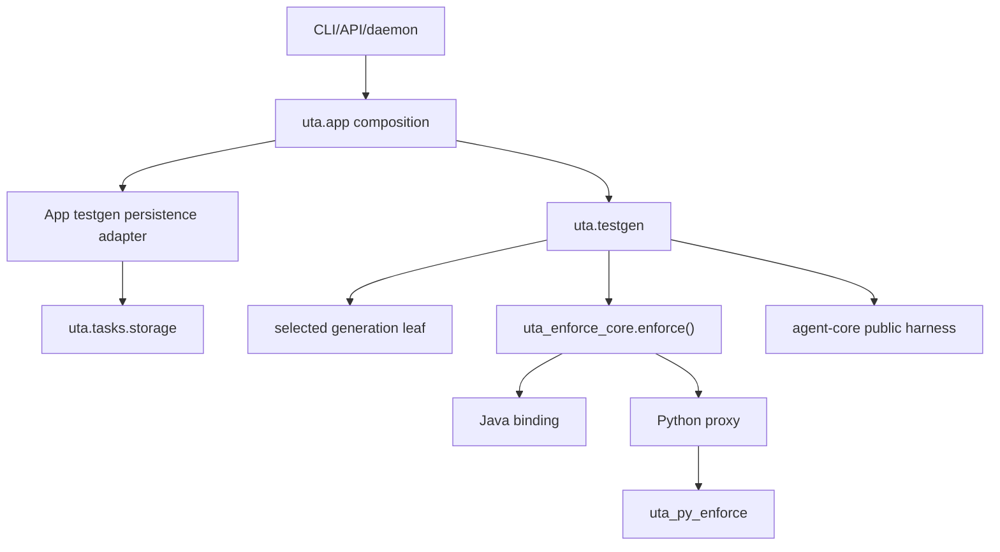

# Design Detail (UTA): Architecture Boundary and Package Cleanup

Status: approved and scope-frozen by the requester on 2026-08-20. This document
is the UTA/tooling detail for
`docs/design-uta-architecture-boundary-cleanup.md`.

## Contents

1. Changes in this repo
2. Key abstractions
3. Enforcement contract and bindings
4. Generation boundary
5. Persistence and workflow boundary
6. Module split map
7. Dependency checker
8. Data and control flow
9. API and schema changes
10. Capacity, reliability, and security
11. Harness configuration neutrality
12. Canonical Python enforcement: behaviour migration map
13. The neutral command-runner port
14. Numeric enforcement limits and subprocess budget
15. Cross-store crash ordering and reconciliation
16. Registry, DTO, and module-migration hardening
17. Failure modes
18. Risks and verification

## Changes In This Repo

UTA and its distributable tools tree will change in these cohesive areas:

| Current surface | Target owner | Change |
| --- | --- | --- |
| `uta.engine` contract/value modules | `uta_enforce_core`, `uta.testgen`, or dependency-light product values | Migrate each symbol to its actual domain and delete the parallel package. |
| `uta.enforcement.enforcement.EnforcementCore` | `uta_enforce_core.enforce()` | Replace the unused parallel protocol with one executable dispatch function. |
| `uta.engine.ci.EnforcementRunner` | binding-owned command port or app CI service | Demote from top-level enforcement contract. |
| `uta.enforcement.verification.VerificationRunner` | deleted | Decided: per-target execution is a private detail of each binding, so the protocol has no cross-binding consumer to justify it. Its Java implementation becomes a private method on the Java binding; its role in the Python path is taken by `PythonEnforcementBinding.enforce`. |
| `uta.shared.languages.LanguageAdapter` | focused app detection plus generation binding composition | Remove the umbrella protocol and its batch/cycle back-edges. |
| `uta.language.python.enforcement*` | `uta.enforcement.bindings.python_proxy` | Replace orchestration with a thin distributed-binding proxy. |
| Python verification orchestration | `tools/python-enforcement/uta_py_enforce` | Canonical high-level implementation lives in the distributable tree. |
| Java enforcement runner | `uta.enforcement.bindings.java` and focused Java modules | Implement shared contract; separate planning, execution, parsing, evidence. |
| Java/Python generation adapters | leaf generation bindings called by testgen | Remove imports back to composers and app managers. |
| `uta.tasks.db` and large manager mixins | `uta.tasks.storage` and `uta.tasks.services` | Split implementations behind stable facades and one transaction owner. |
| `uta.tasks.workflow_retention` | app retention coordinator plus testgen artifact pruners | Remove tasks-to-testgen/agent-core reverse imports. |
| Concrete OpenCode setup/readiness/bootstrap | agent-core neutral lifecycle helpers | Delete UTA provider-specific imports and branches. |
| `uta/tasks/rdc_delivery.py` (427 lines) — imports `agent_core.git` at line 8 | app-owned delivery service behind a testgen/task port | Spec requirement 4 and success criterion 6 forbid `uta.tasks` importing agent-core Git adapters; the dependency gate would reject this file on day one. Delivery moves to `uta/app/delivery/`, and tasks receives the neutral publish outcome. |
| `uta/app/routes.py` (326), `service.py` (616), `task_daemon.py` (411), `enforcement_commands.py` (207) | unchanged location, explicit composition responsibilities | These are the surfaces that actually receive the composed registry, the persistence adapter, and the injected generation binding. `service.py` also consumes enforcement evidence directly (`summarize_test_quality_payloads`, `service.py:25`). |
| Large application/domain files | focused modules listed below | Preserve public entrypoints as thin facades where compatibility is required. |

## Key Data Structures And Abstractions

### Contract DTOs in `uta_enforce_core`

The contract will use frozen dataclasses/enums with explicit validation and no
Pydantic/FastAPI dependency:

- `EnforcementStatus`: the existing normalized pass/fail/error/unsupported
  statuses, with exact legacy string projection.
- `EnforcementTarget`: language-neutral target ID, source path, optional test
  paths, and bounded metadata.
- `QualityGates`: optional changed-line coverage and mutation gates.
- `RuntimeSelection`: executable names, timeouts, and syntax/runtime version;
  it contains no UTA settings object.
- `EnforcementRequest`: repo, language, targets, base ref, gates, and runtime
  selection. It carries no caller identity.
- `EnforcementCapabilities`: supported runtime versions, coverage/mutation
  support, and whether a binding accepts an injected selection policy.
- `TargetEnforcementResult` and `EnforcementResult`: status plus the current
  schema-versioned evidence mapping.
- `EnforcementInvocationContext`: command runner, cancellation, bounded
  progress, and an optional `sampling_policy`. A binding does not ask *who* is
  calling; it asks whether a selection policy was supplied.
- `EnforcementLanguageBinding`: `language`, `capabilities`, and `enforce`.
- `EnforcementRegistry`, an immutable name-to-binding mapping frozen at
  construction, and the stateless module-level `enforce()`.

Validation rules are fail-closed: repo paths must resolve, target/source paths
must remain repository-relative, language must be known, gates must be in
`[0, 1]`, timeouts and target counts are bounded, and evidence must contain the
existing backend/schema/status fields. Validation never runs a command.

### Python binding public API

`tools/python-enforcement/uta_py_enforce/api.py` exports only:

```python
class PythonEnforcementBinding:
    language = "python"

    def capabilities(self) -> EnforcementCapabilities: ...

    def enforce(
        self,
        request: EnforcementRequest,
        context: EnforcementInvocationContext,
    ) -> EnforcementResult: ...


def create_python_enforcement_binding() -> PythonEnforcementBinding: ...
```

The binding composes focused internal coverage, mutation, runtime, selection,
and evidence modules. `uta_py_enforce.cli` becomes parsing/presentation only:
it creates a request, builds a one-entry registry, calls `enforce()`
once, emits existing evidence markers, and maps status to the
existing exit code.

### UTA Python proxy

`uta/enforcement/bindings/python_proxy.py` contains
`UtaPythonEnforcementProxy`. Its constructor accepts the canonical binding and
optional UTA CI selection-policy factory. The proxy may:

- map legacy UTA call parameters into `EnforcementRequest` at explicit
  compatibility entrypoints;
- carry the CI selection policy on the context when the UTA CI composition
  supplied one, and otherwise carry none;
- adapt UTA cancellation/progress/command runner to neutral ports; and
- project the neutral result into existing UTA return facades.

It may not import Python coverage/mutation/test-selection implementation
modules. The proxy delegates exactly once per request.

### Generation contract

`uta/language/contracts.py` will contain dependency-light generation values,
not enforcement:

- `GenerationTarget`, `GenerationRequest`, and `GenerationResult`;
- `GenerationContextResult` and `GeneratedTestArtifact`;
- focused protocols for source discovery, context preparation, target
  selection, test placement, and phase-domain evaluation.

Testgen owns the workflow protocol already represented by
`GenerationCycleBinding`; it will be narrowed so concrete language leaves
receive dependencies rather than importing `uta.testgen` composers.

**Composition is app-owned, and only app-owned.** The specification permitted
either direct or app-composed selection. We choose app-composed: `uta.app`
detects the language, imports exactly one generation leaf, constructs it, and
passes it to testgen as a `GenerationLanguageBinding`. `uta.testgen` imports
only `uta/language/contracts.py` — never `uta.language.java` or
`uta.language.python`, eagerly or lazily.

The alternative — testgen importing the selected leaf through registration
metadata — was rejected for three reasons. It makes the lazy-import rule a
thing to enforce rather than a consequence of the graph (testgen has no import
to make, so a Java run cannot reach the Python toolchain by construction). It
keeps a testgen-to-language edge that the dependency checker would then have to
permit conditionally, and a conditional rule is one a later change can satisfy
accidentally. And it puts language selection in two places, since app already
detects the language to pick the enforcement binding.

The cost is one more constructor argument threaded through testgen entry
points, which is the visible form of the dependency we want.

### Persistence ports

`uta/testgen/ports/persistence.py` defines consumer-side structural protocols:

- `GenerationTaskReader` for neutral task/class/config snapshots;
- `GenerationTaskWriter` for stage, result, event, and terminal projections;
- `WorkflowOperationRepository` for operation rows/accounting;
- `RetentionEligibilityReader`; and
- `GenerationUnitOfWork` for compound atomic product writes.

`uta/app/persistence/testgen.py` implements them with `uta.tasks.storage`.
The adapter converts rows to testgen-owned immutable values; it never returns a
`TaskDB`, SQLite connection, or `TaskManager` to phase/domain code.

## Data Dependency Flow



Task rows flow into immutable product snapshots at the app adapter. Language
leaves and enforcement bindings return value objects. Testgen projects those
values back to task stages/results through the writer port and persists
workflow artifacts through its own stores.

## Key Process Flow (intra-repo)

### Managed generation

1. App normalizes CLI/API/daemon input and resolves language.
2. App creates a configured agent-core harness and calls neutral prepare and
   readiness once.
3. App creates the task persistence adapter, enforcement registry/service, and
   selected generation binding.
4. Testgen loads a neutral task snapshot and opens the existing durable
   workflow identity/checkpointer/artifact scope.
5. Testgen asks the generation binding for source/context/phase-domain values.
6. Testgen constructs prompts and executes agent-core `agent_turn` nodes.
7. Testgen builds `EnforcementRequest` and invokes the shared service.
8. Java dispatches to the UTA Java binding. Python dispatches to the UTA proxy,
   which delegates to the distributed binding.
9. Testgen interprets evidence, follows the unchanged phase route, and writes
   task/product projections through the persistence adapter.
10. Delivery and terminal event commit remain in their existing order.

### Local Python tool

1. The thin CLI parses existing flags and repository config.
2. It converts them to the same typed request used by UTA.
3. It builds a one-entry registry holding `PythonEnforcementBinding`.
4. The binding runs current pytest/coverage/mutmut behavior.
5. The service validates the result; the CLI prints the same marker/evidence
   schema and preserves exit codes.

### Retention

1. App scheduler asks task storage for eligible task/workflow identities using
   existing indexed queries.
2. Testgen retention deletes checkpoints first, then operation/prompt artifacts
   under existing root/symlink/permission guards.
3. App persistence adapter deletes corresponding operation rows in one task
   transaction.
4. Progress pruning remains a task-storage concern.
5. Legacy read-only prompt retention compatibility remains until its already
   approved deletion window expires; it is isolated behind a task query port.

## Key Control Flow

### Enforcement dispatch

```text
enforce(request, registry, context)
  -> validate request
  -> registry lookup by normalized language
     -> missing: fail before any external command
     -> found: check the binding's declared capabilities cover the request
        -> unsupported runtime/feature: normalized unsupported result
        -> supported: binding.enforce exactly once
           -> validate evidence/result
              -> valid: return
              -> invalid: fail closed as contract error
```

No fallback to a second implementation exists. A Python proxy failure does not
fall back to legacy UTA verification.

### Generation selection

App detection produces one supported language. Testgen imports/uses only that
generation binding. Unknown language fails before task mutation. Enforcement
selection repeats validation from the typed language value so a mismatched
generation/enforcement language cannot silently run.

### Persistence transactions

`TaskDB.transaction()` remains the only outer SQLite transaction context.
Repositories receive `conn` for multi-table writes. Facade methods preserve
their current signatures and call one service/repository operation. A
repository method must not call `connect()` when a connection is provided.
Fault injection verifies rollback at every statement boundary for terminal
state/event, progress counters/events, operation completion/accounting, clean
rerun, and acquisition.

## API And Schema Changes (this repo)

### New public enforcement API

Public imports are explicit from `uta_enforce_core` and `uta_py_enforce`.
`__all__` lists the contract DTOs/service and the Python binding factory.
Wildcard mutation-candidate bridges are removed; any retained compatibility
name explicitly re-exports one public symbol and carries a deletion release.

Current evidence JSON, marker names, CLI flags, exit codes, Python 2 lane, and
backend/schema values are unchanged. Typed DTOs are an in-process API and must
round-trip to frozen legacy fixtures.

### Removed internal APIs

- `uta.engine.*` public-contract role;
- `uta.shared.languages.LanguageAdapter` umbrella methods;
- unused `EnforcementCore` protocol;
- top-level `EnforcementRunner`/`VerificationRunner` roles where replaced by
  the shared binding contract;
- direct UTA imports of concrete OpenCode APIs; and
- wildcard mutation-candidate exports.

Before deletion, repository-wide callers and tests move to the owned public
facades. No indefinite deprecation shim remains in the final release.

### Database schema

N/A: no table, column, index, schema-version, checkpoint identity, or durable
state shape changes. File/package movement must preserve SQL text and query
plans unless a separately approved performance fix is introduced.

## Module Split Map

The following destinations are fixed for design purposes; exact private helper
names may change without changing ownership.

| Current module | Target modules |
| --- | --- |
| `uta/testgen/operations.py` | `operations/models.py`, `artifact_store.py`, `cost_gate.py`, `reconciliation.py`, `ledger.py` |
| `uta/tasks/db.py` | `storage/connection.py`, `schema.py`, `task_repository.py`, `operation_repository.py`, `event_repository.py`, `scheduler_repository.py`; facade remains `db.py` |
| `uta/tasks/lifecycle.py` | `services/transitions.py`, `recovery.py`, `preemption.py`, `stages.py` |
| `uta/tasks/accounting.py` | `services/result_projection.py`, `token_accounting.py`, `delivery_accounting.py` |
| `uta/tasks/workflow_retention.py` | `uta/app/retention.py`, `uta/testgen/retention/{checkpoints,artifacts,prompts,standalone}.py` |
| `uta/language/java/generation.py` | `generation/quality.py`, `selection.py`, `commands.py`, `writeback.py`, `evidence.py`, `mutation_context.py` |
| Java `phases/ports.py` | focused phase port factories importing the modules above, never the facade |
| `uta/language/java/enforcement_runner.py` | `enforcement/bindings/java/{binding,planning,execution,parsing,evidence}.py` |
| `uta/language/java/context_builder.py` | `context/{analysis,rendering,index_payload,roi_store}.py` plus stable facade |
| `uta/language/python/verification/runner.py` | distributed binding orchestration plus focused UTA-only adapters; models move to dependency-light contract modules |
| `uta_py_enforce/mutation_candidates.py` | `mutation/{models,ast_policy,opportunities,mutmut_metadata,selection}.py` |
| `uta_enforce_core/mutation_candidates.py` | `mutation/{models,identity,policy,evidence,comparison}.py` with explicit exports |
| `uta/engine/project_summary_artifacts.py` | `uta/testgen/project_summary/{policy,artifacts,rendering,retrospective}.py`; agent execution uses neutral lifecycle/session APIs |
| `uta/app/repair.py` | `app/repair/{service,session,progress,deferred_task,workspace,locking}.py` |
| `uta/app/task_commands.py` | `app/commands/tasks/{create,inspect,control,retention,reporting}.py` |
| `uta/app/cli.py` | root registration plus `app/source_discovery.py` and neutral `app/harness_startup.py` |

Facades/orchestrators target fewer than 400 lines; cohesive modules target
fewer than 600. Any exception is recorded in the implementation plan with
measured complexity and focused tests.

One exception is recorded now: `uta/app/service.py` is 616 lines and gains
composition responsibility in this iteration. It is the application service that
wires everything and is therefore expected to grow rather than shrink. It is
split into `service.py` (the public service) and `service_composition.py` (the
registry, adapter, and binding construction), which brings both under the
guardrail without inventing a boundary that is not there.

`uta/app/enforcement_commands.py` carries a *fifth* enforcement entrypoint that
the rollout's "local CLI, full CLI, repair, CI" list omits:
`uta python-mutant-diffs` (`:24`). It reads survivor diffs through the same
mutation machinery and is migrated in the same slice as the other four.

## Dependency Checker

`scripts/check_package_dependencies.py` uses only `ast`, `pathlib`, and the
standard library. It scans `uta/**/*.py` and
`tools/python-enforcement/**/*.py`. For every import it records:

- importer and imported module;
- line number;
- eager, function-local/lazy, or `TYPE_CHECKING` classification; and
- whether the edge is internal, agent-core, or third-party.

The policy is data in `scripts/package_dependency_policy.py`, not scattered
test assertions. It declares allowed top-level directions and exact temporary
exceptions with owner, rationale, and deletion milestone. The command prints
a deterministic text graph and can write JSON for documentation regeneration.

It fails on:

- tasks importing testgen or agent-core;
- testgen importing task implementations or enforcement binding modules;
- the enforcement contract importing UTA, agent-core, or bindings;
- distributed packages importing UTA or agent-core;
- agent-core imports under product-language packages being used through
  concrete provider names;
- UTA concrete OpenCode names;
- wildcard internal re-exports;
- eager cycles; and
- lazy logical cycles not listed as a temporary seam.

An import is not forgiven merely because it is function-local.

## Key Design Tradeoffs (repo-local)

- The contract service lives in `uta_enforce_core`, not `uta.enforcement`, so
  local and full UTA entrypoints cannot drift behind different orchestrators.
- UTA's Python layer is a proxy, not a subclass/fork of the binding. Explicit
  composition makes CI-only policy visible and testable.
- Existing task facades remain while implementations split because external
  callers and atomic operations rely on them. The final architecture judges
  dependencies by implementation ownership, not by forcing immediate caller
  churn.
- Generation leaves become downward dependencies of testgen. Prompt rendering,
  workflow state, accounting, and delivery are passed in/up rather than
  imported back, eliminating the current cycles.
- `uta.engine` is deleted after its symbols move; keeping it as a permanent
  forwarding namespace was rejected because it would remain a second public
  architecture.

## Capacity, Reliability, And Security

- Dependency scan: under 5 seconds for the current ~207 UTA modules plus tools;
  memory bounded by the import-edge list, expected under 20 MiB.
- Enforcement dispatch/proxy: one lookup and one in-process delegation, no new
  external call, target under 1 ms excluding enforcement work.
- SQLite: unchanged statement count/query plans per public operation; all
  existing indexes retained. Full-suite instrumentation compares selected
  critical operations before/after.
- Language loading remains lazy; Java startup imports no Python mutation stack,
  and the lightweight Python tool imports no UTA stack.
- All command arguments remain sequences without shell interpolation. Existing
  environment scrubbing, path confinement, process-group cancellation, and
  timeouts are reused by the canonical binding.
- Contract errors include safe field names/reasons but never raw environment,
  token, prompt, provider, or command output.

## Failure-Mode Handling

| Failure | Handling |
| --- | --- |
| Contract validation rejects formerly valid fixture | release blocked by golden compatibility suite; adjust typed projection, not evidence consumers |
| Proxy accidentally invokes binding twice | spy/call-count test and cost/process-count test fail |
| CI sampler reaches a non-CI caller | source-boundary test: only the UTA CI composition may construct a context with `sampling_policy` set; the local tool has no import path to a sampler |
| Repository split opens nested transaction | transaction guard test raises and slice is not merged |
| Retention partially fails | preserve current checkpoint-first safety order; do not delete product evidence when checkpoint deletion fails |
| Selected generation binding imports testgen | dependency scan blocks the cycle; inject the required port instead |
| Legacy facade remains used | source scan produces caller list; facade deletion gate requires zero production callers |

## Harness Configuration Neutrality

Decided in ADR-013. Measured on 2026-08-21: `uta/shared/config.py` declares 41
`opencode_*` settings, of which only 8 are read outside `config.py` (14
reference lines in 4 modules: `app/cli.py`, `testgen/harness.py`,
`language/java/baseline.py`, `engine/project_summary_artifacts.py`). The other 33 are declared by UTA and interpreted
only by agent-core.

### Per-setting disposition

| Setting(s) | Read by | Target |
| --- | --- | --- |
| `opencode_model`, `opencode_provider` | `app/cli.py`, `engine/project_summary_artifacts.py` | Removed from UTA. UTA asks the constructed harness for its neutral `model_id`/`provider_id` descriptor when it needs one for a prompt or a log line; it never selects one. |
| `opencode_planning_timeout_seconds`, `opencode_repair_timeout_seconds` | `testgen/harness.py` | Renamed `planning_turn_timeout_seconds`, `repair_turn_timeout_seconds`. These are UTA budget policy that happen to be spelled with a provider name. |
| `opencode_auth_probe_enabled` | `app/cli.py` | Renamed `harness_readiness_probe_enabled`. Meaning is unchanged: skip the startup readiness probe. |
| `opencode_init_command`, `opencode_init_slash_enabled`, `opencode_init_slash_timeout` | `language/java/baseline.py`, `engine/project_summary_artifacts.py` | Become neutral bootstrap policy: `project_bootstrap_enabled`, `project_bootstrap_timeout_seconds`, and `project_bootstrap_fallback_command`. UTA decides *whether* to bootstrap and *what prompt*; how a harness achieves it is agent-core's, per the lifecycle API. |
| The remaining 33 (`opencode_port`, `opencode_spawn_cmd`, `opencode_provider_tokens`, `opencode_variant`, `opencode_turn_log_*`, …) | nothing in `uta/` | One opaque `UTA_HARNESS_OPTIONS` JSON object, forwarded verbatim into `HarnessSpec`. UTA does not default, validate, or branch on any key. |

### Compatibility reader

`uta/shared/harness_config.py` reads legacy `UTA_OPENCODE_*` names for one
release. Rules, tested individually:

- a new name always wins over its legacy name;
- setting both logs one conflict warning naming the value used;
- any legacy name used logs one deduplicated deprecation warning per run,
  naming its replacement;
- a legacy name with no new home is folded into `UTA_HARNESS_OPTIONS` under its
  documented key;
- the reader is the only module permitted to contain the string `OPENCODE`, and
  its dependency-policy allowlist entry carries the deletion release.

### The `uta assess` exemption

`uta/app/opencode_assessment.py` and `uta/app/assessment_commands.py` remain
OpenCode-specific, by ADR-013. The dependency checker exempts exactly those two
paths and, in the same rule, asserts the property the existing test at
`tests/test_opencode_assessment_placement.py:43` already pins: the reader has
exactly one importer, and nothing under `uta/tasks`, `uta/testgen`,
`uta/enforcement`, or `uta/language` imports either. This is an importer rule,
not a reachability claim — `uta/app/cli.py:847` imports the command module
eagerly. The exemption names an owner and a twelve-month review date.

## Canonical Python Enforcement: Behaviour Migration Map

Decided in ADR-014. Promotion order is top to bottom; a caller is redirected
only after every family it depends on is promoted and its fixture is green.

| Behaviour family | Authoritative today | Destination | Frozen fixture |
| --- | --- | --- | --- |
| Test selection and target context | `python/test_selection.py` `discover_strict_python_test_candidates`, `is_strict_python_test_candidate_path` (259 lines); `python/context_builder.py` `PythonContextBuilder.build_target_context` (171 lines), `max_results=5` | `uta_py_enforce.test_selection`, replacing its 52-line filename-stem matcher | `test_selection.json`: selected-path sets across src/flat/namespace layouts, configured vs discovered paths, and the `broad`-token exclusions |
| Nested dependency overlay and environment cache key | `verification/runner.py` `_dependency_fingerprints` (:2778), `_prepare_nested_requirements_overlay` (:2798), `_python_cache_key`, `config.setup_command` execution, and `verification/dependency_requirements.py` (162 lines) | `uta_py_enforce.dependency_overlay` | `dependency_overlay.json`: no manifest, manifest with satisfied imports, manifest with missing imports, cached overlay hit, install failure → `setup_failed` |
| Test-quality evidence | `python/test_quality.py` `scan_python_test_quality_evidence` (293 lines) over shared `uta/enforcement/test_quality.py` (136 lines, also used by Java) | split: the neutral aggregation in `uta/enforcement/test_quality.py` moves to `uta_enforce_core`; the Python scanner moves to `uta_py_enforce`; Java's scanner stays in the Java binding | `test_quality_evidence.json` plus a Java/Python shared-aggregator test |
| Request/target/changed-line derivation | `python/enforcement.py` `_target_refs`, `_changed_*` | `uta_enforce_core` validation + `uta_py_enforce.targets` | `targets_changed_lines.json` over a fixture repo with added, modified, deleted and non-executable changes |
| Non-executable-change short circuit | `python/enforcement.py` `_has_only_non_executable_changed_lines` | `uta_py_enforce.api` | `non_executable_only.json` |
| Runtime resolution and interpreter fallback | `verification/runner.py` `resolve_python_runtime_config`, `_python_runtime_fallback_bin`, `_python_bin`, `_mutmut_bin` | `uta_py_enforce.runtime` | `runtime_resolution.json` across py3, py2 lane, missing interpreter, missing mutmut |
| Runtime-incompatibility precheck | `verification/runner.py` `precheck_python_target_runtime_incompatibility`, `_py_compile_indicates_runtime_incompatibility` | `uta_py_enforce.runtime` | `runtime_incompatible.json` (py2 source under py3 lane) |
| mutmut version ownership and import compatibility | `verification/runner.py` `_check_mutmut_version`, `_ensure_uta_owned_mutmut_version`; `verification/mutmut_import_compat.py` (345 lines) | `uta_py_enforce.mutmut_adapter_runtime` | `mutmut_version_matrix.json` (owned, foreign, absent, too old) |
| Pytest execution context and import roots | `verification/runner.py` `_prepare_pytest_execution_context`, `_pytest_import_roots_for_tests`, `_rewrite_isolated_pytest_source` | `uta_py_enforce.pytest_context` | `pytest_import_roots.json` (src layout, flat layout, namespace package, isolated source) |
| Coverage execution and changed-line scoping | `verification/runner.py` coverage paths, `_coverage_include_patterns` | `uta_py_enforce.coverage` (exists; extended) | `coverage_changed_lines.json` |
| Changed-line mutation scoping and masking | `verification/runner.py` `_scope_mutation_to_changed_lines`, `_apply_changed_line_mutation_mask`, `_low_value_side_effect_statement_lines`, `_is_pragma_safe_skip` | `uta_py_enforce.mutation_policy` (exists; extended) | `mutation_scope_mask.json` |
| Batched modern-mutmut generation policy | `verification/runner.py` `_run_batched_modern_mutation`, `_write_mutmut_generation_policy`, `_generation_policy_*`, `_representative_*`, `_cap_*`, `_stable_policy_hash` (≈600 lines) | `uta_py_enforce.mutation_generation_policy` | `generation_policy.json` plus the existing policy-hash identity assertion |
| Zero-mutant and no-test-association reconciliation | `verification/runner.py` `_zero_mutants_means_no_candidates`, `_reconcile_no_test_association`, `_mark_no_mutatable_candidates`, `_mutmut_meta_mutant_count` | `uta_py_enforce.mutation` | `zero_mutant_reconciliation.json` |
| Survivor diff annotation | `verification/runner.py` `_annotate_mutmut_survivor_diffs`, `_internal_mutmut_survivor_diff`, `_compact_mutmut_show_output`, `_MutmutShowBudget` | `uta_py_enforce.mutation_survivors` | `survivor_diffs.json` including the show-budget exhaustion case |
| Process execution and process-tree termination | `verification/runner.py` `_subprocess_run`, `_run_command`, `_terminate_process_tree` | the neutral command-runner port (below); default implementation in `uta_py_enforce.process` | `process_control.json` plus an orphan-free timeout test |
| Marker rendering (see note below) | two renderers that already differ | frozen in place, separately | payload-scoped parity, not full-block parity |
| Evidence aggregation, gates and markers | `python/enforcement.py` `_aggregate_*`, `validate_python_enforcement_evidence`, `format_evidence_markers`, `_finalize` | split: aggregation/validation to `uta_enforce_core.evidence`, marker rendering stays with the CLI/facade that prints it | the existing marker golden tests, unchanged bytes |
| CI mutation sampling | `python/ci.py` | **stays in UTA** as a selection policy injected through the invocation context | `ci_sampling_matrix.json` proving no other mode receives it |
| Workflow progress and task projection | `testgen`, `app` | **stays in UTA** | existing workflow tests |

**The two marker renderers already differ, and both are frozen.** This is
compatibility, not a tidy split, and the design should not imply otherwise.
`uta/language/python/enforcement.py:256` emits a candidate-plan line, a
test-quality advisory line, and separate `scope == "changed_lines"` and
non-changed-lines branches.
`tools/python-enforcement/uta_enforce_core/evidence.py:23` emits a
`mutation_backend_failed` branch the UTA one lacks, a different mutation line
without the `file mutants` term, no candidate-plan line, no test-quality line,
and the literal `UTA_PYTHON_ENFORCEMENT_EVIDENCE=` prefix. Spec success
criterion 10 asks for equivalent *evidence*, which these two do produce; the
printed markers around it are not equivalent today and are not made so here.
Parity fixtures therefore assert the `UTA_PYTHON_ENFORCEMENT_EVIDENCE=` payload,
not the surrounding marker block. Unifying the renderers is a separate,
user-visible change requiring its own approval.

Two corrections to the review that raised this finding, recorded so the map is
not built on them:

- **Cancellation does not exist in the UTA Python path today.**
  `grep -rn cancel uta/language/python` returns nothing; termination is
  timeout-driven only. Cancellation is added by the neutral invocation context.
  It is new behaviour with its own tests, not a preserved behaviour.
- **The first draft's second "correction" was itself wrong, and is retracted.**
  That draft claimed `verification/dependency_requirements.py` is generation
  policy about what a generated test may import. It is not. Its only importer
  is `verification/runner.py:57`, and it drives
  `_prepare_nested_requirements_overlay`, which pip-installs the target's
  nearest nested requirements into a digest-keyed overlay directory under a
  lock, prepends it to `PYTHONPATH`, and records `setup_status` and
  `dependency_overlay_install` command evidence. It is enforcement runtime
  preparation, it feeds the persisted `cache_key`, and it has its own family in
  the table above. Routing it to the generation binding would have removed it
  from the enforcement path, so targets whose tests need a nested requirement
  would fail at import under the canonical binding.

## The Neutral Command-Runner Port

`EnforcementInvocationContext.run_command` is the only way a binding starts a
process. Its contract is fixed here because environment scrubbing, process
groups, and output limits are the things that silently differ between two
implementations.

```python
@dataclass(frozen=True)
class CommandRequest:
    argv: tuple[str, ...]          # never a string; no shell
    cwd: Path                      # must resolve inside the request repo
    env_overrides: Mapping[str, str] = field(default_factory=dict)
    timeout_seconds: float = 0.0   # > 0 required
    max_output_bytes: int = 8 * 1024 * 1024


@dataclass(frozen=True)
class CommandOutcome:
    returncode: int
    stdout: str
    stderr: str
    duration_seconds: float
    timed_out: bool
    cancelled: bool
    output_truncated: bool


class CommandRunner(Protocol):
    def run(self, request: CommandRequest) -> CommandOutcome: ...
```

Required behaviour of every implementation, asserted by one shared conformance
suite that both the UTA runner and the default runner must pass:

- **No shell.** `argv` is a sequence. A runner that accepts a string is a
  contract violation, not a convenience.
- **Environment is allow-listed, not inherited.** The base is a fixed neutral
  set (`PATH`, `HOME`, `LANG`, `LC_ALL`, `TMPDIR`, `SYSTEMROOT` on Windows)
  plus `env_overrides`. Every other variable is dropped, so provider tokens,
  `GIT_*` credentials helpers, and CI secrets cannot reach a mutation
  subprocess. Dropping is logged by name, never by value.
- **Process groups.** Children start with `start_new_session=True` and are
  terminated with `os.killpg` — `SIGTERM`, then `SIGKILL` after a 2-second
  grace. This preserves the existing `_terminate_process_tree` guarantee;
  killing only the direct child orphans pytest workers and mutmut runners.
- **Paths are confined.** `cwd` and every path-valued argument must resolve
  under the request repo root; a traversal outside it is refused before spawn.
- **Output is bounded.** Streams are read incrementally and truncated at
  `max_output_bytes` (8 MiB, matching `DEFAULT_ENFORCEMENT_OUTPUT_LIMIT_BYTES`)
  with `output_truncated` set. The split is the existing one and is not
  redesigned: `head = max_bytes // 4`, `tail = max_bytes - head` — 2 MiB head,
  6 MiB tail — joined by the literal marker
  `\n... output truncated: N bytes omitted ...\n`. Command output lands in
  `verification_commands` evidence, so both the split and the marker string are
  frozen bytes.
- **Memory bounding stays outside this contract.** Today every full-UTA
  enforcement subprocess runs under `run_resource_bounded_command(...,
  memory_limit_bytes=...)` (`uta/enforcement/enforcement.py:73`, default
  3072 MB from `ci_python_enforcement_memory_limit_mb`), which polls
  process-tree RSS, kills the group on breach, and injects the
  `UTA_RESOURCE_EXHAUSTED` marker consumed at
  `uta/language/python/enforcement_runner.py:97`. The requester waived adding a
  memory field to `CommandRequest`. The guard is therefore preserved by
  *implementation*, not by contract: the runner UTA injects wraps
  `run_resource_bounded_command` and keeps the marker bytes, while the
  distributed client's default runner does not bound RSS. The conformance suite
  cannot assert this property, and a UTA-only test does instead.
- **Timeouts are mandatory.** `timeout_seconds <= 0` is rejected. A timeout
  sets `timed_out` and returns; it does not raise, so evidence still records
  what ran.
- **Cancellation is cooperative and prompt.** The context's `is_cancelled` is
  polled while waiting; on cancellation the group is killed with the same
  escalation and `cancelled` is set.

## Numeric Enforcement Limits And Subprocess Budget

Fixed here so the design carries a budget rather than the word "bounded".

| Limit | Value | Status | Evidence |
| --- | --- | --- | --- |
| Per-command timeout (setup, pytest, coverage, one mutation batch) | 1800 s | **frozen** | `PythonRuntimeConfig.timeout_seconds = 1800` (`verification/runner.py:185`) is the only per-command timeout and covers all four phases |
| Total enforcement wall clock | 7200 s | **frozen** | `ci_python_enforcement_timeout_seconds = 7200` (`shared/config.py:101`); `UTA_PYTHON_GATE_TIMEOUT_SECONDS` default 7200 (`uta_py_enforce/cli.py:102`) |
| Test paths per target | 5 | **frozen** | `max_results: int = 5` (`python/test_selection.py:60`) |
| `max_output_bytes` | 8 MiB, 2 MiB head / 6 MiB tail | **frozen** | `DEFAULT_ENFORCEMENT_OUTPUT_LIMIT_BYTES` (`uta/enforcement/enforcement.py:18`) |
| Subprocess RSS | 3072 MB | **frozen, outside the contract** | see the memory-bounding note above |
| Mutation batch size | unchanged from current policy | **frozen** | behaviour freeze |
| Targets per request | 200 | **new** | no cap exists today; refuses a runaway diff before any process starts. Chosen above the largest observed changed-file count; a request over it fails validation with the count, so the ceiling is visible rather than silent |
| Registry lookups | 1 per request | **new** | in-memory dict |

An earlier draft of this table gave 900 s, 50 test paths, and a 4 h ceiling as
"current defaults". All three were wrong. The 900 s would have halved the real
timeout and failed currently-passing runs on slow repositories — a verdict
change presented as a behaviour freeze. Every row above now cites the constant
it froze.

Subprocess budget, volume × cost, for one enforcement request of *T* targets:

| Phase | Processes | Formula |
| --- | --- | --- |
| Runtime precheck | 1 per target | *T* |
| mutmut version check | 1 per run, cached | 1 |
| Pytest + coverage | 1 per target | *T* |
| Mutation | 1 per batch | ⌈*M*/*B*⌉ where *M* is scored changed-line mutants and *B* the unchanged batch size |
| Survivor annotation | ≤ 1 per surviving mutant, capped by `_MutmutShowBudget` | ≤ budget |

Worst case at the limits: 200 + 1 + 200 + ⌈*M*/*B*⌉ + budget. This equals the
current count; the refactor introduces no additional process. The call-count
test asserts equality against a pre-refactor recording rather than against a
number written here — and the cheapest real-traffic version of that check is a
query over the persisted `verification_commands` length and `setup_status` in
`PythonVerificationResult.as_result_fields()`, which needs no new
instrumentation.

## Cross-Store Crash Ordering And Reconciliation

Four stores can disagree after a crash: the SQLite task database, LangGraph
checkpoints, the repository working tree, and filesystem artifacts (prompts,
operation payloads, reports). The package split does not change the ordering.
An earlier draft of this section asserted an order the code does not use, and
justified it with reasoning that was the opposite of the real one; the order
below is read from the implementation.

**Write order, and why.** Per workflow operation:

1. **SQLite claim.** `WorkflowOperationLedger.classify` calls
   `db.start_workflow_operation(...)` (`uta/testgen/operations.py:437`) before
   any work happens.
2. **Repository edits** (generated tests).
3. **Filesystem artifact.** `record_result` writes the envelope
   (`operations.py:618`).
4. **SQLite completion.** `db.complete_workflow_operation(...)`
   (`operations.py:619`) — same node, immediately after the artifact.
5. **LangGraph checkpoint**, persisted by the graph on node exit.

The claim is written *first*, and that is the point: a crash anywhere after
step 1 leaves a `running` ledger row that names replayable input, and the
operation ID makes the replay idempotent. Writing the claim last would leave
completed work that nothing knows to reconcile. Steps 3 and 4 sit together
inside the node, before the checkpoint, so a resumed run never sees a
checkpoint that believes an operation finished when no row records it.

**Reconciliation on restart**, by the existing operation ledger:

| Observed | Interpretation | Action |
| --- | --- | --- |
| Ledger row `running`, no artifact | crash between 1 and 3 | replay from the row's recorded input; the operation ID makes it idempotent |
| Ledger row `running`, artifact present | crash between 3 and 4 | replay; the artifact write is keyed by operation ID and is overwritten, not duplicated |
| Ledger row complete, no checkpoint | crash between 4 and 5 | the node is re-executed and its ledger row short-circuits it; no paid work repeats |
| Ledger row complete, checkpoint present | clean | resume from the checkpoint |
| Artifact present, no ledger row | should not occur, since the claim precedes the artifact; if seen, it is an out-of-band write | retention deletes it on its normal sweep and the occurrence is logged as an invariant breach |
| Repository edits present, no ledger row | crash before 1 | the workspace is discarded and re-prepared (`fresh=True`); no partial tree is reused |

**Deletion order** is not the simple inverse, and the earlier three-step
description was incomplete. `uta/tasks/workflow_retention.py` does, in order:
`prune_progress_events` (`:64`, before any checkpoint work) → per lineage
`checkpointer.delete(identity)` (`:113`) → `artifacts.delete_unit` (`:114`) →
the SQLite operation rows → `prompt_retention.delete_managed_unit` (`:124`,
after the row deletion) → two legacy prompt sweeps. The safety property being
preserved is narrower than "inverse order": *product evidence remains intact if
checkpoint deletion fails* (the comment at `:112`). Crash-injection tests are
written against these five steps, not against a tidier three.

The split must preserve both orders exactly. A slice that opens a second
connection mid-transition, moves the claim, or reorders retention is rejected.

## Registry, DTO, And Module-Migration Hardening

Accepted from the review's nice-to-have findings.

- **The registry is immutable from construction.** It takes its full mapping as
  a constructor argument; there is no `register()` and therefore no `freeze()`
  and no half-built window. Tests build their own rather than mutating a global.
- **DTO snapshots are deeply immutable.** Frozen dataclasses hold tuples and
  `MappingProxyType`, and evidence mappings are deep-copied at the contract
  boundary. A binding cannot mutate a caller's request, and a caller cannot
  mutate returned evidence in place — which matters because the same evidence
  object is both persisted and rendered.
- **Module-to-package migrations that keep the name** (`operations.py` →
  `operations/`, `db.py` → `storage/` behind `db.py`) are done as: create the
  package, move implementation into submodules, leave the original name as the
  facade, and verify with a test that imports the old path in a subprocess with
  a cold `sys.modules`. A stale `.pyc` or a shadowed name is caught there rather
  than at runtime.

## Repo-Local Risks And Verification

Highest risks are evidence drift, hidden reverse imports, transaction splitting,
and accidentally retaining two Python orchestration paths.

Required focused suites include:

- contract request/result/evidence golden tests;
- full UTA versus lightweight Python fixture parity, including Python 2;
- a source-boundary test that only the CI composition sets `sampling_policy`;
- Java enforcement command/evidence characterization;
- durable Java/Python workflow and standalone projection tests;
- operation ledger, checkpoint/reconciliation, progress, retention, and task
  transaction fault tests;
- CLI command/help snapshots;
- package install plus isolated sparse-copy imports; and
- deterministic dependency graph fixtures for eager/lazy/type-only edges.

The full verification commands are those in the approved spec. The UTA design
is not approved until the independent design review has no undispositioned
Critical or Important finding.

## Changelog

- 2026-08-20 — Initial UTA/tools detail generated from the approved spec.
- 2026-08-21 — Design-review dispositions applied: harness configuration
  neutrality (ADR-013), Python behaviour migration map (ADR-014), command-runner
  contract, numeric limits and subprocess budget, cross-store crash ordering,
  registry/DTO/module-migration hardening.
