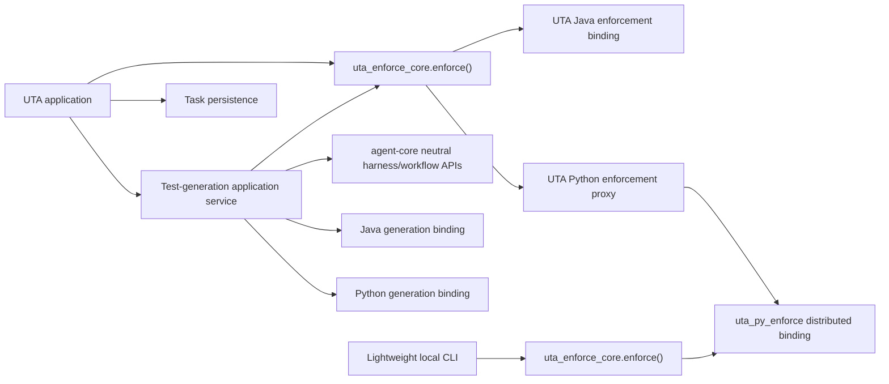
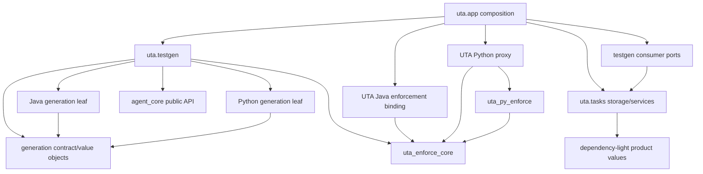
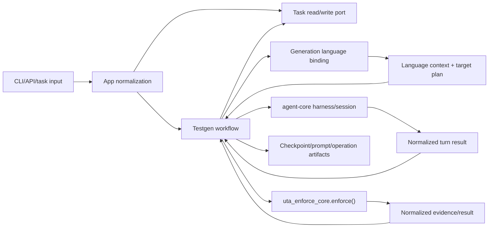
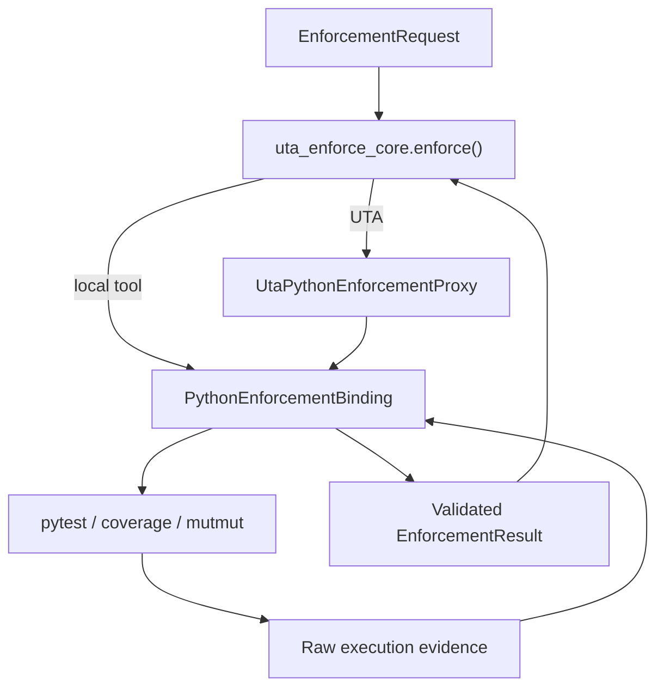
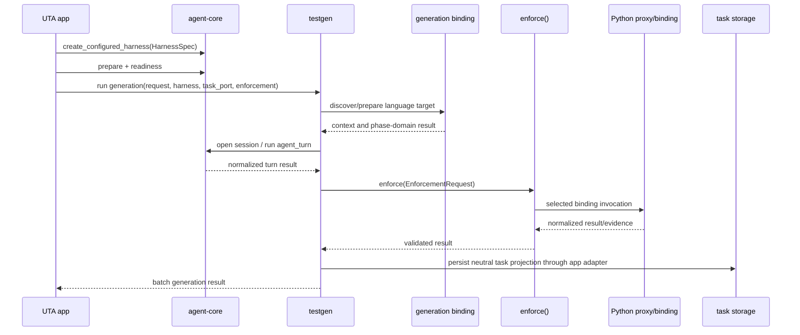

# Design Overview: UTA Architecture Boundary and Package Cleanup

Status: approved and scope-frozen by the requester on 2026-08-20 after both
design-review passes and their recorded dispositions. Planning is authorized;
implementation remains blocked until the implementation plan is approved.

## Contents

1. Goals and non-goals
2. High-level design
3. Intra-system relationships
4. Data dependency flow
5. End-to-end process flows
6. Contracts and ownership
7. Key design tradeoffs
8. Capacity, reliability, and security
9. Failure-mode handling
10. Rollout strategy
11. Rollout control: flags, parity records, and rollback triggers
12. Design review dispositions (both passes)
13. Verification plan
14. Repo detail documents

## Goals And Non-Goals

The design will establish one-way package ownership while preserving generation,
enforcement, task, evidence, CLI, report, and durable-workflow behavior.

The key goals are:

1. make UTA consume agent-core through neutral harness lifecycle APIs;
2. replace the parallel `uta.engine` and `uta.enforcement` top-level contracts
   with one enforcement contract in `uta_enforce_core`;
3. keep the canonical Python enforcement binding independently distributable
   under `tools/python-enforcement`, with UTA consuming it through a thin proxy;
4. keep generation-language behavior separate from enforcement-language
   behavior and from agent/harness behavior;
5. separate task persistence from workflow artifacts and orchestration without
   weakening SQLite transactions; and
6. split the identified monoliths along those ownership boundaries.

Non-goals are behavior changes, new quality policy, a new workflow engine,
publishing the lightweight client as a separate wheel, or moving Java/Python
product logic into agent-core.

## High-Level Design

### Runtime architecture



The arrows above describe runtime calls. The contract package never imports a
concrete binding. UTA and the lightweight CLI each create a registry, register
the binding available in that distribution, and invoke the same service.

### Source dependency architecture



`APP --> PORTS --> TASKS` means an app-owned adapter implements testgen's
consumer-side persistence port by delegating to task storage. Neither tasks nor
testgen imports the other's concrete implementation.

## Intra-System Relationships And Cooperation

### agent-core

Agent-core owns agent selection, harness registration, workspace preparation,
readiness/authentication probing, bootstrap execution, sessions, turns,
fallback, cancellation, progress, and cleanup. It may depend on agent bindings
such as OpenCode or Pi. It must not import Java/Python generation or enforcement
bindings.

The release adds an optional neutral lifecycle protocol and helpers:

```python
@dataclass(frozen=True)
class HarnessReadiness:
    ready: bool
    status: Literal["ready", "authentication_required", "unavailable"]
    detail: str = ""


@dataclass(frozen=True)
class WorkspaceBootstrapRequest:
    purpose: str
    timeout_seconds: int
    prompt_file: Path | None = None


class ManagedHarness(Harness, Protocol):
    def prepare_workspace(self, *, repo_path: Path) -> None: ...
    def check_readiness(
        self, *, repo_path: Path, timeout_seconds: int
    ) -> HarnessReadiness: ...
    def bootstrap_workspace(
        self, *, repo_path: Path, request: WorkspaceBootstrapRequest
    ) -> BootstrapResult: ...
```

`BootstrapResult` is a typed neutral record (completion, session id, unparsed
output text, duration, optional usage); the repo detail gives its fields.
Products call exported helpers `prepare_harness_workspace`,
`check_harness_readiness`, and `bootstrap_harness_workspace`. Readiness carries
an explicit `ReadinessRetryPolicy`, defaulting to the three attempts with
3 s/6 s backoff that UTA runs today. The helpers use
safe defaults: preparation is a no-op when a harness needs none; readiness is
`ready` only when the harness explicitly supports the capability or its
registered specification declares that no external readiness is required;
bootstrap raises `BootstrapUnsupportedError` when requested but unsupported.
OpenCode implements the protocol using its current configuration/auth/session
internals. Provider error payloads are converted to neutral statuses before
returning. Existing `Harness.run_turn` and `open_harness_session` remain
compatible.

### sole enforcement contract

`uta_enforce_core` becomes a dependency-light contract plus dispatch service:

```python
@dataclass(frozen=True)
class EnforcementRequest:
    repo_path: Path
    language: str
    targets: tuple[EnforcementTarget, ...]
    test_paths: tuple[str, ...]
    base_ref: str
    quality_gates: QualityGates
    runtime: RuntimeSelection


@dataclass(frozen=True)
class EnforcementResult:
    status: EnforcementStatus
    evidence: Mapping[str, Any]
    target_results: tuple[TargetEnforcementResult, ...]


class EnforcementLanguageBinding(Protocol):
    language: str
    def capabilities(self) -> EnforcementCapabilities: ...
    def enforce(
        self,
        request: EnforcementRequest,
        context: EnforcementInvocationContext,
    ) -> EnforcementResult: ...


def enforce(
    request: EnforcementRequest,
    *,
    registry: EnforcementRegistry,
    context: EnforcementInvocationContext,
) -> EnforcementResult: ...
```

There is no `EnforcementMode` and no caller identity in the request. An earlier
draft carried `local_dev | full_cli | repair | ci_report`, which taught the
neutral contract UTA's org chart — the coupling the contract exists to remove.
What the binding actually needs to know is whether a mutation-selection policy
was supplied, and that arrives on the context:

```python
@dataclass(frozen=True)
class EnforcementInvocationContext:
    run_command: CommandRunner
    is_cancelled: Callable[[], bool] = lambda: False
    on_progress: Callable[[ProgressEvent], None] = lambda event: None
    sampling_policy: MutationSelectionPolicy | None = None
```

CI sampling is therefore not a mode the binding branches on; it is a policy that
either was injected or was not. Only UTA's CI composition constructs a context
carrying one, which is a source fact a boundary test can check, rather than a
runtime enum a caller could set wrongly. The local tool has no import path to a
sampler at all.

`EnforcementRegistry` is an immutable mapping from normalized language name to
binding, built once in application composition and frozen at construction —
there is no `register()`/`freeze()` lifecycle to get wrong, and no window in
which a half-built registry can be used. Duplicate names are rejected when it is
built; an unknown language is a clear error at lookup.

Dispatch is the module-level `enforce()` above, not a service class. It
validates the request, looks up one binding, checks the binding's declared
`capabilities()` against what the request needs, invokes it exactly once,
validates the returned result and evidence schema, and returns. It holds no
state, so there is nothing to construct, inject, or mock — the whole of "one
implementation, reached one way" is this function plus the source-boundary test
that forbids importing a binding anywhere but composition.

The context contains no task manager, API client, reporter, or agent type. Existing marker JSON and
evidence dictionaries remain the wire format during this iteration; typed
objects validate and contain them rather than replacing their field names.

### Python enforcement distribution and UTA proxy

`uta_py_enforce.api.PythonEnforcementBinding` is the canonical Python binding.
The lightweight CLI parses arguments into `EnforcementRequest`, builds a one-entry
`EnforcementRegistry`, and calls `enforce()`.

UTA registers `UtaPythonEnforcementProxy`. The proxy:

1. receives the same neutral request;
2. adds only UTA-owned invocation policy (CI sampling, progress callback,
   cancellation, and the existing command runner where required);
3. delegates exactly once to `PythonEnforcementBinding`; and
4. returns the binding's normalized result unchanged except for product event
   projection outside the proxy.

The proxy cannot construct pytest/coverage/mutmut commands, parse evidence,
select ordinary candidates, or implement fallback. Source-boundary tests
enforce this rule. Repair, full CLI, and local modes receive no CI sampler.

### Java enforcement binding

Java enforcement remains UTA-local and implements the same
`EnforcementLanguageBinding` protocol. Maven/Surefire/JaCoCo/PIT parsing and
command planning are split into Java-owned modules. The binding converts their
output into the shared evidence/result contract. No Java code moves into the
distributed Python tree.

### generation-language bindings

Generation and enforcement are distinct. Testgen may call Java/Python
generation bindings directly. The current umbrella `LanguageAdapter` is
retired and replaced by dependency-light generation request/result value
objects plus focused capabilities:

- language detection and CLI selection live in app composition;
- source/context discovery, prompt-domain inputs, generated-test placement,
  and phase-domain logic live in language generation leaves;
- graph composition, prompts, agent turns, delivery, accounting projection,
  and reconciliation live in testgen; and
- enforcement always goes through `uta_enforce_core.enforce()`.

The generation leaves do not import testgen composers. Testgen supplies prompt
renderers, agent turn results, delivery ports, and enforcement service as
arguments. This removes the current adapter/phase/composer back-edges while
retaining direct `testgen -> generation binding` use.

### task persistence and workflow ownership

`TaskDB` remains the compatibility facade and sole SQLite connection/
transaction owner. Its implementation is split under `uta.tasks.storage` into
schema, task, class, event/progress, operation-accounting, and scheduler
repositories. Repositories accept an existing connection for compound atomic
operations; they never open a second transaction inside a unit of work.

Testgen defines consumer-side ports for the exact task operations it needs.
App-owned adapters implement those ports with task repositories. Testgen owns
checkpoint, prompt, operation artifact, reconciliation, and retention policy.
An app-owned retention coordinator passes task eligibility rows to testgen
artifact pruners, then asks task storage to delete corresponding product rows
in the established safety order. `uta.tasks` therefore imports neither
agent-core nor testgen implementations.

No database schema change is required for the package split. Existing tables,
indexes, schema version, and transaction boundaries remain authoritative.

## Data Dependency Flow

### Generation



### Python enforcement



## Key Process Flow (inter-repo / end-to-end)



The agent-core release is built and released first. UTA then pins that released
version and removes its concrete OpenCode calls.

## Key Design Tradeoffs

1. **One contract package also owns neutral dispatch.** We will place DTOs,
   validation, the registry mapping, and the module-level `enforce()` in
   `uta_enforce_core`.
   Concrete bindings depend on it, while composition registers them. This
   avoids another UTA-only service API. See ADR-011.
2. **Python behavior remains in the tools tree.** UTA uses a thin proxy instead
   of relocating or copying Python enforcement. This preserves sparse-checkout
   distribution and one algorithm. See ADR-011 and ADR-003.
3. **Generation bindings are not enforcement bindings.** Testgen may call
   generation leaves directly, but all verification/gating is dispatched by
   the enforcement contract. See ADR-012.
4. **TaskDB stays the transaction facade while implementations split.** A new
   ORM or separate workflow database would create migration and atomicity risk
   with no architectural benefit. See ADR-012.
5. **Agent lifecycle belongs in agent-core.** Additive neutral lifecycle APIs
   replace UTA's OpenCode imports. A UTA wrapper around current concrete APIs
   was rejected because it would perpetuate provider knowledge. See the
   agent-core ADR linked from its detail design.
6. **Harness configuration is neutral, with one named exemption.** The 33
   settings UTA never interprets become an opaque `UTA_HARNESS_OPTIONS`
   passthrough; the 8 it does interpret are renamed by meaning. `uta assess`
   stays OpenCode-specific behind a named gate exemption rather than becoming a
   neutral capability with one implementation. See ADR-013.
7. **Python canonicalization is promotion, not redirection.** Each behaviour
   family moves into `uta_py_enforce` with a frozen fixture before its caller is
   redirected. See ADR-014.
8. **Internal compatibility facades are temporary within the implementation
   series, not a second final architecture.** The final tree removes
   `uta.engine`, wildcard bridges, and the umbrella `LanguageAdapter`; public
   CLI/evidence/result contracts remain stable.

## Capacity, Reliability, And Security

### Capacity and performance budgets

- The dependency scan covers approximately 207 UTA production modules plus
  the lightweight tree. It will parse each file once and complete in under 5
  seconds on a developer laptop; no module import/execution occurs.
- Registry selection is one in-memory dictionary lookup per enforcement run
  (target: under 1 ms). The UTA Python proxy adds one in-process call and no
  subprocess, network request, or database query.
- Enforcement preserves the current bounded external work: one test/coverage
  orchestration per request and the existing bounded mutation batches. This
  refactor adds zero pytest, Maven, coverage, mutation, agent, Git, or provider
  calls.
- Harness readiness retains the current probe budget — up to three attempts of
  120 seconds with 3 s/6 s backoff, worst case 369 s — and is never executed per
  generated class. Only `unavailable` retries; `authentication_required`
  returns immediately. Workspace preparation is
  once per run; per-turn isolation remains agent-core-owned.
- Task repository splitting preserves query count and indexes. List operations
  remain one query, event batches remain one transaction, and class creation
  uses the existing batch path where available. Any slice that increases query
  count must carry a measured before/after budget and is rejected by default.
- No new persisted data, checkpoint payload, event volume, or retention volume
  is introduced.

### Reliability

- Duplicate binding registration fails when the registry is built, rather than
  depending on import order.
- Unsupported language and unsupported harness capability fail before a task
  enters paid agent execution.
- Existing operation IDs, checkpoint identities, result artifacts, task event
  cursors, and exactly-once accounting remain unchanged.
- The registry is immutable from construction; tests build their own rather
  than mutating a global.
- Compatibility DTO projections freeze existing evidence and result bytes.

### Security

- `uta_enforce_core` and `uta_py_enforce` cannot import UTA, agent-core,
  FastAPI, LangGraph, task databases, or report/UI code.
- The UTA proxy passes only validated request fields and bounded callbacks; it
  does not expose a `TaskManager` or database connection to the distributed
  binding.
- Path validation, command argument construction, environment scrubbing,
  timeout/process-group termination, prompt artifact permissions, and progress
  redaction remain at their current owning boundaries.
- Readiness details returned to UTA are sanitized neutral messages; raw tokens,
  provider payloads, and generated config contents are not persisted in task
  events.
- The dependency checker parses source without importing it, preventing tool
  side effects during architecture verification.

## Failure-Mode Handling

| Failure | Detection | Containment and recovery | Blast radius |
| --- | --- | --- | --- |
| Binding missing or duplicate | startup/registry exception and metric | refuse the command/worker before task mutation; fix composition and restart | one deployment or invocation |
| Python proxy diverges from local binding | parity fixture hashes and contract tests | block release; proxy is deleted/reduced until it delegates exactly once | Python enforcement only |
| Distributed package accidentally imports UTA | dependency gate and isolated sparse-copy test | block commit/release | local developer install |
| Harness lacks readiness/bootstrap | neutral capability error before paid turn | select a capable harness or disable optional bootstrap through existing config | one run |
| Agent-core readiness implementation leaks provider details | sanitizer/source-boundary tests | fail closed and log private diagnostic only | startup UX |
| Task repository split breaks atomicity | transaction fault-injection and rollback tests | keep facade on old repository implementation for that slice; no schema rollback needed | one task DB transaction |
| Import cycle introduced | eager/lazy/type-only dependency scan | block merge; allowance requires owner and deletion condition | startup/import path |
| Evidence compatibility drift | golden/parity tests | block release; retain old DTO projection | enforcement consumers |
| Refactor changes query/process count | measured call-count tests | revert the slice or batch it before rollout | worker throughput |

## Rollout Plan And Strategy

This is a structural hardening rollout with additive provider API first and no
database migration.

1. Add agent-core neutral lifecycle protocols/helpers and OpenCode adapter
   implementation. Run old-consumer compatibility tests, release agent-core,
   push its main branch, and verify the released artifact/version.
2. In UTA, introduce the typed enforcement contract/service and high-level
   `uta_py_enforce` binding while preserving current evidence. Add the UTA
   Python proxy and parity tests before redirecting any production caller.
3. Migrate local CLI, full CLI, repair, and CI enforcement one at a time to the
   same contract. Remove old Python orchestration only after all four paths are
   green.
4. Add the Java enforcement binding and migrate Java callers. Then retire the
   competing `EnforcementCore`, `EnforcementRunner`, and `VerificationRunner`
   top-level surfaces.
5. Move generation-neutral contracts and make language generation modules
   leaf dependencies. Break the Java and Python logical cycles with
   characterization tests after each move.
6. Split TaskDB/TaskManager implementation modules behind unchanged facades,
   introduce app-owned testgen persistence adapters, and move retention
   coordination out of tasks.
7. Replace UTA OpenCode setup/readiness/bootstrap calls with the released
   agent-core lifecycle API, then enable the source boundary that bans concrete
   harness names in UTA.
8. Split remaining monoliths and command registration modules. Delete
   `uta.engine`, wildcard bridges, and expired compatibility facades.
9. Run the full dependency, package-isolation, behavior, and end-to-end gates.
   Update README architecture diagrams and beta-deploy one canary task per
   language plus one local sparse-copy Python run.

Each numbered slice is independently revertible before the final deletion
slice. Because schemas and durable identities do not change, rollback is code
rollback. After final facade deletion, rollback must use the immediately prior
release or reintroduce the facade commit; it does not require data repair.

## Rollout Control: Flags, Parity Metrics, And Rollback Triggers

The nine slices above roll back by code revert, because no schema, durable
identity, or evidence shape changes. That is sufficient for eight of them. It is
not sufficient for slice 3 — the Python enforcement redirect — because that is
the one slice where two implementations of the same behaviour exist at once and
the failure mode is a *changed verdict*, not a crash.

So the flag surface is deliberately one flag, not nine. A refactor whose whole
point is to stop having two code paths does not get to add eight runtime
switches to prove it.

### The one flag

`UTA_PYTHON_ENFORCEMENT_IMPL` — `legacy` | `canonical` | `shadow`.

- `legacy` (initial default): the current UTA orchestration runs and decides.
- `shadow`: legacy decides; the canonical binding also runs, and the two results
  are compared and recorded. Used for soak, never for a verdict.
- `canonical`: the binding decides; legacy is not invoked. Becomes the default
  at the end of soak, and the legacy path is deleted one release later.

`shadow` doubles enforcement cost for the runs it is enabled on. It is therefore
enabled per-repository for the soak set, not globally, and never in the local
developer lane.

### Parity records

There is no metrics backend in either repository — no counter registry, no sink,
no alerting integration. An earlier draft specified five metrics "on the existing
metrics path" with paging thresholds, which would have left the riskiest slice
looking guarded while being unguarded. Building metrics infrastructure to ship a
refactor is the wrong trade, so the signal uses what already exists.

Each `shadow` comparison appends one JSON line to
`.uta_cache/parity/python-enforcement/<date>.jsonl`, beside the artifacts the
run already writes:

```json
{"ts": "...", "repo": "...", "evidence_id": "...",
 "legacy_status": "pass", "canonical_status": "pass",
 "verdict_match": true, "evidence_diff_fields": [],
 "legacy_seconds": 812.4, "canonical_seconds": 795.1,
 "canonical_error": null, "shadow_timed_out": false}
```

Fields excluded from the diff are enumerated in code, not matched by prefix:
durations, absolute paths, temporary directory names, and mutmut run ids.
Anything not on that list counts as a mismatch.

`uta parity-report` reads the directory and prints the counts below. It is the
promotion gate: promotion requires running it and attaching its output, not
reading a dashboard.

| Count | Meaning | Threshold |
| --- | --- | --- |
| `compared` | shadow comparisons performed | see soak criteria |
| `verdict_mismatch` | disagreement on pass/fail — the count that matters | any occurrence resets the soak clock and is investigated before it resumes |
| `evidence_mismatch[field]` | same verdict, different evidence field | > 0.5 % of comparisons, or any occurrence in a gate-bearing field (coverage %, mutation score, status), blocks promotion |
| `canonical_error` | canonical raised where legacy did not | > 0.1 % blocks promotion |
| `shadow_timed_out` | the shadow run hit its budget | any occurrence blocks promotion of that repository — see below |
| p95 `canonical_seconds` vs `legacy_seconds` | relative cost | > 1.25 × investigated, not an automatic block |

Because the records are files rather than metrics, nobody is paged. Detection is
the promotion gate and a weekly reading during soak, and that is stated plainly
rather than dressed as alerting. If a real metrics path lands before this slice,
these counters map onto it unchanged.

### Shadow-mode cost budget

`shadow` runs both implementations, so a run that takes 40 minutes takes 80. The
enclosing ceilings do not double: `ci_python_enforcement_timeout_seconds` and the
tool's `UTA_PYTHON_GATE_TIMEOUT_SECONDS` are both 7200 s and are unchanged by
this design. Left alone, shadow runs would time out first on the largest
repositories — exactly the ones most likely to expose a mismatch — and silently
bias the soak toward the repositories that prove least.

So the canonical run in `shadow` does not share the legacy run's budget. It
executes after the legacy verdict is returned, under its own 7200 s budget, and
its outcome never gates the enclosing job. A shadow run that exceeds its budget
records `shadow_timed_out` and blocks promotion of that repository rather than
disappearing from the sample.

### Soak thresholds for promotion to `canonical`

Revised 2026-08-21. Shadow runs in beta by **replaying production requests** at a
beta node rather than waiting on live traffic, which changes what the sample is.
Five hundred replays arrive in an afternoon, so elapsed time measures nothing —
the original "14 consecutive days" criterion is dropped.

What the fortnight was standing in for was *variety*: enough live traffic
eventually touches a range of projects. Replay supplies that directly, so the
repository count absorbs the job and rises from 3 to 12. Three was only ever a
floor alongside the calendar; as the sole diversity signal it is far too few,
because 500 comparisons over 3 repositories is one narrow sample seen many
times.

All four must hold simultaneously:

1. ≥ 500 shadow comparisons, spanning ≥ 12 distinct repositories, with zero
   `shadow_timed_out` in the sample;
2. zero `verdict_mismatch`;
3. every promoted behaviour family in the ADR-014 map has a green frozen
   fixture;
4. one full local sparse-copy run and one CI run per repository in the soak set
   produce byte-identical evidence to their legacy counterparts.

### Rollback

Flip `UTA_PYTHON_ENFORCEMENT_IMPL` back to `legacy`. This is a configuration
change, effective on the next run, with no data repair: the legacy path is still
present and still tested until it is deleted. The deletion is its own slice,
gated on 30 days at `canonical` with no rollback.

The other slices retain code-revert rollback. Where a slice lands behind a
compatibility facade, the revert target is the facade commit, which is why the
facades are deleted last.

Slice 7 (harness lifecycle) is the one other slice that changes startup
semantics for every run, and it already has a switch:
`UTA_HARNESS_READINESS_PROBE_ENABLED`, the renamed `opencode_auth_probe_enabled`.
It is named here as slice 7's rollback control. This costs nothing and does not
reintroduce a duplicate code path.

## Design Review Dispositions

Independent review of the 2026-08-20 draft raised 2 Critical and 7 Important
findings. Dispositions below are the requester's to overturn; each fix is
already applied to this document, a repo detail, or an ADR.

| # | Severity | Finding | Disposition |
| --- | --- | --- | --- |
| C1 | Critical | OpenCode-specific assessment and `UTA_OPENCODE_*` configuration undispositioned | **Fix, partly as recommended.** Configuration migrates to `UTA_AGENT_HARNESS` + opaque `UTA_HARNESS_OPTIONS` with a bounded compatibility reader; 8 interpreted settings are re-homed by meaning. `uta assess` is **not** made a neutral agent-core capability — it stays OpenCode-specific under one named, owned, deletion-conditioned gate exemption. See ADR-013. |
| C2 | Critical | Python canonicalization lacks a feature-by-feature migration map | **Fix as recommended.** A 15-family map with authoritative implementation, destination, and frozen fixture is now in the UTA detail; canonicalization proceeds by promotion, and no caller is redirected before its families are promoted. See ADR-014. Two premises in the finding were corrected against the code: cancellation does not exist in the UTA Python path today, and the dependency behaviour named is generation policy, not enforcement. |
| I1 | Important | Finalize readiness metadata; replace bootstrap's `Any` with a typed result | **Fix as recommended.** `BootstrapResult` is typed; `HarnessSpec.readiness` is a three-state field where absence never means ready. |
| I2 | Important | Preserve or explicitly change the three-attempt readiness retry | **Fix as recommended.** The finding is correct and the draft was wrong: `_probe_openai_auth_ready_with_retry` runs 3 attempts with 3 s/6 s backoff. An explicit `ReadinessRetryPolicy` preserves it, with a parity test on the sleep sequence. |
| I3 | Important | Choose one generation-binding composition path | **Fix as recommended.** App selects and injects; testgen imports only `uta/language/contracts.py`. Rationale and rejected alternative recorded in the UTA detail. |
| I4 | Important | Define a safe distributed command-runner contract | **Fix as recommended.** Full contract in the UTA detail: no shell, allow-listed environment, process groups with `SIGTERM`→`SIGKILL`, path confinement, head/tail output truncation, mandatory timeouts, cooperative cancellation, and one conformance suite both runners must pass. |
| I5 | Important | Add numeric enforcement limits and a volume × subprocess budget | **Fix as recommended.** Limits table and per-phase process formula in the UTA detail; the call-count test asserts equality against a pre-refactor recording rather than the written number. |
| I6 | Important | Specify cross-store crash ordering and reconciliation | **Fix as recommended.** Write order (repo → artifacts → checkpoint → SQLite), the reason SQLite is last, a five-case reconciliation table, and the inverse deletion order, asserted by crash injection. |
| I7 | Important | Add rollout flags, parity metrics, mismatch alerts, soak thresholds, rollback triggers | **Fix, narrowed.** Applied in full to the Python redirect, which is the only slice where two implementations coexist. The other eight slices keep code-revert rollback: adding runtime switches to a refactor whose purpose is removing duplicate paths would recreate the condition being fixed. |
| N1–N4 | Nice-to-have | Registry freezing, deeply immutable DTO snapshots, safe same-name module→package migration, accept ADRs after review | **Accept all four.** Recorded in the UTA detail; ADRs move to Accepted on requester approval. |

Two dispositions depart from the review's recommendation — the `uta assess`
exemption (C1) and the narrowed flag surface (I7). Both are recorded here rather
than resolved quietly, because they are the two the requester is most likely to
want to overturn.

### Second review pass (2026-08-21)

A second independent review of the dispositioned design found 5 Critical, 9
Important, and 6 nice-to-have findings, and re-verified fifteen of the design's
factual claims as exact. Three of the five Criticals were defects in the first
disposition pass itself, which is recorded rather than smoothed over: a design
that asserts facts about existing code must have those assertions checked, and
three of mine were not.

| # | Severity | Finding | Disposition |
| --- | --- | --- | --- |
| C-1 | Critical | The ADR-014 map has no family for Python test selection, though the two implementations already differ (259-line context-aware selector vs 52-line filename-stem matcher) | **Fixed.** Family added with fixture over layouts, configured-vs-discovered, and `broad`-token exclusions. Which tests run determines the verdict, so its absence from the merge gate was the gap that mattered most. |
| C-2 | Critical | `dependency_requirements.py` is enforcement, not generation policy; the first pass's "correction" of the original reviewer was itself wrong | **Fixed, correction retracted.** Verified: sole importer is `verification/runner.py:57`, driving a pip overlay install recorded as enforcement evidence and folded into the persisted `cache_key`. Own family added. |
| C-3 | Critical | The command-runner contract drops the 3 GiB RSS guard and its `UTA_RESOURCE_EXHAUSTED` marker | **Waived by the requester.** The guard is preserved by implementation instead of contract: UTA's injected runner wraps `run_resource_bounded_command`; the distributed default runner does not bound RSS. The conformance suite cannot assert it, so a UTA-only test does. Recorded as an accepted gap for local-lane runs. |
| C-4 | Critical | The parity metrics specify thresholds and paging against a metrics path that exists in neither repo | **Fixed.** Replaced with JSON-line parity records beside existing artifacts plus a `uta parity-report` promotion gate. Detection is the gate and a weekly reading, stated plainly rather than dressed as alerting. |
| C-5 | Critical | The cross-store write order contradicts the code, and its own reconciliation table depended on the real order | **Fixed.** Rewritten from `operations.py:437/618/619`: SQLite claim first, artifact and completion together inside the node, checkpoint on exit. The justification is the opposite of the one first given — the claim precedes the work so a crash leaves a replayable row. |
| I-1 | Important | Three of four "current default" limits were wrong (900 s vs 1800 s, 50 vs 5 test paths, 4 h vs 7200 s) | **Fixed.** Every row now cites the constant it freezes and is marked frozen or new. The 900 s would have failed currently-passing runs. |
| I-2 | Important | Truncation is 2 MiB/6 MiB with a frozen marker string, not 1 MiB/1 MiB | **Fixed.** |
| I-3 | Important | Readiness migration widens who gets probed and leaves the exhausted-retry behaviour unstated | **Fixed** in the agent-core detail: the provider gate is expressed through `readiness="not_required"`, and retry-exhausted `unavailable` raises at the UTA call site, with a test. |
| I-4 | Important | `uta/tasks/rdc_delivery.py:8` imports `agent_core.git` and appears nowhere in the design | **Fixed.** Added to scope with an app-owned delivery destination. |
| I-5 | Important | Shadow's 2× cost against unchanged 7200 s ceilings biases the soak away from large repositories | **Fixed.** The canonical run gets its own budget outside the legacy verdict path; `shadow_timed_out` blocks promotion instead of vanishing from the sample. |
| I-6 | Important | The two marker renderers already differ; the design froze both without saying so | **Fixed.** Differences listed; parity fixtures scoped to the `UTA_PYTHON_ENFORCEMENT_EVIDENCE=` payload. Unifying them is a separate approved change. |
| I-7 | Important | Test-quality evidence is a missing family and is cross-language | **Fixed** as recommended: neutral aggregation to `uta_enforce_core`, Python scanner to `uta_py_enforce`, Java scanner stays in the Java binding. |
| I-8 | Important | The 11,213 vs 3,405 headline overstates the migration | **Fixed.** Enforcement-relevant is 8,189; the exclusion list is recorded so the number is reproducible. |
| I-9 | Important | API, daemon, and service surfaces absent from the scope map; `service.py` exceeds the guardrail | **Fixed.** Added, with a recorded split of `service.py` into service and composition. |
| N-1…N-6 | Nice-to-have | Reference count, five-step retention order, `VerificationRunner` indecision, unnamed deletion releases, the fifth enforcement entrypoint, and a stale line count | **All fixed.** `VerificationRunner` is deleted, not "kept if needed". |

Two simplicity observations from the review narrow the contract rather than
correct an error. The requester approved both, and both are applied:

1. **The registry apparatus is gone.** `EnforcementRegistry` is an immutable
   mapping built once at composition, with no `register()`/`freeze()` lifecycle
   and no half-built window. `EnforcementService` is replaced by a stateless
   module-level `enforce()`. The spec still gets its registry — requirement 5
   asks for one — but dispatching between two bindings, one a proxy to the
   other, does not need a service object with a lifecycle.
2. **`EnforcementMode` is gone.** Caller identity is out of the neutral
   contract. CI sampling arrives as `sampling_policy` on the invocation context:
   either it was injected or it was not. This also strengthens the property the
   spec asks for — "UTA-specific mutation sampling remains policy injection
   owned by the UTA CI adapter" — because *only the CI composition constructs a
   context carrying a sampler* is a source fact a boundary test checks, where a
   mode enum was a runtime value any caller could set wrongly.

Neither changes an approved spec requirement. Both reduce what has to be built.


## Verification Plan

### Static architecture

- AST dependency scan classifies eager, lazy, and type-only imports and fails
  prohibited directions or unapproved cycles.
- Source checks ban UTA OpenCode names, wildcard bridges, distributed
  tool-to-UTA/agent-core imports, testgen-to-enforcement-binding imports, and
  agent-core-to-product-language imports.

### Contract and unit tests

- Registry construction: duplicate names rejected, unknown language error, and
  lazy binding import (a Java-only run imports no Python toolchain).
- Request/result validation and legacy evidence golden tests.
- Python proxy exact-delegation tests, and a source-boundary test that only the
  UTA CI composition constructs a context with `sampling_policy` set.
- Java/Python binding normalized-result parity tests.
- Agent-core lifecycle capability, OpenCode implementation, fake second
  harness, sanitizer, timeout, cancellation, and unsupported-capability tests.
- Task repository transaction/fault-injection and facade compatibility tests.
- Command-runner conformance suite, run against both the default and the UTA
  runner: no shell, environment allow-list, process-group termination leaving no
  orphan, path confinement, head/tail output truncation, mandatory timeout, and
  prompt cancellation.
- Configuration migration: each renamed setting, new-over-legacy precedence,
  the conflict warning, one deduplicated deprecation warning per run, and
  `UTA_HARNESS_OPTIONS` forwarded verbatim without UTA defaulting any key.
- Readiness retry: attempt count and sleep sequence against the current
  implementation, no retry on `authentication_required`, `attempts=1` honoured.
- Cross-store crash injection at each of the four write boundaries, asserting
  the five reconciliation outcomes and the inverse deletion order.
- Per-family Python promotion fixtures from the ADR-014 map, each captured from
  the current implementation before its code moves.

### Integration and E2E

- Existing durable Java and Python scripted generation workflows retain phase
  routes, prompts, results, accounting, checkpoint resume, and delivery.
- Full UTA CLI, CI, repair, and lightweight CLI produce equivalent Python
  evidence for the same fixtures.
- An isolated sparse checkout containing only `tools/python-enforcement` runs
  its help and fixture enforcement successfully.
- A configured fake non-OpenCode harness passes UTA readiness, bootstrap, and
  generation wiring without UTA source changes.
- Full UTA test, compile, lint, package-install, and diff checks pass.

### Post-beta proof

- Dependency scan output is clean in the build artifact.
- One Java and one Python managed canary complete with expected workflow
  operation rows, task terminal events, and unchanged evidence versions.
- One standalone generation per language leaves no execution lease/artifact
  residue after close.
- A sparse-copy Python enforcement run matches the Python UTA canary evidence
  for the same fixture.
- Logs contain neutral harness lifecycle events and no UTA concrete-provider
  setup path.

The implementation does not proceed to broad rollout unless these signals are
present. This design makes no real-traffic capacity claim beyond preserving
existing call counts.

## Repo Detail Documents

- `docs/design-uta-architecture-boundary-cleanup-uta.md` contains the UTA and
  distributed-tools implementation detail.
- The agent-core repository contains
  `docs/design-uta-architecture-boundary-cleanup.md` with its lifecycle API
  detail.

## Changelog

- 2026-08-20 — Initial design generated from the approved non-Jira spec.
- 2026-08-21 — Second review pass: 5 Critical, 9 Important, 6 nice-to-have.
  Three Criticals were defects in the first disposition pass (test-selection
  family, the `dependency_requirements` mis-correction, the crash write order);
  the memory-guard finding was waived by the requester; the two
  contract-narrowing proposals were approved and applied — the registry is an
  immutable mapping with a module-level `enforce()`, and `EnforcementMode` is
  replaced by an injected `sampling_policy`.
- 2026-08-21 — Design-review dispositions applied for 2 Critical, 7 Important,
  and 4 nice-to-have findings. Adds rollout control for the Python redirect,
  ADR-013 (harness configuration neutrality) and ADR-014 (canonical Python
  enforcement by promotion), and typed bootstrap/readiness metadata.
