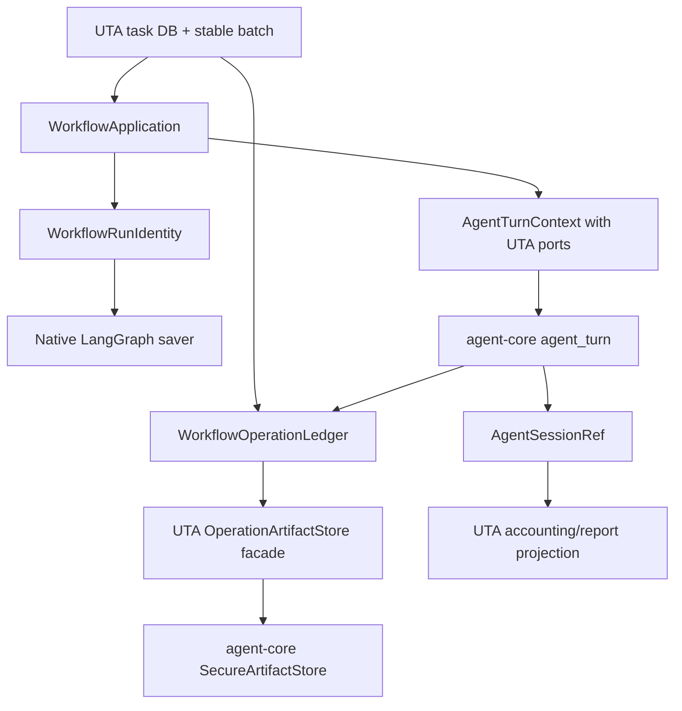
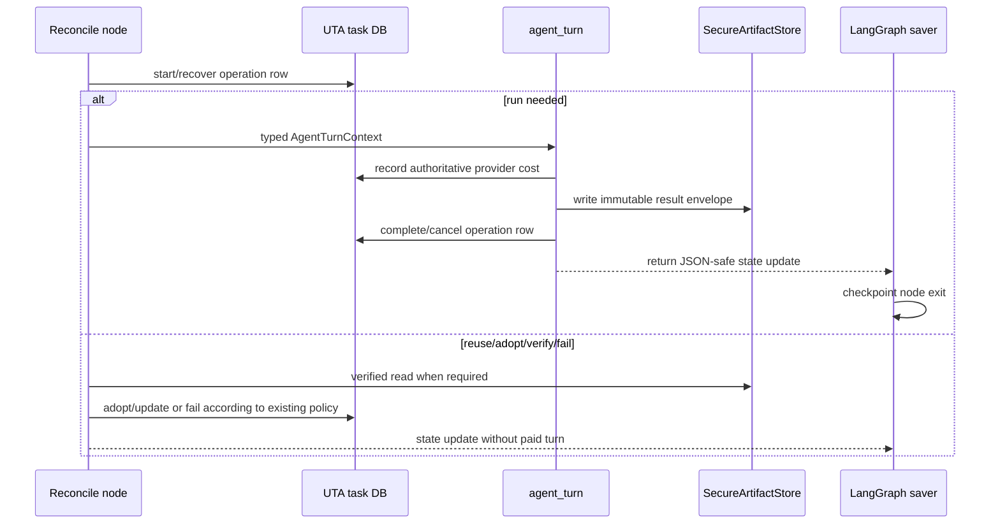

# Design Detail (unit-test-agent): Workflow Persistence and Common Capabilities

## Status And Scope

- Status: Phase 4 implemented and verified against agent-core 0.7.4 on 2026-08-24
- Cross-repo overview:
  `agent-core/docs/design-workflow-persistence-and-common-capabilities.md`
- Approved spec:
  `agent-core/docs/spec-workflow-persistence-and-common-capabilities.md`
- This document is authoritative for UTA composition, operation reconciliation,
  prompt identity, diagnostics presentation, and retention behavior.

## Contents

1. Repository changes and owned abstractions
2. Data/process/control flow
3. APIs, state, CLI, and persistence
4. Tradeoffs, capacity, failures, and verification

## Changes In This Repo

| Module/call path | Change |
| --- | --- |
| `uta.testgen.graph.application` | Compile with native saver and construct typed `AgentTurnContext`/`HarnessBinding`. |
| `uta.app.retention` | Call `delete_checkpoint_lineage`; preserve checkpoint-first deletion order. |
| `uta.testgen.operations.OperationArtifactStore` | Retain UTA envelope/identity facade; delegate generic bytes, locks, verification, and exact deletion to `SecureArtifactStore`. |
| `uta.testgen.prompts.artifacts` | Retain roots/scopes/leases/metadata/retention; use agent-core prompt bundle and secure store. |
| `uta.testgen.graph.cycle` | Materialize one prompt bundle and checkpoint its prompt/input/manifest paths. |
| `uta.testgen.session_analysis` and `session_usage` | Deleted; normalized turn evidence and neutral diagnostics reports are the only accounting/retrospective sources. |
| `uta.app.session_assessment` | Retain comparison/presentation over neutral diagnostics DTOs; no provider DB collection remains in UTA. |
| `uta.app.assessment_commands` | Add harness selection with default configured harness; report unsupported diagnostics explicitly. |
| Java/Python adapters and composition | Supply `AgentSessionRef` and typed execution ports without provider-specific imports. |
| README/architecture/usage | Document native checkpoint versus operation evidence and diagnostic limits. |

UTA task schemas, operation tables, operation IDs, stable batch IDs, generation
cycle YAML, phase semantics, enforcement contracts, and delivery policy do not
move.

## Key Data Structures And Abstractions

### Workflow application

`WorkflowApplication` continues to own a compiled cycle, native saver reference,
UTA ledger, and recursion limit. `open_workflow_application` performs:

1. validate a resumable harness;
2. open/init UTA product DB;
3. accept and canonicalize required `repository_root: Path`, then validate/create
   owner-only workflow-state root with that repository as a forbidden root;
4. construct UTA operation ledger with a secure artifact-backed facade;
5. construct typed agent-turn ports;
6. open agent-core's native checkpointer with
   `forbidden_roots=(repository_root,)`;
7. compile the cycle with that saver;
8. yield application;
9. close progress, graph resources, and saver in reverse order.

The typed context adapters are UTA-owned classes in the testgen application
layer, not task-persistence classes:

- `UtaCancellationSource`
- `UtaTurnGuard`
- `UtaTurnCostPort`
- `UtaTurnResultPort`
- `UtaProgressPort`
- `UtaSessionFactory`

They delegate to existing functions/ledger methods. The migration changes their
shape and construction location, not their semantics.

`UtaTurnCostPort` makes the product policy explicit. When any task, class, or
global currency cap applies, recording `TurnCost.unavailable` causes the next
provider submission in the same fallback/recovery chain to fail closed; the unit
becomes cost-blocked and requires operator reconciliation or cap removal. This is
an approved safety change from aggregate-after-chain behavior. When no currency
cap applies, the current bounded fallback/recovery chain may continue after an
unknown charge, but its aggregate stays unavailable. `WorkflowCostGate` is
refactored to distinguish these two cases instead of rejecting every unavailable
row unconditionally.

UTA does not invent a turn-owned heartbeat or lease port: current daemon heartbeat
and worker liveness remain independent background mechanisms. Harness timeout and
cancellation bound a silent provider stall. A future product pre-attempt check may
use the optional core observer without changing graph state. The graph node calls
agent-core's canonical `execute_agent_turn`; UTA does not implement a second
lifecycle.

### Operation artifact facade

UTA retains:

- `OperationIdentity`
- `OperationResultEnvelope`
- `StoredArtifact` compatibility projection where referenced
- `WorkflowOperationLedger`
- envelope schema version and validation
- operation row transitions and seven reconciliation outcomes

`OperationArtifactStore` becomes a thin facade over an injected
`SecureArtifactStore`. It encodes/decodes UTA envelopes, chooses the canonical
`<workflow_run_id>/<unit_id>/<operation_id>.json` relative path, supplies the
expected-entry predicate, and maps core artifact errors to
`ArtifactValidationError` at the existing UTA boundary.

No operation artifact is relocated in this iteration. Existing relative paths
and hashes remain valid.

### Prompt scope and bundle

`PromptArtifactScope` remains the sole authority for managed and standalone
roots. For one reconciled operation it supplies the bundle directory. The bundle
contains:

```text
<operation>/
  prompt.md
  inputs.json
  manifest.json
  references/...
```

`CycleState` adds optional `prompt_manifest_file`; existing `prompt_file` and
`prompt_inputs_file` remain. Resume logic treats a missing/incomplete/unverified
bundle as product evidence requiring rematerialization before the turn, using the
same operation identity and frozen template inputs. Prompt bytes do not change.

Standalone prompt bundles remain beneath the single leased standalone execution
root and are removed with that root on normal close.

### Neutral diagnostics

UTA's application composition retains the configured harness instance. Assessment
uses its `SessionDiagnosticsProvider` capability through the agent-core helper.
The CLI accepts existing repeated `--session-id` options and adds:

```text
--harness <registered-name>       default: configured UTA harness
--max-parts <n>                   default/core hard maximum enforced
--max-steps <n>                   default/core hard maximum enforced
```

Existing `--db-path` remains for one compatibility release only when
`--harness=opencode`; UTA passes it as an adapter diagnostic option rather than
opening SQLite itself. A deprecation warning names the replacement harness option.

UTA comparison, tables, ratios, and JSON projection remain app-owned. Core emits
exact total usage, raw `usage_by_model`, and typed bounded diagnostic signals.
UTA alone maps model keys to its existing main/small/other buckets and maps hint,
compile-fact, repeated-tool, and observation signal categories into current
private assessment fields. It renders `unsupported`/`unavailable` distinctly
from zero and never exposes a signal's private summary publicly.

### Session state

UTA already uses neutral `session_id` and `session_ids_json` persisted fields.
Graph state gains `turn_session_refs` and `session_refs`; each entry includes
harness, locator, and durable/process scope, and every fallback candidate is
retained. Existing string IDs remain as a UTA-owned report projection during the
consumer migration. Diagnostics resolve the referenced harness at invocation,
never during DTO deserialization and never by parsing an ID.

Legacy `session_id`/`session_ids` preserve the same process-wrapper IDs currently
emitted when those IDs exist, so report/API snapshots do not silently change.
When a future harness supplies only durable locators, the legacy projection uses
the latest durable locator. New reconciliation, diagnostics, and persistence code
uses `session_refs`; legacy strings never select a harness or claim complete
fallback history.

No UTA DB migration is required.

## Data Dependency Flow



## Key Process Flow (intra-repo)

### Operation execution and checkpoint



The existing ordering remains: claim before external work; cost callback after
provider result; guard acceptance; immutable result artifact and operation
completion inside the node; LangGraph checkpoint on node exit. The acknowledged
process-kill window between provider charge and cost callback remains outside this
iteration, as approved previously.

### Retention

For each eligible lineage:

1. prune progress records according to existing product retention;
2. call `delete_checkpoint_lineage(native_saver, identity)`;
3. only after successful checkpoint deletion, delete exact operation artifacts;
4. delete product operation/batch rows in their existing transaction;
5. delete exact prompt unit bundle;
6. retain all later evidence if an earlier step fails.

There is no SQL against LangGraph tables.

## Key Control Flow

### Resume

- `invoke_workflow` returns `started`: UTA executes from initial batch state.
- `resumed`: UTA logs/audits the pending nodes and lets reconcile nodes classify
  product effects before any paid turn.
- `reused_completed`: UTA performs terminal product-evidence validation and
  projection without invoking graph nodes.
- corrupt: UTA marks the unit/operator-visible workflow error and requires an
  explicit clean rerun; it does not mint an identity automatically.

### Diagnostics

- configured harness supports diagnostics: diagnose and render;
- stored harness is not registered: return typed unsupported/unavailable without
  making the durable row unreadable;
- unsupported: exit with a documented non-zero code and JSON status;
- unavailable/schema drift: retain sanitized reason and no false numeric totals;
- limits exceeded: require a narrower request; no partial comparison.

### Prompt recovery

- complete verified bundle: reuse paths;
- no bundle before turn: materialize;
- missing manifest/recognized partial residue: under the namespace lock,
  rematerialize final files and write the manifest last;
- final bundle with digest conflict: `fail_indeterminate`, never overwrite;
- bundle path under/containing repository: refuse before turn.

## API And Schema Changes

### Python APIs

- UTA first remains pinned to agent-core 0.6.11, then moves with its source
  migration to released agent-core 0.7.x; mixed old-UTA/new-core execution is not
  supported.
- `open_workflow_application(..., repository_root: Path)` constructs
  `HarnessBinding` and `AgentTurnContext`; `durable_cycle` passes the canonical
  `state["repo_path"]`. The same root is supplied to checkpointer, operation, and
  prompt secure-store validation.
- UTA retention imports `delete_checkpoint_lineage`.
- session analysis functions accept `SessionDiagnosticsReport` or the neutral
  provider helper, not `client: Any`.
- operation/prompt facades accept `SecureArtifactStore` for tests/composition.

### Graph state

Add optional JSON-safe fields:

- `prompt_manifest_file: str | None`
- `turn_session_refs: list[dict[str, str]]` with exactly `harness`, `locator`,
  and `scope`
- `session_refs: list[dict[str, str]]` with the same exact shape

Existing `session_id`, `session_ids`, `prompt_file`, and `prompt_inputs_file`
remain during the compatibility window. Graph topology version changes only if
the state-field addition changes a node/edge contract; merely adding optional
checkpoint-safe fields does not mint a new version.

### CLI

`uta assess` adds neutral harness/limit options and retains `--db-path` as one
release OpenCode compatibility input. JSON adds `harness` and diagnostic status;
existing numeric fields remain when exact totals are available.

### Database

N/A. UTA's task and operation schemas already use neutral session fields and
retain all existing operation evidence.

### Dependencies

UTA narrows LangGraph to `>=1.0,<2.0` and checkpoint SQLite to the agent-core
tested `>=2.0,<4.0` range. Agent-core owns direct saver construction; UTA does not
import concrete saver classes.

## Key Design Tradeoffs

- Keep the UTA ledger facade so callers and persisted paths stay stable while the
  byte mechanics move to core.
- Add prompt manifest state rather than derive a path silently, so resume can
  verify the exact bundle.
- Retain current diagnostic presentation in UTA; only collection/DTO move to the
  harness adapter.
- Preserve string session IDs as projections to avoid a broad report/schema
  migration in the same iteration.

Rejected: deleting `OperationArtifactStore` entirely. UTA still needs envelope
encoding, error translation, identity paths, and exact retention predicates.

## Capacity, Reliability, And Security

- One native saver is opened per current workflow application; no extra
  checkpoint reads/writes.
- Artifact locking is one local lock per result and never spans a turn.
- Prompt bundle adds one small manifest-last write per operation;
  reference count is bounded by core and current templates.
- Diagnostics are explicit operator work, bounded by core limits, and use one
  read-only local query.
- Artifact/checkpoint roots remain outside repositories and owner-only.
- Existing operation hash and workspace fingerprint checks remain authoritative.
- No raw diagnostics enter SSE/report events; reports receive bounded aggregates.
- Enforcement packages and language enforcement bindings remain independent of
  agent-core internals.

## Failure-Mode Handling

| Failure | Detection | Recovery |
| --- | --- | --- |
| Saver deletion unsupported | Retention capability error | Stop before artifact/product deletion; upgrade/check backend. |
| Result artifact conflict | UTA `ArtifactValidationError` | Quarantine operation; operator clean rerun with new lineage if approved. |
| Core artifact security rejection | Exact path/reason in private log | Repair owner-only application root; do not move into repo. |
| Prompt manifest conflict | Reconcile `fail_indeterminate` | Inspect retained bundle and operation identity. |
| Typed port missing | Application configuration error before paid work | Fix composition/configuration. |
| Diagnostics unavailable | CLI typed status | Use supported harness/storage or task-recorded normalized usage. |
| Crash in retained cross-store windows | Existing operation classification | Reuse/adopt/verify/retry/fail according to current matrix. |

## Repo-Local Risks And Verification

### Risks

1. Accidentally changing an operation path breaks persisted row references.
   Freeze existing path fixtures and read old artifacts with the new facade.
2. Prompt bundle directory change affects prompt byte snapshots or delivery
   staging. Freeze bytes and assert all private roots remain excluded from Git.
3. Typed context changes callback ordering. Share the agent-core ordered trace and
   retain UTA crash tests.
4. UTA's dirty architecture migration overlaps many files. Implement this design
   only after the current architecture-boundary iteration is committed; do not
   mix unrelated worktree changes.

### Verification

- Existing generation application, operation artifact, retention, prompt,
  standalone, and Java/Python E2E suites.
- Cost fixtures cover known fallback aggregation, capped unknown stopping before
  candidate two, uncapped unknown continuing the bounded chain, and the same
  policy for recovery turns.
- New native-saver source boundary and no checkpoint-table SQL.
- Application integration rejects both checkpoint/artifact root inside the
  repository and repository inside a managed root, including symlinked ancestors.
- Old operation artifact read/rehydrate fixtures.
- Every reconciliation decision skips or enters the expensive node correctly.
- `uta assess` supported/unsupported/schema-drift/limit fixtures.
- Package dependency scan proving tools/enforcement remain independent.
- Beta scripted interruption between operation completion and checkpoint followed
  by resume with no repeated turn.

## Changelog

- 2026-08-20 — Initial UTA detail generated from the approved spec.
- 2026-08-20 — Revision 2 restores live retention ordering and specifies the
  canonical turn observer, diagnostics projection, multi-session refs, and
  manifest-last recovery.
- 2026-08-20 — Revision 3 passed fourth independent design review with explicit
  cap-aware unknown-cost and forbidden-root composition policy.
