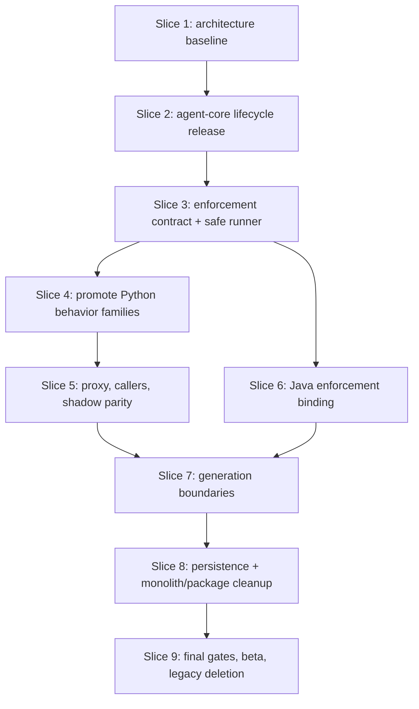

# Implementation Plan: UTA Architecture Boundary and Package Cleanup

Status: draft for requester approval. Implementation is blocked until this plan
and its companion task list are approved.

This is confirmed non-Jira tool/product architecture work.

Inputs:

- Spec: `docs/spec-uta-architecture-boundary-cleanup.md`
- Overview design: `docs/design-uta-architecture-boundary-cleanup.md`
- UTA detail: `docs/design-uta-architecture-boundary-cleanup-uta.md`
- Agent-core detail: `../agent-core/docs/design-uta-architecture-boundary-cleanup.md`
- Usage: `docs/usage-uta-architecture-boundary-cleanup.md`
- Decisions: ADR-011 through ADR-014 in UTA and agent-core ADR-001

## Overview

Implementation proceeds as nine ordered rollout slices. Agent-core adds and
releases the neutral lifecycle first. UTA then builds the immutable enforcement
contract and safe command port, promotes every Python behavior family into the
distributed binding behind frozen fixtures, migrates callers with shadow parity
control, adds the Java binding, separates generation and persistence ownership,
splits remaining monoliths, and finally deletes parallel facades. No database
schema, durable identity, evidence schema, prompt, quality-policy, cost-policy,
or retry-policy change is authorized.

## Architecture Decisions Frozen By This Plan

- `EnforcementRegistry` receives its complete mapping at construction and is
  immutable. Dispatch is stateless `uta_enforce_core.enforce()`.
- `EnforcementRequest` contains no caller/mode enum. CI sampling exists only as
  an invocation-context policy constructed by CI composition.
- The canonical Python binding remains in
  `tools/python-enforcement/uta_py_enforce`; UTA delegates through a thin proxy.
- App composition selects and injects generation bindings. Testgen imports only
  the generation contract, agent-core, and enforcement contract.
- `TaskDB` stays the SQLite transaction facade while repositories/services are
  split behind it. Filesystem/checkpoint reconciliation remains testgen-owned.
- `uta assess` is the one named OpenCode-specific app exemption. Other product
  code becomes harness-neutral.
- The requester waived a distributed default-runner RSS limit. UTA's injected
  runner must preserve the existing 3 GiB guard and marker.

## Dependency Graph

Python family promotion is sequential because later families consume earlier
request/runtime/process contracts. Java binding work can run after the neutral
contract exists and in parallel with later Python promotions. Persistence and
large-module splits start only after the public dependency checker is enforcing
the new directions, so moves cannot recreate hidden cycles.

## Task List

### Slice 1 — Freeze Baseline And Make Architecture Executable

#### Task 1: Add the AST package-dependency scanner

**Description:** Add the standard-library scanner and deterministic graph
output for eager, lazy, and `TYPE_CHECKING` imports.

**Acceptance criteria:**

- Scanner covers `uta/**/*.py` and `tools/python-enforcement/**/*.py` once and
  completes under the 5-second design budget.
- Output records importer, imported module, line, and edge classification.
- Fixture tests prove eager/lazy/type-only and logical-cycle detection.

**Verification:**
` .venv312/bin/python scripts/check_package_dependencies.py` and focused scanner
tests.

**Dependencies:** None.

**Files likely touched:** `scripts/check_package_dependencies.py`,
`scripts/package_dependency_policy.py`, `tests/test_package_dependencies.py`,
`tests/fixtures/package_dependencies/*`.

**Estimated scope:** Medium.

#### Task 2: Encode the approved dependency policy and named exemptions

**Description:** Encode one-way package rules, sparse-client isolation, wildcard
ban, temporary seam metadata, and the exact two-file `uta assess` exemption.

**Acceptance criteria:**

- Existing known violations are enumerated as temporary entries with owner and
  deletion milestone rather than broad package exemptions.
- Assessment exemption asserts its sole importer and blocks reachability from
  tasks, testgen, enforcement, and language code.
- New prohibited edges fail with an actionable source location.

**Verification:** Focused policy tests plus a current-tree baseline report.

**Dependencies:** Task 1.

**Files likely touched:** `scripts/package_dependency_policy.py`,
`tests/test_package_dependencies.py`, `tests/test_opencode_assessment_placement.py`.

**Estimated scope:** Small.

#### Task 3: Capture pre-refactor behavior, import, and call-count baselines

**Description:** Freeze current public imports, CLI help, evidence payloads,
critical SQLite statement counts, enforcement subprocess counts, and generation
phase routes before moving code.

**Acceptance criteria:**

- Baselines cover Java/Python managed and standalone generation, Python
  enforcement entrypoints, task terminal/progress/operation transactions, and
  marker payloads.
- Baseline artifacts contain no machine-local absolute paths or credentials.
- Later tasks can compare behavior without importing old private modules.

**Verification:** Characterization suite passes on the unchanged implementation.

**Dependencies:** Task 1.

**Files likely touched:** `tests/test_architecture_behavior_baseline.py`,
`tests/fixtures/architecture_baseline/*`, existing focused snapshot tests.

**Estimated scope:** Medium.

### Checkpoint A — Baseline

- [ ] Dependency scanner runs deterministically under 5 seconds.
- [ ] Every current exception is explicit and deletion-conditioned.
- [ ] Behavior/call-count fixtures pass before provider or enforcement changes.

### Slice 2 — Release Neutral Harness Lifecycle From Agent-Core

#### Task 4: Add typed lifecycle contracts and readiness metadata

**Description:** In agent-core, add typed preparation/readiness/bootstrap
protocols, `BootstrapResult`, `ReadinessRetryPolicy`, and exact
`HarnessSpec.readiness` semantics while preserving old factories.

**Acceptance criteria:**

- Old/third-party harness construction remains source compatible.
- Missing readiness never silently means authenticated; explicit
  `not_required` is retained by the created harness/spec metadata.
- Bootstrap returns a typed neutral result; public detail is bounded/sanitized.

**Verification:** Agent-core lifecycle contract and old-consumer tests.

**Dependencies:** Checkpoint A.

**Files likely touched:** `src/agent_core/harness/lifecycle.py`,
`src/agent_core/harness/registry.py`, `src/agent_core/harness/__init__.py`,
`tests/test_harness_lifecycle.py`.

**Estimated scope:** Medium.

#### Task 5: Implement OpenCode preparation and readiness behind the contract

**Description:** Move configuration preparation and readiness/auth probing into
`OpenCodeHarness`, preserving the provider gate, three attempts, 3s/6s backoff,
and hard-fail product outcome.

**Acceptance criteria:**

- Preparation reuses current config builders without returning provider fields.
- Only `unavailable` retries; authentication-required and ready return
  immediately; worst-case budget remains 369 seconds.
- Provider errors map to neutral, sanitized readiness states.

**Verification:** OpenCode success/auth/rate-limit/timeout/5xx tests and exact
attempt/sleep call-count parity.

**Dependencies:** Task 4.

**Files likely touched:** `src/agent_core/harness/opencode.py`,
`src/agent_core/harness/lifecycle.py`, `tests/test_harness_lifecycle_opencode.py`,
`tests/test_opencode_config.py`.

**Estimated scope:** Medium.

#### Task 6: Implement neutral workspace bootstrap and cleanup

**Description:** Put OpenCode initialization/session behavior behind the typed
bootstrap capability while keeping UTA artifact policy outside agent-core.

**Acceptance criteria:**

- Bootstrap works with and without a prompt, returns the typed result, and
  closes temporary sessions/processes once.
- Unsupported harness raises the neutral unsupported error.
- A fake second harness satisfies the same product-facing API without OpenCode.

**Verification:** Bootstrap isolation, failure, cleanup, and fake-harness tests.

**Dependencies:** Task 4.

**Files likely touched:** `src/agent_core/harness/lifecycle.py`,
`src/agent_core/harness/opencode.py`, `tests/test_harness_bootstrap.py`,
`tests/test_consumer_integration.py`.

**Estimated scope:** Medium.

#### Task 7: Release agent-core and pin the verified artifact in UTA

**Description:** Run the full agent-core gate, update API docs/ADR status,
release from main, verify the remote/tag/artifact, then pin UTA to that released
version before any lifecycle consumer change.

**Acceptance criteria:**

- Agent-core full tests, compile, lint, wheel inspection, and consumer
  compatibility pass.
- Main branch, tag, and built artifact resolve to the same commit.
- UTA uses a released version, never a temporary snapshot/path dependency.

**Verification:** Agent-core release commands plus UTA dependency install/import
smoke test.

**Dependencies:** Tasks 5 and 6.

**Files likely touched:** agent-core `pyproject.toml`, lifecycle docs/ADR;
UTA `pyproject.toml` and lock/requirements metadata.

**Estimated scope:** Medium; multi-repo sequential release task.

### Checkpoint B — Provider API

- [ ] Released agent-core exposes lifecycle APIs and preserves old consumers.
- [ ] UTA installs the released artifact successfully.
- [ ] No UTA concrete-provider path has been removed yet.

### Slice 3 — Build The Sole Enforcement Contract And Safe Runner

#### Task 8: Add immutable enforcement DTOs, validation, and registry

**Description:** Build frozen request/result/capability/value contracts and an
immutable construction-time registry in `uta_enforce_core`.

**Acceptance criteria:**

- Registry has no register/freeze lifecycle; duplicate normalized names fail at
  construction and unknown languages fail clearly.
- Request has no caller/mode field; nested evidence/metadata is defensively
  copied into validated snapshots.
- Existing evidence payloads round-trip without field/version changes.

**Verification:** Contract golden, immutability, invalid path/gate/limit, and
registry tests in isolated `PYTHONPATH=tools/python-enforcement` mode.

**Dependencies:** Checkpoint A.

**Files likely touched:** `tools/python-enforcement/uta_enforce_core/contracts.py`,
`registry.py`, `validation.py`, `__init__.py`, focused tests.

**Estimated scope:** Medium.

#### Task 9: Add stateless enforcement dispatch

**Description:** Implement module-level `enforce(request, *, registry, context)`
with one validation, lookup, capability check, invocation, and result validation.

**Acceptance criteria:**

- Binding is invoked exactly once and dispatch holds no global mutable state.
- Java-only registry construction/import does not load Python tooling.
- Contract and dispatch import no UTA, agent-core, or concrete binding.

**Verification:** Call-count, lazy-import, unsupported capability, and source
boundary tests.

**Dependencies:** Task 8.

**Files likely touched:** `uta_enforce_core/dispatch.py`, `__init__.py`,
`tests/test_enforcement_dispatch.py`, dependency-policy fixtures.

**Estimated scope:** Small.

#### Task 10: Implement the safe distributed command-runner port

**Description:** Define neutral command request/result protocols and a safe
default process runner with no shell, allow-listed environment, repository path
confinement, cancellation polling, process-group teardown, timeout, and 2/6 MiB
head/tail output limits.

**Acceptance criteria:**

- Default runner leaves no child process after timeout/cancel and rejects path,
  executable, shell, or environment violations before spawn.
- UTA injected runner passes the same conformance suite and preserves the
  existing 3 GiB RSS marker/guard.
- The approved waiver is visible: the distributed default runner does not claim
  RSS enforcement.

**Verification:** Shared conformance suite against both runners, orphan check,
output-marker golden, and UTA-only RSS test.

**Dependencies:** Task 8.

**Files likely touched:** `uta_enforce_core/commands.py`,
`uta_py_enforce/process.py`, UTA command-runner adapter, conformance tests.

**Estimated scope:** Medium.

#### Task 11: Enforce numeric request and subprocess budgets

**Description:** Apply the design limits: 200 targets, five test paths per
target, 1800 seconds per command, 7200 seconds total, current mutation batch
size/show budget, and one registry lookup.

**Acceptance criteria:**

- Over-limit requests fail before any subprocess and report the actual count.
- Process-count fixtures equal the pre-refactor recording for accepted inputs.
- Canonical shadow work has an independent deadline and cannot affect the
  legacy verdict.

**Verification:** Boundary/limit and process-call-count tests.

**Dependencies:** Tasks 9 and 10.

**Files likely touched:** `uta_enforce_core/validation.py`,
`uta_py_enforce/api.py`, `tests/test_enforcement_limits.py`, call-count fixture.

**Estimated scope:** Small.

### Checkpoint C — Neutral Enforcement Foundation

- [ ] Contract and dispatch run from the isolated tools tree.
- [ ] Both process runners pass their approved conformance scope.
- [ ] No legacy enforcement caller has been redirected.

### Slice 4 — Promote Canonical Python Enforcement Families

Every task captures its frozen fixture from the authoritative current UTA code
before moving the behavior. A family is marked promoted only when the fixture,
isolated tools test, full-UTA adapter test, and dependency boundary are green.

#### Task 12: Promote strict test selection and target context

**Acceptance criteria:** Preserve src/flat/namespace layouts, configured versus
discovered paths, five-result limit, and broad-token exclusions; delete the
filename-stem implementation after parity.

**Verification:** `test_selection.json` golden in isolated and UTA contexts.

**Dependencies:** Checkpoint C.

**Files likely touched:** `uta_py_enforce/test_selection.py`, target-context
module, old UTA selector facade, fixture test.

**Estimated scope:** Medium.

#### Task 13: Promote nested dependency overlays and cache identity

**Acceptance criteria:** Preserve nearest-manifest selection, satisfied/missing
imports, digest-keyed locked overlays, cache hit, install evidence, and
`setup_failed` behavior.

**Verification:** `dependency_overlay.json` plus concurrency/cache tests.

**Dependencies:** Tasks 10 and 12.

**Files likely touched:** `uta_py_enforce/dependency_overlay.py`, runtime helper,
old UTA facade, fixture test.

**Estimated scope:** Medium.

#### Task 14: Promote request targets, changed lines, and non-executable shortcut

**Acceptance criteria:** Preserve added/modified/deleted path handling,
changed-line derivation, repository confinement, and no-command short circuit
for non-executable-only changes.

**Verification:** `targets_changed_lines.json` and
`non_executable_only.json`.

**Dependencies:** Task 12.

**Files likely touched:** `uta_enforce_core/targets.py`,
`uta_py_enforce/targets.py`, `uta_py_enforce/api.py`, fixture tests.

**Estimated scope:** Medium.

#### Task 15: Promote runtime resolution and incompatibility precheck

**Acceptance criteria:** Preserve Python 3/Python 2 selection, configured
fallback, missing interpreter/mutmut reasons, and py2-source-under-py3
incompatibility evidence.

**Verification:** `runtime_resolution.json` and `runtime_incompatible.json`.

**Dependencies:** Tasks 10 and 13.

**Files likely touched:** `uta_py_enforce/runtime.py`, runtime-precheck module,
old UTA facade, fixture tests.

**Estimated scope:** Medium.

#### Task 16: Promote mutmut ownership and import compatibility

**Acceptance criteria:** Preserve owned/foreign/absent/old mutmut handling and
the import-compat behavior without importing UTA.

**Verification:** `mutmut_version_matrix.json` and sparse-copy import tests.

**Dependencies:** Task 15.

**Files likely touched:** `uta_py_enforce/mutmut_adapter_runtime.py`, import
compat module, old UTA facade, fixture test.

**Estimated scope:** Medium.

#### Task 17: Promote pytest execution context and coverage

**Acceptance criteria:** Preserve import roots/isolation for src, flat,
namespace layouts and exact changed-line coverage include/scoping/evidence.

**Verification:** `pytest_import_roots.json`, `coverage_changed_lines.json`, and
process conformance.

**Dependencies:** Tasks 12, 13, and 15.

**Files likely touched:** `uta_py_enforce/pytest_context.py`, `coverage.py`, old
UTA coverage facade, two fixture tests.

**Estimated scope:** Medium.

#### Task 18: Promote mutation scoping, masking, and generation policy

**Acceptance criteria:** Preserve changed-line masks, low-value/pragma rules,
representative selection, hard caps, batching, and stable policy hash.

**Verification:** `mutation_scope_mask.json`, `generation_policy.json`, and
existing policy-hash identity assertion.

**Dependencies:** Tasks 14, 16, and 17.

**Files likely touched:** `uta_py_enforce/mutation_policy.py`,
`mutation_generation_policy.py`, old UTA policy facade, fixture tests.

**Estimated scope:** Medium.

#### Task 19: Promote zero-mutant reconciliation and survivor annotations

**Acceptance criteria:** Preserve no-candidate/no-test-association reasons,
mutmut metadata reconciliation, compact survivor diffs, and show-budget
exhaustion.

**Verification:** `zero_mutant_reconciliation.json` and `survivor_diffs.json`.

**Dependencies:** Task 18.

**Files likely touched:** `uta_py_enforce/mutation.py`,
`mutation_survivors.py`, old UTA facade, fixture tests.

**Estimated scope:** Medium.

#### Task 20: Promote test-quality and evidence aggregation

**Acceptance criteria:** Move neutral aggregation to `uta_enforce_core`, Python
scanner to `uta_py_enforce`, keep Java scanner binding-owned, and preserve all
status/reason/gate evidence fields.

**Verification:** `test_quality_evidence.json`, shared Java/Python aggregation
test, and existing marker/evidence payload goldens.

**Dependencies:** Tasks 17 and 19.

**Files likely touched:** `uta_enforce_core/evidence.py`, test-quality module,
`uta_py_enforce/test_quality.py`, old UTA facade, fixture tests.

**Estimated scope:** Medium.

#### Task 21: Build the canonical Python binding facade

**Description:** Compose all promoted families behind
`PythonEnforcementBinding` and make the distributed CLI a parse/print adapter.

**Acceptance criteria:**

- Binding uses every promoted family and invokes the supplied runner only.
- CLI flags, exit codes, Python 2 lane, and evidence payload bytes remain
  stable; known surrounding marker differences remain separately frozen.
- Sparse checkout needs no UTA, agent-core, API, DB, or workflow package.

**Verification:** Full family suite, CLI snapshot, package isolation, and one
real fixture orchestration.

**Dependencies:** Tasks 12–20.

**Files likely touched:** `uta_py_enforce/api.py`, `cli.py`, `__init__.py`,
`uta_python_test_enforce.py`, binding integration tests.

**Estimated scope:** Medium.

### Checkpoint D — Canonical Binding Ready, No Caller Redirected

- [ ] Every promotion family has its named frozen fixture.
- [ ] Distributed CLI is isolated and behavior-compatible.
- [ ] Legacy UTA remains authoritative until Slice 5 promotion gates pass.

### Slice 5 — UTA Proxy, Caller Migration, And Shadow Promotion

#### Task 22: Add the thin UTA Python proxy and CI policy boundary

**Acceptance criteria:** Proxy delegates once, implements no command/evidence/
mutation algorithm, and only CI composition constructs a context with
`sampling_policy`; repair/full/local/generation paths cannot import the sampler.

**Verification:** Delegation spy, source-boundary CI policy test, and existing
sampling fixture.

**Dependencies:** Task 21.

**Files likely touched:** `uta/enforcement/bindings/python_proxy.py`, CI
composition, app enforcement composition, proxy tests.

**Estimated scope:** Medium.

#### Task 23: Add harness-neutral UTA configuration migration

**Acceptance criteria:** Add `UTA_AGENT_HARNESS`, opaque
`UTA_HARNESS_OPTIONS`, eight meaning-owned settings, new-over-legacy precedence,
one deduplicated warning, and verbatim options forwarding; retain the named
assessment exemption only.

**Verification:** Per-setting matrix, conflict/warning tests, and source scan
showing no other concrete-provider settings branch.

**Dependencies:** Task 7.

**Files likely touched:** `uta/shared/config.py`, `uta/testgen/harness.py`, app
harness startup/composition, config migration tests.

**Estimated scope:** Medium.

#### Task 24: Migrate local and full Python enforcement CLIs

**Acceptance criteria:** Local CLI invokes the binding directly; `uta
python-enforce` invokes the proxy through immutable registry/dispatch; flags,
exit codes, evidence payload, and no-sampling behavior remain stable.

**Verification:** CLI help/golden/E2E and isolated sparse-copy tests.

**Dependencies:** Tasks 21–23.

**Files likely touched:** distributed CLI, UTA Python enforcement command,
composition module, CLI tests.

**Estimated scope:** Medium.

#### Task 25: Migrate repair and generation-quality entrypoints

**Acceptance criteria:** Both paths use the proxy, preserve UTA runner/progress/
task projection and unsampled behavior, and contain no fallback to legacy on a
contract error.

**Verification:** Repair verification and durable generation E2E parity.

**Dependencies:** Tasks 22 and 24.

**Files likely touched:** repair enforcement adapter, generation verification
adapter, composition helpers, focused E2E tests.

**Estimated scope:** Medium.

#### Task 26: Migrate CI, API, daemon, and service entrypoints

**Acceptance criteria:** All product entrypoints share one composition module;
only CI injects sampling; service/daemon modules stay under size guardrails and
do not construct bindings ad hoc.

**Verification:** CI/API/daemon/service contract tests and dependency scan.

**Dependencies:** Tasks 22 and 24.

**Files likely touched:** Python CI handler, API/service composition, daemon
composition, focused tests.

**Estimated scope:** Medium.

#### Task 27: Implement shadow parity records and promotion control

**Acceptance criteria:** Implement `legacy|shadow|canonical`, per-repository
shadow selection, independent canonical budget, JSONL records, deterministic
exclusions, `uta parity-report`, and exact promotion/rollback thresholds.

**Verification:** Mismatch/error/timeout/threshold report tests and a shadow run
that proves legacy verdict isolation.

**Dependencies:** Tasks 24–26.

**Files likely touched:** Python enforcement dispatch adapter, parity record
store, parity CLI command, config, parity tests.

**Estimated scope:** Medium.

### Checkpoint E — Python Promotion Gate

- [ ] All five product entrypoint families can run canonical through one proxy.
- [ ] Shadow never changes the legacy verdict or shares its deadline.
- [ ] `uta parity-report` provides the recorded promotion evidence.
- [ ] Legacy deletion remains blocked until the soak task in Slice 9.

### Slice 6 — Java Enforcement Behind The Sole Contract

#### Task 28: Add Java binding command planning and execution

**Acceptance criteria:** Java binding implements the shared protocol, uses the
neutral command runner, preserves Maven command/timeout/environment behavior,
and imports no task manager/app composer.

**Verification:** Command plan/execution characterization and runner conformance.

**Dependencies:** Checkpoint C.

**Files likely touched:** `uta/enforcement/bindings/java/binding.py`,
`planning.py`, `execution.py`, Java binding tests.

**Estimated scope:** Medium.

#### Task 29: Split Java output parsing and evidence classification

**Acceptance criteria:** Surefire/JaCoCo/PIT parsing remains Java-owned,
normalized evidence matches current fixtures, and neutral test-quality
aggregation is shared with Python.

**Verification:** Java evidence goldens and cross-language aggregator test.

**Dependencies:** Tasks 20 and 28.

**Files likely touched:** Java binding `parsing.py`, `evidence.py`, old runner
facade, focused tests.

**Estimated scope:** Medium.

#### Task 30: Migrate Java callers and retire competing enforcement protocols

**Acceptance criteria:** Java CI/repair/generation call dispatch through the
immutable registry; unused `EnforcementCore`, `EnforcementRunner`, and
`VerificationRunner` top-level contracts have zero production callers and are
deleted.

**Verification:** Java managed/standalone generation, CI/repair tests, import
scan, and public facade snapshots.

**Dependencies:** Task 29.

**Files likely touched:** Java CI composition, generation enforcement adapter,
repair adapter, old enforcement protocol modules, tests.

**Estimated scope:** Medium.

### Checkpoint F — Sole Enforcement Contract

- [ ] Java and Python both dispatch through `uta_enforce_core.enforce()`.
- [ ] No competing top-level enforcement protocol remains.
- [ ] Evidence/gates remain byte/contract compatible.

### Slice 7 — Separate Generation-Language Bindings

#### Task 31: Add generation contracts and app-owned binding composition

**Acceptance criteria:** Dependency-light generation values/protocols exist;
app selects/injects one binding; testgen imports no concrete binding or umbrella
`LanguageAdapter`; one language startup does not load the other.

**Verification:** Composition, lazy-import, unsupported-language, and existing
batch request/result tests.

**Dependencies:** Checkpoints E and F.

**Files likely touched:** `uta/language/contracts.py`, app language composition,
testgen runner/backend contract, focused tests.

**Estimated scope:** Medium.

#### Task 32: Extract Java generation helper families

**Acceptance criteria:** Quality, selection, commands, writeback/evidence, and
mutation-context helpers move to focused modules; `phases/ports.py` and
`cycle_inputs.py` no longer import the generation facade.

**Verification:** Java prompt/phase/evidence/compile/coverage/mutation
characterization and dependency scan.

**Dependencies:** Task 31.

**Files likely touched per sub-commit:** At most one focused destination module,
the old facade, one direct caller, and focused tests. Implement as five
sub-commits matching the helper families.

**Estimated scope:** Five small sequential sub-tasks.

#### Task 33: Remove Java adapter/phase/composer back-edges

**Acceptance criteria:** Prompt/phase ports are injected downward, compile/
coverage/mutation phases never instantiate `JavaLanguageAdapter`, and the
recorded eight-module logical cycle disappears.

**Verification:** Dependency graph plus durable Java route/recovery/E2E tests.

**Dependencies:** Task 32.

**Files likely touched:** Java adapter, generation backend, phase port factory,
affected phase, cycle tests.

**Estimated scope:** Medium.

#### Task 34: Remove Python generation and verification logical cycles

**Acceptance criteria:** Public result/models are dependency-light,
`mutation_context` and runner no longer import each other, and Python generation
leaf receives testgen/enforcement/delivery ports instead of importing composers.

**Verification:** Dependency graph, Python managed/standalone workflow, staged
E2E, and result projection tests.

**Dependencies:** Tasks 21, 25, and 31.

**Files likely touched:** Python generation binding, verification models,
mutation context, generation backend, focused tests.

**Estimated scope:** Medium.

#### Task 35: Retire the umbrella language adapter and old generation facades

**Acceptance criteria:** Zero production callers remain for umbrella methods or
same-name compatibility facades; explicit public exports remain only where
documented; module-to-package moves preserve import snapshots during each step.

**Verification:** Public import snapshots, dependency scan, full language
selection and generation tests.

**Dependencies:** Tasks 33 and 34.

**Files likely touched:** `uta/shared/languages.py`, Java/Python adapter exports,
app composition, facade tests.

**Estimated scope:** Medium.

### Checkpoint G — Generation Direction

- [ ] App composes generation; testgen consumes the neutral contract.
- [ ] Java and Python logical cycles are gone, including lazy back-edges.
- [ ] Durable routes/prompts/results/retries remain unchanged.

### Slice 8 — Persistence Ownership And Monolith Cleanup

#### Task 36: Split TaskDB connection and schema ownership

**Acceptance criteria:** Connection/transaction and schema/migration modules are
separate; `TaskDB.transaction()` remains the sole outer transaction; schema
version/SQL are unchanged.

**Verification:** Migration/idempotency, nested transaction guard, and query
snapshot tests.

**Dependencies:** Checkpoint G.

**Files likely touched:** `uta/tasks/storage/connection.py`, `schema.py`,
`uta/tasks/db.py`, DB tests.

**Estimated scope:** Medium.

#### Task 37: Split task/class and scheduler/heartbeat repositories

**Acceptance criteria:** Repository methods accept an existing connection,
facade signatures remain stable, acquisition/status/heartbeat atomicity and
query counts match baseline.

**Verification:** Lifecycle/acquisition/fault/query-count tests.

**Dependencies:** Task 36.

**Files likely touched:** task repository, scheduler repository, DB facade,
focused tests.

**Estimated scope:** Medium.

#### Task 38: Split event/progress and operation/accounting repositories

**Acceptance criteria:** Terminal/event and progress counter/event writes remain
single transactions; operation/accounting exact-once semantics and indexes are
unchanged.

**Verification:** Statement-boundary fault injection, cursor, progress budget,
ledger/accounting tests.

**Dependencies:** Task 36.

**Files likely touched:** event repository, operation repository, progress
store/facade, focused tests.

**Estimated scope:** Medium.

#### Task 39: Add app-owned testgen persistence adapters

**Acceptance criteria:** Testgen receives immutable task snapshots and narrow
reader/writer/UoW ports; no phase/domain code constructs `TaskManager`, sees a
connection, or imports task implementations.

**Verification:** Adapter contract, product projection, dependency, and durable
workflow tests.

**Dependencies:** Tasks 37 and 38.

**Files likely touched:** `uta/testgen/ports/persistence.py`,
`uta/app/persistence/testgen.py`, app composition, testgen application, tests.

**Estimated scope:** Medium.

#### Task 40: Move retention coordination out of tasks

**Acceptance criteria:** Preserve exact five-step deletion order and eligibility,
legacy read-only window, root/symlink guards, orphan handling, and idempotency;
tasks imports neither agent-core nor testgen artifacts.

**Verification:** Crash/partial-delete/legacy/standalone retention suite and
dependency scan.

**Dependencies:** Tasks 38 and 39.

**Files likely touched:** app retention coordinator, testgen retention package,
task eligibility repository, old facade, tests.

**Estimated scope:** Medium.

#### Task 41: Move RDC delivery and remaining Git composition to app ownership

**Acceptance criteria:** `uta.tasks` has no agent-core Git import; app delivery
adapter preserves branch/commit/push/failure policy and task projections.

**Verification:** RDC delivery, Git failure, cancellation, and dependency tests.

**Dependencies:** Task 39.

**Files likely touched:** app delivery adapter, tasks RDC facade, composition,
focused tests.

**Estimated scope:** Small.

#### Task 42: Split testgen operation storage and reconciliation

**Acceptance criteria:** Models/artifact store/cost gate/reconciliation/ledger
are focused modules; operation ID and payload bytes are unchanged; source write
order is SQLite claim → repository work → artifact+completion → checkpoint.

**Verification:** Four-boundary crash injection and five reconciliation outcomes,
including no repeated paid work after completed ledger.

**Dependencies:** Tasks 38 and 39.

**Files likely touched per sub-commit:** one operations destination, facade,
direct caller, focused tests. Implement as models/store then reconcile/ledger.

**Estimated scope:** Two medium sequential sub-tasks.

#### Task 43: Split task lifecycle and accounting services

**Acceptance criteria:** Transitions/stages, recovery/preemption, result
projection, token accounting, and delivery outcomes are focused services;
TaskManager facade and public summaries stay compatible.

**Verification:** Lifecycle/recovery/preemption/accounting/report compatibility
and query-count tests.

**Dependencies:** Tasks 37 and 38.

**Files likely touched per sub-commit:** one destination service, facade/mixin,
one test module. Implement as four small sub-tasks.

**Estimated scope:** Four small sequential sub-tasks.

#### Task 44: Split project-summary and Java context builders

**Acceptance criteria:** Product summary policy/artifacts/rendering/retrospective
are separate from neutral agent execution; Java context analysis/rendering/
index/ROI storage are separate behind stable facades.

**Verification:** Summary bootstrap/harvest, context/index/ROI goldens, fake
harness, and dependency tests.

**Dependencies:** Tasks 7 and 33.

**Files likely touched per sub-commit:** one destination module, facade, one
caller, tests. Implement summary and Java context as separate task runs.

**Estimated scope:** Two medium sequential sub-tasks.

#### Task 45: Split repair application services

**Acceptance criteria:** Session, progress, deferred-task, workspace/rerun, and
locking responsibilities are focused; public repair API/report behavior and
cost provenance remain unchanged.

**Verification:** Repair workflow, cancellation, locking, progress, reporting,
and source-size tests.

**Dependencies:** Tasks 25, 39, and 41.

**Files likely touched per sub-commit:** one repair destination, facade, focused
tests. Implement as three small sub-tasks.

**Estimated scope:** Three small sequential sub-tasks.

#### Task 46: Split CLI and task command registration

**Acceptance criteria:** Root CLI, source discovery, neutral harness startup,
and focused task command groups preserve command names, flags, help, exit codes,
and stable imports.

**Verification:** Full CLI help snapshots, command tests, source-size and
dependency gates.

**Dependencies:** Tasks 23, 26, 39, and 45.

**Files likely touched per sub-commit:** one command group, root registrar, one
test module. Implement by command group.

**Estimated scope:** Several small sequential sub-tasks.

#### Task 47: Delete `uta.engine`, wildcard bridges, and expired facades

**Acceptance criteria:** Every former engine symbol has one owned destination;
zero production callers use old facades/wildcards; same-name module→package
migrations preserve imports during the move and leave no shadowed module.

**Verification:** Dependency scanner, public import snapshots, no-wildcard scan,
compile/import-all, and full focused suites.

**Dependencies:** Tasks 30, 35, 40–46.

**Files likely touched:** Delete/migrate in small domain-specific commits; final
task changes only facade `__init__` files, dependency policy, and snapshots.

**Estimated scope:** Medium final deletion gate after sequential sub-commits.

### Checkpoint H — Final Package Shape

- [ ] Tasks imports neither testgen nor agent-core.
- [ ] Testgen imports neither task implementations nor enforcement bindings.
- [ ] `uta.engine`, wildcard bridges, and unowned facades are gone.
- [ ] Facades/orchestrators meet size targets or have recorded approved exceptions.

### Slice 9 — Full Verification, Beta Proof, And Legacy Removal

#### Task 48: Run full static, unit, integration, packaging, and isolation gates

**Acceptance criteria:** All spec commands pass; installed wheel imports UTA and
both tool packages; sparse-copy CLI runs; dependency graph has no prohibited
edge/cycle; Java-only startup does not load Python tooling.

**Verification:** Attach command outputs and test counts to the implementation
record; run `git diff --check` in both repos.

**Dependencies:** Checkpoint H.

**Files likely touched:** Test/docs fixes only; no new behavior.

**Estimated scope:** Medium verification task.

#### Task 49: Update README and architecture/usage documentation

**Acceptance criteria:** UTA and agent-core READMEs show final graph, lifecycle,
contract/proxy/distribution, dependency command, configuration migration,
assessment exemption, rollback, and operator proof; ADRs/changelogs match code.

**Verification:** Documentation links/commands reviewed against packaged tree.

**Dependencies:** Task 48.

**Files likely touched:** UTA `README.md`, agent-core `README.md`, usage/design
changelogs, ADR status notes.

**Estimated scope:** Medium; split by repo commits.

#### Task 50: Beta canary and Python shadow soak

**Acceptance criteria:** One managed and one standalone run per language pass;
operation rows/events/evidence versions and cleanup match; sparse-copy evidence
matches full UTA; Python shadow meets the design sample/time thresholds with
zero verdict mismatch and no gate-bearing evidence mismatch.

**Verification:** Attach canary task IDs, parity-report output, logs showing
neutral lifecycle, and artifact-cleanup checks.

**Dependencies:** Tasks 48 and 49.

**Files likely touched:** No source by default; evidence/usage record only.

**Estimated scope:** Operational verification.

#### Task 51: Promote canonical Python enforcement and delete legacy orchestration

**Acceptance criteria:** Set canonical default only after Task 50; retain
rollback flag for the documented release, then remove legacy implementation one
release later; final source scan shows one Python algorithm and one contract
entry path.

**Verification:** Canonical canary, rollback rehearsal before deletion, full
suite after deletion, and zero legacy caller/source report.

**Dependencies:** Task 50 and the documented soak window.

**Files likely touched:** Python dispatch config, legacy orchestration modules,
tests, usage changelog.

**Estimated scope:** Medium, two release-separated sub-tasks.

#### Task 52: Final code review and delivery handoff

**Acceptance criteria:** Cross-repo code review finds no Critical/Important
issue; commits are detailed and sliced; agent-core remote release is verified;
UTA branch push occurs only after all gates; unrelated worktree changes remain
untouched.

**Verification:** Review report, final status/diff, remote refs, and commit list.

**Dependencies:** Task 51.

**Files likely touched:** None except review-driven fixes.

**Estimated scope:** Final gate.

## Requirement Coverage Matrix

| Source | Requirement / decision | Covered by |
| --- | --- | --- |
| Spec R1 / SC1 | One-way package architecture; no hidden cycles | T1–T3, T31–T47, T48 |
| Spec R2 / SC4, SC5, SC10, SC11 | Distributed tools use sole contract and canonical Python binding | T8–T27, T48, T50–T51 |
| Spec R3 / SC9, SC12 | UTA agent-neutral; agent-core owns harness bindings only | T4–T7, T23, T44, T46–T50 |
| Spec R4 / SC6 | Task persistence separate from workflow ownership | T36–T43, T47–T48 |
| Spec R5 / SC2–SC5 | Merge engine/enforcement into one contract and proxy/bindings | T8–T11, T20–T30, T47 |
| Spec R6 / SC7–SC8 | Finish Java generation boundary and remove Java cycle | T31–T35 |
| Spec R7 / SC5, SC8, SC10 | Split Python verification around canonical client | T12–T27, T34, T51 |
| Spec R8 / SC14 | Split named monoliths by responsibility | T32, T36–T47 |
| Spec R9 / SC1, SC13 | Executable dependency rules and no wildcard bridges | T1–T2, T47–T48 |
| Spec Commands / SC15 | Full test, compile, lint, package, isolation gates | T3, all checkpoints, T48 |
| Spec SC16 | README and architecture docs match final graph | T49 |
| Design ADR-011 | Immutable registry, stateless enforce, distributed Python proxy | T8–T9, T21–T27 |
| Design ADR-012 | App composition, generation leaves, TaskDB transaction facade | T31–T43 |
| Design ADR-013 | Neutral harness config and named assessment exemption | T2, T4–T7, T23, T46 |
| Design ADR-014 | Fifteen-family promotion before redirect | T12–T21, T27, T50–T51 |
| Review I4/C-3 | Safe runner and accepted RSS waiver | T10, T20, T48 |
| Review I5 | Numeric process/target/time budgets | T11, T17–T21, T48 |
| Review C-5/I6 | Cross-store write order and reconciliation | T3, T40, T42, T48 |
| Review I7/C-4 | Real parity records, report thresholds, rollback | T27, T50–T51 |
| Design module split map | Operations, DB, lifecycle, accounting, Java/Python, app modules | T32–T47 |
| Usage configuration migration | New neutral env plus bounded compatibility reader | T23, T49–T50 |
| Usage rollout/operations | Agent-core-first, beta proof, rollback | T7, T27, T48–T52 |

No schema migration, Jira task, Java language-style guideline task, or
public evidence-version migration is included: this is Python architecture/tool
work with Java-domain Python modules, not a Java source project or Jira
release flow, and the approved design explicitly preserves the existing DB and
evidence schemas.

## Parallelization And Sequencing

Safe parallel work after Task 11:

- Java binding Tasks 28–30 can proceed while Python promotion Tasks 12–20 run.
- Agent-core docs/release verification can run independently after Tasks 4–6.
- Characterization fixtures for later Python families can be captured in
  parallel, but promotion edits remain ordered by their dependencies.
- Task repository Tasks 37 and 38 may run in parallel after Task 36 if they do
  not edit the facade simultaneously; integration waits for both.

Must remain sequential:

- agent-core release before UTA lifecycle consumption;
- family fixture capture before moving authoritative behavior;
- all Python families before caller redirects;
- shadow soak before canonical promotion and legacy deletion;
- persistence repositories before app ports/retention moves; and
- zero old callers before facade/package deletion.

## Risks And Mitigations

| Risk | Impact | Mitigation |
| --- | --- | --- |
| False-pass Python enforcement | Critical | Per-family goldens, shadow legacy verdict, zero-mismatch promotion gate, fail-closed validation |
| Duplicate paid work or repository edits after crash | Critical | Preserve operation ID/order, four-boundary fault injection, ledger reconciliation tests |
| SQLite atomicity weakened by split | Critical | One outer transaction/connection, nested transaction guard, statement-boundary fault tests |
| New harness breaks startup/auth semantics | High | Agent-core additive release, exact retry/provider-gate parity, fake second harness, UTA hard-fail test |
| Local runner leaves processes or leaks environment | High | Shared conformance suite, process groups, allow-listed env, path/output/time bounds |
| Shadow doubles expensive enforcement | High | Per-repo opt-in, separate deadline, soak minimums, no local shadow, timeout blocks promotion |
| Import move creates shadowed module/package | Medium | Facade-first rename sequence, import snapshots, dependency scanner after every slice |
| Refactor grows call/query count | Medium | Pre-refactor call-count fixtures and rejection of unbudgeted increases |
| Unrelated dirty worktree overwritten | High | Path-scoped staging/diffs; preserve listed unrelated changes throughout |

## Plan Approval Gate

Approval authorizes implementation of Tasks 1–52 in dependency order and the
recorded parallel slices. It does not authorize beta or production deployment
outside Tasks 50–51, changing approved policies/schemas/contracts, pushing
unverified commits, or touching unrelated worktree changes. Any scope change
returns to spec/design review before the plan is amended.
