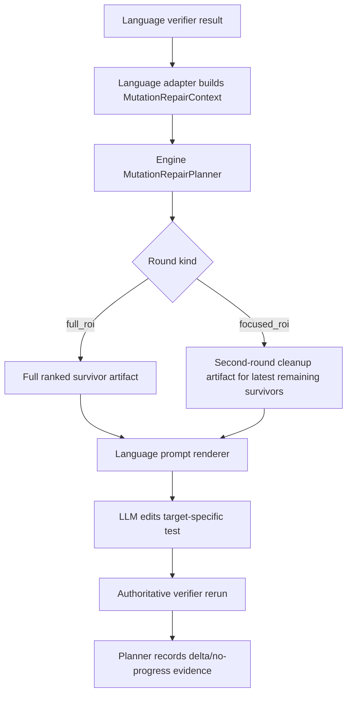

# Spec: Language-Agnostic Mutation Repair Planner

## Changelog

- 2026-06-17: Initial spec for fixing slow mutation-repair rounds by aligning Python with the Java PIT repair pattern through a shared engine planner.
- 2026-06-17: Clarified issue B after live task-115 verification: next-target OpenCode did create JSONL and was actively running, so the planner spec tracks issue A and issue C only.

## 1. Decision Log

1. This is a non-Jira internal UTA design change.
2. This spec covers issue A only: mutation-fix-too-slow per round.
3. Issue B, next-target LLM stall, is not an active requirement for this spec. Live verification on repair task 115 showed the second target created a per-turn JSONL artifact and had an active OpenCode process, so it did not reproduce the old no-session/no-first-JSONL failure mode.
4. If a future run reproduces no first JSONL on a next target, it should be handled as OpenCode process/session observability or provider fallback work, not as mutation planner scope.
5. Issue C, first-round mutation repair with no progress, is not a separate fix track. It is treated as a symptom of issue A because Python's first round currently behaves like a fixed source-order batch instead of a meaningful ROI-planned mutation repair round.
6. The design must preserve the project invariant: workflow orchestration is language-agnostic; Java, Python, and future languages provide adapters.

## 2. Problem

Python mutation repair currently advances too slowly on large survivor sets. The previous direction of sending a fixed small number of mutmut groups per round works only when the selected chunk happens to contain useful behavior-level mutants. It becomes ineffective when the first source-order chunk contains low-value, hard-to-test, setup/import/log/config-style mutants.

This also explains issue C: the first mutation-repair turn can repeatedly make no progress while the second turn makes progress, because round 1 is not truly "the first repair round over the mutation problem." It is just the first deterministic chunk. Round 2 gets a different chunk and may contain better mutants. The fix for A must therefore also fix C by making round 1 a full ROI-guided repair plan.

Java already has a better shape:

1. PIT survivors are summarized into mutation families.
2. The prompt receives a compact, ranked artifact rather than raw verifier output.
3. The verifier remains authoritative after the agent edits tests.

Python should use the same workflow pattern, but the shared policy must live in the engine layer rather than in either language backend.

## 3. Scope Discovery

| Area | Path | Scope |
| --- | --- | --- |
| Shared mutation contract | `uta/engine/mutation_repair.py` | Extend with planner-level round policy and evidence. |
| Shared ROI math | `uta/engine/mutation_roi.py` | Reuse for Java and Python group ranking. |
| Java PIT adapter | `uta/language/java/maven/pitest.py` | Keep PIT XML parsing and family extraction language-specific. |
| Java workflow | `uta/graph/nodes.py` | Wire through the shared planner and avoid selected-window regression. |
| Python mutmut adapter | `uta/language/python/mutation_context.py` | Keep mutmut results/show parsing language-specific, normalize into engine groups. |
| Python repair loop | `uta/language/python/batch.py` | Use the shared planner for full-vs-focused rounds. |
| Prompts | `uta/prompts/fix_mutations.txt`, `uta/prompts/python_fix_mutations.txt` | Consume planner artifacts; keep wording language-specific. |
| Reports/progress/cost | `uta/reporting`, `uta/tasks`, `uta/progress` | No behavioral change expected; planner evidence should remain compatible. |
| DB schema | task DB | No migration for this change. |

## 4. Requirements

1. Mutation repair round planning must be language-agnostic.
2. Java and Python must both provide `MutationRepairContext` through language adapters.
3. The first mutation repair round for a target should expose the full ROI-ranked survivor map to the LLM, not a narrow fixed window.
4. The second mutation repair round is a cleanup fallback round. It should focus only on the latest remaining mutants after round 1 and should not behave like another full discovery round.
5. The planner must choose round behavior from explicit target repair state, not from historical task event counts.
6. The repair prompt must receive compact mutation context artifacts and avoid raw mutmut/PIT progress spam.
7. Java must not regress to a narrowed selected mutation window by default.
8. Python must not solve large survivor sets only by increasing retry count.
9. The authoritative pass/fail decision remains the language verifier after LLM edits.
10. The planner must record enough evidence to explain no-progress rounds: pre-survivor count, post-survivor count, selected groups, and edited test path.
11. First-round no-progress should be diagnosed as a planner/evidence problem unless the LLM made a meaningful edit and the latest verifier still shows no survivor reduction.

## 5. Non-Goals

1. Do not change provider/model fallback behavior.
2. Do not change next-target OpenCode startup behavior. Task-115 verification did not reproduce issue B; no OpenCode startup/session change belongs in this planner spec.
3. Do not add a DB migration.
4. Do not change coverage or mutation gate thresholds.
5. Do not make mutmut or PIT execution itself language-agnostic.
6. Do not allow mutation repair to edit production source files.

## 6. Proposed Contract

### 6.1 Existing Normalized Input

`MutationRepairContext` remains the normalized language-to-engine boundary:

1. `target_id`
2. `language`
3. `total_survivors`
4. `groups: list[MutationRepairGroup]`
5. `reproduce_command`
6. `artifact_paths`

Language adapters own extraction:

1. Java: PIT XML and mutation family summaries.
2. Python: mutmut survivors, AST symbol ranges, and representative `mutmut show` diffs.

### 6.2 New Engine Planner Output

Add a planner output, tentatively:

```python
class MutationRepairPlan:
    target_id: str
    language: str
    round_index: int
    round_kind: Literal["full_roi", "focused_roi"]
    selected_groups: list[MutationRepairGroup]
    context_artifact_path: str
    prompt_flags: dict[str, Any]
    evidence: MutationRepairPlanEvidence
```

`round_kind` semantics:

1. `full_roi`: first real repair turn for this target. Include all mutant groups ranked by ROI, with compact representative examples. This is the primary repair round where the LLM should see the whole mutation problem and make broad, high-value edits.
2. `focused_roi`: second repair turn for this target. This is a cleanup fallback after verifier rerun, not another primary repair round. Include only the latest remaining mutant groups, ranked by ROI, plus no-progress evidence from round 1.

The planner must not define round 1 as "first source-order batch" or "first fixed-width group window." That behavior is the root cause of issue C and is replaced by `full_roi`.

### 6.3 Round State

The planner should consume explicit state:

1. target id
2. current attempt number for this target
3. prior selected groups, if any
4. prior survivor count
5. latest survivor count
6. whether the agent changed the selected test file

It must not infer "first round" from historical `stage_started` events because resumes and retries can make event history misleading.

## 7. Expected Flow



## 8. Acceptance Criteria

1. Java mutation repair still receives full PIT family context by default.
2. Python first mutation repair round receives a full ROI-ranked mutmut survivor map.
3. Python second mutation repair round is only a cleanup fallback over latest remaining survivors, not stale initial survivors.
4. No-progress rounds are visible in structured evidence.
5. Reverting a process and resuming does not accidentally skip the first full-context repair round for an unfinished target.
6. The observed issue C pattern is eliminated: first Python mutation repair no longer consistently starts from an arbitrary source-order batch while second round gets the useful batch.
7. Existing report/progress/cost features continue to work because the planner does not introduce language-specific workflow branches.

## 9. Verification Plan

1. Unit tests for the engine planner:
   - first attempt returns `full_roi`;
   - second attempt returns cleanup `focused_roi`;
   - ranking is deterministic;
   - no-progress evidence is preserved.
2. Java regression tests:
   - PIT survivor families are adapted into the shared context;
   - Java prompt receives full family context, not a selected narrow window.
3. Python regression tests:
   - mutmut survivors are adapted into the shared context;
   - first mutation repair prompt includes all ranked groups;
   - first mutation repair prompt is not limited to source-order `batch-1-of-N`;
   - resume/history events do not change first-round semantics.
4. Integration tests:
   - run one Java repair fixture and one Python repair fixture with mutation failures;
   - assert verifier remains the final authority;
   - assert cost/progress reporting still records the target repair stages.

## 10. Design Review Checklist

1. Change scope: limited to mutation repair planning and prompt context; no provider fallback or DB behavior.
2. Abstraction/extensibility: language adapters normalize mutation data; engine owns shared round policy.
3. Verification: covers planner unit tests, Java regression, Python regression, and integration flow.
4. API/schema/data model: no DB migration; new internal engine contract only.
5. Risk: Java regression risk is controlled by explicitly preserving full PIT context.
6. Simplicity: avoids duplicated Java/Python round policy and avoids solving performance by adding retry count.
