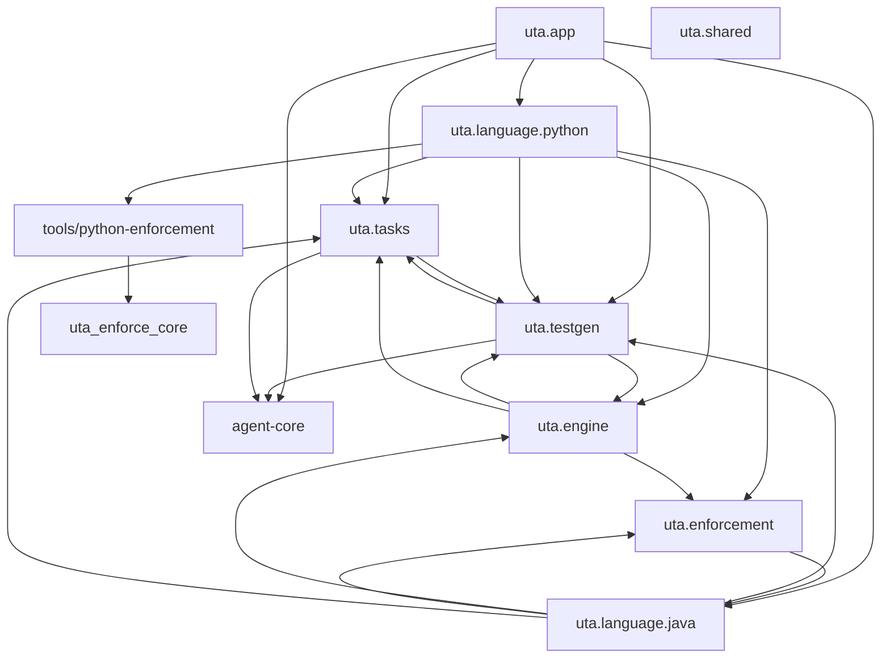
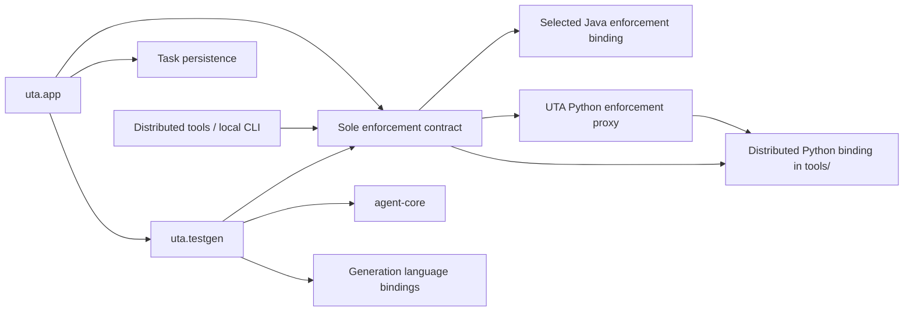
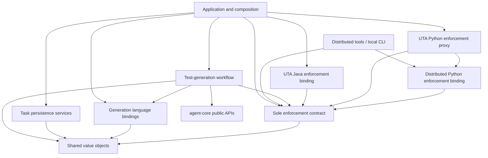

# Spec: UTA Architecture Boundary and Package Cleanup

Status: approved by the requester on 2026-08-20. The dispositioned design is
also approved and scope-frozen; implementation remains blocked until the
implementation plan is approved.

## Decision record

This is the next iteration of the non-Jira UTA/agent-core migration work. The
requester asked that the package-dependency scan, corrected distributed-tools
boundary, agent-specific leakage, and remaining oversized-module findings be
recorded as one requirements source of truth.

This specification extends rather than rewrites these earlier decisions:

- `docs/spec-generation-legacy-cleanup.md`: declarative generation and
  agent-core `agent_turn` remain the only generation path.
- `docs/spec-task-manager-cleanup.md`: task management remains agent-,
  provider-, and language-agnostic.
- `docs/spec-python-enforcement-standalone-core.md` and ADR-003:
  `tools/python-enforcement/` remains an independently distributable,
  sparse-checkout-safe local-development enforcement client.

## Objective

Make UTA's package dependency direction match its intended architecture:

1. UTA product code consumes agent-core only through agent-agnostic public
   harness, workflow, runtime, prompt, and Git APIs.
2. Replace the parallel `uta.engine` and `uta.enforcement` contract surfaces
   with one authoritative, language-neutral enforcement contract. The contract
   does not depend on concrete languages, task infrastructure, or workflow
   implementations.
3. Task persistence and test-generation workflows have one-way, explicit
   ownership rather than importing each other's concrete implementations.
4. Java and Python backends depend on focused domain capabilities rather than
   compatibility helper buckets or their own composing adapters.
5. Full UTA and the lightweight third-party Python enforcement client execute
   one canonical enforcement implementation through a stable public API.
6. Remaining oversized source files are split by cohesive responsibility
   without changing product behavior, evidence contracts, durability, or
   local-developer workflows.

The primary users are UTA maintainers, agent-core maintainers, developers who
run the lightweight Python enforcement client locally, and operators who rely
on existing task/workflow behavior.

## Scope-discovery evidence

The 2026-08-19 scan parsed imports from 207 production files under `uta/` and
all Python sources under `tools/`. It found no eager module-level circular
import, so this work is not an emergency import-crash repair. It did find a
package-level layering cycle spanning:

```text
uta.engine
uta.enforcement
uta.language.java
uta.shared
uta.tasks
uta.testgen
```

When type-only references are excluded, `uta.shared` drops from the eager
cycle, but the remaining five packages still have bidirectional package-level
dependencies. Lazy imports currently hide several logical module cycles.

### Current dependency shape



The diagram is architectural, not a claim that every shown edge is eager.
The design phase must regenerate the graph with eager, lazy, and type-only
edges distinguished and store the reproducible scan command.

### Candidate modules

| Candidate | Evidence | Decision | Reason |
| --- | --- | --- | --- |
| `uta/testgen/operations.py` | 1,009 lines; result models, secure artifact storage, cost gate, reconciliation, and ledger | In scope | Independent persistence and reconciliation responsibilities are coupled. |
| `uta/tasks/db.py` | 1,631 lines; schema/migration, task CRUD, operation ledger, events, progress, scheduler, and heartbeat | In scope | Persistence domains need focused repositories while preserving atomic transactions. |
| `uta/tasks/workflow_retention.py` | Imports checkpoint, operation, prompt, and standalone implementations from `uta.testgen` | In scope | Reverses task-storage versus workflow ownership. |
| `uta/testgen/*` task imports | `operations`, `progress`, `delivery`, graph application, batches, cancellation, and guards import `TaskDB`/`TaskManager` | In scope | Replace broad manager dependencies with narrow product ports/repositories. |
| `uta/engine/ci.py` | Imports concrete `TaskManager` | In scope | A language-neutral contract layer must not own task infrastructure. |
| `uta/engine/__init__.py` | Re-exports `uta.testgen.wave_assigner` | In scope | Test-generation planning belongs under `uta.testgen`, not a parallel engine contract facade. |
| `uta/shared/languages.py` `LanguageAdapter` | Umbrella protocol mixes detection/policy with batch generation and testgen cycle binding | In scope for retirement/split | It is not a dependency-light neutral contract and contributes type-level back-edges. |
| `uta/enforcement/enforcement.py` `EnforcementCore` | Nominal neutral protocol with no production implementation or consumer | In scope for replacement | An unused protocol is not the effective enforcement boundary. |
| `uta/engine/ci.py` `EnforcementRunner` and `uta/enforcement/verification.py` `VerificationRunner` | Parallel untyped command runner and per-target verification contracts | In scope for consolidation/role clarification | Command execution and target verification are subordinate ports, not competing top-level enforcement contracts. |
| `uta/enforcement/evidence.py` | Imports Java Maven/PIT evidence helpers | In scope | Generic enforcement must not depend on Java. |
| `uta/language/java/generation.py` and `phases/ports.py` | 1,137-line helper bucket; phase ports import the whole module | In scope | Preserves a compatibility seam and contributes to an eight-module logical cycle. |
| Java `adapter`, `cycle_inputs`, `generation_backend`, and compile/coverage/mutation phases | Adapter, phase, and helper imports point back to their composers | In scope | Prompt bundles and ports must be injected downward. |
| `uta/language/python/verification/runner.py` | 2,917 lines; 755-line main function; config, pytest, coverage, mutation, process, dependency, and artifact responsibilities | In scope | Largest remaining production monolith. |
| `uta/language/python/mutation_context.py` | Imports runner result types while runner lazily imports mutation context | In scope | Shared models can remove the logical cycle. |
| `tools/python-enforcement/` | Required sparse-checkout distribution used by third-party/local developers | In scope with location preserved | It is a deliberate distribution boundary, not misplaced tooling. |
| `uta_py_enforce/mutation_candidates.py` | 1,056 lines; AST policy, opportunity collection, mutmut metadata, and selection | In scope | Oversized canonical client implementation. |
| `uta_enforce_core/mutation_candidates.py` | 521 lines; models, identity, policy, evidence, and comparison | In scope | Contract package needs explicit stable submodules. |
| UTA mutation-candidate wildcard re-export modules | Two compatibility bridges expose accidental APIs | In scope | Keep necessary facade compatibility but replace wildcard ownership with explicit public exports. |
| `uta/engine/project_summary_artifacts.py` | 809 lines; directly drives `OpenCodeAuthClient` and also owns bootstrap, introspection, retrospectives, summaries, and templates | In scope | Active concrete-agent leakage and mixed responsibility. |
| `uta/app/cli.py` and `uta/app/generation_commands.py` | Direct `OpenCodeProcess` readiness and `generate_opencode_config` calls | In scope | Product entrypoints must use configured neutral harness capabilities. |
| `uta/language/java/generation.py` fallback imports | Imports unused agent-core OpenCode/provider fallback symbols | In scope | Dead concrete-agent coupling. |
| `uta/app/repair.py` | 1,087 lines; session, progress, task creation, workspace, locking, rerun | In scope | Application service remains a mini-monolith. |
| `uta/language/java/enforcement_runner.py` | 1,144 lines; command construction, execution, parsing, classification, evidence | In scope | Cohesive feature but separable layers. |
| `uta/language/java/context_builder.py` | 1,101 lines; graph analysis, summaries, Markdown, index payload, ROI persistence | In scope | Keep facade while separating analysis, rendering, and storage. |
| `uta/language/python/enforcement.py` | 794 lines; full-UTA enforcement entrypoint and evidence aggregation | In scope as canonical-client consumer | It must delegate to the shared high-level client API; split only where that migration exposes independent policy/projection responsibilities. |
| `uta/tasks/lifecycle.py` and `accounting.py` | 823 and 623 lines; lifecycle recovery/preemption/stages and a 300+ line result sync | In scope | `TaskManager` was reduced, but its mixins remain broad managers. |
| `uta/app/task_commands.py` | 887 lines in one registration function | In scope | Command groups need separate registration modules without changing CLI names. |
| `uta/app/cli.py` | 893 lines; Java source discovery, auth, batch launch, root registration | In scope | Agent readiness and source discovery are independent capabilities. |
| `tools/estimate_repo_unit_cost.py` | 1,447-line standalone analysis tool | Deferred/optional | No runtime cycle; split after production and distributed-client boundaries unless implementation work naturally touches it. |
| Algorithmic modules such as coverage ROI, mutation context, CI evidence, JaCoCo, and PIT | Large but comparatively cohesive | Out of initial split scope | Reassess after dependency boundaries are clean; size alone is not sufficient. |

## Requirements

### 1. Enforce a one-way package architecture

The target runtime architecture is:



The corresponding source dependency direction is:



Terms in this specification:

- **Enforcement contract**: the sole neutral request, capability, normalized
  evidence/result, validation, backend protocol, and registry-facing API. Its
  authoritative definitions live in `uta_enforce_core` so both UTA and the
  distributed local client can consume them.
- **Enforcement language binding**: a Java or Python implementation of the
  enforcement contract. A binding owns language detection/normalization and
  enforcement-specific execution/evidence projection; it is not an agent
  adapter and does not own task persistence or workflow composition.
- **UTA enforcement proxy**: a thin UTA-local adapter that supplies UTA-owned
  context or policy to an independently distributed binding. A proxy may map
  contract DTOs and inject policy, but it must not reimplement enforcement
  algorithms, process orchestration, evidence parsing, or failure policy.
- **Generation language binding**: a Java or Python implementation of
  generation-specific behavior such as source/context discovery, prompt input
  projection, generated-test handling, and phase-domain policy. Testgen may
  depend on these bindings directly. They are distinct from enforcement
  bindings and do not become part of agent-core.
- **Test generation**: the product workflow. It uses agent-core for agent
  execution, may use concrete generation-language bindings directly, and uses
  the enforcement contract for enforcement. It does not import a concrete
  enforcement binding.
- **Task persistence**: storage and transactions only. It is reached through
  application services and knows neither agent-core nor enforcement bindings.
- **Distributed tools**: independently distributable entrypoints such as the
  local Python enforcement CLI. They consume the same sole enforcement
  contract and select a packaged enforcement-language binding; they do not
  define a second enforcement API or orchestration algorithm.

- The diagram above is the source dependency direction. At runtime, the app
  composes a registry so calls flow `app/testgen -> enforcement contract ->
  selected language binding`. Distributed tools follow the equivalent
  `tools -> enforcement contract -> selected language binding` flow. The
  contract itself never imports a binding; application/tool composition owns
  registration.
- Lower layers never import their consumers.
- `uta.engine` ceases to exist as a parallel public contract layer.
  Enforcement-relevant contracts move to the sole enforcement contract;
  test-generation-specific neutral logic moves under `uta.testgen`; generic
  value objects move to the lowest dependency-light package.
- The sole enforcement contract must not import `uta.tasks`, `uta.testgen`,
  `uta.app`, or a concrete language binding.
- Task persistence must not import agent-core. Agent-core workflow, Git, and
  harness adapters belong in `uta.testgen` or application composition; task
  persistence receives plain product records and transaction inputs.
- `uta.testgen` may import concrete Java/Python generation-language bindings
  for non-enforcement behavior. It must not import a concrete enforcement
  binding or bypass the sole enforcement contract for enforcement behavior.
  Generation binding selection may be direct or app-composed, but must stay
  independent of the configured agent harness.
- Enforcement language bindings implement the sole contract and are composed
  by `uta.app`; they do not import the application layer that composed them.
- The canonical Python enforcement binding may—and in this iteration should—
  live under `tools/python-enforcement/uta_py_enforce` so it can be
  independently distributed. Full UTA reaches it through an explicit thin
  proxy; local tools compose it directly behind the same contract.
- New package cycles, including cycles hidden by function-local imports, are
  prohibited.

### 2. Preserve the distributed enforcement-client boundary

- `tools/python-enforcement/` remains the primary sparse-checkout distribution
  root for third-party/local development enforcement.
- Its runtime dependency flow is `tool/CLI -> uta_enforce_core contract ->
  packaged enforcement-language binding`. The CLI is a composition adapter,
  not an alternative enforcement implementation.
- `uta_enforce_core` becomes the authoritative source for the sole neutral
  enforcement request, result/evidence, validation, capability, and backend
  protocol contracts. UTA may expose a deliberate facade but must not redefine
  a parallel incompatible contract.
- `uta_enforce_core` must not import `uta.*`,
  agent-core, a UTA task database, API service, report UI, or a concrete Python
  implementation.
- `uta_py_enforce` owns Python-specific local enforcement behavior. It may
  depend on `uta_enforce_core`, the standard library, and documented
  target-runtime command-line tools, but not full UTA or agent-core.
- UTA's Python enforcement proxy may depend on the public `uta_py_enforce`
  facade and `uta_enforce_core` types. The distributed binding must never
  import the UTA proxy, and the proxy must contain no duplicate enforcement
  algorithm.
- Local CLI, full `uta python-enforce`, CI verification, and repair
  verification must enter through the same canonical high-level enforcement
  contract and dispatch to a registered language binding. Sharing only
  low-level utilities while retaining separate orchestration is not
  sufficient.
- UTA-specific mutation sampling remains policy injection owned by the UTA CI
  adapter. Local development and repair remain unsampled.
- Evidence schema, reason taxonomy, marker output, candidate-plan identity,
  Python 2 legacy behavior, and failure-closed semantics remain compatible.
- UTA compatibility facades may remain during migration, but they must use
  explicit imports and `__all__`; wildcard re-exports are prohibited.

### 3. Remove concrete-agent knowledge from UTA

- No production module under `uta/` may import or name `OpenCodeClient`,
  `OpenCodeAuthClient`, `OpenCodeProcess`, `generate_opencode_config`, or
  OpenCode-specific fallback internals.
- UTA entrypoints obtain the configured harness through agent-core and invoke
  neutral capabilities for workspace preparation, readiness/authentication,
  isolated sessions, turns, cancellation, progress, and cleanup.
- UTA owns project-summary policy: when bootstrap is needed, the prompt, and
  harvesting product artifacts. Agent-core owns concrete session execution.
- Provider-specific readiness errors are normalized by agent-core before UTA
  sees them.
- Agent selection is configuration only. Selecting Pi or another future
  harness must not require changing UTA application, task persistence,
  test-generation, enforcement-contract, or language-binding code.
- Agent-core may own and depend on concrete **agent/harness bindings**, such as
  OpenCode or Pi adapters. It must remain unaware of product-language
  generation bindings and enforcement bindings such as Java or Python.
- If agent-core lacks a required neutral API, agent-core is changed, released,
  and pushed first; UTA then pins the released version. Shared agent APIs must
  not be recreated in UTA.

### 4. Separate task persistence from workflow ownership

- Task storage owns task/class records, events, queue state, controls,
  heartbeat, and repository transactions.
- Test-generation workflow code owns checkpoints, prompt artifacts, operation
  artifacts, reconciliation, and workflow-specific retention semantics.
- Workflow retention coordination moves to `uta.testgen` or the application
  composition layer; `uta.tasks` must not import concrete workflow artifact
  implementations.
- Test-generation components consume narrow task repositories/ports rather
  than constructing or importing broad `TaskManager` instances in phase or
  domain code.
- Cross-domain operations that must be atomic have one explicit transaction
  owner. Splitting `TaskDB` must not turn an atomic transition into multiple
  independent connections.
- `TaskDB` and `TaskManager` may remain compatibility facades, but their
  implementations delegate to focused repositories/services.
- Task persistence exposes no agent-core types and imports no agent-core
  package. Product services project workflow/Git/harness outcomes into neutral
  task records before persistence.

### 5. Merge engine and enforcement into one enforcement contract

- `uta_enforce_core` defines the one authoritative neutral contract for an
  enforcement request, normalized result/evidence, validation verdict,
  capabilities, and an `EnforcementLanguageBinding` protocol.
- `uta.app` composes the available Java/Python bindings with a neutral
  enforcement registry. `uta.app` may import concrete enforcement bindings;
  `uta.testgen` receives the composed enforcement contract/registry and never
  imports an enforcement binding directly. This restriction does not prohibit
  testgen from directly using separate generation-language bindings.
- For Python, the registered UTA implementation is a thin proxy to the
  canonical distributed `uta_py_enforce` binding. For Java, the binding may
  remain UTA-local unless a separate distribution requirement is approved.
- Runtime dispatch is `app/testgen -> enforcement contract -> selected
  language binding`. Source dependencies point from each binding to the
  contract, never from the contract to the binding.
- The current `LanguageAdapter`, `EnforcementCore`, `EnforcementRunner`, and
  `VerificationRunner` surfaces are mapped to the sole contract or explicitly
  retained as subordinate ports with one responsibility. They must not remain
  competing top-level contracts.
- External command execution is a subordinate infrastructure port. Per-target
  test/coverage/mutation verification is a subordinate binding capability.
  Neither is independently presented as the product enforcement API.
- CI repair handlers consume the enforcement contract plus a narrow task
  service; enforcement contracts never accept concrete `TaskManager`.
- Generic enforcement evidence accepts language evidence through the selected
  binding. Java Maven, Surefire, and PIT parsing remain in the Java binding;
  Python candidate planning and mutation execution remain in the Python
  binding/shared lightweight client.
- Language-neutral wave assignment and other test-generation-only logic move
  under `uta.testgen`; they are not part of enforcement merely because they
  were formerly re-exported from `uta.engine`.
- Shared value-object modules do not call the binding registry to coerce
  product input. Language-dependent coercion occurs at the enforcement binding
  boundary.

### 6. Finish the Java generation boundary

- `uta.language.java.generation` stops acting as a global helper namespace.
- Delegated quality, batch selection, compile/test commands, symbol writeback,
  Maven evidence, and mutation context move to focused domain modules.
- `phases/ports.py` imports named capabilities directly; it must not import the
  entire `generation` module.
- Prompt bundles and phase ports are injected by the adapter/backend
  composition root. Compile, coverage, mutation, and other phases must not
  instantiate or import `JavaLanguageAdapter`.
- `cycle_inputs` uses focused context/selection capabilities and must not
  import helper functions from `generation`.
- The existing Java prompt, phase route, evidence, retry, compile, coverage,
  mutation, and result behavior remains byte/contract compatible unless a
  separate approved requirement changes it.

### 7. Split Python verification around the canonical client API

- Public verification request/result/config models move into dependency-light
  modules importable by the runner, mutation context, UTA adapter, and tests.
- Pytest execution, coverage execution, mutation execution, mutation policy,
  process-tree control, runtime/dependency setup, and orchestration have
  separate modules.
- The UTA verification facade calls the canonical `uta_py_enforce` use case
  rather than maintaining a second coverage/mutation algorithm.
- UTA-only workflow context and CI sampling are passed as explicit policy or
  adapter inputs; they do not fork the shared algorithm.
- The `runner`/`mutation_context` logical import cycle is removed.

### 8. Split remaining application and domain monoliths

- `uta.testgen.operations` separates models, secure artifact storage, cost
  gate, reconciliation policy, and ledger orchestration.
- `uta.tasks.db` separates connection/transaction ownership, schema/migration,
  task repository, operation repository, event/progress repository, and
  scheduler/heartbeat repository.
- `uta.app.repair` separates repair sessions, progress projection, deferred
  task creation, workspace refresh/rerun, and locking.
- Java enforcement separates command planning, execution, output parsing, and
  evidence classification.
- Java context building keeps a stable facade while separating graph analysis,
  Markdown rendering, index payloads, and ROI persistence.
- Task lifecycle separates ordinary transitions/stages from crash recovery and
  priority/preemption. Task accounting separates result projection, token
  aggregation, and delivery outcomes.
- CLI task commands are registered by focused command groups while preserving
  every command name, flag, help contract, and stable import explicitly relied
  on by callers/tests.
- Project-summary code separates summary policy/artifact rendering from agent
  execution.

Line count is a review signal, not the architectural goal. As a guardrail,
facades and orchestrators should normally remain below 400 lines and cohesive
implementation modules below 600 lines. A larger exception requires a design
justification showing one responsibility and focused tests.

### 9. Make dependency rules executable

- Add a repository-owned dependency check that parses Python imports and
  distinguishes eager, lazy, and type-only edges.
- The check must fail on prohibited package directions, concrete OpenCode
  imports under `uta/`, imports from `uta.*`/agent-core inside the lightweight
  distribution, wildcard compatibility re-exports, and newly introduced
  logical cycles.
- Store a small allowlist only for deliberate, documented migration seams.
  Every allowance names an owner and deletion condition; no blanket package
  exemption is allowed.
- Tests verify that backend string registration remains lazy so Java-only or
  Python-only commands do not eagerly import the other language toolchain.

## Commands

The exact dependency-check script name is a design decision, but the completed
iteration must provide a stable command equivalent to:

```bash
.venv312/bin/python scripts/check_package_dependencies.py
```

Required verification commands:

```bash
.venv312/bin/python -m pytest tests -q
.venv312/bin/python -m compileall -q uta tools/python-enforcement
.venv312/bin/python -m ruff check uta tools/python-enforcement tests
git diff --check
```

Lightweight-distribution verification must run without the UTA package on
`PYTHONPATH`:

```bash
PYTHONPATH=tools/python-enforcement python3 \
  tools/python-enforcement/uta_python_test_enforce.py --help

PYTHONPATH=tools/python-enforcement python3 -c \
  'import uta_enforce_core; import uta_py_enforce'
```

The design must name focused Java/Python parity tests and the agent-core test
and release commands for any new neutral harness API.

## Project structure target

Exact names are finalized during design, but the dependency direction must be
recognizable in the source tree:

```text
uta/
  app/                         # composition, CLI/API adapters
    commands/                  # focused Click command registration
    repair/                    # repair application services
  enforcement/                 # UTA facade/services over the sole contract
    bindings/
      java/                    # UTA-local Java enforcement binding
      python_proxy.py          # thin proxy to distributed uta_py_enforce
  language/
    java/                      # Java generation/domain implementation
    python/                    # Python generation/domain implementation
  tasks/
    storage/                   # transaction owner and repositories
    services/                  # lifecycle/accounting/reporting
  testgen/
    operations/                # operation models/store/reconciliation/ledger
    graph/                     # declarative workflow
    retention/                 # workflow artifact retention
    # may call generation APIs under language/java and language/python directly

tools/python-enforcement/
  uta_python_test_enforce.py   # thin composition CLI over the sole contract
  uta_enforce_core/            # sole neutral enforcement contract
  uta_py_enforce/              # packaged Python enforcement-language binding
```

## Code style

Prefer explicit constructor/argument injection over imports back to a
composition root:

```python
@dataclass(frozen=True)
class ProjectBootstrapPolicy:
    prompt: str
    timeout_seconds: int


def bootstrap_project_summary(
    *,
    harness: Harness,
    repo_path: Path,
    policy: ProjectBootstrapPolicy,
) -> BootstrapResult:
    with harness.open_session(repo_path=repo_path, scope="project-bootstrap") as session:
        return session.run_turn(policy.prompt, timeout=policy.timeout_seconds)
```

Do not import a composing binding from its phase, `TaskManager` from the
enforcement contract, or an OpenCode class from UTA product code. Public
facade exports are explicit and typed; `import *` compatibility layers are not
used.

## Testing strategy

### Dependency and source-boundary tests

- Assert every required package direction and every forbidden reverse edge.
- Assert testgen may depend on generation-language bindings but cannot import
  enforcement-binding implementations or product-language code from
  agent-core.
- Assert zero concrete OpenCode imports/names in UTA production source.
- Assert no `uta.*` or agent-core imports in `tools/python-enforcement`.
- Assert the UTA Python proxy delegates through the public `uta_py_enforce`
  facade and contains no enforcement command construction, evidence parsing,
  mutation algorithm, or fallback implementation.
- Assert no wildcard re-export adapters remain.
- Assert no eager module cycle and no unapproved lazy logical cycle.

### Behavior and contract tests

- Freeze Java/Python generation phase routes, prompts, normalized results,
  evidence, retries, accounting, delivery, and standalone result projection.
- Exercise project bootstrap and readiness with a fake neutral harness and at
  least two configured harness types without changing UTA domain code.
- Prove full UTA and lightweight Python enforcement parity for Python 3,
  Python 2 legacy behavior, mutation batching/operator filtering, backend
  failure, and evidence markers.
- Prove CI sampling is available only through the internal UTA CI policy and
  never through the local client or repair path.
- Preserve workflow reconciliation, checkpoint recovery, transaction
  atomicity, task lifecycle, retention safety, progress SSE, and cost-ledger
  tests while repositories are split.

### Packaging and isolation tests

- Install the UTA wheel and import `uta`, `uta_enforce_core`, and
  `uta_py_enforce` from the installed artifact.
- Run the lightweight client from a sparse copy containing only
  `tools/python-enforcement`.
- Verify Java-only startup does not require Python mutation tooling and the
  lightweight client does not import UTA, agent-core, FastAPI, LangGraph, or
  task infrastructure.

### Refactor safety

- Use characterization tests before moving logic.
- Move one cohesive responsibility at a time and keep the suite green between
  slices.
- Do not delete tests merely because a private import path changes; migrate
  them to the public behavior boundary first.

## Boundaries

### Always

- Keep the lightweight enforcement client independently distributable by
  sparse checkout.
- Keep UTA product/domain code agent-agnostic.
- Put shared agent capabilities in agent-core and release agent-core before
  updating UTA.
- Preserve durable workflow, operation ledger, task lifecycle, evidence, CLI,
  and report contracts throughout structural changes.
- Preserve unrelated user worktree changes.
- Regenerate and review the dependency graph after every implementation slice.

### Ask first

- Changing a public CLI flag, evidence schema/version, task database schema,
  workflow state shape, or normalized result contract.
- Adding a dependency to the lightweight distribution.
- Replacing sparse-checkout distribution with a separately published wheel.
- Changing default quality gates, sampling behavior, retry policy, cost policy,
  or retention duration.
- Retaining a prohibited dependency through a permanent allowlist entry.

### Never

- Move Python enforcement domain logic to agent-core.
- Recreate an agent-core harness/session/configuration capability inside UTA.
- Let UTA branch on OpenCode, Pi, or another concrete harness in product,
  task, workflow, enforcement-contract, or language-domain code.
- Maintain separate local and production Python enforcement algorithms.
- Break transaction atomicity to achieve smaller files.
- Use function-local imports merely to conceal a package cycle.
- Perform behavior changes while moving code unless separately specified and
  tested.

## Success criteria

1. The executable dependency scan reports no prohibited package edge, no
   concrete OpenCode dependency under `uta/`, and no unapproved logical cycle.
2. `uta.engine` no longer exists as a parallel public contract layer. One
   authoritative enforcement contract is defined by `uta_enforce_core`, and
   UTA does not redefine incompatible request/result/backend protocols.
3. App composition registers the Java enforcement binding and the thin UTA
   proxy to the distributed Python binding. `uta.testgen` consumes only the
   injected neutral contract for enforcement, and the contract imports no
   binding. Testgen may directly consume separate Java/Python
   generation-language bindings for non-enforcement behavior.
4. Distributed tools execute through `tool/CLI -> uta_enforce_core -> selected
   enforcement-language binding`; no tool-local parallel enforcement contract
   or orchestration path remains.
5. The canonical Python enforcement binding resides in the independently
   distributable tools tree. UTA reaches it through a thin proxy, and parity
   tests prove the proxy and local CLI execute the same binding behavior.
6. `uta.tasks` no longer imports agent-core or concrete workflow checkpoint,
   prompt, operation-artifact, Git/harness adapter, or standalone-execution
   implementations.
7. Test-generation workflow and language phases use narrow injected task and
   domain ports instead of importing broad application managers or their own
   composing adapters.
8. The Java eight-module logical cycle and Python runner/mutation-context cycle
   are removed.
9. UTA contains no production reference to `OpenCodeClient`,
   `OpenCodeAuthClient`, `OpenCodeProcess`, `generate_opencode_config`, or
   provider-specific fallback internals. A second configured harness can pass
   readiness, bootstrap, and generation contract tests without UTA changes.
10. Full UTA, CI, repair, and lightweight local Python enforcement enter through
   the same `uta_enforce_core` contract, select the canonical
   `uta_py_enforce` Python binding, and emit equivalent evidence for equivalent
   inputs.
11. `tools/python-enforcement` runs from an isolated sparse copy and imports no
   UTA or agent-core package.
12. Agent-core contains no product-language generation or enforcement binding;
    concrete bindings owned by agent-core are limited to agent/harness
    integrations such as OpenCode or Pi.
13. Wildcard compatibility exports are removed or replaced with explicit,
   documented public facades.
14. The listed oversized modules are split by responsibility or receive an
    approved design exception; `generation.py`, the Python verification
    monolith, task DB, operations, repair, and project-summary agent execution
    cannot remain unchanged.
15. All required full, focused, packaging, lightweight isolation, compile,
    lint, and diff checks pass.
16. README and architecture documentation describe the final package graph,
    the agent-core boundary, and the distributed enforcement-client boundary.

## Non-goals

- Changing generation prompts, quality gates, mutation scoring, provider
  selection, cost policy, retry budgets, or user-visible reports.
- Replacing the declarative LangGraph workflow or operation ledger.
- Moving UTA-specific enforcement logic into agent-core.
- Changing the lightweight client from sparse-checkout distribution to a
  separately released package in this iteration.
- Splitting every large algorithmic module solely to satisfy a line target.
- Refactoring `tools/estimate_repo_unit_cost.py` before production boundaries,
  unless the approved design explicitly promotes it into the iteration.

## Design questions to resolve after spec approval

1. Whether workflow-retention composition belongs in `uta.testgen.retention`
   or `uta.app`, while keeping `uta.tasks` independent.
2. The exact neutral agent-core APIs for workspace preparation and readiness;
   isolated harness sessions already remain the execution mechanism.
3. Whether task repositories are composed behind the existing `TaskDB` facade
   or a new storage unit-of-work, without weakening atomicity.
4. The exact stable public surface for `uta_py_enforce` and
   `uta_enforce_core`, and the bounded migration window for existing UTA import
   facades.
5. Which cohesive algorithmic modules may exceed the normal size guardrail and
   the evidence required for each exception.

## Approval gate

Approval of this document authorizes design work only. It does not authorize
implementation, schema changes, agent-core release, UTA commit/push, beta
deployment, or production deployment.
